# Aurumix Process Maps

> Draft for the client call. Covers only the decisions finalised so far: the gating procurement question, Mining Events, the premium, token denomination, the ICS Dividend, and the allocation and float mechanism.
>
> ⚠ **Two companion sets carry decisions this file predates.** `Aurumix_Process_Maps_SIP_Spot_ICS.md` covers the SIP/spot split, the lock-in deletion and the ICS structure, and **supersedes diagram 5 below ("Spot Lane"), because the lanes no longer exist.** `Aurumix_Process_Maps_Custody_Fee.md` covers custody-fee recovery, which is summarised as the seventh row of diagram 14 and reasoned in full there.

## Diagram Plan

| # | Diagram Name | Type | Direction | Nodes | Placement | Source Section |
|---|---|---|---|---|---|---|
| 1 | One Name, Four Jobs | Flowchart | LR | 5 | Inline | Mining Events |
| 2 | Why the Scarcity Layer Goes | Flowchart | LR | 5 | Inline | Four reasons |
| 3 | The Premium: Three Ways It Fails | Flowchart | LR | 7 | Inline | Premium |
| 4 | The Three Layers | Flowchart | LR | 4 | Inline | The solution |
| 5 | Spot Lane: Benefits, Not Supply | Flowchart | LR | 5 | Inline | Spot |
| 6 | Token Denomination | Flowchart | LR | 5 | Inline | Denomination |
| 7 | Why the Dividend Reads as a Security | Flowchart | LR | 5 | Inline | Dividend |
| 8 | Gold Rewards: The Replacement | Flowchart | LR | 5 | Inline | Dividend |
| 9 | The Lumpiness Problem | Flowchart | LR | 5 | Inline | The problem |
| 10 | Where Price Risk Sits Today | Flowchart | LR | 5 | Inline | Mining Events |
| 11 | The Float: How It Works | Flowchart | LR | 5 | Inline | The mechanism |
| 12 | Who Carries the Float | Flowchart | LR | 5 | Inline | The dealer fork |
| 13 | The Float Fixes the Buyback | Flowchart | LR | 5 | Inline | Four jobs |
| 14 | Before and After | Flowchart | TD | 16 | Dedicated | Summary |

## Consistency Convention

- **Flowchart direction:** LR for all process diagrams. TD only for the before and after summary, which is a paired comparison rather than a flow.
- **Gold node convention:** solution outcomes, key actions and recommended paths.
- **Concrete node convention:** problem outcomes, dead ends and rejected paths.
- **Stone node convention:** intermediate and supporting steps.
- **Text style:** regular, no bold.
- **Sequence:** diagrams 1 to 8 carry the decisions and the reasoning. Diagrams 9 to 13 are the mechanical build detail behind them.

---

## 1. One Name, Four Jobs

<!-- SPEAKER NOTES:
"The Mining Event is doing four unrelated jobs under one name. Two are real and stay: batching gold purchases is a genuine treasury requirement, and the monthly moment with your investors is worth keeping. Two do not survive. Manufacturing scarcity has no economic function because every token mints against the buyer's own gold. And the three to eight percent premium it was built to create is the reason the scarcity exists at all, so when the premium goes, the scarcity has nothing left to do."
-->

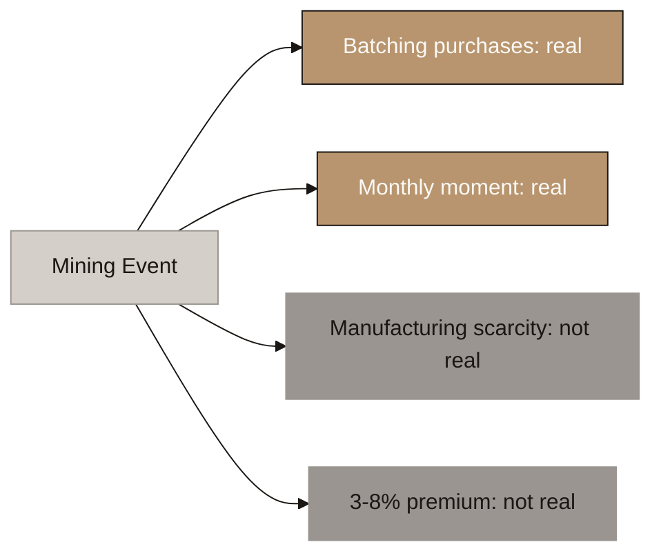

---

## 2. Why the Scarcity Layer Goes

<!-- SPEAKER NOTES:
"Four independent reasons and any one is enough. First, it makes no economic sense: every token mints at NAV against the buyer's own gold, so supply expands on demand and there is no fixed quantity to compete for. Second, the premium cannot be assured: whether a token trades above or below net asset value is a function of market liquidity, not of design, and the two protocols closest to your structure trade at a discount. Third, a capped, oversubscribed, priority-queued sale carries securities classification risk, which is the expensive one because it threatens the ARVA lane. Fourth, rationing supply caps AUM and market cap by construction, and you were accepting that cost to buy the premium, so once the premium goes the cost buys nothing."
-->

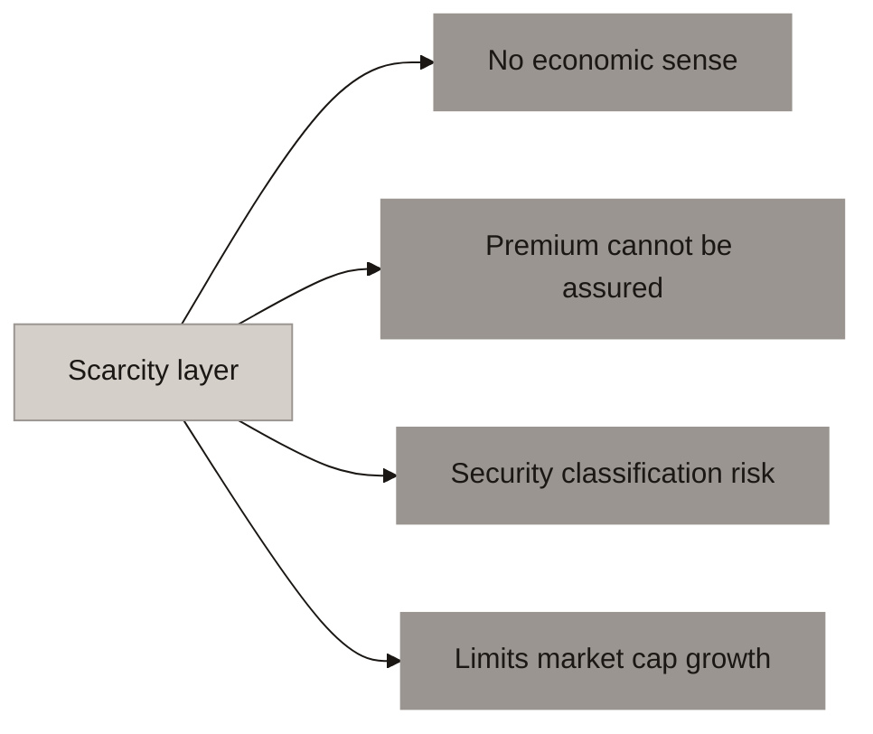

---

## 3. The Premium: Three Ways It Fails

<!-- SPEAKER NOTES:
"A price above net asset value needs a market to exist in. If that market is liquid, anyone can mint at NAV and sell into the premium until it closes, so the premium destroys itself by being profitable. Tether Gold at two point five billion and Pax Gold at one point eight billion both trade at gold. If the market is illiquid there is no price to speak of: Pleasing Gold has ninety million in assets and under twenty dollars of daily volume, so a single trade above NAV is an anecdote, not a price level.

And the third branch is the one that matters most for the design. Whichever state you are in, the premium is set by the market, not by you. You cannot dial it, you cannot guarantee it, and the moment you promise it in marketing you have given a regulator an expectation of profit from the promoter's efforts, which is a securities characteristic. So the premium is only defensible if you never mention it, and if you never mention it, it will not materialise. It cannot be a revenue line."
-->

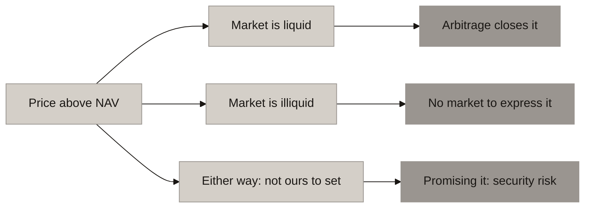

---

## 4. The Three Layers

<!-- SPEAKER NOTES:
"Separate the three and each one gets simpler. The contribution sits on the investor's own anniversary date, exactly like an insurance premium. Allocation happens at the next morning fix after funds clear, so under twenty four hours. Procurement is internal and threshold driven. And the monthly report replaces the event: bar serials, assay certificates, float balance. Same monthly moment, but it proves something instead of restricting something."
-->

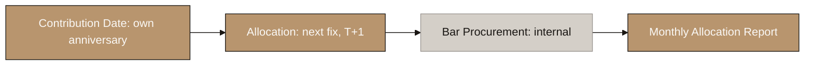

---

## 5. Spot Lane: Benefits, Not Supply

<!-- SPEAKER NOTES:
"You cap spot because you want to discourage institutions. There are two ways to do that and only one is safe. If you limit how much anyone can buy, you are running a restricted sale of a limited quantity, and that looks like selling shares. Same classification risk as the scarcity layer. If instead you let anyone buy but hold back the benefits, that is a loyalty programme, which every bank and airline in the world runs and nobody treats as a security. So spot stays open, and spot earns no ICS, no dividend share, no credit ratio, no card tier. An institution gets clean gold exposure and nothing else. Also worth noting: a large spot ticket actually helps the treasury, because it funds a wholesale purchase immediately."
-->

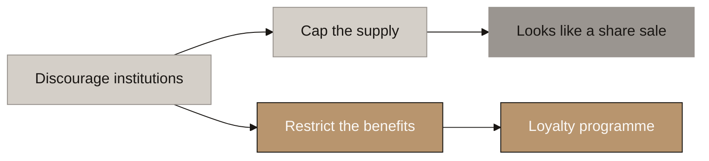

---

## 6. Token Denomination

<!-- SPEAKER NOTES:
"At one hundredth of a gram, the statement reads seven thousand eight hundred tokens equals seven point eight grams, and the customer has two numbers to reconcile. At one gram, the token count is the gram count. One number. The invariant also reads straight off it: grams in the vault should equal tokens outstanding, and a retail holder can check that themselves. On the ten gram point, that is how Indian gold is quoted. Quote the price per ten grams in the app. It does not have to be the token size."
-->

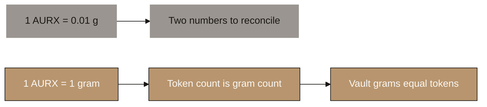

---

## 7. Why the Dividend Reads as a Security

<!-- SPEAKER NOTES:
"Strip it to plain words. You give us money, we run a business, we share our profits with you, and your share is bigger if you gave us more. That is a share in a company whatever we call it. Two things make it worse than it needs to be: it is paid out of operating profit, and it is weighted by investment value. The consequence is that the token stops being an asset-referenced token under VARA and becomes a security token under a different regulator. A twenty dollar a month retail product cannot survive that."
-->

```mermaid
%%{init: {'theme': 'base', 'themeVariables': {
    'primaryColor': '#B8956E',
    'primaryTextColor': '#1A1714',
    'primaryBorderColor': '#1A1714',
    'lineColor': '#1A1714',
    'secondaryColor': '#FAF8F5',
    'tertiaryColor': '#D4CFC8',
    'fontFamily': 'Libre Franklin, sans-serif',
    'edgeLabelBackground': '#D4CFC8',
    'clusterBkg': '#FAF8F5',
    'clusterBorder': '#B8956E'
}}}%%
graph LR
    A["Investor gives money"] --> B["Aurumix runs a business"]
    B --> C["Profits shared with holders"]
    C --> D["Share scales with amount invested"]
    D --> E["Security, not ARVA"]

    style A fill:#D4CFC8,stroke:#9A9590,color:#1A1714
    style B fill:#D4CFC8,stroke:#9A9590,color:#1A1714
    style C fill:#9A9590,stroke:#9A9590,color:#1A1714
    style D fill:#9A9590,stroke:#9A9590,color:#1A1714
    style E fill:#9A9590,stroke:#9A9590,color:#1A1714
```

---

## 8. Gold Rewards: The Replacement

<!-- SPEAKER NOTES:
"Same feeling, different legal character. Fund it from card interchange and credit revenue, which is genuinely external money. Cap it at what that customer generated, so it can never overpromise. Size it by ICS tier, which is earned by how consistently they save, not by how much they put in. Pay it as grams, so their gold balance visibly grows every month. Kinesis proves both halves of this: its yield missed its own number by twenty times, and its interchange-funded card cashback works fine. Same company, same currency. The difference is the framing and the cap."
-->

```mermaid
%%{init: {'theme': 'base', 'themeVariables': {
    'primaryColor': '#B8956E',
    'primaryTextColor': '#1A1714',
    'primaryBorderColor': '#1A1714',
    'lineColor': '#1A1714',
    'secondaryColor': '#FAF8F5',
    'tertiaryColor': '#D4CFC8',
    'fontFamily': 'Libre Franklin, sans-serif',
    'edgeLabelBackground': '#D4CFC8',
    'clusterBkg': '#FAF8F5',
    'clusterBorder': '#B8956E'
}}}%%
graph LR
    A["Card and credit revenue"] --> B["Capped at fees generated"]
    B --> C["Sized by ICS tier"]
    C --> D["Credited as grams"]
    D --> E["Balance grows monthly"]

    style A fill:#D4CFC8,stroke:#9A9590,color:#1A1714
    style B fill:#B8956E,stroke:#1A1714,color:#FAF8F5
    style C fill:#B8956E,stroke:#1A1714,color:#FAF8F5
    style D fill:#B8956E,stroke:#1A1714,color:#FAF8F5
    style E fill:#B8956E,stroke:#1A1714,color:#FAF8F5
```

---

## 9. The Lumpiness Problem

<!-- SPEAKER NOTES:
"Your SIP book buys about eleven grams a day in year one. The smallest sensible wholesale bar is a hundred grams. So every day you either sit on cash you have not converted, or you buy small bars at a retail premium that eats the entry fee. This is the actual problem the Mining Event was invented to solve."
-->

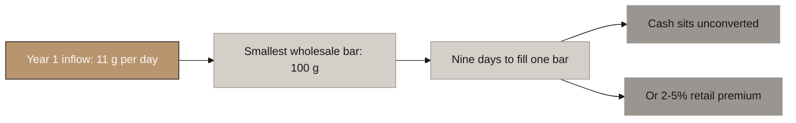

---

## 10. Where Price Risk Sits Today

<!-- SPEAKER NOTES:
"Under a collective mining event, a contribution can wait up to thirty days before it becomes gold. Over thirty days a one sigma gold move is about four point three percent. The investor carries that, and they cannot be quoted a price when they pay. At year ten inflow, that timing gap is worth around three hundred thousand dollars a year."
-->

```mermaid
%%{init: {'theme': 'base', 'themeVariables': {
    'primaryColor': '#B8956E',
    'primaryTextColor': '#1A1714',
    'primaryBorderColor': '#1A1714',
    'lineColor': '#1A1714',
    'secondaryColor': '#FAF8F5',
    'tertiaryColor': '#D4CFC8',
    'fontFamily': 'Libre Franklin, sans-serif',
    'edgeLabelBackground': '#D4CFC8',
    'clusterBkg': '#FAF8F5',
    'clusterBorder': '#B8956E'
}}}%%
graph LR
    A["Contribution arrives"] --> B["Waits for the event"]
    B --> C["Up to 30 days"]
    C --> D["Gold moves 4.3%"]
    D --> E["Investor carries it"]

    style A fill:#B8956E,stroke:#1A1714,color:#FAF8F5
    style B fill:#D4CFC8,stroke:#9A9590,color:#1A1714
    style C fill:#9A9590,stroke:#9A9590,color:#1A1714
    style D fill:#9A9590,stroke:#9A9590,color:#1A1714
    style E fill:#9A9590,stroke:#9A9590,color:#1A1714
```

---

## 11. The Float: How It Works

<!-- SPEAKER NOTES:
"A float is working inventory on the metal side. Not a reserve, not a buffer against redemption. Funds clear, grams are struck at the next LBMA morning fix, and those grams move out of the float into the investor's allocated holding the same day. The metal already exists and already has a serial number. The treasury tops the float back up later, in bar-sized lots. The investor never sees that part."
-->

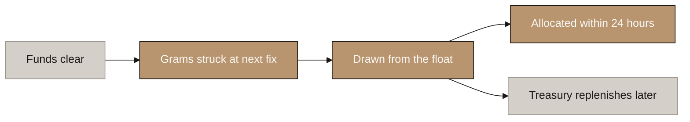

---

## 12. Who Carries the Float

<!-- SPEAKER NOTES:
"The float has to exist. Who funds it is open, and the dealer decides it. Aurus runs the first model: a licensed bullion trader delivers metal to the vault, tokens mint, and the trader sells them on. The dealer is the float. That needs no capital from you. Our recommendation is to launch that way and internalise it later, once volume makes the spread worth the capital."
-->

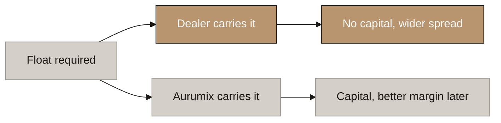

---

## 13. The Float Fixes the Buyback

<!-- SPEAKER NOTES:
"Section 3.2 of your document says the buyback is funded by the custodian liquidating exactly those grams. Custodians do not liquidate. They store. Without a float, every exit forces a physical bar sale to a dealer on demand. With a float, small exits are absorbed and settled against inflow, and you only touch the dealer when the float breaches its band."
-->

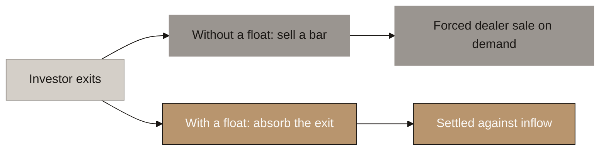

---

## 14. Before and After

<!-- SPEAKER NOTES:
"Seven changes. None of them removes a feature your investors value. Every one of them removes a regulatory exposure, and three of them make the product better for the saver: they get a firm price within a day, a gold balance that grows every month, and a statement they can read without a conversion.

The seventh row is the newest and it is the one your development team will ask about first, because your document names a custody fee of 0.8 to 1% and never says how it is collected. Every route that touches the metal either breaks the one-gram peg or requires debiting a holder's wallet, and a monthly cash bill stops working for the majority of holders who stop contributing but keep holding. So custody is recovered at entry and at exit, where cash is already moving. The gram count only ever rises. There is a separate set of four diagrams on that one if you want the full reasoning."
-->

```mermaid
%%{init: {'theme': 'base', 'themeVariables': {
    'primaryColor': '#B8956E',
    'primaryTextColor': '#1A1714',
    'primaryBorderColor': '#1A1714',
    'lineColor': '#1A1714',
    'secondaryColor': '#FAF8F5',
    'tertiaryColor': '#D4CFC8',
    'fontFamily': 'Libre Franklin, sans-serif',
    'edgeLabelBackground': '#D4CFC8',
    'clusterBkg': '#FAF8F5',
    'clusterBorder': '#B8956E'
}}}%%
graph TD
    subgraph Before["Before"]
        A1["Mining Events limit supply"]
        A2["Premium assumed at 3-8%"]
        A3["Spot capped at 20-40%"]
        A4["1 AURX = 0.01 g"]
        A5["Dividend from operating profit"]
        A6["No gold seller named"]
        A7["Custody fee, no collection route"]
    end

    subgraph After["After"]
        B1["Continuous allocation at T+1"]
        B2["Premium modelled at zero"]
        B3["Spot open, benefits gated"]
        B4["1 AURX = 1 gram"]
        B5["Gold Rewards from fee revenue"]
        B6["Two-way dealer required"]
        B7["Recovered at entry and exit"]
    end

    A1 -->|"Allocation"| B1
    A2 -->|"Pricing"| B2
    A3 -->|"Spot lane"| B3
    A4 -->|"Denomination"| B4
    A5 -->|"Dividend"| B5
    A6 -->|"Procurement"| B6
    A7 -->|"Custody"| B7

    style A1 fill:#9A9590,stroke:#9A9590,color:#1A1714
    style A2 fill:#9A9590,stroke:#9A9590,color:#1A1714
    style A3 fill:#9A9590,stroke:#9A9590,color:#1A1714
    style A4 fill:#9A9590,stroke:#9A9590,color:#1A1714
    style A5 fill:#9A9590,stroke:#9A9590,color:#1A1714
    style A6 fill:#9A9590,stroke:#9A9590,color:#1A1714
    style A7 fill:#9A9590,stroke:#9A9590,color:#1A1714
    style B1 fill:#B8956E,stroke:#1A1714,color:#FAF8F5
    style B2 fill:#B8956E,stroke:#1A1714,color:#FAF8F5
    style B3 fill:#B8956E,stroke:#1A1714,color:#FAF8F5
    style B4 fill:#B8956E,stroke:#1A1714,color:#FAF8F5
    style B5 fill:#B8956E,stroke:#1A1714,color:#FAF8F5
    style B6 fill:#B8956E,stroke:#1A1714,color:#FAF8F5
    style B7 fill:#B8956E,stroke:#1A1714,color:#FAF8F5
```
