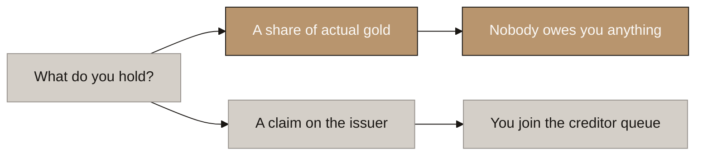
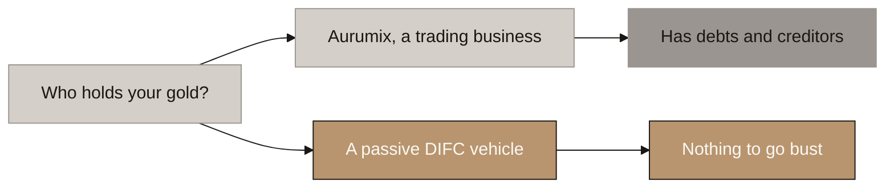
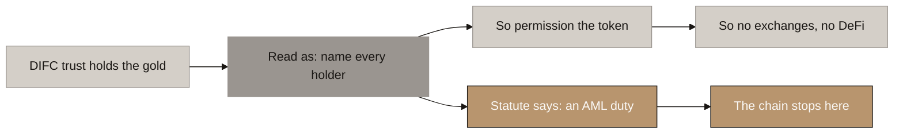
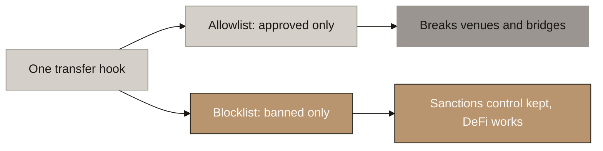

```mermaid
%%{init: {'theme': 'base', 'themeVariables': {
    'primaryColor': '#B8956E',
    'primaryTextColor': '#1A1714',
    'primaryBorderColor': '#1A1714',
    'lineColor': '#1A1714',
    'secondaryColor': '#FAF8F5',
    'tertiaryColor': '#D4CFC8',
    'fontFamily': 'Libre Franklin, sans-serif',
    'edgeLabelBackground': '#D4CFC8',
    'clusterBkg': '#FAF8F5',
    'clusterBorder': '#B8956E'
}}}%%
graph LR
    A["Ali sends AURX to Sara"] --> B["Gold stays in the vehicle"]
    B --> C["Trust deed reads the ledger"]
    C --> D["Sara owns the grams"]
    D --> E["No register write, no approval"]

    style A fill:#D4CFC8,stroke:#9A9590,color:#1A1714
    style B fill:#B8956E,stroke:#1A1714,color:#FAF8F5
    style C fill:#B8956E,stroke:#1A1714,color:#FAF8F5
    style D fill:#B8956E,stroke:#1A1714,color:#FAF8F5
    style E fill:#B8956E,stroke:#1A1714,color:#FAF8F5
```

```mermaid
%%{init: {'theme': 'base', 'themeVariables': {
    'primaryColor': '#B8956E',
    'primaryTextColor': '#1A1714',
    'primaryBorderColor': '#1A1714',
    'lineColor': '#1A1714',
    'secondaryColor': '#FAF8F5',
    'tertiaryColor': '#D4CFC8',
    'fontFamily': 'Libre Franklin, sans-serif',
    'edgeLabelBackground': '#D4CFC8',
    'clusterBkg': '#FAF8F5',
    'clusterBorder': '#B8956E'
}}}%%
graph LR
    A["Money in, full KYC"] --> B["Gold bought, tokens issued"]
    B --> C["Hold and trade, no checks"]
    C --> D["Cash out, full KYC"]
    D --> E["VARA requires this exit check"]

    style A fill:#B8956E,stroke:#1A1714,color:#FAF8F5
    style B fill:#B8956E,stroke:#1A1714,color:#FAF8F5
    style C fill:#D4CFC8,stroke:#9A9590,color:#1A1714
    style D fill:#B8956E,stroke:#1A1714,color:#FAF8F5
    style E fill:#9A9590,stroke:#9A9590,color:#1A1714
```

```mermaid
%%{init: {'theme': 'base', 'themeVariables': {
    'primaryColor': '#B8956E',
    'primaryTextColor': '#1A1714',
    'primaryBorderColor': '#1A1714',
    'lineColor': '#1A1714',
    'secondaryColor': '#FAF8F5',
    'tertiaryColor': '#D4CFC8',
    'fontFamily': 'Libre Franklin, sans-serif',
    'edgeLabelBackground': '#D4CFC8',
    'clusterBkg': '#FAF8F5',
    'clusterBorder': '#B8956E'
}}}%%
graph LR
    A["AURX locked in a wrapper"] --> B["The contract is the owner"]
    B --> C["Wrapped holder owns a claim"]
    C --> D["Direct ownership dies in DeFi"]
    D --> E["Kinesis does this today"]

    style A fill:#D4CFC8,stroke:#9A9590,color:#1A1714
    style B fill:#9A9590,stroke:#9A9590,color:#1A1714
    style C fill:#D4CFC8,stroke:#9A9590,color:#1A1714
    style D fill:#D4CFC8,stroke:#9A9590,color:#1A1714
    style E fill:#9A9590,stroke:#9A9590,color:#1A1714
```

```mermaid
%%{init: {'theme': 'base', 'themeVariables': {
    'primaryColor': '#B8956E',
    'primaryTextColor': '#1A1714',
    'primaryBorderColor': '#1A1714',
    'lineColor': '#1A1714',
    'secondaryColor': '#FAF8F5',
    'tertiaryColor': '#D4CFC8',
    'fontFamily': 'Libre Franklin, sans-serif',
    'edgeLabelBackground': '#D4CFC8',
    'clusterBkg': '#FAF8F5',
    'clusterBorder': '#B8956E'
}}}%%
graph LR
    A["Ownership follows the token"] --> B["1. Owners as a rule"]
    B --> C["2. Transfer alone moves it"]
    C --> D["3. Outsiders must accept it"]
    D --> E["4. VARA accepts it"]
    E --> F["Any link fails: flip the hook"]

    style A fill:#D4CFC8,stroke:#9A9590,color:#1A1714
    style B fill:#9A9590,stroke:#9A9590,color:#1A1714
    style C fill:#9A9590,stroke:#9A9590,color:#1A1714
    style D fill:#9A9590,stroke:#9A9590,color:#1A1714
    style E fill:#9A9590,stroke:#9A9590,color:#1A1714
    style F fill:#B8956E,stroke:#1A1714,color:#FAF8F5
```

# Aurumix Process Maps: Composability and the Open Token

> Draft for the client call. Answers one question: **can AURX be a normal ERC-20 that works across DeFi and trades anywhere, while the investor still owns real gold?**
>
> Reasoning and every citation: `_draft_composability-and-ownership-route.md`. Ownership structure it builds on: `Aurumix_Process_Maps_Ownership_Structure.md`.
>
> ⚠ **This set revises a position we gave earlier.** Diagram 3 exists specifically to explain that, and it should not be skipped. The client will raise it if we do not.
>
> ⚠ **Diagram 8 is not optional.** The structure rests on assumptions counsel has not yet confirmed, and the set must not be presented as settled.

## Diagram Plan

| # | Diagram Name | Type | Direction | Nodes | Placement | Source Section |
|---|---|---|---|---|---|---|
| 1 | Owner or Creditor, and Why the Word Is Not the Test | Flowchart | LR | 5 | Inline | §3, Option A vs B |
| 2 | Same Words, Different Counterparty | Flowchart | LR | 5 | Inline | §3, routes |
| 3 | The Chain That Broke | Flowchart | LR | 6 | Inline | §1 |
| 4 | What Moves When the Token Moves | Flowchart | LR | 5 | Inline | §4.1 |
| 5 | Identity at the Two Doors | Flowchart | LR | 5 | Inline | §4.3 |
| 6 | Why the Wrapper Fails | Flowchart | LR | 5 | Inline | §5 case C |
| 7 | One Hook, Two Settings | Flowchart | LR | 5 | Inline | §5 case A |
| 8 | The Four Links Composability Rests On | Flowchart | LR | 6 | Inline | §10 |

## Consistency Convention

- **Flowchart direction:** LR throughout.
- **Gold node convention:** the recommended path and the outcomes that hold.
- **Concrete node convention:** ruled out, superseded, or the position we are correcting.
- **Stone node convention:** starting points, and anything pending counsel.
- **Text style:** regular, no bold.
- **Sequence:** 1 and 2 settle what the customer owns. 3 clears the air. 4 to 7 are the mechanism. 8 is the honesty slide.

**Call sets.** Ten minutes: **1, 3, 4.** Thirty minutes: add **5, 6, 8.** **3 and 8 are a pair and must not be split**, because 3 explains why we changed our advice and 8 shows we have not made the same mistake twice. **Diagram 4 is the leave-behind.**

---

# Part 1: What the customer owns

## 1. Owner or Creditor, and Why the Word Is Not the Test

<!-- SPEAKER NOTES:
"Before anything about DeFi, we need to settle one thing, because a question came up internally and your team will ask it too.

Under the structure we are recommending, the investor's interest is called a beneficial interest. Somebody will hear that and ask whether that is weaker than owning the gold outright, and whether we have quietly slid from Option A to Option B.

We have not, and here is the test that settles it. Do not ask what the interest is called. Ask what you are holding if everybody disappears tomorrow.

Under Option A, you hold a share of actual gold that is already yours. Nobody owes you anything, because you are not owed anything, you own it. Under Option B, you hold a claim on Aurumix. Somebody owes you. You join the queue with every other creditor and you hope the reserves cover it.

That is the whole difference, and it is why VARA treats them differently. The reserve asset regime, and the two percent of reserves capital that could be four million dollars at your Year 10 target, exists to protect a promise. Under Option A there is no promise to protect, because the investor already owns the metal. VARA's rule opens with the words 'which purport to maintain a stable value', so the reserve regime attaches only to the promise branch.

One last piece of evidence, because it is the one that ends the argument. PAX Gold is the largest gold token in the world and it is unambiguously a direct ownership product. Paxos describes what its holders have as, in their words, beneficial ownership akin to a warehouse receipt. Beneficial ownership is not a downgrade. It is what direct ownership looks like every time a custodian is in the picture, and a custodian is always in the picture, because no retail saver takes delivery of a one kilogram bar."
-->

---

## 2. Same Words, Different Counterparty

<!-- SPEAKER NOTES:
"The second half of the same question. If the investor has a beneficial interest either way, why does it matter whether Aurumix holds the gold or a separate DIFC vehicle holds it?

Because the words are the same and the counterparty is not.

If Aurumix holds it, Aurumix is a trading business. It has staff, suppliers, a lending partner, a card programme, a licence to maintain, and every ordinary way a business can fail. If it does fail, the argument starts about whether that gold was ever really the customers' or whether it is an asset of the company. Onshore, that argument has no settled answer, because the gold is pooled and fungible, there is no bar with anyone's name on it, and onshore UAE law has no trust concept to solve it with. Four research passes returned the same non-answer.

If a DIFC vehicle holds it, the vehicle is passive. It runs no business, employs nobody, borrows nothing and owes nothing. There is no creditor who could ever make a claim on it. And DIFC Trust Law Article 14 subsection 2 says in terms that a transfer into a trust cannot be undone by the bankruptcy of the person who transferred it.

The parallel your banking people will recognise instantly: money in a bank's own account, versus money in a segregated client account. It is your money in both sentences. Only one of them survives the bank failing.

So we are not choosing the DIFC vehicle to get a better sounding word. We are choosing it so that the sentence 'you own the gold' is still true on the worst day."
-->

---

# Part 2: Clearing the air

## 3. The Chain That Broke

<!-- SPEAKER NOTES:
"We need to deal with something head on, because otherwise it sits in the room. Earlier we told you the token had to be permissioned, meaning only pre-approved wallets could ever hold it, and that this ruled out exchanges and DeFi. We are now telling you the opposite. Here is exactly why, and I want you to judge the process rather than take the conclusion on trust.

We told you permissioned because of one named provision. DIFC Trust Law Article 60, subsection 6. Read in summary, it appeared to require a trustee to identify every beneficiary. If the beneficiaries are the token holders, then you must know every token holder, and the only way to guarantee that is to control who may hold. That was the chain, and it was written down with its source so it could be checked.

We then checked it against the statute itself rather than the summary. Article 60 is headed Duties of Trustees, but subsection 6 is an anti money laundering duty about corporate parties to the trust, enforced by the Registrar. It is the beneficial ownership register regime, the same idea as a company UBO register. It is not an instruction to list every holder. The chain stops there.

We found the same pattern on the VARA side. We had read rule three B one c as requiring every transfer to run between registered parties. Word for word it is a risk management clause. It never mentions registration, whitelists or approved venues. And rule three E three lets a holder redeem provided the owner, and I am quoting, or their designee, has successfully onboarded. So VARA plainly expects the token to reach people you have never met.

Now the part that matters commercially. Nothing was built on the old position, and that was deliberate. Our written advice in early August was do not commit to a permissioned standard by name, commit to permissioned capable, and deploy behind an upgradeable proxy with a transfer hook. That advice has not changed. What changes is the default setting of one hook.

If you want the honest diagnosis of our own error: we chose the DIFC route and then kept reasoning about ownership as though the gold still moved between customers. It does not. Once you follow that through, the identification requirement disappears by itself. We caught it at primary source before it reached your licence application, and it cost you nothing because you had not built on it."
-->

---

# Part 3: The mechanism

## 4. What Moves When the Token Moves

<!-- SPEAKER NOTES:
"This is the whole design on one slide, and if you remember one thing from today, make it this.

Ali holds five AURX. He sends them to Sara, who Aurumix has never met and never will.

Watch what happens to the gold. Nothing. It does not move. It does not get reallocated. It does not get re-registered. The DIFC vehicle owned those bars before the transfer and owns exactly the same bars afterwards. It will still own them in ten years.

What changes is who benefits from them, and that is decided by one clause in the trust document. The clause says the beneficiaries are the holders of AURX from time to time, as recorded by the token contract. So the moment the token contract updates, Ali drops out for five grams and Sara joins for five grams. Automatically. No register entry, no form, no approval from us, no counterparty check.

The sentence to hold onto is this. The gold never changes owner. Only the question of who benefits changes, and the trust document says that question is answered by the token ledger.

Three consequences follow, and they are all commercial. Sara can hold it in any wallet. She can sell it on any exchange or any decentralised venue. She can post it as collateral in a lending market. None of that needs our permission, because none of it needs anything to happen off chain.

And here is the compliance point, which is the opposite of what you would expect. VARA's rule three B one c exists to stop the token ledger and the ownership ledger drifting apart. Under the design we had, the token moved and then a register got updated separately, so those two things could drift, and we would owe VARA mitigating measures. Under this design they cannot drift, because they are the same ledger. That is a stronger answer than any whitelist."
-->

---

## 5. Identity at the Two Doors

<!-- SPEAKER NOTES:
"The obvious worry with an open token is compliance. If anyone can hold it, have we lost control? No, and the reason is that the control sits at the doors rather than inside the room.

Door one is buying. Money comes in, full KYC, sanctions screening, source of funds. Only then is gold bought and are tokens issued. That is already how the product works and nothing changes: verification is a hard precondition of minting.

In between, people hold and trade freely. No checks, no approvals, no list.

Door two is cashing out. Tokens are burned, gold is sold, and cash is paid to a bank account in the same name. Full KYC again. And this is worth saying carefully to VARA, because it is their rule and not our choice. Rule three E three says redemption must be processed provided the owner or holder, or their designee, has successfully onboarded. VARA wrote that sentence knowing tokens travel. They put the identity check at the exit.

So the shape is identity at the two doors, freedom in the room. That is not a workaround. It is the architecture PAX Gold, Tether Gold and Backed Finance all use, and between them that is the overwhelming majority of this market.

Two things we keep regardless. A blocklist, so a sanctioned address can be frozen. And a freeze and seize power, so a court order or a theft has an answer. PAX Gold carries exactly the same powers and it is the most institutionally accepted token in the category.

The one thing we genuinely give up is a live list of everyone holding at any moment. We can produce that list at both doors and nowhere in between. That matters for the wind down plan, and slide eight deals with it."
-->

---

## 6. Why the Wrapper Fails

<!-- SPEAKER NOTES:
"You asked us to look at wrapping AURX so it could be used in DeFi. We did, and the answer is that you do not need a wrapper, and you should not build one. This slide is why, because it is counterintuitive.

The wrapper idea is: keep AURX permissioned, put it inside a wrapper contract, and let that contract issue a free floating version for DeFi. It looks like you get both.

Here is what actually happens. While the wrapper holds the AURX, the holder of record is the wrapper contract. Under the trust document, the beneficiary is whoever holds AURX. So the beneficiary is a piece of software. The person holding the wrapped version is not an owner of gold at all. They hold a claim against a smart contract.

So Option A, direct ownership, stays alive in the token nobody trades, and dies in the token everybody trades. Your strongest differentiator evaporates at exactly the point where it is most visible.

This is not hypothetical, and the example is in your own competitive set. Kinesis runs precisely this structure today. On its own chain, you own the gold. On its Ethereum wrapper, a separate company's terms say holders have, quoting, no legal, equitable or beneficial right, title or interest in or to the Reserves. Same brand, same ticker, two completely different legal positions, and a customer cannot tell them apart without reading two separate documents.

You can patch it, by drafting the trust to look through the wrapper. But then you need to be able to identify the wrapper holders anyway, which means the whitelist on the base token buys you nothing, and you have paid for an extra contract, an extra audit and an extra thing that can break.

So the recommendation is simpler and cheaper than what you asked for. One token. One legal position. No wrapper."
-->

---

## 7. One Hook, Two Settings

<!-- SPEAKER NOTES:
"This is the build slide, and it is the cheapest thing in this deck.

Your token contract has one place where a transfer can be checked. One hook. It can be set two ways, and the setting is the entire difference between a token that works in DeFi and one that does not.

Setting one is an allowlist. It asks, is this address approved, and blocks everyone else. That is what we previously specified. It does what it says, and it also breaks exchange deposit sweeps, bridges and decentralised venues, often in confusing ways, because the approval step succeeds and then the transfer reverts.

Setting two is a blocklist. It asks, is this address banned, and lets everyone else through. Sanctions control is identical, because the addresses you actually need to stop are the ones you name. Everything else works normally.

The important commercial point: the blocklist is less code than the allowlist. This is not an expensive change, it is a cheaper build. There is no identity registry to write, no onboarding flow for recipients, no per transfer counterparty check.

And the piece that de risks the whole thing: deploy behind an upgradeable proxy with the hook as a stub. Roughly a day of work in the September build. It means the token standard stops being a decision that must be made before the build and becomes one that can follow your lawyers.

One rule to hold firmly. Do not ship the allowlist thinking you will remove it later. You cannot remove it cleanly once real holders exist, and taking a control away reads badly even when it is correct. Ship the blocklist, and if counsel objects you tighten it. Tightening is easy. Loosening is not."
-->

---

# Part 4: What we are assuming

## 8. The Four Links Composability Rests On

<!-- SPEAKER NOTES:
"Last slide, and the most important one, because we have just changed our advice once and you are entitled to ask what stops that happening again. So here is exactly what we are assuming, in plain terms, and what breaks if each one is wrong.

Everything on the DeFi side depends on one sentence being true. When AURX moves from any wallet to any other wallet, ownership of the gold has to move with it, automatically, with no paperwork and no approval from Aurumix. If that holds, AURX is just a normal token and everything works. If it does not, you need a signed form on every transfer, which is impossible on an exchange or in a lending market.

That sentence breaks into four links, and all four have to hold.

Link one. We can describe the owners as a rule instead of a list. The trust document has to be able to say the gold is held for whoever holds AURX, rather than naming Ali, Sara and Rahul. DIFC law says the people it is held for can be, quoting, ascertainable by reference to a class, and that they count as identified if they can be worked out now or in the future. Whoever holds the token is a class, and a blockchain tells you exactly who is in it at any second. We rate this medium to high. The words are clear. Nobody has done it. If this is wrong, you must name holders, so you must control who can hold, and composability dies right here.

Link two. Ownership can move by token transfer alone. Normally passing on your share of something held in trust needs a signed document. We need the token transfer itself to do that job. The DIFC article that sets that requirement opens with the words, subject to the terms of a trust. That is the law saying your own document can set a different method. English law does not allow this and DIFC does, which is a genuine reason DIFC was the right jurisdiction. Medium confidence. Strong wording, no court has tested it. If this is wrong, every transfer needs paperwork from both sides, so transfers only work between people you have already onboarded.

Link three, and this is the weakest and the one we want you to hear us name ourselves. It has to hold up against outsiders, not just between us and the customer. The trust document binds Aurumix and the investor. But the moment ownership really matters is when a stranger challenges it: a liquidator, a creditor, a court. Will they accept that the blockchain says Sara owns it, when there is no signed document anywhere? Medium to low. And note the shape of the risk: the design works perfectly day to day and fails on the one day it needs to work.

Link four is not a legal question, it is a regulator question. VARA's rule says you must prove ownership transfers when the token transfers. Our argument is that under this design it transfers automatically, so the proof is structural rather than procedural. There is no VARA guidance and no precedent. That one gets asked to VARA directly in pre application dialogue rather than to a lawyer.

Now what is already settled, so you know the base is solid. VARA mandates no token standard and imposes no transfer restriction anywhere in the issuance rulebook. The only clause on the subject tells you to disclose restrictions you choose to impose. VARA expressly allows redemption where the owner or holder, or their designee, has onboarded, so an unidentified holder is contemplated by the rules themselves. Identity at buying and at cashing out is enough for anti money laundering. And PAX Gold and Tether Gold, together about ninety seven percent of this market, are open tokens claiming direct ownership. So the market side is settled. Every open question is about the trust document.

Two more we owe you, and they are about the vehicle rather than the token: whether it could be classified as a collective investment fund, which turns on the gold producing no income and not being managed and is a further reason the profit share dividend must stay dead, and whether a single purpose trustee company needs a DFSA licence, which is a cost question rather than a structure question.

And now the reason none of this holds up September. Four assumptions, three for a lawyer, one for VARA, none tested by anyone anywhere. So we are not asking you to assume this works. We are asking you to spend about a day making it reversible, and then go and ask. If any of the four fails, you flip the hook to the restricted setting and you are back to precisely the design already drafted, having lost nothing. Because of the proxy that is a configuration change, not a rebuild.

You are not betting on our reading. You are buying the option to act on it, and the option costs a day."
-->

---

## The assumptions register

Reproduce this in the leave-behind. It is the discipline that makes diagram 3 survivable.

**The one sentence everything rests on:** when AURX moves from any wallet to any other wallet, ownership of the gold moves with it, automatically, with no paperwork and no approval from Aurumix.

### The four links, and what breaks if each is wrong

| # | In plain terms | Why we think it holds | Confidence | If wrong |
|---|---|---|---|---|
| 1 | The owners can be described as **a rule**, not a list: "whoever holds AURX" | Art 45(1)(b)(i): owners may be "ascertainable by reference to a class". Art 34(2): ascertained "now or in the future" | Med-High | You must name holders, so you must control who can hold. **Composability dies here** |
| 2 | Ownership moves **by token transfer alone**, with no signed document | Art 47(2) opens "**Subject to the terms of a trust**". The law lets the deed set the method. English law does not | Medium | Every transfer needs paperwork from both sides, so transfers work only between onboarded people |
| 3 | That method binds **outsiders**, not just Aurumix and the customer | Nothing yet. This is the untested one | **Med-Low. The sharpest attack** | It works perfectly day to day and fails on the one day it matters |
| 4 | **VARA accepts** it satisfies Annex 2 III.B.1.a and III.B.1.c | The argument is strong: divergence is structurally impossible, not merely mitigated. But no guidance and no precedent | Medium | Falls back to a register write on transfer, which means a permissioned token |

**All four must hold. Three go to counsel, one goes to VARA in pre-application dialogue. None has been tested by anyone, anywhere, and no DIFC or ADGM trust exists with token holders as the beneficiary class.**

### Already verified, so the base is solid

| Verified word for word at primary source |
|---|
| VARA mandates no token standard and **imposes no transferability restriction anywhere**. The only clause on the subject requires you to *disclose* restrictions you choose to impose |
| Rule III.E.3 permits redemption where "the owner and/or holder, **or their designee**, has successfully onboarded", so VARA contemplates unidentified holders |
| Identity at mint and at redemption satisfies VARA and AML |
| PAXG and XAUT, roughly 97% of the market, are open ERC-20s claiming direct allocated ownership |

### Two further questions, about the vehicle rather than the token

| # | Question | Confidence | Note |
|---|---|---|---|
| 5 | Is the DIFC vehicle a Collective Investment Fund? | Med-High that it is not | Turns on the gold producing no income and not being managed. **A further reason the profit-share dividend must stay dead** |
| 6 | Does a single-purpose DIFC trustee company need a DFSA licence? | Medium, unverified at primary source | A cost question, not a structure question |

### The way back

**If any link fails, the hook is switched to the restricted setting and the design reverts to exactly what was already drafted.** Because the token sits behind an upgradeable proxy, that is a configuration change, not a rebuild: same address, same balances, no migration, no relisting.

**You are not betting on this reading. You are buying the option to act on it, and the option costs about a day.**

## Three departures from the client's document

Raise these deliberately rather than letting them be discovered.

| Their position | Ours | Why |
|---|---|---|
| A wrapped AURX for DeFi | **No wrapper. AURX itself is composable** | Inside a wrapper the beneficiary is a smart contract, so the wrapped holder owns no gold |
| Permissioned token (our own earlier advice) | Open ERC-20 with a blocklist | The provision it rested on does not say what the summary said |
| An exchange listing plan | **Composable-capable at launch, listed later** | A thin pool makes a discount public and continuous. The gap between capable and listed is the float |

## Open item owed before this set is presented

⚠ **ICS versus self-custody is undecided and it is Abdur's call.** If a customer withdraws AURX to their own wallet, Retention has nothing to read. Proposed default: a withdrawal to self-custody counts as a sale, with registered self-custody addresses as a later feature. Smaller than it looks, because ICS never measured gold, only behaviour, and contributions arrive on the identified fiat rail. Full reasoning in `_draft_composability-and-ownership-route.md` §7.1.
