# Aurumix Process Maps: The Lending System and the Gold Card

> Companion to `_draft_credit-and-card-infrastructure.md`. The whole credit product end to end: why we partner, who the partners are, how a limit is set, how a tap is authorised, and what happens when the gold price falls.
>
> **The single message: this is one product, not two.** One gold-secured facility, drawn two ways. The card is the channel that makes the economics work, because credit interchange is roughly double prepaid and it is the only merchant-funded money in the model.
>
> Related decisions: 21, 24, 25, 28, 42, 44, 45, 46. **Maps 1, 7 and 11 carry material that reverses or corrects earlier positions — see the reconciliation list at the end.**

## Diagram Plan

| # | Diagram Name | Type | Direction | Nodes | Placement | Theme |
|---|---|---|---|---|---|---|
| 0 | One Facility, Two Draws | Flowchart | LR | 5 | Inline | The headline |
| 1 | Why We Partner | Flowchart | LR | 7 | Inline | Licensing walls |
| 2 | Two Chains, One Decision | Flowchart | LR | 6 in two clusters | Inline | Structure |
| 3 | The Provider Shortlist | Flowchart | LR | 8 in two clusters | Inline | Named counterparties |
| 4 | Setting the Limit | Flowchart | LR | 5 | Inline | Origination |
| 5 | A Cash Draw, Walked | Flowchart | LR | 6 | Inline | Mechanism |
| 6 | A Card Tap in Three Seconds | Flowchart | LR | 6 | Inline | Mechanism |
| 7 | When the Rail Fails | Flowchart | LR | 6 | Inline | Honest warning |
| 8 | The Collateral Chain | Flowchart | LR | 5 | Inline | Security |
| 9 | The Liquidation Ladder | Flowchart | LR | 6 | Inline | Enforcement |
| 10 | Who Is Actually Exposed | Flowchart | LR | 6 | Inline | Reassurance, honestly given |
| 11 | Where the Money Comes From | Flowchart | LR | 5 | Inline | Economics |

## Call Sets

- **Ten minutes:** 0, 2, 9. What it is, who builds it, what protects the customer.
- **Thirty minutes:** adds 1, 4, 10, 11.
- **The build conversation:** 6 and 7 are a pair and **must not be split.** Map 6 is the design; map 7 is the hole in it. Presenting 6 alone overstates the control we have.
- **Maps 9 and 10 are also a pair.** Nine is the ladder, ten is who it reaches. Nine alone sounds frightening; ten alone sounds complacent.
- **Leave-behind:** map 3.

## Consistency Convention

- **Flowchart direction:** LR throughout.
- **Gold node convention:** solutions, outcomes that hold, where the mechanism lands.
- **Concrete node convention:** problems, honest warnings, ruled-out routes.
- **Stone node convention:** starting points, mechanism steps, pending items.
- **Text style:** regular, no bold.
- **Clusters:** used in maps 2 and 3 only, to hold the spending chain and the money chain apart. Everywhere else, flat.

---

## 0. One Facility, Two Draws

<!-- SPEAKER NOTES:
"Start here, because your own documents describe credit in one place and the card in another, and that has been quietly costing you.

They are the same product. There is one facility, secured on one pool of pledged gold, priced by one ratio ladder, sitting on one lender's book. What changes is only how the customer reaches it.

They can ask for a lump sum, and it lands in their bank account. School fees, a hospital bill in Kerala, a deposit. Or they can tap a card at a shop, and that tap is a small draw against the same limit.

Why does the distinction matter to you? Because it means one integration, not two. One credit decision, not two. One collateral pool, not two. And when you go and talk to a bank, you are asking for one thing.

But it also matters for a second reason, and it is the commercial one. A cash draw earns you lending revenue. A card tap earns you lending revenue and interchange, which is the merchant's money, not your investor's. Same customer, same collateral, same loan. One of those two channels pays you twice.

That is why the card is not a nice-to-have bolted onto the lending product. It is the reason the lending product is worth building."
-->

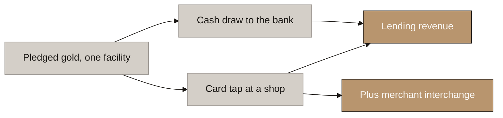

⚠ **The build rule this forces:** the facility is struck **once**, at opening, and every draw inherits that strike. The benefits draft says the ratio is "struck at the draw", which on a card would mean re-striking on every coffee.

---

## 1. Why We Partner

<!-- SPEAKER NOTES:
"The first question any founder asks is why we cannot just do this ourselves. Three walls, and they are all hard.

Lending dirhams to consumers in the UAE needs a Central Bank finance company licence. That is a hundred and fifty million dirhams of paid-up capital. We have verified that against the Central Bank rulebook itself, so it is not a rumour. And there is a second condition that money cannot solve: sixty percent of that capital must be owned by UAE nationals. You do not clear that with a bigger raise. It is a different company with different owners.

There is a smaller category, the Restricted Licence, and I want to correct something we told you earlier. We had said it fails because it cannot take collateral. That was wrong, and we checked. It fails because it caps lending at twenty thousand dirhams per borrower, or three months of their income, whichever is lower. It is a payday lending regime. Same answer, better reason.

And now the one I most want to walk you through, because we spent real time on it and it was the most attractive idea in the file. VARA has its own lending licence, and it is five hundred thousand dirhams of capital instead of a hundred and fifty million. Three hundred times cheaper. We asked whether your facility could sit inside it.

It cannot. We pulled VARA's own regulations and read the definition. Lending and Borrowing Services means lending a virtual asset where the borrower commits to return the same asset. The thing lent has to be the token, and the same token has to come back. Advancing dirhams against gold collateral is simply not that activity.

I would rather tell you that now than have your counsel tell you in November. So: partnering is not the cheap option we settled for. It is the only door."
-->

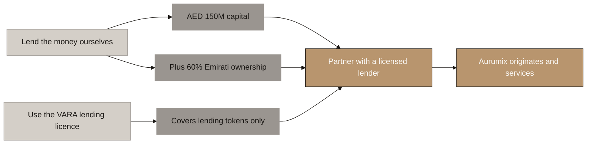

🔴 **This map reverses a position.** `Aurumix_Process_Maps_Revenue_Streams.md` currently instructs the presenter to raise the token-lending question as the **first** item for counsel, describing the difference as *"roughly three hundred fold"*. VARA Regulations 2023 Schedule 1 closes it. **Do not present the old speaker notes.**

⚠ **Both CBUAE figures verified** against Article 11 of the Finance Companies Regulation. The AED 20,000 Restricted Licence cap is Article 23.

---

## 2. Two Chains, One Decision

<!-- SPEAKER NOTES:
"This is the diagram that makes the whole arrangement make sense, and I want to start by clearing up the thing everybody gets wrong, ourselves included until recently.

Visa and Mastercard are not the card programme. They are the road. They never issue a card, never hold a rupee or a dirham, never lend, and they have no customers. They route messages and they rent out the brand. So when somebody says we have a Visa programme, that tells you how the message travels. It tells you nothing at all about where the money comes from.

Here is the idea that unlocks it. A card does not contain money. A card points at money. Every card in the world points at something. A prepaid card points at cash the customer loaded last week. A debit card points at their bank account. And a credit card points at somebody's balance sheet.

You chose credit. So something, somewhere, has to actually be lending real money. And lending real money in this country needs a Central Bank licence.

Which is why there are two chains here, not one list.

The spending chain answers: how does the customer pay? Visa's rails, a licensed issuer whose name is on the card, and a processor that runs the thing.

The money chain answers: where does the cash come from? A licensed lender, secured on pledged gold.

Those two chains are independent. You could have the first without the second, and that is a prepaid card. You could have the second without the first, and that is a cash loan. Aurumix wants both, and the two chains meet at exactly one place.

You. Aurumix sits at the junction and makes the decision. Not the bank, not the processor. You hold the customer, the collateral valuation, the rules, and the yes or no at the moment of the tap.

So the sentence for every partner meeting is: structure is ours, pricing is theirs. The ladder, the ninety day seasoning, the strike rules, the warning thresholds, the cure period, the promise that a score fall never triggers a margin call. All ours. The interest rate, the final acceptance of eighty percent, the licence. Theirs.

If a bank tries to write your origination policy, that is the wrong bank."
-->

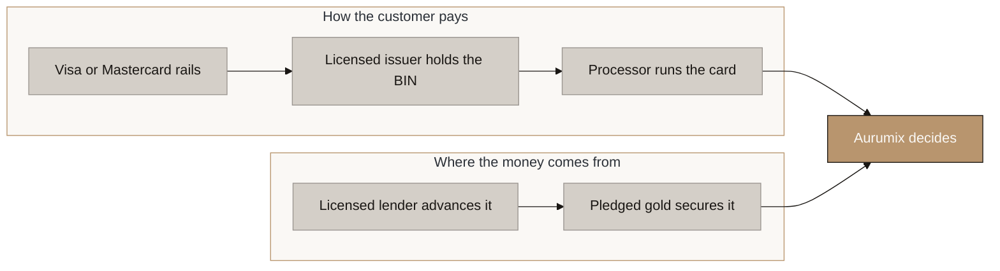

**The one line to leave them with:** a card is a pipe, not a pot of money. **The spending chain builds the pipe. The money chain fills it. Neither substitutes for the other.**

⚠ **The BIN premise is unverified.** Our drafts state the CBUAE reserves the sole right to issue BINs. **No such clause was found** in the Retail Payment Services and Card Schemes Regulation. The binding constraint looks like card-scheme principal membership plus RPSCS licensing — which may collapse two boxes of the spending chain into one vendor. See map 3.

⚠ **Do not let the processor be confused with the shop's card machine.** The POS terminal sits on the *merchant's* side of the transaction and belongs to the merchant's acquirer. Our processor sits behind the *customer's* card. They are opposite ends of the same wire — which is also why interchange flows toward us: it travels from the merchant's side to the card-issuing side, and we are on the issuing side.

---

## 3. The Provider Shortlist

<!-- SPEAKER NOTES:
"Same two chains as the last diagram, now with names in them.

Spending chain first. NymCard, Dubai, in Media City. What makes them interesting is that they are a principal member of both Visa and Mastercard in their own right, and their own materials say they support revolving credit and embedded lending, not just prepaid. That combination is rare here.

And it raises a question worth one phone call before you talk to any bank. If NymCard is already a scheme principal member, you may not need a separate sponsor bank on the card side at all. That deletes a counterparty. I would not assert it yet, because we could not verify the underlying Central Bank rule either way, but it is a cheap question with a large answer.

Now the important caveat, and this is the one I most want to land, because it is where people get their hopes up. NymCard solves the card. It does not solve the credit. They have no lending licence and no balance sheet for consumer lending. Even in the best case where they cover the whole spending chain on their own, you still need the money chain, and the money chain still needs a licensed lender.

So: the money chain. Start with Emirates Money. Central Bank licensed finance company, wholly owned by Emirates NBD, and they already run a loan against gold at up to eighty percent. Eighty. That is the exact number we settled on for Sovereign, and we settled on it before we knew this. Better still, their gold sits in the DMCC vault operated by Brink's, which is where yours would sit. Every hard question you were preparing to argue, they have already answered internally.

Mashreq is the fallback and for a specific reason. They have demonstrably taken third party originated consumer credit onto their own book, with Cashew, up to a hundred and fifty thousand dirhams a customer. Emirates Money knows gold. Mashreq knows the partnership shape. Ideally you find one that knows both.

Commercial Bank of Dubai is the wildcard, because it is the only institution touching all three of your problems: a gold denominated lending product launched in June, debt funding to a fintech originator, and virtual asset banking.

And for your own banking, Zand. VARA custody licence, and they bank most of the licensed virtual asset firms in Dubai. One sequencing warning I will repeat: approaching a bank before you hold your licence creates a refusal record that other banks can see. Order these conversations deliberately.

Last thing, and it is the question I would actually walk into the lender meeting with. It is not whether they will also do the card. It is who funds settlement. Visa pays the merchant the next day, so somebody has to have cash sitting there. Either the lender funds a settlement account daily, or you prefund and get reimbursed. If it is the second, that is working capital you are carrying, and it is in nobody's model yet."
-->

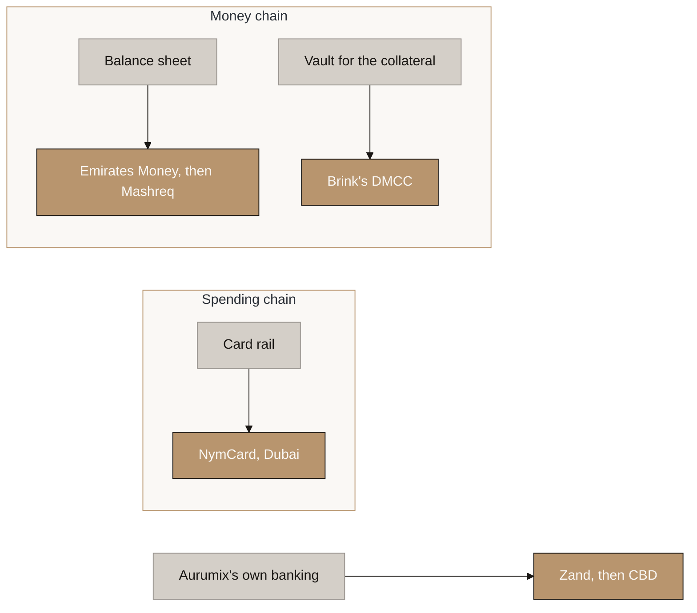

🔴 **The sentence that prevents the most likely misunderstanding: NymCard solves the card, it does not solve the credit.** A scheme principal member is not a lender. Even in the best case it removes a counterparty from the spending chain and changes nothing in the money chain.

**The three realistic shapes:**

| | Spending chain | Money chain | Counterparties |
|---|---|---|---|
| **A** | One bank issues and lends | Same bank | **1** — cleanest, hardest to find. Mashreq, ADIB and Emirates NBD are all scheme members *and* lenders, so it is worth asking |
| **B** | NymCard issues | Emirates Money or Mashreq | **2** — the realistic default |
| **C** | Sponsor bank + NymCard processes | Separate lender | **3** — most work |

⚠ **Option B is genuinely workable, not a compromise.** Because Aurumix holds the balance and makes the authorisation decision (map 6), **the lender is never in the real-time path** — they sit in daily batch settlement. Splitting the two chains across two companies costs contracts and diligence, not latency.

⚠ **The real commercial question is who funds settlement**, not whether one partner can do both. Visa settles the merchant at T+1. If Aurumix prefunds and is reimbursed, that is working capital carried by the client and it appears in no model yet.

✅ **The finding that most helps you:** Emirates Money publishes **80% LTV** on physical gold, vaulted at DMCC with Brink's. Our benefits draft currently says *"no UAE bank or finance company was found publishing a loan-against-gold LTV"*. That is now wrong, and wrong in our favour.

⚠ **The ADIB / Al Fardan precedent is real but weaker than cited.** The product is Travelez Plus, and it is **prepaid, not credit** — so it proves ADIB will sponsor a non-bank, not that ADIB will sponsor credit risk. It is also a four-party structure including Rêv Worldwide as processor.

---

## 4. Setting the Limit

<!-- SPEAKER NOTES:
"How much can somebody borrow. Three inputs and one piece of arithmetic.

First, they have to be at Gold tier. Not merely through the Confirmed SIP door: credit unlocks one rung higher. That is deliberate. It is the largest benefit in the product and it should require the most.

Second, the grams have to have been held ninety days. That is collateral seasoning, and it exists to stop somebody buying gold on Monday and borrowing against it on Tuesday, which is not saving, it is a wire transfer with extra steps. Sell and rebuy, the clock restarts.

Third, their tier sets the ratio. Gold fifty percent, Platinum sixty five, Sovereign eighty.

Multiply the three together. Seasoned unpledged grams, times today's fix, times the ratio for their tier. That is their limit.

Notice what sets the size and what sets the rate. The grams set the size, and grams come from money. The ratio comes from behaviour. A big depositor and a small depositor with identical payment records get the identical percentage. That is decision forty one made concrete, and it is the sentence that keeps this out of securities territory: capital buys grams, behaviour buys the rate.

Last thing. The facility is struck once, when it opens, not on every transaction. If they climb a tier afterwards, new borrowing uses the better ratio. If they fall a tier, nothing outstanding is touched, ever."
-->

```mermaid
%%{init: {'theme': 'base', 'themeVariables': {
    'primaryColor': '#B8956E',
    'primaryTextColor': '#1A1714',
    'primaryBorderColor': '#1A1714',
    'lineColor': '#1A1714',
    'secondaryColor': '#FAF8F5',
    'tertiaryColor': '#D4CFC8',
    'fontFamily': 'Libre Franklin, sans-serif',
    'edgeLabelBackground': '#D4CFC8',
    'clusterBkg': '#FAF8F5',
    'clusterBorder': '#B8956E'
}}}%%
graph LR
    A["Reach Gold tier"] --> B["Grams seasoned 90 days"]
    B --> C["Tier sets the ratio"]
    C --> D["50, 65 or 80 percent"]
    D --> E["Facility struck once"]

    style A fill:#D4CFC8,stroke:#9A9590,color:#1A1714
    style B fill:#D4CFC8,stroke:#9A9590,color:#1A1714
    style C fill:#D4CFC8,stroke:#9A9590,color:#1A1714
    style D fill:#B8956E,stroke:#1A1714,color:#FAF8F5
    style E fill:#B8956E,stroke:#1A1714,color:#FAF8F5
```

⚠ **A revolving facility needs a review date that a term loan does not.** Without one, a customer struck at Sovereign who later falls to Silver borrows at 80% forever and the tier ladder stops binding. **Recommended: annual review, limit re-strikes to the current tier, drawn balances run to term at the original strike.**

---

## 5. A Cash Draw, Walked

<!-- SPEAKER NOTES:
"The simple channel first, because the card is the same thing with a faster clock.

The customer asks to borrow. We check headroom against the formula in the last diagram. If it is there, their grams are flagged as pledged.

Say that word carefully to customers: flagged. The gold does not move. It does not leave the vault, it is not sold, and it is not lent to anybody else, which is a promise we can now make on doctrinal grounds as well as commercial ones. It stays theirs, it keeps earning their score, and it keeps counting in Retention. It simply cannot be withdrawn while it is securing a loan.

The licensed lender advances the money. It is their balance sheet, so it is their credit risk.

And Aurumix does the work: originates, prices the collateral, runs the app, services the account, chases the arrears. You get paid for that work in four or five ways. An origination fee when they draw. A servicing fee on the outstanding balance. A penal charge if they run past term. Recovery costs if it goes bad. And a negotiated share of the interest.

That is not us inventing charges to pad a model. It is the published schedule of the largest gold lender in India, line for line. Manappuram itemises recovery down to the rupee: printing six, advertisement one seventy, transport fifty, insurance thirty, auctioneer forty five, postage eighty. Five hundred and forty one rupees all in. Every line reads as cost recovery rather than margin, which is precisely why borrowers accept them without complaint."
-->

```mermaid
%%{init: {'theme': 'base', 'themeVariables': {
    'primaryColor': '#B8956E',
    'primaryTextColor': '#1A1714',
    'primaryBorderColor': '#1A1714',
    'lineColor': '#1A1714',
    'secondaryColor': '#FAF8F5',
    'tertiaryColor': '#D4CFC8',
    'fontFamily': 'Libre Franklin, sans-serif',
    'edgeLabelBackground': '#D4CFC8',
    'clusterBkg': '#FAF8F5',
    'clusterBorder': '#B8956E'
}}}%%
graph LR
    A["Customer requests a draw"] --> B["Headroom checked"]
    B --> C["Grams flagged, never moved"]
    C --> D["Lender advances the money"]
    D --> E["Aurumix services and collects"]
    E --> F["Origination, servicing, interest share"]

    style A fill:#D4CFC8,stroke:#9A9590,color:#1A1714
    style B fill:#D4CFC8,stroke:#9A9590,color:#1A1714
    style C fill:#D4CFC8,stroke:#9A9590,color:#1A1714
    style D fill:#D4CFC8,stroke:#9A9590,color:#1A1714
    style E fill:#D4CFC8,stroke:#9A9590,color:#1A1714
    style F fill:#B8956E,stroke:#1A1714,color:#FAF8F5
```

---

## 6. A Card Tap in Three Seconds

<!-- SPEAKER NOTES:
"This is the diagram for your engineering team, and it answers a question that has been open in our documents since we started: when somebody taps a card in a supermarket, who decides whether there is enough gold behind it?

The answer surprises most people. You do.

The pattern is called just in time funding, and it is documented publicly by the card processors. The customer taps. The network sends the authorisation to the processor. The processor does not answer it from a stored balance. It turns around and calls your endpoint and asks: can this be funded?

Your system then computes, live, in that instant: seasoned unpledged grams, times the current fix, times the ratio for their tier, minus what they already owe. And you answer approve, decline, or a partial approval, which lets you approve up to their remaining headroom instead of embarrassing them with a decline at the till.

Two things follow from this and both matter for September.

The first is that your collateral is not revalued on a schedule and pushed to a bank overnight. It is revalued on every single transaction. Your effective mark to market frequency is every tap, limited only by how fresh your gold price feed is. That is a much stronger risk position than a monthly-review lender has, and it is worth saying to the lender.

The second is the constraint. You have three seconds. Marqeta's documentation is explicit: no answer within three seconds and the transaction is declined automatically. Everything, the valuation, the ratio, the check, the answer, plus the network round trip, inside three seconds, at three in the morning, every time. That is a real architectural requirement and it needs to be in the September build brief, not discovered in December."
-->

```mermaid
%%{init: {'theme': 'base', 'themeVariables': {
    'primaryColor': '#B8956E',
    'primaryTextColor': '#1A1714',
    'primaryBorderColor': '#1A1714',
    'lineColor': '#1A1714',
    'secondaryColor': '#FAF8F5',
    'tertiaryColor': '#D4CFC8',
    'fontFamily': 'Libre Franklin, sans-serif',
    'edgeLabelBackground': '#D4CFC8',
    'clusterBkg': '#FAF8F5',
    'clusterBorder': '#B8956E'
}}}%%
graph LR
    A["Customer taps"] --> B["Network asks the processor"]
    B --> C["Processor asks Aurumix"]
    C --> D["Grams times fix times ratio"]
    D --> E["Approve, decline or partial"]
    E --> F["Three seconds or auto-decline"]

    style A fill:#D4CFC8,stroke:#9A9590,color:#1A1714
    style B fill:#D4CFC8,stroke:#9A9590,color:#1A1714
    style C fill:#D4CFC8,stroke:#9A9590,color:#1A1714
    style D fill:#D4CFC8,stroke:#9A9590,color:#1A1714
    style E fill:#B8956E,stroke:#1A1714,color:#FAF8F5
    style F fill:#B8956E,stroke:#1A1714,color:#FAF8F5
```

⚠ **Build consequence for September:** Aurumix must run a real-time authorisation engine holding the live collateral figure. This is a named system that does not appear in any prior deliverable.

---

## 7. When the Rail Fails

<!-- SPEAKER NOTES:
"I am showing you this one because it would be dishonest to show you the last one without it, and because your lender will ask.

There are two ways a card gets approved with nobody checking the gold.

If your systems are unreachable, the processor does not simply decline everything. It falls into what is called Commando Mode and decides on your behalf, using static rules you agreed in advance. That protects the customer experience. It also means spending happens against rules, not against collateral.

And if the processor itself is unreachable, the card network steps in, decides unilaterally, and tells the processor afterwards. That one is not yours to control at all. Nobody's card programme controls it. It is how the rails work.

So in both cases, transactions get approved with no collateral check, and you learn about them afterwards.

Now, the honest framing. This is not a flaw we introduced and it is not fixable. Every card programme in the world has it. What is specific to a collateral backed programme is that the exposure lands on a loan rather than on a deposit balance.

Your only lever is the static rules, so we would set them tight: two hundred and fifty dollars a transaction, three transactions, no cash machines, no cross border, hard stop at five hundred dollars. Sized so that the worst case on any single account is immaterial even against a Gold tier facility.

Tell the lender this before they find it. A partner who hears it from you reads it as competence. A partner who finds it in diligence reads it as concealment."
-->

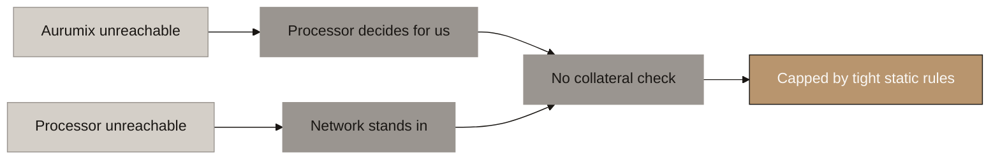

⚠ **Separately, the auth-to-settlement gap.** Settlement is typically T+1, so collateral could in principle move in between. **Recommendation: a 48-hour hold on redemption requests from accounts with an active card facility.** Gnosis Pay solves the same problem with a mandatory withdrawal delay module.

---

## 8. The Collateral Chain

<!-- SPEAKER NOTES:
"A lender will lend against gold only if they believe they can actually reach it. So here is the chain, and one link in it is unusually strong.

The customer owns a beneficial interest in gold whose legal title sits in the holding vehicle. They grant security over that interest. That security gets registered, which is what makes it good against a liquidator rather than merely good against the customer.

This is where the vehicle jurisdiction stops being an abstract question. DIFC passed a new Law of Security in 2024, modelled on the UN's framework. It has a security registry, it covers intangible interests generically, and it works no matter who the grantor is. ADGM does not have that. ADGM registers charges created by ADGM companies. Your grantor is a retail customer in Dubai or Kerala, so in ADGM there may be nothing to register at all.

We had that decision open on bankruptcy grounds alone. Taking security breaks the tie, and it breaks it toward DIFC.

Then the link that is genuinely strong. Pledged tokens cannot be transferred. Not "we promise not to", not "there is a clause": the permissioned token blocks it at the ledger, and the exit path already checks for an unreleased pledge before any redemption.

That is worth money in the negotiation. Most secured lenders in the world cannot stop their collateral walking out of the door. A car can be driven away, jewellery can be sold. You can tell a lender, truthfully, that the collateral is immobilised and cannot leave without their release. Ask them to price that.

And a happy accident worth mentioning if the sponsor is an Islamic bank: the AAOIFI gold standard treats exactly this arrangement, holding the ownership record so the owner cannot dispose without it, as constructive possession of the pledge. One mechanism, two entirely separate tests, both satisfied."
-->

```mermaid
%%{init: {'theme': 'base', 'themeVariables': {
    'primaryColor': '#B8956E',
    'primaryTextColor': '#1A1714',
    'primaryBorderColor': '#1A1714',
    'lineColor': '#1A1714',
    'secondaryColor': '#FAF8F5',
    'tertiaryColor': '#D4CFC8',
    'fontFamily': 'Libre Franklin, sans-serif',
    'edgeLabelBackground': '#D4CFC8',
    'clusterBkg': '#FAF8F5',
    'clusterBorder': '#B8956E'
}}}%%
graph LR
    A["Customer's beneficial interest"] --> B["Security registered in DIFC"]
    B --> C["Token transfer blocked"]
    C --> D["Exit check bars the sale"]
    D --> E["Collateral cannot walk"]

    style A fill:#D4CFC8,stroke:#9A9590,color:#1A1714
    style B fill:#D4CFC8,stroke:#9A9590,color:#1A1714
    style C fill:#D4CFC8,stroke:#9A9590,color:#1A1714
    style D fill:#D4CFC8,stroke:#9A9590,color:#1A1714
    style E fill:#B8956E,stroke:#1A1714,color:#FAF8F5
```

⚠ **Two questions for counsel, not for us.** Whether AURX qualifies as a Digital Asset under DIFC Law No. 2 of 2024 (s.8 requires existence *"independent of any legal system"*, and our token is nothing but a legal claim). And whether Article 88's requirement of grantor **and possessor** consent for repossession can be pre-wired into the custody documents, given the possessor is our own vehicle.

---

## 9. The Liquidation Ladder

<!-- SPEAKER NOTES:
"What happens when the gold price falls. This is the part of the product where a wrong answer breaks the central promise, so we have designed it properly rather than leaving it to the partner.

Three rungs, and they are absolute numbers, quotable, disclosed at the draw.

At eighty five percent, a notice. App and a push message. Nothing is required of them. It exists so the first time they ever hear about this is not a demand.

At eighty eight, a formal cure notice, and fourteen days. Three ways out and they can mix them: put in more gold, repay some of the loan, or add cash. Fourteen days is not a number we invented. It is what Manappuram gives, in a board approved policy written to satisfy the Reserve Bank of India, and if it is good enough for the regulator of the world's largest gold loan market it is good enough here.

At ninety two, we sell. Partially. Only enough to bring them back to eighty, and not one gram more. They keep the facility, they keep the card, they keep the rest of their gold.

Two design points worth pausing on.

We never fully liquidate. There is no rung on this ladder where somebody loses everything.

And the whole thing is graduated. Two warnings and a two week cure before anything is sold. Now, why does that matter beyond kindness? Because we looked at every legal dispute in this category, and not one of them was about whether the lender had the right to liquidate. Every single one was about notice and procedure. Nexo got sued for liquidating five million dollars of collateral after changing the rules without telling anybody. Celsius and Tether are arguing about whether the agreed procedure was followed.

Nobody in this industry publishes their cure period or their liquidation waterfall. Nobody. So the thing to be loudly explicit about is exactly the thing everyone else hides."
-->

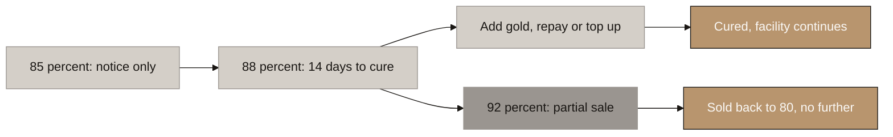

🔴 **THE RESTORE POINT IS NOT SETTLED — do not present this map until it is.** "Sell only enough to restore to 80%" understates what the arithmetic does, because a sale shrinks the loan **and** the collateral together. Worked on 100 g at ~USD 11,500 borrowed at 80%: a 13% gold fall triggers at 92% LTV, and restoring to **80% sells ~60% of their remaining gold in one event.** Restoring to **88%** sells ~33%; to **90%**, ~20%. **Recommendation: 88%** — one number, already on the ladder, and it returns the customer to the cure rung rather than to square one. Abdur's call.

⚠ **Who sells.** Recommended route is **Aurumix's own float** — fastest, best price, no dealer call on a bad day. This is the float's **fifth job**. But it makes Aurumix valuer, collateral agent and buyer at once, so the sale price must be **mandated at the LBMA fix with zero discretion**, disclosed at the draw and reported to the customer.

⚠ **Counsel question not previously raised:** is an enforcement sale a "redemption" under VARA III.E.4? If so, no fee may be charged and the recovery costs in stream 5 become unchargeable.

---

## 10. Who Is Actually Exposed

<!-- SPEAKER NOTES:
"Show this one immediately after the ladder, because the ladder on its own sounds alarming and this is the corrective.

Ask how far gold has to fall before anybody actually reaches the selling rung.

For a Gold tier customer borrowing at fifty percent, gold has to fall forty six percent. That is not a correction, that is a generational event, and it has happened roughly never over a period this short.

For Platinum at sixty five, twenty nine percent.

For Sovereign at eighty, thirteen percent. And I am not going to dress that one up. A thirteen percent fall in gold is an ordinary year. It is roughly a one standard deviation move. It will happen.

So the exposure in this product is real, and it is concentrated in exactly one population: people at the very top tier who have drawn their facility to the maximum. That is the smallest group in the book and, by construction, the most disciplined, because five years of unbroken saving is the only way to get there.

Two things follow.

For the customer: the promise has to carry its caveat every single time it is said. Your score can never cost you your gold. The market can, but only if you borrow against it, and only past thresholds we showed you on the day you borrowed. Say the second half every time you say the first, or your first liquidation becomes a mis-selling complaint.

For the lender, the argument runs the other way, and it is your strongest card. Nexo lends against tokenised gold at seventy percent. But gold's volatility is roughly a third of Bitcoin's, so eighty percent on gold is a materially safer book than fifty percent on crypto. And Emirates Money, a Central Bank licensed lender owned by Emirates NBD, already lends at eighty against physical gold in this market. You are not asking anybody to be brave."
-->

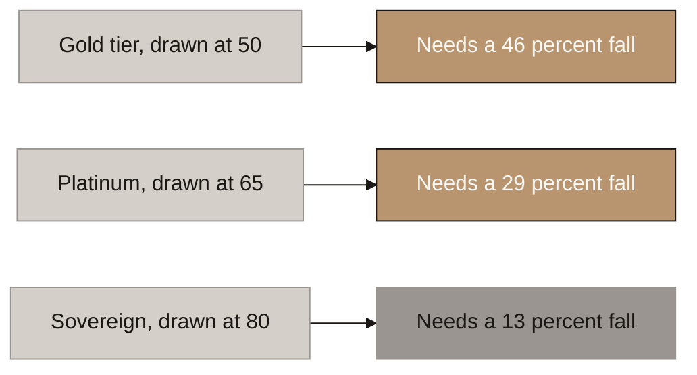

⚠ **Run the actual volatility numbers before this is presented.** The gold-versus-crypto volatility argument is the strongest card in the lender negotiation and it should be quantified, not asserted.

---

## 11. Where the Money Comes From

<!-- SPEAKER NOTES:
"Last one, and it is the one that decides whether the card is a cost centre or the best line in your model.

When your customer spends a hundred dirhams, the shop does not receive a hundred. The largest slice of the difference is interchange, and it goes to whoever issued the card.

Here is the single design choice that sets the ceiling on it, and we now have the real numbers from Visa's own published UAE schedule rather than industry commentary.

Since October 2024 the Central Bank caps interchange on debit and prepaid. Prepaid is one percent flat. I have to correct something we told you earlier: we said prepaid could reach nought point seven five. It cannot. One percent is the ceiling, everywhere, always.

Credit is not in that notice at all. Credit Platinum earns one point eight. Signature two point nought five. Infinite two point one. No caps.

So building this as prepaid would have cost you roughly half of the only externally funded revenue line in your entire business. Everything else, entry fees, custody, credit fees, is your own investors' money. Interchange is the merchant's. It is the money that lets Gold Rewards be a real reward rather than investors' fees recycled back to the top ten percent, which is what your original dividend was and why we replaced it.

And now something better than we expected. Those three credit rates map exactly onto your three card levels. Gold tier gets Platinum plastic at one point eight. Platinum tier gets Signature at two point nought five. Sovereign gets Infinite at two point one. Your loyalty ladder and your revenue ladder are the same ladder. Promoting a loyal saver literally increases what you earn from them.

One number to take into the negotiation. Gold Rewards pays nought point seven five percent at Sovereign, funded from interchange. So you need to keep at least thirty six percent of the interchange for the top rung to fund itself. Below thirty six percent, the top of your rewards ladder is subsidised.

Nobody publishes what programme managers keep. We looked hard and there is not a single UAE or regional figure in the public domain. So thirty six percent is your floor, and you should walk into NymCard already knowing it."
-->

```mermaid
%%{init: {'theme': 'base', 'themeVariables': {
    'primaryColor': '#B8956E',
    'primaryTextColor': '#1A1714',
    'primaryBorderColor': '#1A1714',
    'lineColor': '#1A1714',
    'secondaryColor': '#FAF8F5',
    'tertiaryColor': '#D4CFC8',
    'fontFamily': 'Libre Franklin, sans-serif',
    'edgeLabelBackground': '#D4CFC8',
    'clusterBkg': '#FAF8F5',
    'clusterBorder': '#B8956E'
}}}%%
graph LR
    A["Customer spends on credit"] --> B["Merchant pays 1.8 to 2.1 percent"]
    B --> C["Split with the card partner"]
    C --> D["Aurumix needs 36 percent"]
    D --> E["Gold Rewards funds itself"]

    style A fill:#D4CFC8,stroke:#9A9590,color:#1A1714
    style B fill:#D4CFC8,stroke:#9A9590,color:#1A1714
    style C fill:#D4CFC8,stroke:#9A9590,color:#1A1714
    style D fill:#B8956E,stroke:#1A1714,color:#FAF8F5
    style E fill:#B8956E,stroke:#1A1714,color:#FAF8F5
```

**The tier ladder and the revenue ladder are the same ladder:**

| Tier | Card level | Visa product | Interchange | Gold Rewards | PM share needed |
|---|---|---|---|---|---|
| Gold | L1 | Platinum | 1.80% | 0.15% | 8.3% |
| Platinum | L2 | Signature | 2.05% | 0.45% | 22.0% |
| **Sovereign** | L3 | Infinite | **2.10%** | **0.75%** | **35.7%** |

🔴 **No UAE or MENA programme-manager interchange split is published anywhere.** This single unknown sizes all of stream 2.

---

# What this set deliberately leaves out

| Not included | Why |
|---|---|
| Interest rates and loan pricing | The partner's, and Phase 4 |
| Card fee schedule: FX margin, ATM allowances, issuance waivers | Benefits map 3 covers the tier shape; the numbers are sponsor-gated |
| Collections and arrears beyond the liquidation ladder | Phase 4 |
| The Sharia structure in detail | `_draft_credit-and-card-infrastructure.md` §9. Becomes a call topic only if the client chooses an Islamic sponsor |
| Whether agents may originate loans | Unresolved between the referral draft and this one |

# Reconciliations this set forces

- [ ] 🔴 **`Aurumix_Process_Maps_Revenue_Streams.md:315` and its speaker notes** — the token-lending question is closed by VARA Schedule 1. Delete the "three hundred fold" passage and the instruction to raise it first with counsel. **Map 1 replaces it.**
- [ ] 🔴 **`Aurumix_Process_Maps_Revenue_Streams.md:197`** — prepaid is 1.00% flat, not 0.75%. Credit is 1.80–2.30% by level. **Map 11 carries the corrected table.**
- [ ] **`Aurumix_Process_Maps_Revenue_Streams.md:317`** — the "re-space to 90 to 95%" note is superseded by map 9.
- [ ] **`_draft_ics-benefits.md:158`** — the "no UAE lender publishes an LTV" finding is overturned by Emirates Money at 80%. **This strengthens the ladder and should be told to the client.**
- [ ] **`_draft_ics-benefits.md:197`** — the dirhams-or-tokens question is closed.
- [ ] **`Aurumix_Process_Maps_ICS_Benefits.md:228`** — "interchange caps at 1% forever" is right for prepaid; add the credit numbers.
- [ ] **`_draft_entities-licensing-and-payments.md:90-91`** — Restricted Licence fails on the AED 20,000 cap, not a lien exclusion; mark the BIN claim unverified; add the issuer processor as a fifth partner role.
- [ ] **Decision 25** — map 8 adds a security-law argument for DIFC over ADGM.
- [ ] **`handoff.md` §4** — the "thresholds must be re-spaced" note is discharged by map 9.
- [ ] 🆕 **`_draft_credit-and-card-infrastructure.md` §2** — currently lists the four roles flat. Restructure to the **spending chain / money chain** split from map 2; it is the framing that makes the arrangement legible. Also soften §3.1's "one institution is strongly preferred": because Aurumix owns the authorisation decision, the lender is never in the real-time path, so two counterparties cost contracts, not latency.
- [ ] 🆕 **Settlement funding is undesigned anywhere.** T+1 merchant settlement needs a funding source; neither the infrastructure draft nor the revenue streams map addresses it. Add to Phase 4 alongside the collection economics.

# Questions for the client

1. **Conventional or Islamic?** (maps 3 and 8) This decides the lender shortlist and whether a Sharia board sits on the critical path. A revolving gold-secured Islamic card would be first-of-kind anywhere.
2. **Do we test whether the sponsor bank is needed at all?** (map 3) NymCard is a Visa and Mastercard principal member. One call could delete a counterparty from the build.
3. **Who owns the authorisation engine in the September build?** (map 6) Three-second budget, live collateral valuation. It is not in any current build brief.
4. **Is the client comfortable disclosing the stand-in gap to the lender up front?** (map 7) Our strong recommendation is yes.
5. **Confirm the annual facility review** (map 4), without which the tier ladder stops binding on the largest benefit in the product.
6. 🆕 **Who funds settlement?** (map 3) Visa pays the merchant at T+1. If Aurumix prefunds and is reimbursed by the lender, that is working capital the client carries and it is in no model yet. **This is the question to open the lender meeting with**, ahead of whether one partner can cover both chains.
