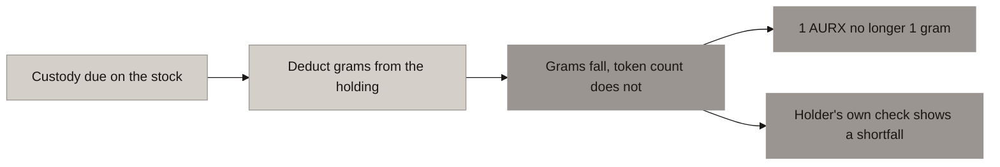
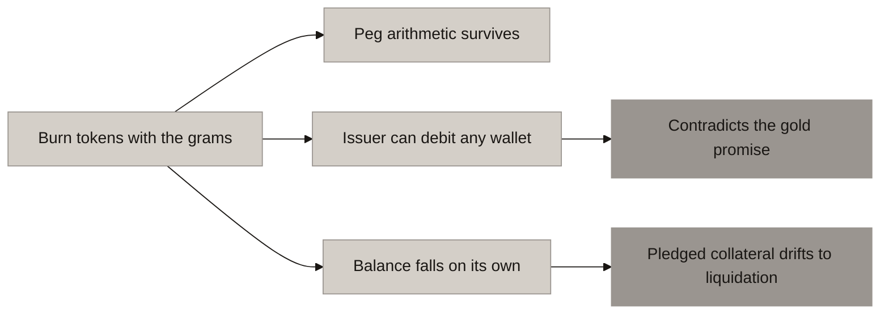
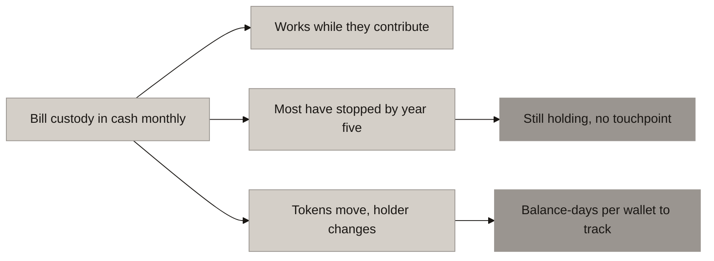
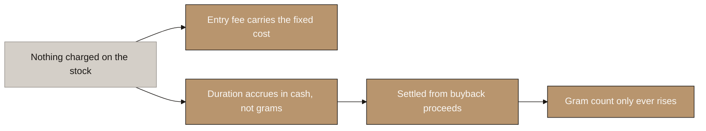

# Aurumix Process Maps: Recovering the Custody Fee

> Four diagrams for the client call. They are one argument in four steps, and they must run in order: three ways of charging custody that do not survive contact with this product, then the one that does. The reasoning is the deliverable here, not the conclusion, because the client has to be able to defend the answer to their own counsel.
>
> ⚠ **This supersedes a previously recorded decision.** `_draft_allocation-and-float.md` currently states that the custody fee must be **cash, skimmed from SIP inflow**, on the grounds that the SIP gives Aurumix a monthly cash touchpoint no other gold token has. That reasoning holds for the contributing investor and fails for the one who stops. Diagram 3 is the case against it. The draft and `handoff.md` §6 item 5 both need updating once this is agreed.

## The problem in one line

Custody is **0.8 to 1% a year, charged on stock**. Every other cost in this design is charged on flow. There is no moment in the current mechanism where a charge on stock can be collected.

## Diagram Plan

| # | Diagram Name | Type | Direction | Nodes | The one thing it says | Source |
|---|---|---|---|---|---|---|
| 1 | Charging in Grams Breaks the Peg | Flowchart | LR | 5 | Take metal without taking tokens and 1 AURX stops being 1 gram | Denomination |
| 2 | Why Not Take It From the Wallet | Flowchart | LR | 6 | The arithmetic survives, the promise and the credit book do not | Digix, ICS |
| 3 | Why a Monthly Cash Bill Fails | Flowchart | LR | 6 | The bill outlives the touchpoint, and tokens move | Persistency, CACHE Gold |
| 4 | Roll It Into the Door | Flowchart | LR | 5 | Charge nothing on the stock, settle in cash at the exit | Category practice |

## Consistency Convention

- **Flowchart direction:** LR throughout. Each is a consequence chain, not a comparison.
- **Gold node convention:** the recommended design and outcomes where the holder's gold is untouched.
- **Concrete node convention:** the failure at the end of each rejected route.
- **Stone node convention:** intermediate steps and facts that are neither a decision nor an outcome.
- **Open parameters:** the split between the entry leg and the exit leg, the accrual rate and the ICS discount on it are not set. No diagram shows a number that is still open.

---

## 1. Charging in Grams Breaks the Peg

<!-- SPEAKER NOTES:
"Start with the most natural answer, because it is the one everybody reaches for first. Custody is a cost denominated in gold, so charge it in gold. Take a small number of grams out of each holding every month and sell them to pay the vault.

Follow what that does to the accounting. The holder's gram count falls. Their token count does not, because nothing burned any tokens. So the vault now holds 99 grams against 100 tokens outstanding, and 1 AURX is no longer 1 gram. It is 0.99 grams this year and 0.98 next year.

That matters more here than it would in another design, for two reasons.

The first is that we made the ratio permanent on purpose. One of the three corrections we owe your document is deleting the words 'at launch' from the definition, precisely because a drifting ratio is the pool-share model from the old version and it is the thing we removed. A custody fee charged this way puts the drift straight back in, just slowly.

The second is the verification identity. We kept your formula, vault gold times the fix divided by tokens, as the thing a retail holder uses to check that supply still equals metal. Under a gram-denominated custody fee that formula returns a shortfall every month. And here is the problem: a holder who runs that check cannot tell the difference between a custody fee and missing gold. The one number in the product that is supposed to be independently verifiable stops being able to distinguish routine housekeeping from fraud. That is not a disclosure problem you can write your way out of.

So there are only two ways to charge in metal. Either the token count follows the grams down, which is diagram 2, or the peg breaks. There is no third option."
-->

---

## 2. Why Not Take It From the Wallet

<!-- SPEAKER NOTES:
"So burn the tokens alongside the grams. Take 1 gram, destroy 1 AURX, and the ratio holds exactly. This is worth taking seriously rather than dismissing, because it does work arithmetically and because somebody already built it.

Digix charged 0.60% a year demurrage on DGX, and the important detail is that it burned tokens rather than grams, so the gold per token was untouched throughout. Arithmetically it is peg-neutral. It would be peg-neutral here too. And Digix switched it off in 2019 and never turned it back on.

Three reasons not to repeat it, and they get worse in order.

First, the mechanism requires the issuer to be able to reduce any holder's balance without their consent. On a permissioned base like ERC-3643 that power exists, but it exists for a court order, a sanctions hit or a lost-key recovery. Using it for routine monthly revenue makes it an ordinary operating function. And it directly contradicts the one sentence we have committed to in exactly these words: you can lose your status, you can never lose your gold. Every other consequence in this design falls on tier, fee or credit ratio. This one falls on the gram count, which is the thing we said was untouchable.

Second, the balance visibly decrements every day, on its own, for a customer whose reference point is an insurance policy and a jeweller. Indian digital gold, the product this persona actually uses, displays grams to four decimals and that number only ever goes up. A savings balance that falls while you did nothing is not a fee to that customer, it is a loss, and every one of them arrives at support asking the same question.

Third, and this is the one nobody sees coming: it walks into the credit book. Pledged gold is collateral, and your loan-to-value sits at 90 to 95%, so there is almost no headroom by design. If the collateral shrinks every month on its own, the ratio climbs on its own, and a borrower who has done absolutely nothing drifts toward a margin warning and then a liquidation. The fee mechanism liquidates your best customers. Digix's other lesson points the same way: a non-standard token broke integrations, and its own auditors found bugs and a timing exploit in the fee logic itself.

The pattern across the whole landscape is worth stating plainly. Not one of nineteen protocols currently runs a working balance-decline or rebase mechanism. One tried it and turned it off."
-->

---

## 3. Why a Monthly Cash Bill Fails

<!-- SPEAKER NOTES:
"Third route, and this is the one we ourselves recommended three weeks ago, so I want to be straight that we are changing our own answer here. The argument was good: custody has to be cash because it cannot be metal, and Aurumix is the only gold token in the world with a monthly cash touchpoint, because a SIP investor sends money every month. PAXG and XAUT need dilution or velocity taxes precisely because their holders never send money again. Collect the custody fee alongside the contribution and it is nearly free to collect.

That holds perfectly for the contributing investor. It fails on two things.

The first is persistency, and it is the number that governs this whole design. Indian life insurance retains about 79% at month 13 and about 38% at month 61. So by year five, six holders in ten have stopped contributing. They have not left: they still hold their gold, it still sits in the vault, and it still costs money to store every day. The custody bill continues and the cash touchpoint is gone. The mechanism collects from everyone except the cohort it exists to bill.

There is a precedent for exactly this and it is fatal. CACHE Gold charged a 0.25% annual storage fee, and clause 6.2.1 collected it only when the holder initiated a transaction. So the buy-and-hold saver paid nothing while consuming vault cost daily. The landscape's verdict is the sentence I would use with counsel: it died charging a fee it had architected itself out of collecting. Your target customer is a buy-and-hold saver. That is not an edge case here, it is the base case.

The second thing is that tokens move. The moment AURX is transferable, the person on the register is not necessarily the person with a payment mandate. To bill a stock charge fairly you now need balance-days per wallet, transfers split pro rata between seller and buyer mid-period, and an answer for wallets with no payment method attached at all. Then for anyone who does not pay you have created a cash debt owed by a retail saver, secured by nothing, and you need dunning and write-off around it.

Size that debt before deciding it is worth chasing. After a full year of 75 dollar contributions the holding is about 855 dollars net of entry fee, so the monthly custody charge is roughly 64 cents. You cannot send a payment request for 64 cents. On most rails the collection costs more than the amount.

And note where the enforcement road ends. If a holder will not pay a cash custody bill, your only real remedy is to take it out of their gold, which is diagram 1 and diagram 2. The cash model's failure mode is the two routes we just ruled out.

Worth knowing that the category found the same wall and answered it badly. VNX charges 10 euros a month on dormant accounts until the balance reaches zero, and PAXG has a 2 dollar monthly inactivity fee. That is a cash custody charge aimed precisely at the disengaged holder, and it drains a small retail saver to nothing. For a product whose promise is that you never lose your gold, that door is closed to us."
-->

---

## 4. Roll It Into the Door

<!-- SPEAKER NOTES:
"So the answer. Charge nothing on the stock. Recover custody at the two moments cash is already moving through your hands, which are the entry fee and the buyback.

Three things make this the right answer rather than just the last one standing.

The metal is never touched. No grams leave a holding, no tokens are burned, no balance ever falls. The invariant holds exactly, the verification identity keeps returning the right answer, and the sentence stays literally true: the gram count only ever rises.

There is no collection mechanism to build, because both charges are netted out of a payment you are already processing. Nothing to invoice, nothing to chase, no receivable, no write-off, and no per-wallet accrual, because a charge taken at exit does not care who held it in between.

And it is what the category actually does. Sixteen of nineteen protocols charge holders no recurring storage fee at all and load everything at the door: XAUT at 0.25% in and 0.25% out, Aurus at 0.5% to mint and 1.5% to burn, Kinesis at 0.45%, Comtech at roughly 1% commission plus spread, WisdomTree's WTGOLD at 2% or more on redemption.

But I want to give you the honest version of that comparison, because it is the one point where we cannot simply copy them. Those protocols are not pricing custody into the door. They are absorbing it, and they can absorb it because a parent pays: Tether behind XAUT, Paxos's trust bank behind PAXG, Matrixport behind XAUm, WisdomTree behind WTGOLD, MKS PAMP behind DGLD. The landscape says it flatly about XAUT, that the arithmetic only works because of what is not in the fee table. Aurumix has no parent. So we have to actually price it, not absorb it.

Which brings us to the one hard constraint, and it decides how the design is built. Custody accrues with time, so the cost of a holder scales with roughly the square of how long they stay. On a 75 dollar monthly SIP at 0.9%, cumulative custody is about 0.45% of everything contributed per year held. That is 2.25% at five years, 4.5% at ten, 9% at twenty. Your entry fee at year one is 5% against a cost build-up of 4.15%, so there is under 1% of room in it. A one-time entry fee cannot carry a cost that grows like that. It is not a matter of setting it higher.

So the entry leg carries the fixed part, the per-account cost and the first period, and the duration part accrues quietly in cash against the account and settles out of the buyback proceeds when they exit. You control that moment completely, because there is no physical redemption and every exit is a cash buyback that runs through you. There is always a point at which you owe them money, and that is where the accrual clears. It also means a two-year holder and a twenty-year holder each pay for what they actually used, with no cross-subsidy in either direction.

Two things I am flagging rather than hiding. The exit charge now has two components pulling in opposite directions in time: the anti-flipping fee on spot grams that decays to zero over 6 to 12 months, and this custody accrual that grows. They can display as one number but they are not one fee and they have to be documented separately. And the accrual as designed charges your most loyal customer the most, which is backwards for a savings product, so the natural fix is to discount it by ICS tier. That is legitimate under the rule we already set, since price is one of the three levers the score is allowed to move."
-->

---

## The arithmetic behind diagram 4

Custody at 0.9% a year on a balance that grows linearly with contributions costs roughly **0.45% of cumulative contributions per year held**. On a 75 USD monthly SIP:

| Years held | Cumulative contributions | Cumulative custody | As % of contributions |
|---|---|---|---|
| 1 | 900 USD | ~4 USD | 0.45% |
| 5 | 4,500 USD | ~101 USD | 2.25% |
| 10 | 9,000 USD | ~405 USD | 4.50% |
| 20 | 18,000 USD | ~1,620 USD | 9.00% |
| 25 | 22,500 USD | ~2,531 USD | 11.25% |

Against entry-fee headroom of **under 1%** at Year 1 (5% fee less a 4.15% cost build-up), and under 1.3% at Year 10.

> 🔴 **The result that decides the design: the entry fee cannot carry custody.** At ten years the cost is 4.5% of everything the investor has contributed, which is larger than the entire entry fee before any other cost is paid. **The duration component has to sit on the exit leg**, where it scales with the holding period that generated it. "Roll it into entry and exit" is right, but the exit leg is doing most of the work and it cannot be a flat percentage.

## Why the exit leg is collectable here and nowhere else

- **No physical redemption.** Every exit is a cash buyback, and it runs through Aurumix. There is always a moment where Aurumix owes the holder money, and the accrual nets out of it.
- **A permissioned base (ERC-3643) makes every holder of record a billable account**, so the accrual follows the account rather than the token, and each permitted transfer is itself a settlement point.
- ⚠ **A wrapper breaks this.** Tokens in an unpermissioned wrapper have no billable holder of record. This is a further reason the rights delta must sit in the wrapper's own terms, and it needs the same treatment as the gold-title question already flagged there.

## Open items

- **[CLIENT]** The split between the entry leg and the exit leg. Related: the Google Drive access still owed, which holds the differential fee structure for spot versus SIP.
- **[OURS]** The accrual rate and whether it is discounted by ICS tier. Sits with the ICS formula (B4), not before it.
- **[OURS]** Whether the two exit components are displayed as one number or two. They must be documented as two.
- **[COUNSEL]** Whether an accrued custody liability settled from buyback proceeds is disclosable as a fee under the ARVA rulebook, or whether it constitutes a deduction from redemption proceeds requiring separate treatment.
- ⚠ **Inconsistency to resolve in our own artifacts.** `Aurumix_Protocol_Landscape.md` Finding 2 says PAXG-style dilution is "arithmetically peg-neutral for Aurumix". That was written against the superseded `grams ÷ tokens` pool-share reading of the peg. Under the later fixed-weight decision of 1 AURX = 1 gram, minting AURX to treasury without matching grams breaks the invariant directly. **The Phase 2 decision governs; the landscape line needs a correction note.**
