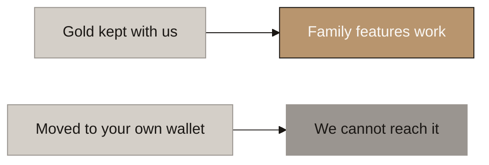
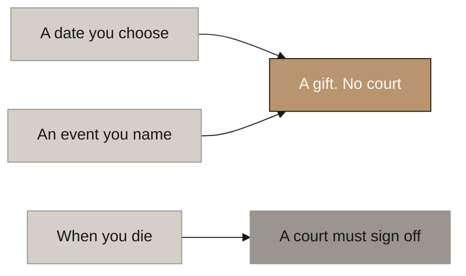
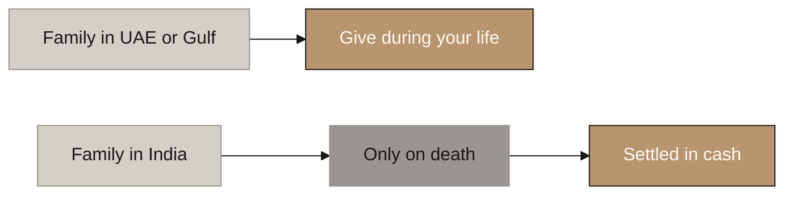
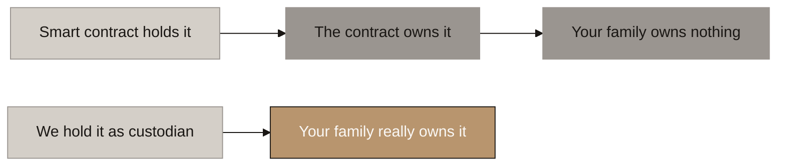

# Aurumix Process Maps: Family Portfolio and the Digital Will

> Companion to `_draft_family-and-succession.md` (B6, the family and succession layer). **Eight diagrams.**
>
> The single message: **you name your family, they watch their gold grow for years, and when the moment comes everything is already prepared, so the transfer takes days instead of a year of arguments.**
>
> ⚠ **One promise in their document has to be withdrawn on this call**, and map 5 is where it happens. Raise it deliberately rather than letting them discover it.
>
> Related decisions: 6, 20, 23, 25, 32, 42, 44, 46, 48. Written against the design as settled 2026-08-14, after the composability decision.

## Diagram Plan

| # | Diagram Name | Type | Direction | Nodes | Placement | What it answers |
|---|---|---|---|---|---|---|
| 0 | How It Works, End to End | Flowchart | LR | 5 | Inline | What actually happens, start to finish |
| 1 | Naming Is Not Giving | Flowchart | LR | 5 | Inline | What a sub-portfolio is during your life |
| 2 | It Works on the Gold You Keep With Us | Flowchart | LR | 4 | Inline | Why self-custody drops out of the product |
| 3 | Three Triggers, Three Different Events | Flowchart | LR | 5 | Inline | Why choosing when is a legal choice |
| 4 | Where Your Family Lives Changes the Answer | Flowchart | LR | 5 | Inline | The India inversion |
| 5 | What Happens When Someone Dies | Flowchart | LR | 5 | Inline | The court gate, and what we can honestly promise |
| 6 | If You Borrowed Against Your Gold | Flowchart | LR | 5 | Inline | Who gets paid first |
| 7 | Why This Is Not a Smart Contract | Flowchart | LR | 5 | Inline | The build decision, and the USD 75k it saves |

**Call set.** Ten minutes is **0, 4 and 5**. Thirty minutes adds **1, 2 and 3**. **Map 5 is the one that must not be cut**, because it is where a promise in their own document is withdrawn, and it is much better coming from us than from their counsel.

**Map 4 is the leave-behind.**

**Map 7 belongs in the September build conversation, not this one.** It is included here because it is the same mechanism seen from the engineering side, and because it releases a budget line.

## Consistency Convention

- **Flowchart direction:** LR throughout.
- **Gold node convention:** solutions, outcomes that hold, where the customer lands.
- **Concrete node convention:** problems, honest warnings, ruled-out routes.
- **Stone node convention:** starting points, mechanism steps, pending items.
- **Text style:** regular, no bold.

---

## 0. How It Works, End to End

<!-- SPEAKER NOTES:
"This is the whole product on one slide, and I want to start here because the rest of the session is detail hanging off these five boxes.

A customer names the people they want to look after. Wife forty percent, son thirty, daughter thirty, whatever suits them. Each of those people gets their own login and can see their share of the grams. Not a promise in a drawer somewhere, a live number that goes up every month when the contribution lands.

Then years pass, and that is the point. The daughter watches her share grow from the time she is sixteen. The family has already had the conversation about who gets what, because it is on a screen and nobody has to guess.

Then the moment comes. A birthday, a wedding, or the customer passes away. And because everyone was named years ago, verified years ago and screened ever since, there is nothing left to prepare. The transfer executes.

Here is the sentence I would use with an investor: gold has always been the family asset that causes the family argument. This is the version where the argument already happened, calmly, while everyone was alive.

One thing to flag now so it does not surprise anyone later. Where somebody has died, a court still has to sign off. We will come to exactly why on map 5. Everything else on this slide is true regardless."
-->

✅ **Nobody else in the category has any of this.** Nineteen protocols surveyed, zero with a family structure or a succession mechanism of any kind.

⚠ **The product is a paid annual plan, not a loyalty perk.** Roughly USD 29 to 36 a year including four names, and the tier makes it cheaper rather than unlocking it. **Their version needed the tier to get the thing that gave you the tier**, which is a loop nobody can enter.

---

## 1. Naming Is Not Giving

<!-- SPEAKER NOTES:
"This is the correction I would spend the most time on, because it is the one that protects the customer and it is the one their document currently gets wrong in three places.

When a customer names their wife for forty percent, nothing has moved. The gold is still entirely theirs. They can change it tomorrow, they can remove her, they can take the gold out altogether. What she has is a window into what he intends, which is genuinely valuable, but it is not ownership.

Their document says each sub-portfolio has its own credit facility, its own score and its own dividend entitlement, all while the primary is alive. None of the three can work.

The credit one is the clearest. You cannot lend somebody money against gold that is not theirs yet. If she borrows against her forty percent and he then changes his mind and re-allocates it, whose collateral was that? There is no good answer, which is how you know the feature should not exist.

The score is the same shape. Our score measures one person's saving behaviour over time. There is no coherent way to give somebody a score for being related to a saver, and if we did, the obvious move is to name six family members and harvest six scores.

And the dividend has a simpler problem. There is no dividend. It became Gold Rewards, which is a rebate capped at what that specific account itself generated through card spend and credit. A sub-portfolio that has never spent anything generates nothing, so the entitlement would be zero. We would be shipping an empty box with a label on it.

So the rule is one line: the family member's benefits begin at transfer, not at designation. Before that they get the view, which is the part that actually creates the emotional attachment anyway."
-->

⚠ **Their §5.2 gives each sub-portfolio its own credit facility and its own ICS sub-score during the primary's life.** Neither survives. **You cannot lend against gold somebody does not own yet, and a score is one number about one person.**

⚠ **Their §4.6 has the dividend accruing to beneficiaries before transfer.** There is no dividend to accrue. Gold Rewards is capped at what that account itself generated, and a sub-account with no spending generates zero.

✅ **The read-only view is the feature, and it is doing real work.** A child who watches gold accumulate in their name from sixteen is a customer at twenty-five. **No financial product for young people has managed to create that, and it costs us a dashboard.**

---

## 2. It Works on the Gold You Keep With Us

<!-- SPEAKER NOTES:
"This slide exists because of a decision taken last week on the token itself, and it is worth two minutes because it changes what we can promise.

We are recommending that AURX be a normal, freely transferable token. That is the right call for a lot of reasons and it makes the September build cheaper, not dearer. But it has one consequence here. A freely transferable token can be moved out. A customer can withdraw their AURX into their own wallet, on their phone, where they hold the keys.

The moment they do that, we cannot see it and we cannot move it. So the family features stop applying to those grams. Not because we withdrew them, but because there is nothing left for us to act on.

The comparison I would use is a safe deposit box versus gold under the mattress. We can arrange for the box to pass to your daughter, because we hold the box. We can do absolutely nothing about the mattress, and neither can anyone else.

That cuts both ways and we should say so. It is the honest reason to keep your balance with us, and it is not a lock-in. The customer keeps every gram either way. They just keep or lose the service around it.

There is a hard-edged version of this that families need to hear. If somebody self-custodies and then dies without passing on the keys, that gold is gone. Not delayed, gone. That is true of every self-custodied crypto asset in the world and we are not making it worse, but we are one of very few products where the alternative is genuinely handled.

Internally, the same rule settles a question we had open on the score. A withdrawal to self-custody counts as a sale for the retention part of the score, exactly as selling would. One rule, both problems closed, and the thirty percent annual allowance means a customer can move a meaningful slice out at no cost at all."
-->

✅ **The customer keeps the gold either way.** They keep or lose the service, never the metal. **The sentence to use: your gold is yours to take out whenever you want, and the family features work on the gold you keep with us.**

⚠ **Self-custodied gold that outlives its owner without the keys is simply lost.** True of every bearer crypto asset. **We are one of very few products where there is an alternative at all.**

⚠ **The same rule closes an open item on the score.** A withdrawal to self-custody counts as a disposal for the retention multiplier, so ICS and the family product read the same balance and no third rule is needed.

---

## 3. Three Triggers, Three Different Events

<!-- SPEAKER NOTES:
"Their document offers three trigger types and treats them as three flavours of the same feature. They are not. They are three different legal events, and the difference decides whether a court has to be involved.

If the transfer happens on a date the customer chose, or when a named event occurs, and they are alive when it fires, then in law that is a gift. A completed lifetime gift. No court, no delay, and it is protected against somebody turning up later claiming a fixed share of the estate, because the protections in the relevant law cover transfers made while you are living.

If it happens because they died, it is inheritance. That means a court, and it means it sits inside the estate where forced heirship rules can reach it.

So here is the recommendation, and it is a marketing recommendation as much as a legal one. Lead with the birthday and the wedding, not the funeral. Their own Scenario 2, the education fund transferring at eighteen and twenty-five, is the strongest version of this product and it is buried in the middle of a section about death.

That reframes the whole thing. It stops being a will, which is a sad product people postpone buying, and becomes a way of giving to your children on a schedule, which is a happy product people buy immediately. Same mechanism, and the happy one is also the one that works better in law.

One thing to close off. Their Scenario 3 has two business partners cross-designating gold, transferring if the other stops contributing. We are not supporting that, and I would rather explain why now than in a compliance review. It is a bet on somebody else's behaviour, not succession. And it collides badly with our own rules: if we ever have to block a customer's payments for a compliance reason, that block would trigger a transfer of their gold to somebody else. We would be the cause of the loss and the executor of it in the same movement."
-->

✅ **Lead with the lifetime trigger.** It completes cleanly, needs no court, and is shielded from forced-heirship claims. **Their own Scenario 2, the education fund at eighteen and twenty-five, is the best version of this product and it is buried inside a section about dying.**

⚠ **Conditions must be about the beneficiary's own life**, an age, a marriage, a graduation. **Not about another person's payment behaviour.** Their Scenario 3, where business partners transfer gold if the other stops contributing, is a wager rather than succession and it is not supported.

⚠ **Their Scenario 3 also collides with our own compliance rules.** If Aurumix ever blocks a customer's contributions for a regulatory reason, that block would itself fire the transfer. **We would be the cause and the executor of the customer's loss in one movement.**

---

## 4. Where Your Family Lives Changes the Answer

<!-- SPEAKER NOTES:
"This is the leave-behind slide and it is the sharpest single fact in the design, because the law points in opposite directions on the two sides of the same transaction.

On the UAE side, giving during your life is cleaner. No court, better protection.

On the India side it reverses completely, and it is worth understanding why because it is counter-intuitive.

Indian law is comparatively relaxed about inheritance. If an Indian resident inherits an asset from a relative who lived abroad, the exchange control rules permit them to hold it, and the wording is without any limit. No cap, no approval, no remittance involved, so the rules that block Indians from buying gold abroad simply do not reach it.

But a gift is treated completely differently. A gift from a person outside India is pushed out of the exchange control regime altogether and into the foreign contributions law, which is designed for something else entirely and is much stricter. And whether it bites turns on the donor's passport rather than where they live, which is a distinction far too fine to enforce inside an app.

So for a family member living in India, we block the lifetime route at launch and support the death route only.

And even then we settle in cash rather than tokens. The reason is honest and worth stating plainly: the inheritance permission lists three categories of asset, foreign currency, foreign securities and foreign property, and a gold token is arguably none of the three. That is a gap rather than a prohibition, but it is not a gap anyone should test using a grieving family's inheritance. If we send money to their bank account instead, the question never arises, because no Indian resident ever holds the token.

One commercial note for your finance director. That India leg is free. We are not allowed to charge for it, because converting to cash is a redemption and the rules forbid any fee on redemption. It is also the most operationally expensive path we run. Model it as a cost centre from day one."
-->

✅ **On death, Indian law is permissive and the wording is "without any limit".** No remittance occurs, so the rules that close India to residents buying gold abroad do not reach an inheritance at all.

⚠ **A lifetime gift is the opposite.** It leaves exchange control entirely and lands in the foreign contributions regime, and whether it bites turns on the donor's **passport rather than their residence**. Too fine a line to enforce in an app, so it is blocked at launch.

🔴 **Cash, not tokens, and the reason is a gap we refuse to test.** The inheritance permission covers foreign currency, foreign securities and foreign property. **A gold token is arguably none of the three.** Settling in cash means no Indian resident ever holds the token and the question never arises.

⚠ **The India leg is free and must be modelled as a cost centre.** Cash settlement is a redemption, and no fee may be charged on a redemption.

---

## 5. What Happens When Someone Dies

<!-- SPEAKER NOTES:
"This is the slide where we correct something in your document, and I want to do it directly because it is much better hearing it from us now than from your counsel during the licence application.

Section 5.4 says the Digital Will executes the financial transfer without requiring probate, family agreement, or legal proceedings. That sentence is not deliverable and it has to come out.

Here is why, and it is not a technical limitation, it is the direct consequence of the thing that makes your whole product work. Your customer genuinely owns their gold. That is the entire proposition, it is the Individual Gold Receipt, and it is what keeps you out of the regime that would lock up several million dollars of capital. But anything a person genuinely owns becomes part of their estate when they die, and estates go through a court. There is no way around that.

The only structure that truly avoids probate is one where the customer never owns the gold at all. It exists, it works, and it would destroy the product. So we keep ownership and we accept the court.

Now, the important half. Nobody else has solved this either. Coinbase, the largest regulated crypto custodian in the world, does not even let you name a beneficiary in advance, and it demands full court paperwork before it releases anything to a family. We checked their published policy directly.

So we are not withdrawing a feature that competitors deliver. Nobody delivers it. What we deliver is everything on either side of the court.

Walk the flow. Death is reported, we freeze the account immediately so nothing moves while things are uncertain. The family goes to court, which they were always going to have to do for the house and the bank accounts anyway. And while that runs, everything on our side is already finished: the beneficiaries were named years ago, their identity was verified years ago, they have been screened continuously ever since, and the split was decided by the customer while he was alive so there is nothing to argue about.

The paperwork arrives and the transfer happens in days.

The honest promise, and I would put this exact sentence in the marketing: when the court's paperwork arrives, everything else is already done.

Compare that to gold in a bank locker with no documentation, which is the actual alternative for this customer base. That takes a year and frequently splits families."
-->

```mermaid
%%{init: {'theme': 'base', 'themeVariables': {
    'primaryColor': '#B8956E',
    'primaryTextColor': '#1A1714',
    'primaryBorderColor': '#1A1714',
    'lineColor': '#1A1714',
    'secondaryColor': '#FAF8F5',
    'tertiaryColor': '#D4CFC8',
    'fontFamily': 'Libre Franklin, sans-serif',
    'edgeLabelBackground': '#D4CFC8',
    'clusterBkg': '#FAF8F5',
    'clusterBorder': '#B8956E'
}}}%%
graph LR
    A["Death is reported"] --> B["Account frozen"]
    B --> C["Court paperwork"]
    C --> D["Everything already prepared"]
    D --> E["Transferred in days"]

    style A fill:#D4CFC8,stroke:#9A9590,color:#1A1714
    style B fill:#D4CFC8,stroke:#9A9590,color:#1A1714
    style C fill:#9A9590,stroke:#9A9590,color:#1A1714
    style D fill:#D4CFC8,stroke:#9A9590,color:#1A1714
    style E fill:#B8956E,stroke:#1A1714,color:#FAF8F5
```

🔴 **Their §5.4 promise, "without requiring probate, family agreement, or legal proceedings", must be corrected before it reaches an investor.** It is also the sentence most likely to attract a regulator, because it is the sentence that makes this sound like a will.

✅ **The market has not solved this either, and that is the argument.** **Coinbase does not offer beneficiary designation at all** and requires probate documents, letters testamentary or letters of administration before releasing anything. **We are not conceding a feature competitors have. Nobody has it. We are the only one doing the work in advance.**

✅ **The promise that replaces it:** *when the court's paperwork arrives, everything else is already done.* Pre-named, pre-verified, pre-screened, pre-split. **Days instead of a year.**

⚠ **We never decide who inherits.** We hold, we freeze, we wait for the court, we execute. **No VARA licence covers estate administration**, and stepping into that role is a licensing problem we would create for ourselves.

---

## 6. If You Borrowed Against Your Gold

<!-- SPEAKER NOTES:
"Short slide, and it closes a hole their document does not address at all.

A customer can borrow against their gold. So what happens if they die owing money, and the same gold is promised to their daughter?

The lender is paid first. That is not our policy choice, it is how secured lending works everywhere, and the security survives the borrower's death. The daughter inherits what is left after the debt.

But she gets a right that matters, and it needs to be written into the contract explicitly because it will not be there by default. She can pay off the loan herself and take the gold whole. If her father borrowed twenty thousand against a hundred thousand of gold, she is not forced to accept eighty. She can settle the twenty and keep all of it.

And the piece I would push hardest on with the lending partner: death is not an event of default. Some partners will want it to be, because it is simpler for them. We should not accept that. Standard practice in consumer secured lending, including Indian gold loans which is the closest comparison, is procedural: notify, identify the successors, preserve the collateral, allow them time to settle. Nobody liquidates a dead man's collateral on day one.

That closes a scenario we flagged earlier in the design, where a family could watch an inheritance disappear in a margin call during the weeks it takes to get a court order. The answer is that they cannot lose more than the debt, and they always have the right to pay it."
-->

⚠ **Their document does not address this anywhere**, and it is the scenario most likely to produce a complaint: an inheritance liquidated by a margin call while the family waits for a court.

✅ **Death must not be an event of default**, and the lending partner will want it to be because it is simpler. **Market practice, including Indian gold-loan practice, is procedural: notify, identify successors, preserve the collateral, allow settlement.**

✅ **The right to redeem is the clause that makes it fair.** A family owing USD 20,000 against USD 100,000 of gold is **not forced to accept USD 80,000**. They settle the debt and keep all of it. **Five clauses are owed to the credit contract and none of them exist today.**

---

## 7. Why This Is Not a Smart Contract

<!-- SPEAKER NOTES:
"This one is for your build team rather than your investors, but it saves money and it protects the product, so it is worth five minutes.

Your section 13 puts two smart contracts on the blockchain. A Family Portfolio Contract that holds and manages the sub-portfolio allocations, and a Digital Will Contract that stores the instructions and fires the transfers. There is a seventy-five thousand dollar line in your budget to audit them.

Do not build either one.

Here is the problem, and it is not a preference, it is a legal consequence of the ownership structure we have chosen. Under our design, whoever holds the token is the person who owns the gold. That is what makes the ownership claim work, it is what keeps you out of the reserve asset regime, and it is elegant precisely because it needs no paperwork.

Now put a smart contract in the middle. The contract holds the tokens. So the contract is the holder. So the contract owns the gold. And the family member named inside it owns nothing at all, they have a claim against a piece of software.

That is not a hypothetical. It is exactly what happened to Kinesis. On their own chain you own the gold. On their Ethereum wrapper, a separate company's terms say holders have no legal, equitable or beneficial right to the reserves. Same brand, same ticker, two completely different legal positions, and you cannot tell unless you read both documents.

So the design would break Option A for precisely the customers who paid for the family product. The people who cared most about their family owning the gold would be the only ones who did not.

The alternative is much simpler and it is what a custodian does every day. The allocations live in our platform database. The instructions live in the client agreement. And when the trigger fires and the authority is proven, we move the tokens from one verified account to another. One on-chain action, at the end, done by the licensed custodian.

The commercial summary is unusual and worth saying out loud: this is cheaper and safer at the same time. You remove an audit line, two failure modes, an upgrade problem on an instruction that has to survive forty years, and you protect the ownership claim. That combination almost never comes together."
-->

🔴 **Whoever holds the token owns the gold. Put a contract in the middle and the contract is the owner.** The family member named inside it holds a claim against software, not metal. **This would break the ownership claim for exactly the customers who paid for the family product.**

⚠ **This is the Kinesis case, not a hypothesis.** On its own chain, bailment and you own the gold. On its Ethereum wrapper, a separate company's terms strip all right, title and interest in the reserves. **Same brand, same ticker, and the difference is invisible unless you read both documents.**

✅ **What we build instead:** allocations in the platform ledger, instructions in the Client Agreement, and **one token movement at the end** between two verified accounts, made by the licensed custodian after the authority gate.

✅ **Cheaper and safer together, which is rare.** It removes the **USD 75,000** audit line, two failure modes, and an upgrade problem on an instruction that must survive forty years.

---

## Departures from the client's document

Recorded here rather than as further diagrams, because they are conversation points and not mechanism.

| # | Their document | This design |
|---|---|---|
| 1 | §5.4 transfers *"without requiring probate, family agreement, or legal proceedings"* | **A probate accelerator, not a substitute.** Genuine ownership means the asset enters the estate. The only probate-free structure is one where the customer owns nothing |
| 2 | §5.2 each sub-portfolio has **its own credit facility limit** | **No facility until transfer completes.** You cannot lend against gold somebody does not own yet |
| 3 | §5.2 each sub-portfolio has **its own ICS sub-score** | **Family scores nothing, for anyone.** A score is one number about one person's saving |
| 4 | §5.2 and §4.6 each sub-portfolio has **its own dividend entitlement**, accruing before transfer | **There is no dividend.** Gold Rewards is capped at what that account itself generated, so a sub-account with no spending generates zero |
| 5 | §5.4(3)(c) **income-only transfer** | **Deleted.** It would transfer zero. Selling an empty box |
| 6 | §5.6 death confirmed by **nominated executor plus Aurumix compliance, 48 to 72 hours** | **Grant of probate, and we do not adjudicate.** No VARA licence covers estate administration |
| 7 | §5.6 beneficiary gets a **30-day KYC window** after the trigger | **Verified at registration, years earlier.** This is the actual product |
| 8 | §5.5 Will Lock-In makes terms **irrevocable** | **Retained, re-scoped to the percentages.** It cannot bind against a grant of probate or a heirship claim |
| 9 | §5.7 Scenario 3, **business partners cross-designating** on a stopped SIP | **Not supported.** A wager on behaviour, and a compliance block by us would fire it |
| 10 | §13 **two on-chain contracts**, USD 75,000 audit budget | **Do not build either.** The contract would own the gold. See map 7 |
| 11 | Free perk **unlocked by ICS tier** | **Paid annual plan, open to all, tier discounts the price.** Their version needed the tier to get the thing that gave you the tier |
| 12 | *"Digital Will"* as the product name | **Contractual term is Beneficiary Transfer Instruction.** Plan on "Digital Will" not surviving counsel as anything but a marketing name |

> 🔴 **One item that is not in their document at all and needs a decision.** The DIFC Wills Service, our nearest comparable and a possible partner, is **open to non-Muslims only**, and a Muslim customer cannot use a DIFC or ADGM will to depart from fixed Sharia shares. **Our persona is both populations.** The design answer is cheap: ask at onboarding, lead Muslim customers to the lifetime trigger which is the recognised route, and **never market this as overriding Sharia shares anywhere, to anyone.**

> ⚠ **And one comparable worth knowing before the client hears it elsewhere.** The **DIFC Courts already sell a Digital Assets Will at AED 5,000**, running a non-custodial wallet on Hedera. It supports Bitcoin, Ethereum, USDC, USDT and a few others, **but not arbitrary ERC-20 tokens, so AURX is not on it today.** It is simultaneously our pricing anchor, a possible referral partner for the customer's underlying legal will, and a court-operated competitor. **This space is not empty and we should not tell them it is.**
