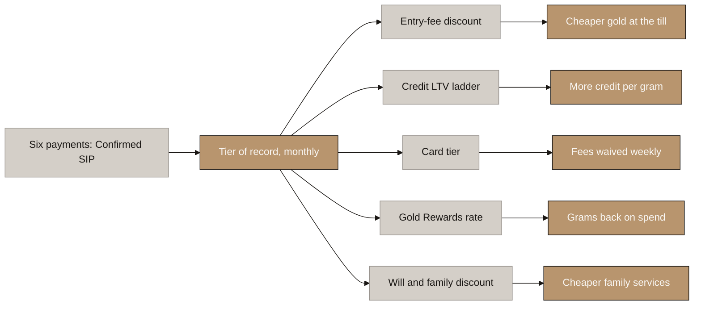
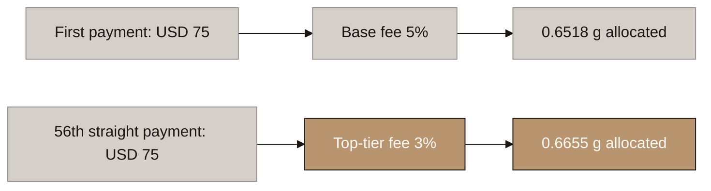
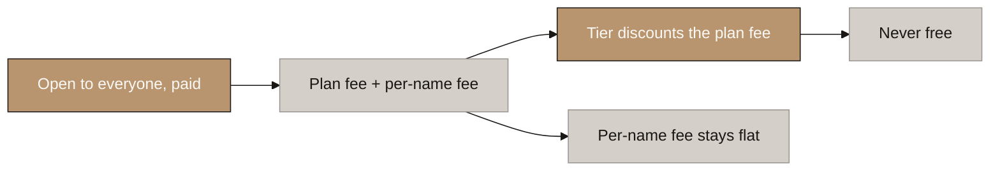

# Aurumix Process Maps: The Five ICS Benefits

> Companion to `_draft_ics-benefits.md` (the definition layer). One map per benefit plus the engine they share. The single message: **capital buys grams, behaviour buys the rate.**
>
> Related decisions: 6, 20, 21, 32, 41, 42, 44, 45. Tier count and thresholds are deliberately absent: B4's output.

## Diagram Plan

| # | Diagram Name | Type | Direction | Nodes | Placement | Lever family |
|---|---|---|---|---|---|---|
| 0 | The Common Engine | Flowchart | LR | 12 | Inline | All five. ⚠ Deliberate exception to the 4-to-6 rule: the hub map names all five benefits with their outcomes |
| 1 | The Entry-Fee Discount | Flowchart | LR | 5 | Inline | Price |
| 1b | The Discount, Worked | Flowchart | LR | 6 | Inline | Price, example numbers |
| 2 | The Credit LTV Ladder | Flowchart | LR | 6 | Inline | Leverage |
| 3 | The Card Tier | Flowchart | LR | 5 | Inline | Service and waiver |
| 4 | Gold Rewards | Flowchart | LR | 6 | Inline | Payout |
| 5 | The Digital Will and Family Discount | Flowchart | LR | 5 | Inline | Price |

## Consistency Convention

- **Flowchart direction:** LR throughout.
- **Gold node convention:** solutions, outcomes that hold, where the benefit lands.
- **Concrete node convention:** problems, honest warnings, ruled-out routes.
- **Stone node convention:** starting points, mechanism steps, pending items.
- **Text style:** regular, no bold.

---

## 0. The Common Engine

<!-- SPEAKER NOTES:
"Six consecutive payments earn Confirmed SIP, and it is permanent: a historical fact, and facts do not expire. From then on one number, recalculated monthly, prices everything. A tier fall only changes the future: nothing repriced, nothing clawed back, never a margin call. You can lose your status, you can never lose your gold."
-->

⚠ **The binding test:** a USD 20 saver who never misses reaches every ceiling.

---

## 1. The Entry-Fee Discount

<!-- SPEAKER NOTES:
"The fee at the door shrinks as the tier climbs, on every purchase including lump sums. A lump sum cannot earn the tier; it earns zero counted periods. Funded by setting the base rate above the top-tier price, never out of margin. It cannot leak: the most anyone extracts from a discount is the discount, and the only way is to buy gold. The app shows the running total in grams, so the invisible benefit becomes visible."
-->

```mermaid
%%{init: {'theme': 'base', 'themeVariables': {
    'primaryColor': '#B8956E',
    'primaryTextColor': '#1A1714',
    'primaryBorderColor': '#1A1714',
    'lineColor': '#1A1714',
    'secondaryColor': '#FAF8F5',
    'tertiaryColor': '#D4CFC8',
    'fontFamily': 'Libre Franklin, sans-serif',
    'edgeLabelBackground': '#D4CFC8',
    'clusterBkg': '#FAF8F5',
    'clusterBorder': '#B8956E'
}}}%%
graph LR
    A["Customer buys gold"] --> B["Base fee, uplifted"]
    B --> C["Tier discounts it"]
    C --> D["Struck at the fix"]
    D --> E["Savings shown in grams"]

    style A fill:#D4CFC8,stroke:#9A9590,color:#1A1714
    style B fill:#D4CFC8,stroke:#9A9590,color:#1A1714
    style C fill:#B8956E,stroke:#1A1714,color:#FAF8F5
    style D fill:#D4CFC8,stroke:#9A9590,color:#1A1714
    style E fill:#B8956E,stroke:#1A1714,color:#FAF8F5
```

⚠ **Open, client's call: the size of the base-rate uplift.** Ceiling placeholder 1.5 to 2.0pp; margin alone funds only ~0.12pp per tier.

---

## 1b. The Discount, Worked

<!-- SPEAKER NOTES:
"Two savers, the identical seventy-five dollars. One is on their first payment and pays the base fee. The other has made fifty-six straight payments and pays two points less: an extra 0.0137 grams that month, a sixth of a gram a year. The money is the same. The record is the only difference, and money cannot buy the record."
-->

⚠ **The only difference between the lanes is the record: 56 straight payments** (the month the USD 20 saver reaches the top tier, rulebook §11.1). Same money, +0.0137 g that month, ~0.16 g a year in the app counter.

⚠ **Example numbers, not decisions:** base 5% (decision 9, Year 1 top of range), top-tier discount 2pp (the placeholder ceiling), same fix as the minting worked example (USD 75 → 0.6518 AURX). The 0.6655 g figure is decision 41's own arithmetic. B4 sets the real ladder.

---

## 2. The Credit LTV Ladder

<!-- SPEAKER NOTES:
"Walk it start to finish. The saver asks to borrow. Every gram held ninety days qualifies, spot grams included: grams are the base, tier is the rate. Whatever their tier is that month sets the ratio, and it locks for the life of the loan. The gold is flagged as pledged, never leaves the vault, and keeps earning score. A licensed lender advances the cash. And to term: a tier fall never touches the loan; only a market fall can, on thresholds shown at the draw."
-->

```mermaid
%%{init: {'theme': 'base', 'themeVariables': {
    'primaryColor': '#B8956E',
    'primaryTextColor': '#1A1714',
    'primaryBorderColor': '#1A1714',
    'lineColor': '#1A1714',
    'secondaryColor': '#FAF8F5',
    'tertiaryColor': '#D4CFC8',
    'fontFamily': 'Libre Franklin, sans-serif',
    'edgeLabelBackground': '#D4CFC8',
    'clusterBkg': '#FAF8F5',
    'clusterBorder': '#B8956E'
}}}%%
graph LR
    A["Saver requests a draw"] --> B["Grams held 90 days qualify"]
    B --> C["Tier sets the LTV, locked now"]
    C --> D["Pledged: stays in vault, still earns"]
    D --> E["Partner advances the cash"]
    E --> F["To term: tier fall never margin-calls"]

    style A fill:#D4CFC8,stroke:#9A9590,color:#1A1714
    style B fill:#D4CFC8,stroke:#9A9590,color:#1A1714
    style C fill:#B8956E,stroke:#1A1714,color:#FAF8F5
    style D fill:#B8956E,stroke:#1A1714,color:#FAF8F5
    style E fill:#D4CFC8,stroke:#9A9590,color:#1A1714
    style F fill:#B8956E,stroke:#1A1714,color:#FAF8F5
```

⚠ **The one thing the score cannot protect against: the market.** A gold price fall can trigger the partner's warning and liquidation thresholds, disclosed at the draw. A tier fall never can.

⚠ **Ceiling = min(partner max, 90 to 95%), and the partner will bind:** every observed comp sits at 50 to 85% (RBI tiers 85/80/75 from April 2026; no UAE lender publishes one). Structure ours, pricing theirs.

---

## 3. The Card Tier

<!-- SPEAKER NOTES:
"The discount pays when you buy, credit pays if you borrow; the card pays every week. Two layers: the plastic is a network product that upgrades on sustained tier and never downgrades, the parameters inside it move monthly. Every perk is a fee waived, funded by the interchange the same spending generates. Higher plastic also earns higher interchange, so an upgrade grows the pool that funds Gold Rewards."
-->

⚠ **Sponsor bank owns the frame:** level count (3 to 4), FX floor, allowances. **Credit, not prepaid**, or interchange caps at 1% forever. No annual or monthly fee at any level.

---

## 4. Gold Rewards

<!-- SPEAKER NOTES:
"Follow the money start to finish. The saver spends on the card. The shop, not the saver, pays about two and a half percent of the sale, and the largest slice of that is interchange. Aurumix's contracted share of it is the pot. At month end the tier sets the rebate rate on that month's spend, capped at what this customer's own activity put in the pot, minus their storage. What clears the cap converts to grams at the next fix and lands in their holding, forever. The merchant funds the reward. No saver's fee ever funds another saver's payout, which is the whole difference from the dividend we deleted."
-->

```mermaid
%%{init: {'theme': 'base', 'themeVariables': {
    'primaryColor': '#B8956E',
    'primaryTextColor': '#1A1714',
    'primaryBorderColor': '#1A1714',
    'lineColor': '#1A1714',
    'secondaryColor': '#FAF8F5',
    'tertiaryColor': '#D4CFC8',
    'fontFamily': 'Libre Franklin, sans-serif',
    'edgeLabelBackground': '#D4CFC8',
    'clusterBkg': '#FAF8F5',
    'clusterBorder': '#B8956E'
}}}%%
graph LR
    A["Saver spends on the card"] --> B["Shop pays ~2.5%: interchange"]
    B --> C["Aurumix takes its share"]
    C --> D["Tier sets the rebate rate"]
    D --> E["Capped at what you generated"]
    E --> F["Grams at the next fix, forever"]

    style A fill:#D4CFC8,stroke:#9A9590,color:#1A1714
    style B fill:#D4CFC8,stroke:#9A9590,color:#1A1714
    style C fill:#D4CFC8,stroke:#9A9590,color:#1A1714
    style D fill:#B8956E,stroke:#1A1714,color:#FAF8F5
    style E fill:#B8956E,stroke:#1A1714,color:#FAF8F5
    style F fill:#B8956E,stroke:#1A1714,color:#FAF8F5
```

⚠ **The cap runs net of that customer's storage cost** (decision 42) and includes their credit revenue share alongside interchange. Reward grams cannot inflate the score and earn no periods.

⚠ **Ships with the card; the contracted interchange share is the hard ceiling on the rate table.**

⚠ **Rejected, stays rejected: a pooled rebate from entry fees.** A pool recycles investor fees, the dividend problem reborn; a passive holder's cap is zero. Their benefit is the discount, made visible in map 1.

---

## 5. The Digital Will and Family Discount

<!-- SPEAKER NOTES:
"The feature is open to everyone: payment is the gate, never tier, because tier-gating built the old deadlock. The tier discounts the annual plan fee, up to roughly half. The per-name fee stays near flat because ten names is ten times the work. And the ceiling never reaches free: the discounted price always covers the cost, or the old gate rebuilds in mirror image."
-->

⚠ **The cost floor:** the ceiling discount must keep the per-name fee at or above the will partner's per-name cost. Base prices: client, Phase 4, priced on cost.

---

# What this set deliberately leaves out

| Not included | Why |
|---|---|
| Tier count, thresholds, value tables | B4's output. The maps hold whatever the numbers become |
| The tenure rebate | Retired, decision 44: Retention rewards holding structurally |
| The pooled entry-fee rebate | Rejected, decision 45; recorded under map 4 |
| Interest rate by tier, FX spread discount, priority service, streak shield, transfer-fee waiver | The five rejections of decision 44 |
| Score mechanics (Retention, streaks, misses) | Mapped in the SIP sets; this set starts where the score ends |

# Reconciliations this set forces

- [ ] `Aurumix_Process_Maps_SIP_Spot_ICS.md`: the old three-lever ICS diagrams are superseded; the owed revision pass (rulebook §12) should point here.
- [ ] The client call: map 2's warning is the new material. Reposition 90 to 95% as a partner outcome before it is printed anywhere customer-facing.

# Questions for the client

1. **The base-rate uplift** (map 1): how far above the top-tier price does the base fee sit? A revenue decision, and the ladder cannot be sized without it.
2. **The plastic ladder** (map 3): distinct network products by tier, or one product with parameter tiers? The first is stronger marketing and higher interchange; it needs the sponsor to agree.
3. **Family pricing** (map 5): confirm the two-price structure so the discount has a base to work on.
