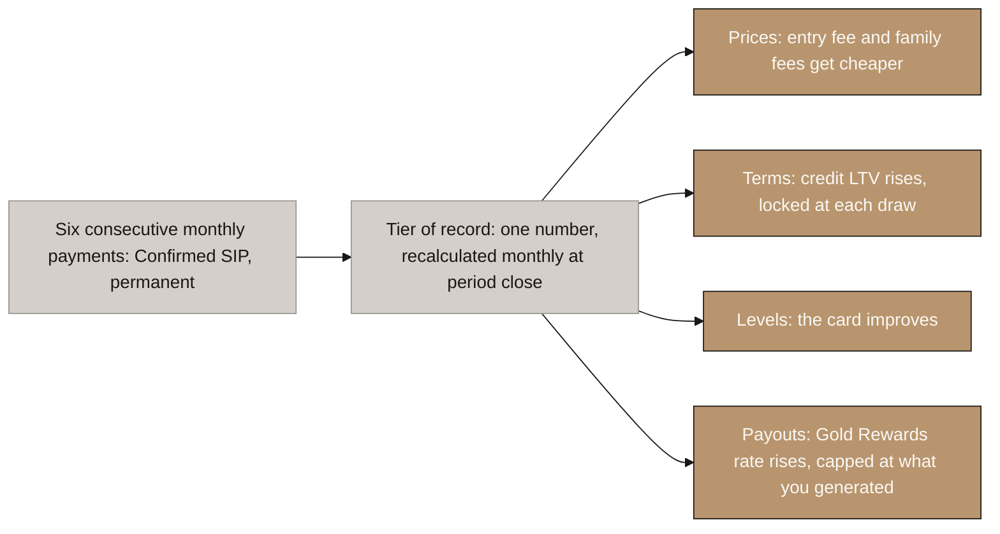
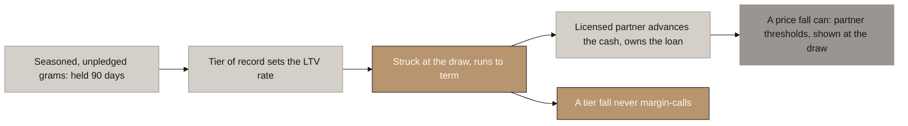
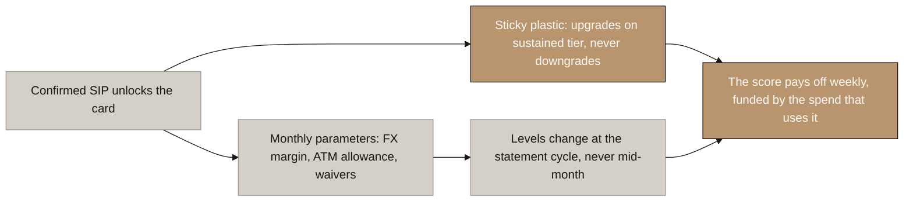
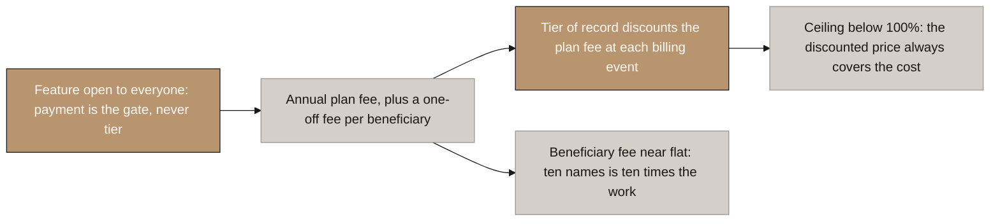

# Aurumix Process Maps: The Five ICS Benefits

> Companion to `_draft_ics-benefits.md` (the definition layer) and `_draft_sip-rulebook.md` (how the score is earned). One map per benefit plus one for the engine they all share. Answers the question a client or regulator asks first: **what exactly does the score buy, and why can none of it be bought with money?**
>
> Related decisions: 6 (Gold Rewards replaces the dividend), 20 (behaviour, never amount), 21 (climbing ladder, no margin call), 32 (no fee on redemption), 41 (grams fungible; discount over rebate), 42 (custody netting), 44 (the set closed at five), 45 (the definition layer).
>
> **The single message: capital buys grams, behaviour buys the rate. Every benefit reads one monthly number, and the only way to move that number is to save every month and keep what you bought.**
>
> Scope note: tier count and threshold values are deliberately absent; they are B4's output. Every number shown is a placeholder marked in the definition layer.

## Diagram Plan

| # | Diagram Name | Type | Direction | Nodes | Placement | Lever family |
|---|---|---|---|---|---|---|
| 0 | The Common Engine | Flowchart | LR | 6 | Inline | All five |
| 1 | The Entry-Fee Discount | Flowchart | LR | 5 | Inline | Price |
| 2 | The Credit LTV Ladder | Flowchart | LR | 6 | Inline | Leverage |
| 3 | The Card Tier | Flowchart | LR | 5 | Inline | Service and waiver |
| 4 | Gold Rewards | Flowchart | LR | 5 | Inline | Payout |
| 5 | The Digital Will and Family Discount | Flowchart | LR | 5 | Inline | Price |

## Consistency Convention

- **Flowchart direction:** LR throughout.
- **Gold node convention:** solutions, outcomes that hold, and where the benefit lands.
- **Concrete node convention:** the problem, honest warnings, and routes that are ruled out.
- **Stone node convention:** starting points, mechanism steps, and anything pending confirmation.
- **Text style:** regular, no bold.

---

## 0. The Common Engine

<!-- SPEAKER NOTES:
"Before the five benefits, the machine they all share, because it is the answer to the question a regulator will ask and the question your best customer will ask, and it is the same answer.

Everything starts with six consecutive monthly payments. That earns a status called Confirmed SIP, and it is permanent: it is a historical fact about the account, and facts do not expire. That status is the switch. Nothing is granted before it, and nothing that follows ever needs it to be re-earned.

From then on the account has one number that matters: the tier of record. It is recalculated once a month, when the period settles, and between recalculations it cannot move, whatever happens day to day. Every benefit reads that number and nothing else. No benefit reads the live score, because benefits that flicker are unusable.

The tier then pays out through four different shapes, and the shape decides the protection. Prices: the entry fee and the family fees get cheaper. Terms: the credit ratio gets more generous, locked in on the day you draw. Levels: the card gets better. Payouts: Gold Rewards pays a higher rate, and because it is the one shape that hands over value, it is the one with a hard cap: never more than the revenue you personally generated.

And one rule runs through all of it. A tier fall only ever changes the future. Your next purchase, your next draw, your next statement. Nothing you already hold is repriced, nothing credited is clawed back, and a missed payment can never force a liquidation. You can lose your status. You can never lose your gold."
-->

⚠ **The binding test sits behind this map and should be said on the call:** a USD 20 per month saver who never misses reaches the ceiling of all four shapes. If any benefit table ever fails that test, the programme has become a preference class for the wealthy and the classification defence fails with it.

---

## 1. The Entry-Fee Discount

<!-- SPEAKER NOTES:
"The first benefit is the one every saver meets: the fee at the door gets smaller as the tier climbs.

Three things to notice. First, the discount applies to everything the account buys, lump sums included. You cannot earn the tier with a big cheque, because a big cheque earns zero counted periods. But once the tier is earned by saving, it prices every purchase. We tried the other rule, where spot pays full price, and it fails: your SIP amount is variable with no maximum, so a sophisticated customer just relabels the lump sum as this month's contribution. A rule only the unsophisticated pay is a tax on them, not a control.

Second, the funding. The ladder is paid for by setting the base rate above the top-tier price, so the discount gives away uplift, never margin. At Year 1 the margin under a five percent fee is less than one point; a ladder carved from that would be invisible. This is a decision we need from you: how far above the top-tier price the base rate sits.

Third, it cannot leak. Run the worst case: buy at a discounted fee, exit the same week at the buyback, which by law carries no fee. The customer is down the fee they paid. The most anyone extracts from a discount is the discount, and the only way to get it is to buy gold and keep it.

And because a smaller fee is invisible in the moment, the app keeps a running total: your tier has earned you 1.4 grams since 2026. Same money, now visible, and the number only ever goes up."
-->

```mermaid
%%{init: {'theme': 'base', 'themeVariables': {
    'primaryColor': '#B8956E',
    'primaryTextColor': '#1A1714',
    'primaryBorderColor': '#1A1714',
    'lineColor': '#1A1714',
    'secondaryColor': '#FAF8F5',
    'tertiaryColor': '#D4CFC8',
    'fontFamily': 'Libre Franklin, sans-serif',
    'edgeLabelBackground': '#D4CFC8',
    'clusterBkg': '#FAF8F5',
    'clusterBorder': '#B8956E'
}}}%%
graph LR
    A["Any purchase: SIP contribution or spot lump sum"] --> B["Base fee, set above the top-tier price"]
    B --> C["Tier of record takes points off at the till"]
    C --> D["Price and discount struck together, at the next fix"]
    D --> E["App shows lifetime savings in grams, rising only"]

    style A fill:#D4CFC8,stroke:#9A9590,color:#1A1714
    style B fill:#D4CFC8,stroke:#9A9590,color:#1A1714
    style C fill:#B8956E,stroke:#1A1714,color:#FAF8F5
    style D fill:#D4CFC8,stroke:#9A9590,color:#1A1714
    style E fill:#B8956E,stroke:#1A1714,color:#FAF8F5
```

⚠ **The one open decision is the client's: the size of the base-rate uplift.** Ceiling placeholder 1.5 to 2.0 percentage points. A margin-funded ladder is about 0.12 points per tier and decorative; the uplift decides whether this lever exists at all.

---

## 2. The Credit LTV Ladder

<!-- SPEAKER NOTES:
"The second benefit is borrowing power. Your gold stays in the vault, gets flagged as pledged, and a licensed lender advances cash against it. The tier decides the ratio: how many fils of credit per dirham of gold.

The design principle, in one sentence: grams are the base, tier is the rate. A twenty dollar saver and a two thousand dollar saver with the same record get the same ratio, on very different gram counts. That is the founding principle of the whole score made concrete.

Three protections, all already locked. Gold must sit for ninety days before it counts as collateral, so nobody can cycle to a top tier and borrow big the same week. The ratio is struck on the day you draw and holds to the end of that loan: if your tier later falls, nothing outstanding changes, only new draws feel it. And that gives us the sentence that matters: a missed twenty dollar payment can never trigger a liquidation. The market can move against a loan, and the lender's thresholds handle that, disclosed on the day you draw. But the score cannot cost anyone their gold.

Now the honest number. Your document says up to ninety or ninety-five percent. We checked the world: India's central bank caps gold loans at seventy-five to eighty-five percent and the biggest lenders sit exactly at the cap; no UAE lender publishes a figure at all; platforms lending against tokenised gold run fifty to eighty. So the top of our ladder will be whatever the lending partner signs, most likely seventy-five to eighty-five. We keep ninety to ninety-five as the design ceiling so the structure survives a generous partner, but it must never appear in customer-facing material as a promise."
-->

⚠ **The ceiling is min(partner max, 90 to 95%), and the partner max will almost certainly bind.** Every observed comparable sits at 50 to 85% (RBI 2025 Directions: 85/80/75 by loan size from April 2026; Fringe 50% and Clapp 80% on PAXG; no UAE lender publishes one). B4 must produce a ladder that still differentiates at 75 to 85%.

⚠ **Structure ours, pricing theirs.** The ladder, seasoning and strike rules are Aurumix origination policy; the maximum, the interest rate and the liquidation thresholds are the partner's. The dirhams-or-tokens licence question (AED 150M versus AED 500k of capital) is already first in the counsel queue.

---

## 3. The Card Tier

<!-- SPEAKER NOTES:
"The third benefit fixes a gap the first two leave open. The discount only pays when you buy, and the credit line only pays if you borrow. A disciplined saver who does neither climbs seven tiers and feels nothing. The card is the benefit that pays off every week, in something they can see.

It runs in two layers, because the rails force it. The plastic itself is a network product: Visa Gold, Platinum, Signature, each a separate card with its own number range and its own bundled perks. Moving between them means issuing a new physical card, so the plastic upgrades only after the tier has been held for a few months, and it never downgrades. Once earned, the card in your pocket is yours. The parameters inside the card are different: the foreign-exchange margin, the free ATM allowance, the fee waivers. Those are account settings, and they move with the tier every statement cycle.

Why this is cheap: every one of those perks is a fee we waive rather than cash we hand over, and the spending that enjoys the waivers is the same spending that generates interchange from the merchant. The benefit funds itself in the act of being used.

And one alignment worth knowing: higher network products carry higher interchange rates. So when a loyal saver's card upgrades, the pool that funds their Gold Rewards gets bigger at the same moment. The upgrade is revenue-positive, not a cost.

The numbers, the level count and the margin floors all sit in the sponsor bank contract. Structure ours, pricing theirs. And the one choice that must be made before the September build: the card draws on the credit line, not a prepaid wallet, or the interchange is capped at one percent forever."
-->

⚠ **Sponsor bank supplies the frame:** the level count (typically 3 to 4, so several ICS tiers may share one card level), the FX floor, the allowance economics, and which perks are product-bound versus programme-bound. No annual fee and no monthly fee at any level; the market has moved past both.

---

## 4. Gold Rewards

<!-- SPEAKER NOTES:
"The fourth benefit is the only one that pays out, which is why it carries the strictest rule in the model.

The mechanism: spend on the card during the month, and at period close a percentage of that spend comes back as grams added to your holding. The tier sets the percentage. The precedent is the Kinesis card, two percent back in gold capped at two thousand dollars of monthly spend, the one benefit in the whole category worth copying. Kinesis runs theirs as a cost centre; ours runs inside interchange.

The rule that makes it legal, and it should be said in every description: you can never receive more than the revenue you personally generated, the interchange from your own spending plus your share of credit revenue, minus your own storage cost. The merchant funds your reward. No saver's entry fee ever funds another saver's payout. That is the entire difference between a rebate and the dividend we deleted, and it is why this must never, in any document, be called a yield.

Three quiet protections. The reward grams count on both sides of the retention ratio, so they cannot inflate the score. They earn no periods, so they cannot build the streak. And spending purely to farm the reward loses money at every tier, because the rate always sits below the interchange share the spending generates.

Timing: computed once a month, converted to grams at the next fix nobody has seen, credited in one event. And once credited, the grams are the customer's gold, forever. A later tier fall changes next month's rate. It never touches a gram already given."
-->

```mermaid
%%{init: {'theme': 'base', 'themeVariables': {
    'primaryColor': '#B8956E',
    'primaryTextColor': '#1A1714',
    'primaryBorderColor': '#1A1714',
    'lineColor': '#1A1714',
    'secondaryColor': '#FAF8F5',
    'tertiaryColor': '#D4CFC8',
    'fontFamily': 'Libre Franklin, sans-serif',
    'edgeLabelBackground': '#D4CFC8',
    'clusterBkg': '#FAF8F5',
    'clusterBorder': '#B8956E'
}}}%%
graph LR
    A["Card spend during the period"] --> B["Rate set by tier of record"]
    B --> C["Capped at what this customer generated, net of their storage"]
    C --> D["Converted at the next fix after period close"]
    D --> E["Grams credited: the customer's gold, never clawed back"]

    style A fill:#D4CFC8,stroke:#9A9590,color:#1A1714
    style B fill:#D4CFC8,stroke:#9A9590,color:#1A1714
    style C fill:#B8956E,stroke:#1A1714,color:#FAF8F5
    style D fill:#D4CFC8,stroke:#9A9590,color:#1A1714
    style E fill:#B8956E,stroke:#1A1714,color:#FAF8F5
```

⚠ **Ships with the card, not before.** It is funded by interchange that does not exist until the card does. The contracted interchange share (sponsor-negotiated, unpublished) is the hard ceiling on the whole rate table; B4 can fix relative tier spacing now, absolute rates only after that number lands.

⚠ **Rejected and recorded so it stays rejected: a pooled rebate funded from entry fees**, divided among holders by tier. A pool redistributes across customers, which recycles investor fees into investor payouts: the dividend problem, reborn. A passive holder who never spends or borrows generates no revenue, so their cap under the payout rule is zero. There is no compliant funding line for paying a passive holder; their benefit is the discount, made visible by the grams counter in map 1.

---

## 5. The Digital Will and Family Discount

<!-- SPEAKER NOTES:
"The fifth benefit prices loyalty into the two features nobody else in this market has: the Family Portfolio and the Digital Will.

First, remember what we fixed. These features were tier-gated in the original design, and that built a deadlock: family contributions raise your tier, but you needed the tier to unlock family contributions. The fix was to open the feature to everyone and charge for it, because every name added is a real KYC file, a register entry and a succession instruction that has to stand up in court. Payment is the gate. Tier is never the gate.

So the fifth benefit is a discount, not a key. Your tier cuts the annual plan fee, up to roughly half at the top of the ladder. The per-beneficiary registration fee is barely discounted or not at all, deliberately, because that fee prices the actual work: ten beneficiaries is ten times the KYC, ten times the register entries, ten times the succession instructions.

And the ceiling never reaches free, for two reasons that reinforce each other. The cost is real and recurring, so giving the feature away at the top hands the biggest bill to the customers using it most. And a free top tier would quietly rebuild the old gate in mirror image: the feature would once again be a thing only high tiers really have. The discounted price always covers the cost, at every tier, permanently.

Timing is simple: whatever your tier is on the day of a billing event is what you pay. An annual fee already paid never reprices mid-year, and a tier fall touches only the next renewal. The will itself, the beneficiaries, the succession instructions: untouched by anything the score does. The will follows the person, not the balance."
-->

⚠ **The cost floor is the one hard arithmetic check:** the ceiling discount must keep the discounted per-beneficiary fee at or above the will partner's per-name cost. Base prices are the client's Phase 4 decision, priced on cost; no published comparable exists anywhere in the set.

---

# What this set deliberately leaves out

| Not included | Why |
|---|---|
| Tier count, thresholds, and the value tables | B4's output, not this set's. The maps hold whatever the numbers become |
| The tenure rebate | Retired, decision 44: Retention rewards holding structurally |
| The pooled entry-fee rebate | Rejected, decision 45; recorded under map 4 so it stays rejected |
| Interest rate by tier, FX spread discount, priority service, streak shield, transfer-fee waiver | The five rejections of decision 44: partner-owned, or no fee exists to waive |
| The score mechanics themselves (Retention, streaks, misses) | Mapped in the SIP sets; this set starts where the score ends |

# Reconciliations this set forces

- [ ] `Aurumix_Process_Maps_SIP_Spot_ICS.md`: the older ICS diagrams show three benefit levers (price, credit, time). Superseded by this set's five; the revision pass owed to that file (rulebook §12) should point here rather than redraw them.
- [ ] The client call: map 2's LTV warning is the new material. The 90 to 95% ceiling must be repositioned as a partner outcome before any customer-facing number is printed.
- [ ] `Aurumix_Process_Maps.md` diagram set (pre-SIP-decisions): still shows "Spot Lane" and predates the benefit set entirely; already flagged stale in the file map, unchanged by this set.

# Questions for the client

1. **The base-rate uplift** (map 1): how far above the top-tier price does the base entry fee sit? The discount ladder cannot be sized before this is answered, and it is a revenue decision, not a design one.
2. **The plastic ladder** (map 3): does he want distinct network card products by tier (Gold, Platinum, Signature), or one product with parameter tiers only? The first is stronger marketing and higher interchange; it also needs the sponsor bank to agree to more products.
3. **Family pricing** (map 5): confirm the two-price structure (annual plan plus per-beneficiary) so the discount ladder has a base to work on. Base prices themselves are Phase 4.
