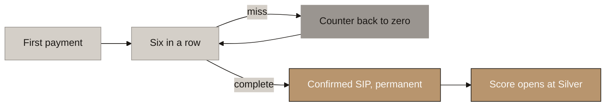
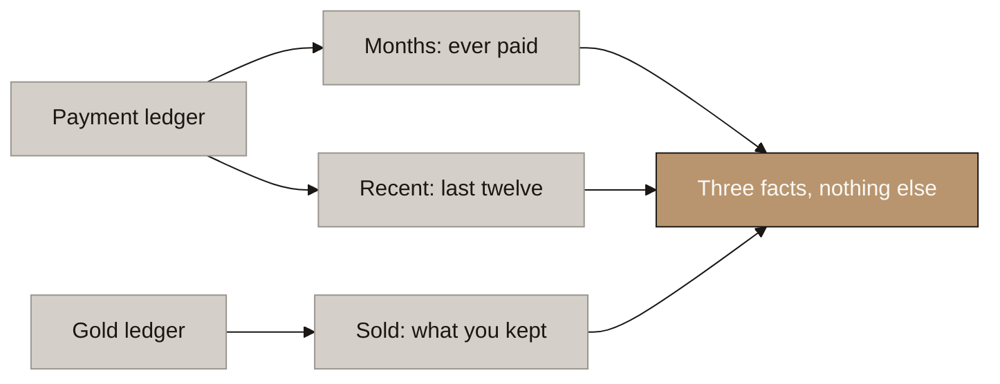
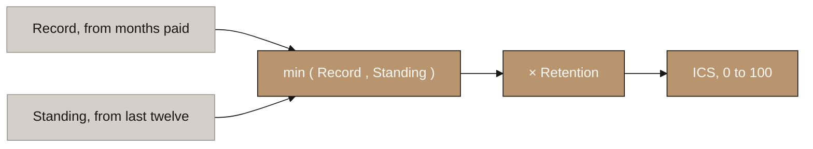
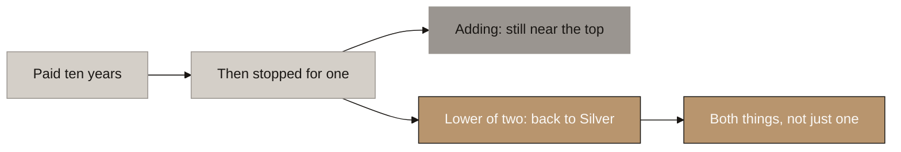
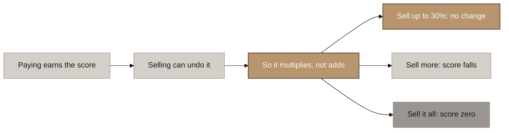
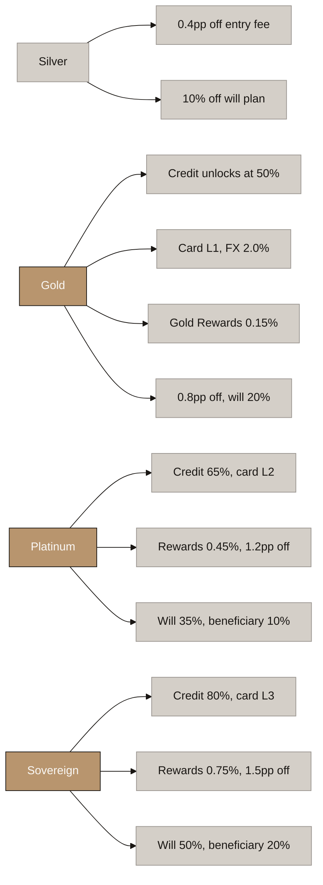
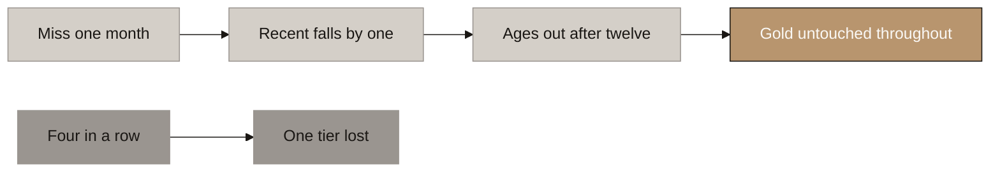
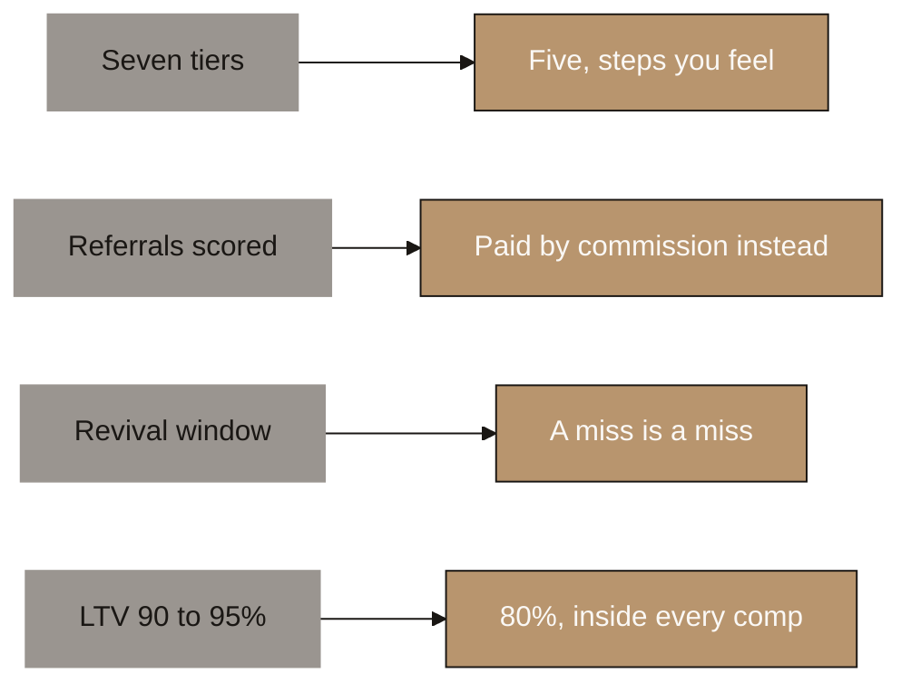

# Aurumix Process Maps: How the ICS Score Works

> Companion to `_draft_ics-scoring.md` (B4, the scoring layer) and to `Aurumix_Process_Maps_ICS_Benefits.md` (the five benefits in detail). **This set explains how the number is earned. That set explains what the number buys.** Maps 5a and 5b are the bridge between them.
>
> The single message: **two facts and one penalty, all readable off the ledger, and a customer can check their own score by hand.**
>
> Related decisions: 13, 19, 20, 21, 22, 44, 45, 46. Written against the design as settled 2026-08-13.

## Diagram Plan

| # | Diagram Name | Type | Direction | Nodes | Placement | What it answers |
|---|---|---|---|---|---|---|
| 0 | The Gate | Flowchart | LR | 5 | Inline | How do I start? |
| 1 | The Three Facts | Flowchart | LR | 6 | Inline | What is being measured? |
| 2 | The Formula | Flowchart | LR | 5 | Inline | How is the number built? Nodes are the terms of the equation; the equation itself and a worked example sit under the diagram |
| 3 | Why the Lower of Two | Flowchart | LR | 5 | Inline | Why not just add them? |
| 4 | Why Selling Multiplies | Flowchart | LR | 6 | Inline | Why is holding treated differently? |
| 5a | The Ladder: Names and Scores | Flowchart | LR | 5 | Inline | What are the tiers and what does each take? |
| 5b | What Unlocks at Each Tier | Flowchart | LR | 16 | Inline | ⚠ Deliberate exception to the 4-to-6 rule: the bridge map, and it has to be complete. Every tier against every benefit it buys, with the values on screen |
| 6 | The Climb | Flowchart | LR | 5 | Inline | How long does it take? |
| 7 | The Miss | Flowchart | LR | 6 | Inline | What happens if I stop? |
| 8 | The Cycler | Flowchart | LR | 5 | Inline | Can it be gamed? |
| 9 | What Changes From Your Document | Flowchart | LR | 8 | Inline | ⚠ Deliberate exception: a before-and-after comparison needs both sides on screen |

## Consistency Convention

- **Flowchart direction:** LR throughout.
- **Gold node convention:** solutions, outcomes that hold, where the customer lands.
- **Concrete node convention:** problems, honest warnings, ruled-out routes.
- **Stone node convention:** starting points, mechanism steps, pending items.
- **Text style:** regular, no bold.

---

## 0. The Gate

<!-- SPEAKER NOTES:
"Nothing happens for the first six months, and that is deliberate. Six payments in a row earns Confirmed SIP, and only then does a score exist. Before that there is no score and no tier, just a counter in the app telling you how many you have made and how many are left.

Miss one and the counter goes back to zero. That is the only place in the whole design where we ask for a streak, and we ask for it once. After the door opens we never ask again.

Two things worth saying out loud. Confirmed SIP is permanent: once you have it, you have it, whatever happens later. And everybody comes through that door at the same place, Silver, twenty five. Whether it took you six months or sixteen."
-->



⚠ **Before the gate the app shows a countdown, never a number.** *"Four of six, two to go."* A score of eight reads as bad credit to a customer who knows CIBIL, in exactly the months where people are most likely to walk away.

⚠ **A regulatory pause freezes the run, it never breaks it.** A saver at four of six who hits a compliance block resumes at four of six. We never penalise someone for a month we refused their money.

---

## 1. The Three Facts

<!-- SPEAKER NOTES:
"Everything the score knows comes from two ledgers you already keep: what the customer paid, and what gold they hold.

Months is how many payments they have ever made. It only goes up. Nothing reduces it, not a missed month, not a withdrawal, nothing.

Recent is how many of the last twelve months they paid. That one moves both ways as the window rolls forward.

Sold is what share of their gold they did not keep this year.

Three facts, and each measures exactly one thing. That is what lets a customer check their own score on the back of an envelope, and that is the property we protect above everything else. The moment one of these starts measuring two things, nobody can verify their own number and the whole thing becomes something they have to take on trust."
-->



⚠ **No input reads an amount.** Months and Recent count periods; Sold is a proportion. The size of a payment appears nowhere, which is why a USD 20 saver and a USD 2,000 saver score identically.

---

## 2. The Formula

<!-- SPEAKER NOTES:
"Here is the whole thing on one line. Your score is the lower of Record and Standing, multiplied by Retention. That is it. There is nothing else.

Two of the three facts become numbers out of a hundred.

Record comes from Months. Your first year of payments takes you to fifty, at four and a bit a month. The next four years take you from fifty to a hundred, at one a month. It stops at five years, because five years of saving is a complete record.

Standing comes from Recent. Each of the last twelve months you paid is worth eight and a third. Twelve out of twelve is a hundred.

Then take the lower of the two and multiply by Retention.

Notice what is not in that equation. There are no weights, because a minimum does not have any. There is no normalisation constant, no cap on a component, no adjustment factor. And there is no amount anywhere: not the size of a payment, not the value of the holding. Every constant in it is a consequence of where we put the four rungs, not a number somebody chose and has to defend."
-->



**The equation, in full.**

```
ICS  =  min( Record , Standing )  ×  Retention


Record      4.17 per month to month 12       = 50
            1.04 per month to month 60       = 100        then capped

Standing    8.33 per month paid of the last 12

Retention   1.00   if you sold 30% or less this year
            falls to 0 as you sell the rest
```

**Worked, for a saver at month 18 who missed two of the last twelve and sold nothing:**

```
Record    = 50 + (18 − 12) × 1.04   =  56.3
Standing  = 10 × 8.33               =  83.3
Retention                           =  1.00

ICS = min( 56.3 , 83.3 ) × 1.00     =  56.3    →   Gold
```

| | Record | Standing |
|---|---|---|
| Comes from | Months ever paid | Paid in last 12 |
| Month 6 | 25 | 50 |
| Month 12 | 50 | 100 |
| Month 36 | 75 | 100 |
| Month 60 | 100 | 100 |

⚠ **For anyone paying on time, Record is always the lower of the two.** Look down that table: Standing is the bigger number at every row. So a good customer's score is simply their record, and Standing only ever appears when something has gone wrong. That is the right way round.

⚠ **The whole scale is built backwards from the four thresholds**, 25 / 50 / 75 / 100, so that a saver who never misses lands exactly on them at months 6, 12, 36 and 60. The constants are consequences of the ladder, not choices in their own right.

---

## 3. Why the Lower of Two

<!-- SPEAKER NOTES:
"This is the one choice in the design I would ask you not to unpick, so let me give you the reason.

We built the first version by adding the two numbers together. It failed one test badly. Take a customer who paid every month for ten years and then stopped for a year. Under addition they still came out near the top, because ten years is a big number, and a big number plus zero is still a big number.

We could not fix that by changing the weights, because it is not a weighting problem. It is just what adding does. A high score in one place makes up for a low score in the other.

Now look at what a tier actually means. Gold is twelve months paid, and six of the last twelve. Both of those. Not one or the other.

If you want both numbers to be at least fifty, there is a very simple way to check it: take the smaller one and see if it clears fifty. If the smaller one clears the bar, they both do.

That is the whole reason we take the lower. A long history cannot make up for not paying now, and paying now cannot make up for a short history. And nobody has to remember to enforce that, because the formula cannot do anything else.

The same customer under the new formula: ten years of payments still gives them a Record of a hundred, but nothing paid in the last year gives them a Standing of zero. The lower of the two is zero, so they sit on the Silver floor until they start paying again."
-->



⚠ **A useful side effect: the score tells the customer which of the two is holding them back.** If the score came from Standing, they need to start paying again. If it came from Record, they are doing everything right and just need more time. The app can say which, with no extra working out.

---

## 4. Why Selling Multiplies

<!-- SPEAKER NOTES:
"Paying is one thing we measure. Keeping the gold is different, because a customer who pays perfectly every month and sells everything every month has not actually saved anything. Their payment record looks perfect and they have nothing to show for it.

So Retention is not a third number we add on. It multiplies. If we added it, a good payment record could outweigh selling everything. Multiplying means it cannot: no amount of paying makes up for not keeping the gold.

The shape is generous where it should be. You can take out up to a third of your gold in a year and nothing happens at all, not a fraction of a point. Past a third, every further seven percent you sell costs ten percent of your score. Empty the account and the score goes to zero, though the floor still holds you at Silver.

One number worth knowing: we measure what share of everything you had that you did not keep. Not an average balance. That matters, because an average would have made a sale cheaper the later in the year you made it, which is an invitation to time your withdrawals around the assessment date."
-->



| Sold in 12 months | 30% | 40% | 50% | 70% | 100% |
|---|---|---|---|---|---|
| **Multiplier** | **1.00** | 0.86 | 0.71 | 0.43 | **0** |
| Costs a Platinum saver | nothing | one tier | one tier | two tiers | three tiers |

⚠ **The row to put in front of the client is the first one.** A real household withdrawal of nearly a third costs absolutely nothing. The design promises small withdrawals are free and then actually delivers it, including to the customers who have earned most.

⚠ **A sale ages out of the window in twelve months, exactly as a missed payment does.** One recovery rule covers both. Someone who liquidated once and then held for a year has demonstrated the behaviour we want.

---

## 5a. The Ladder: Names and Scores

<!-- SPEAKER NOTES:
"Four named rungs and one state below them. Below the gate there is no tier at all, because there is genuinely nothing there yet: no score has been calculated.

The scores are twenty five, fifty, seventy five and a hundred. Round numbers, on purpose, so a customer can hold them in their head.

Each rung has two conditions and you need both. Silver is six payments in a row. Gold is twelve months paid and six of the last twelve. Platinum is thirty six months paid and nine of the last twelve. Sovereign is sixty months paid and twelve of the last twelve.

Sovereign is the strict one. It needs a perfect year, a complete record and your gold intact, all at the same time. That is deliberate. Sovereign is rented by conduct, never owned. The only rung you keep no matter what is Silver."
-->


| Tier | Score | What it takes | A perfect saver gets there |
|---|---|---|---|
| **No tier** | no score | Gate not passed yet | — |
| **Silver** | **25** | 6 payments in a row. **Permanent** | month 6 |
| **Gold** | **50** | 12 months paid **and** 6 of the last 12 | month 12 |
| **Platinum** | **75** | 36 months paid **and** 9 of the last 12 | month 36 |
| **Sovereign** | **100** | 60 months paid **and** 12 of the last 12, gold intact | month 60 |

⚠ **Lower bounds, never ranges.** The score is a real number, so a band written "75 to 99" would leave 99.4 in no tier at all. This is a build note and it is exactly the kind of thing that ships broken.

⚠ **Every score the customer ever sees is 25 or higher.** Below the gate there is no score, and above it the Silver floor holds. The old 0 to 24.9 band does not exist.

---

## 5b. What Unlocks at Each Tier

<!-- SPEAKER NOTES:
"Now the same ladder, with everything each rung actually buys.

Silver gives two price benefits: a little off the entry fee, and ten percent off the will plan. Small, and that is honest. Silver says the account is real.

Gold is the big rung, and it is worth spending a moment on. Three things switch on at once here: credit against the gold, the card, and Gold Rewards. Nothing before Gold involves borrowing or spending. That matters for a reason we will come back to: it means somebody gaming the score can never reach anything worth taking.

Platinum and Sovereign do not add new features. Everything steps up. Borrowing goes from fifty to sixty five to eighty percent. Rewards roughly triple across the two steps. The will discount goes from twenty to thirty five to fifty.

One thing to flag: at launch only the two price benefits exist. Credit needs the lending partner. The card and rewards need the sponsor bank. So sell the tier as the thing that lasts, and the benefits as what it currently buys."
-->



⚠ **Silver to Gold is deliberately the biggest step.** All three headline features switch on there, and nothing borrowable or spendable exists below it. That is what makes the Silver floor safe to hand out (map 8).

**The full matrix. This is the leave-behind.**

| | No tier | Silver | Gold | Platinum | Sovereign |
|---|---|---|---|---|---|
| **Entry-fee discount** | 0 | 0.4pp | 0.8pp | 1.2pp | **1.5pp** |
| **Credit max LTV** | — | — | 50% | 65% | **80%** |
| **Card level** | — | — | L1 | L2 | **L3** |
| **Card FX margin** | — | — | 2.0% | 1.5% | **1.0%** |
| **ATM allowance, AED/mo** | — | — | 1,000 | 2,500 | **5,000** |
| **Gold Rewards rate** \* | — | — | 0.15% | 0.45% | **0.75%** |
| **Will plan discount** | 0 | 10% | 20% | 35% | **50%** |
| **Per-beneficiary discount** | 0 | 0 | 0 | 10% | **20%** |

⚠ **\* The Gold Rewards rates are provisional.** They are bounded by the interchange share Aurumix negotiates with the card sponsor, which is not contracted yet, and by whether the card is built as credit rather than prepaid. The tier *shape* is settled; the three numbers in that row are not.

⚠ **At launch only two of the five columns exist:** the entry-fee discount and the will discount. Credit arrives with the lending partner, the card and Gold Rewards with the sponsor bank. **Sell the tier as the durable thing and the matrix as what it currently buys.**

⚠ **Detail on any single benefit lives in `Aurumix_Process_Maps_ICS_Benefits.md`**, one map each. Do not unpack a benefit from this map; switch decks.

---

## 6. The Climb

<!-- SPEAKER NOTES:
"Silver at six months, Gold at one year, Platinum at three, Sovereign at five.

Notice the spacing. Two rungs in the first year, then two more across four years. That is deliberate and it is aimed at your own persistency problem. In Indian life insurance roughly seventy nine percent are still paying at month thirteen and about thirty eight percent at month sixty one. The reinforcement is concentrated where the falling off happens.

The later stretch is walked by people who have already proved they are stayers, and by then they hold credit, a card and rewards, all of which grow with their gold every month whether or not the tier moves.

And after year five the tier stops climbing, which is correct. A rate that stops improving is the founding principle working: your gold sizes the benefit, your behaviour sets the rate. At year twenty the rate is the same eighty percent, but the borrowing headroom is four times bigger."
-->



```mermaid
%%{init: {'theme': 'base', 'themeVariables': {
    'primaryColor': '#B8956E',
    'primaryTextColor': '#1A1714',
    'primaryBorderColor': '#1A1714',
    'lineColor': '#1A1714',
    'secondaryColor': '#FAF8F5',
    'tertiaryColor': '#D4CFC8',
    'fontFamily': 'Libre Franklin, sans-serif',
    'edgeLabelBackground': '#D4CFC8',
    'clusterBkg': '#FAF8F5',
    'clusterBorder': '#B8956E'
}}}%%
graph LR
    A["Six payments"] --> B["Silver at six months"]
    B --> C["Gold at one year"]
    C --> D["Platinum at three years"]
    D --> E["Sovereign at five years"]

    style A fill:#D4CFC8,stroke:#9A9590,color:#1A1714
    style B fill:#B8956E,stroke:#1A1714,color:#FAF8F5
    style C fill:#B8956E,stroke:#1A1714,color:#FAF8F5
    style D fill:#B8956E,stroke:#1A1714,color:#FAF8F5
    style E fill:#B8956E,stroke:#1A1714,color:#FAF8F5
```

⚠ **The fairness row, and it is the one that answers a regulator.** A saver putting in USD 20 a month and a saver putting in USD 2,000 a month reach Sovereign **on the same day**. A hundred times the money buys zero tiers. Amount sizes the base; behaviour sets the rate.

⚠ **There is no acceleration route at all.** Referrals, family portfolios and Masterclass do not score, so contributions are the only path for anyone.

---

## 7. The Miss

<!-- SPEAKER NOTES:
"Miss a month and one thing happens: the count of payments in the last twelve goes down by one, worth eight and a third points. Twelve months later it rolls out of the window on its own.

That is the entire penalty. There is no fee, no fine, no interest, no arrears to clear. Your gold is untouched, your record is untouched, your Confirmed SIP is untouched.

In practice a single miss costs at most one tier, and in the middle of the climb it usually costs nothing at all. It takes four misses in a row to lose Platinum and seven to lose Gold.

There is no revival and no arrears mechanism, and that is deliberate rather than harsh. Revival is an insurance idea that exists because a lapsed policy kills the cover. Here a miss kills nothing, so there is nothing to revive. Money arriving after the grace period is simply a spot purchase, allocated normally.

The governing sentence, and it should be in these exact words: you can lose your status, you can never lose your gold."
-->



| Consecutive misses, from Sovereign | 1 | 2 | 3 | **4** | 7 | 12 |
|---|---|---|---|---|---|---|
| **Score** | 91.7 | 83.3 | 75 | **66.7** | 41.7 | floor 25 |
| **Tier** | Platinum | Platinum | Platinum | **Gold** | Silver | Silver |

⚠ **A veteran who lapses and comes back rebuilds only their recent form, never their history.** Nine clean months restores Platinum, against the thirty six a newcomer needs. *You never re-earn your history, only your form.*

⚠ **Nothing already given is taken back.** A drawn loan runs to term at the rate it was struck. The plastic never downgrades. Grams already credited stay credited.

---

## 8. The Cycler

<!-- SPEAKER NOTES:
"This is the answer to can it be gamed, and it is worth walking slowly because it is the sharpest attack on the product.

Picture someone who contributes every single month for five years and never misses once. On payments alone their record is flawless: sixty out of sixty, twelve of the last twelve. On any scoring system built on payment history they are your best customer.

But every month they also sell everything they just bought. They are using you as a payment rail, not saving anything.

Retention catches them, and it catches them with a number they cannot fake, because it is read straight off the gold ledger rather than off anything they tell us. Their multiplier is zero, so their score is zero, and the floor puts them at Silver. Three tiers below someone with an identical payment record.

And Silver buys them nothing worth having: four tenths of a point off a fee they pay when they buy, and a discount on a will they would have to purchase. No credit, no card, no rewards, because all three start at Gold. They never get there.

The wider point: five of our nine known attacks are now impossible by the shape of the formula rather than blocked by a rule someone has to enforce. Someone alternating pay, miss, pay, miss sits at six out of twelve forever, capped at Gold for life. We did not write a rule for that. The arithmetic does it."
-->



```mermaid
%%{init: {'theme': 'base', 'themeVariables': {
    'primaryColor': '#B8956E',
    'primaryTextColor': '#1A1714',
    'primaryBorderColor': '#1A1714',
    'lineColor': '#1A1714',
    'secondaryColor': '#FAF8F5',
    'tertiaryColor': '#D4CFC8',
    'fontFamily': 'Libre Franklin, sans-serif',
    'edgeLabelBackground': '#D4CFC8',
    'clusterBkg': '#FAF8F5',
    'clusterBorder': '#B8956E'
}}}%%
graph LR
    A["Pays every month, perfectly"] --> B["Sells it all, monthly"]
    B --> C["Retention reads zero"]
    C --> D["Score zero, floored at Silver"]
    D --> E["Three tiers below a saver"]

    style A fill:#D4CFC8,stroke:#9A9590,color:#1A1714
    style B fill:#9A9590,stroke:#9A9590,color:#1A1714
    style C fill:#9A9590,stroke:#9A9590,color:#1A1714
    style D fill:#B8956E,stroke:#1A1714,color:#FAF8F5
    style E fill:#B8956E,stroke:#1A1714,color:#FAF8F5
```

⚠ **Nothing farmable passes through the Silver floor.** Both Silver benefits are price reductions bounded by money the customer hands over. Credit, card and Gold Rewards all start at Gold.

⚠ **Five attacks are closed by construction rather than by rule:** the alternating misser, the late lump sum, referral farming, family-account farming, and timing a sale to make it cheaper.

---

## 9. What Changes From Your Document

<!-- SPEAKER NOTES:
"Four things in your section eight point two work differently in what we are proposing, and I would rather put them on the table than have you find them.

Seven tiers become five. The reason is your own benefit set. Seven tiers cut a fixed ladder into six steps, and the steps came out too small to feel: a quarter of a point off the entry fee is nineteen cents a month on a seventy five dollar contribution, and five cents for the twenty dollar saver this product exists to serve. At five tiers the borrowing steps double, the rewards steps double, and the card maps one to one onto the three levels a sponsor bank actually operates. Your Gold Member at fifty percent row survives exactly.

Referrals, family portfolios and Masterclass no longer feed the score. All three survive as programmes. The reason is that referrals are already paid a commission for a function performed, so scoring them as well pays twice for one behaviour. And a status bonus for recruiting people is precisely the shape a regulator reads as a pyramid, which is the thing your agent network was carefully designed to avoid.

There is no revival and no arrears. A missed month is missed. Late money is a spot purchase.

And the credit ratio is eighty percent at the top, not ninety to ninety five. Every comparable in the world sits between fifty and eighty five. India's regulator caps gold lending at seventy five to eighty five. No UAE lender publishes one at all. And your own worked example in nine point three computes to eighty five, not the hundred and ten in the heading, so the number was never really ninety five."
-->



⚠ **A fifth change, smaller but visible in the app:** Confirmed SIP is six consecutive contributions, and it now switches on the score itself rather than only the benefits. Below it there is no tier at all, which is why the bottom rung is called **No tier** rather than Green.

⚠ **One recommendation attached to this map: show the customer the raw score, not just the tier.** The persona already understands CIBIL, and the score now names its own constraint, so the app can tell somebody exactly what to fix.

---

## Running Order for the Call

**If you have ten minutes, use 0, 5a, 5b and 6.** Zero establishes how you start. 5a is the ladder, 5b is what it buys, and they are one beat: put 5a up, then replace it with 5b so the rungs stay in the same place on screen. Six is the promise in one sentence: Silver at six months, Gold at one year, Platinum at three, Sovereign at five.

**If you have thirty minutes, add 3, 4 and 8.** Three is why the formula is shaped the way it is. Four is the withdrawal allowance, which is the most generous thing in the design and the easiest to undersell. Eight is the anti-gaming answer, and it is the one that makes the rest credible.

**Diagrams 1, 2 and 7 are for questions.** One and two answer "how is it actually calculated". Seven answers "what happens if I stop paying", which is the question every customer asks and the one your own document answered with a penalty.

**Diagram 9 is not optional and it does not go last.** Raise the departures early, in your own words, before they are discovered mid-presentation.

⚠ **3 and 8 are a pair and should not be split.** Three is the argument; eight is the proof it works. Three alone sounds like mathematics. Eight alone sounds like a claim.

## Reconciliation Owed

- [ ] **Gold Rewards rates in map 5b are provisional** and marked as such. They harden only when the interchange share is contracted and the credit-versus-prepaid question is answered. Revisit this map at that point, not before.
- [ ] **`Aurumix_Process_Maps_ICS_Benefits.md` diagram 0** (the common engine) says "six payments" for Confirmed SIP. Under the 2026-08-13 gate it is **six consecutive** payments and it gates the score, not only the benefits. One-line correction owed.
- [ ] **The compliance-forced exit is unresolved** (scoring §10 item 2) and no map covers it. If a returning NRI is forced to sell, Retention currently reads that as a sale. Deliberately left open; add a map only once it is decided.
- [ ] **`Aurumix_Process_Maps.md` and both SIP map sets predate this design.** None of them should be used to explain scoring.
- [ ] Map 5b's matrix duplicates `_draft_ics-scoring.md` §6. **If the ladder changes, both move together.**
