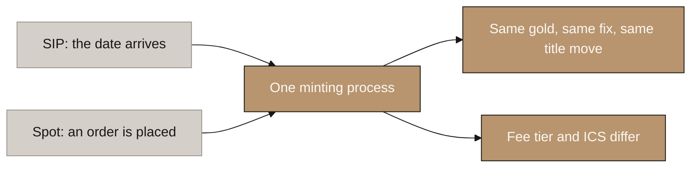
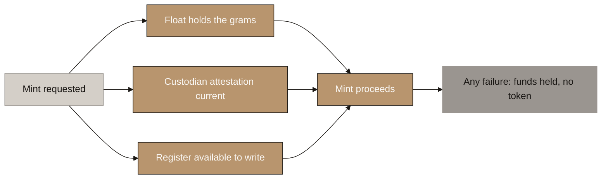
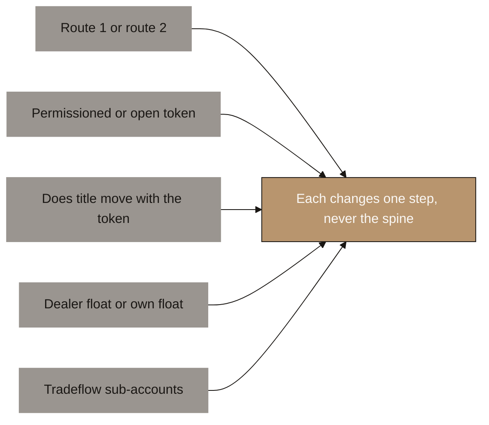

```mermaid
%%{init: {'theme': 'base', 'themeVariables': {
    'primaryColor': '#B8956E',
    'primaryTextColor': '#1A1714',
    'primaryBorderColor': '#1A1714',
    'lineColor': '#1A1714',
    'secondaryColor': '#FAF8F5',
    'tertiaryColor': '#D4CFC8',
    'fontFamily': 'Libre Franklin, sans-serif',
    'edgeLabelBackground': '#D4CFC8',
    'clusterBkg': '#FAF8F5',
    'clusterBorder': '#B8956E'
}}}%%
graph LR
    A["Account opened, residence captured"] --> B["KYC, sanctions, country perimeter"]
    B --> C["Wallet registered on the identity registry"]
    C --> D["Bank account name-matched"]
    D --> E["The address is now mint-eligible"]

    style A fill:#D4CFC8,stroke:#9A9590,color:#1A1714
    style B fill:#B8956E,stroke:#1A1714,color:#FAF8F5
    style C fill:#B8956E,stroke:#1A1714,color:#FAF8F5
    style D fill:#B8956E,stroke:#1A1714,color:#FAF8F5
    style E fill:#B8956E,stroke:#1A1714,color:#FAF8F5
```

```mermaid
%%{init: {'theme': 'base', 'themeVariables': {
    'primaryColor': '#B8956E',
    'primaryTextColor': '#1A1714',
    'primaryBorderColor': '#1A1714',
    'lineColor': '#1A1714',
    'secondaryColor': '#FAF8F5',
    'tertiaryColor': '#D4CFC8',
    'fontFamily': 'Libre Franklin, sans-serif',
    'edgeLabelBackground': '#D4CFC8',
    'clusterBkg': '#FAF8F5',
    'clusterBorder': '#B8956E'
}}}%%
graph LR
    A["Funds clear into the Client Account"] --> B["Price struck at the next LBMA fix"]
    B --> C["Title crosses: float to trust"]
    C --> D["Token minted, 1 AURX per gram"]
    D --> E["Entry fee becomes Aurumix's"]

    style A fill:#D4CFC8,stroke:#9A9590,color:#1A1714
    style B fill:#B8956E,stroke:#1A1714,color:#FAF8F5
    style C fill:#B8956E,stroke:#1A1714,color:#FAF8F5
    style D fill:#B8956E,stroke:#1A1714,color:#FAF8F5
    style E fill:#B8956E,stroke:#1A1714,color:#FAF8F5
```

```mermaid
%%{init: {'theme': 'base', 'themeVariables': {
    'primaryColor': '#B8956E',
    'primaryTextColor': '#1A1714',
    'primaryBorderColor': '#1A1714',
    'lineColor': '#1A1714',
    'secondaryColor': '#FAF8F5',
    'tertiaryColor': '#D4CFC8',
    'fontFamily': 'Libre Franklin, sans-serif',
    'edgeLabelBackground': '#D4CFC8',
    'clusterBkg': '#FAF8F5',
    'clusterBorder': '#B8956E'
}}}%%
graph LR
    A["Float pot: Aurumix's own metal"] --> B["Grams cross at allocation"]
    B --> C["Trust pot: held by the vehicle"]
    C --> D["Sub-account names the customer"]
    D --> E["Token minted to match"]

    style A fill:#D4CFC8,stroke:#9A9590,color:#1A1714
    style B fill:#B8956E,stroke:#1A1714,color:#FAF8F5
    style C fill:#B8956E,stroke:#1A1714,color:#FAF8F5
    style D fill:#B8956E,stroke:#1A1714,color:#FAF8F5
    style E fill:#B8956E,stroke:#1A1714,color:#FAF8F5
```

```mermaid
%%{init: {'theme': 'base', 'themeVariables': {
    'primaryColor': '#B8956E',
    'primaryTextColor': '#1A1714',
    'primaryBorderColor': '#1A1714',
    'lineColor': '#1A1714',
    'secondaryColor': '#FAF8F5',
    'tertiaryColor': '#D4CFC8',
    'fontFamily': 'Libre Franklin, sans-serif',
    'edgeLabelBackground': '#D4CFC8',
    'clusterBkg': '#FAF8F5',
    'clusterBorder': '#B8956E'
}}}%%
graph LR
    A["Allocations draw the float down"] --> B["Drawdown reaches one bar"]
    B --> C["Treasury buys a bar"]
    C --> D["Float replenished"]
    D --> E["Monthly Allocation Report"]

    style A fill:#D4CFC8,stroke:#9A9590,color:#1A1714
    style B fill:#B8956E,stroke:#1A1714,color:#FAF8F5
    style C fill:#B8956E,stroke:#1A1714,color:#FAF8F5
    style D fill:#B8956E,stroke:#1A1714,color:#FAF8F5
    style E fill:#B8956E,stroke:#1A1714,color:#FAF8F5
```

# Aurumix Process Maps: The Minting Cycle

> Draft for the client call and for the build. How a contribution becomes gold and then becomes a token, end to end, in the order it actually happens.
>
> Reasoning: `_draft_purchase-structure.md` sections 2.0 to 2.4. Float and treasury cycle: `_draft_allocation-and-float.md`. Ownership construct: `_draft_entities-licensing-and-payments.md` section 2.
>
> ⚠ **Drawn assuming route 2 (a DIFC holding vehicle) and a permissioned token.** Neither is settled. Diagram 7 shows exactly what changes if counsel rules the other way, and the answer is one step each, never the spine.
>
> ⚠ **The redemption cycle is a separate set.** This file covers money in only.

## Diagram Plan

| # | Diagram Name | Type | Direction | Nodes | Placement | Source Section |
|---|---|---|---|---|---|---|
| 1 | One Pipe, Two Doors | Flowchart | LR | 5 | Inline | Purchase draft 4.1 |
| 2 | Stage Zero: The Identity Gate | Flowchart | LR | 5 | Inline | Purchase draft 2.0 |
| 3 | Money, Then Title, Then Token | Flowchart | LR | 5 | Inline | Purchase draft 2.1 |
| 4 | Worked Example: What USD 75 Buys | Flowchart | LR | 6 | Inline | Purchase draft 2.2 |
| 5 | Where the Gold Sits, Before and After | Flowchart | LR | 5 | Inline | Purchase draft 2.3 |
| 6 | What Halts a Mint | Flowchart | LR | 6 | Inline | Purchase draft 2.4 |
| 7 | The Treasury Cycle, Invisible to the Investor | Flowchart | LR | 5 | Inline | Allocation draft |
| 8 | The Five Open Switches | Flowchart | LR | 6 | Appendix | Open items |

## Consistency Convention

- **Flowchart direction:** LR throughout.
- **Gold node convention:** the step as designed, and outcomes that hold.
- **Stone node convention:** anything pending counsel or pending the dealer.
- **Concrete node convention:** starting points and inputs.
- **Text style:** regular, no bold.
- **Sequence:** diagram 1 collapses the two lanes. Diagrams 2 to 4 are the cycle itself. Diagrams 5 and 6 are what protects it. Diagram 7 is the appendix for the open decisions.

---

## 1. One Pipe, Two Doors

<!-- SPEAKER NOTES:
"Start here, because it removes a complication before it appears.

Your document treats SIP and spot as two different things, and commercially they are. Mechanically they are not. A spot purchase and a SIP contribution run through the identical process. The only difference is what starts it: a scheduled date on one side, an order placed on the other.

After that first moment, everything is the same. The same price, from the same public fix. The same gold, out of the same pot. The same title transfer, the same token, the same receipt, the same settlement. The system that mints gold does not know which lane the money came from, and it should not.

What does differ sits around the transaction, not inside it. The entry fee differs, because SIP investors get a tier discount and spot pays the flat top of the range. And ICS accrues on a SIP contribution and never on a spot purchase.

That is the whole difference. Price and score, not plumbing.

This matters for the build more than for the conversation. If your developers build two purchase flows, you will have two sets of bugs, two reconciliation paths and two places for the backing invariant to break. Build one, and put the lane difference in the fee calculation and the scoring event."
-->

---

## 2. Stage Zero: The Identity Gate

<!-- SPEAKER NOTES:
"Before any money moves, there is a stage that is easy to file under compliance and should not be.

Under direct ownership with a permissioned token, an unverified address cannot receive AURX. So verification is not a form that runs alongside onboarding. It is a hard precondition of the mint. If someone's verification is still pending when their money clears, the money sits in the client account and no gold is allocated. Nothing breaks, but nothing happens either.

Five things have to be true before the first dirham can buy gold. The account is open and we have captured country of residence, not passport, because every rule that binds is about where someone lives. KYC, sanctions and PEP screening have passed. The country is inside our perimeter. The wallet is registered, which is what makes the address mint eligible. And the bank account is registered and name matched to the account holder.

I want to draw out that last one, because it is the easiest to skip and the most expensive to add later. Our entire payment design rests on a single test: whose bank account sent the money. That is what lets us accept stablecoin value without ever touching a token, because the customer converts it themselves and pays from their own named account. If the funding account is not name matched at onboarding, we cannot apply that test at payment time, and the whole approach falls over.

So name match at onboarding, then reject any inbound payment from an account that does not match."
-->

---

## 3. Money, Then Title, Then Token

<!-- SPEAKER NOTES:
"This is the core of the design and it is one sentence: money, then title, then token, and never any other order.

The money arrives and lands in a designated client account within one calendar day. At that point it is entirely the customer's money. Not some of it. All of it, including the entry fee, because we have not delivered anything yet.

Then the price is struck at the next published LBMA fix. Not a price we choose, not the last one published, the next one nobody has seen yet. That single rule appears in three places in this design: on a contribution, on arrears, and on an exit. Anywhere either side can pick between two prices they already know, that side is holding a free option, and over thousands of transactions a free option is a real cost.

Then title crosses, and this is the moment that matters. The grams move out of the float and into the trust, and the vehicle's register records that customer as owning them. Ownership is created here. Not when the token appears.

Then the token is minted, one AURX per gram, to the registered address.

And only now does the entry fee stop being client money and become Aurumix's. VARA excludes money immediately due and payable to a licensed firm for its own account, and the fee becomes due when the service is delivered. Title transfer is the delivery. Your existing documents do not draw this line anywhere and a licence application will ask for it.

One precision, and it is an accounting point rather than a customer point. On a seventy five dollar contribution at year one assumptions, the disclosed fee is five percent, which is three dollars seventy five. The cash Aurumix actually keeps is about one dollar sixty, because the fabrication premium on a hundred gram bar is buried inside that fee. Both numbers are true. Disclose the fee, budget the margin, and do not let anyone plan spending against the five percent."
-->

---

## 4. Worked Example: What USD 75 Buys

<!-- SPEAKER NOTES:
"One worked example, because the arithmetic is the part people trust.

A seventy five dollar contribution at year one. The entry fee is five percent, so three dollars seventy five. Seventy one dollars twenty five is what actually buys gold.

The price comes from the LBMA fix. Say gold is thirty four hundred dollars an ounce. A troy ounce is 31.1035 grams, so that is one hundred and nine dollars thirty one per gram. This conversion matters because the world quotes gold in ounces and AURX is denominated in grams.

Seventy one twenty five divided by one hundred and nine thirty one is nought point six five one eight grams. And because one AURX is exactly one gram, the customer receives nought point six five one eight AURX. The token count is the gram count. There is no conversion, no ratio, no pool share to calculate. That is the single biggest reason we recommended one gram over one hundredth of a gram.

Now the part to be careful about internally, and it is not for the customer slide. The disclosed fee is five percent, three dollars seventy five. The cash Aurumix actually keeps is one dollar sixty one, because you buy a hundred gram bar at roughly a three percent fabrication premium and that premium is buried inside the fee. Seventy three thirty nine goes to the dealer, one sixty one stays.

Both numbers are true. Disclose the fee, budget the margin, and do not let anyone build a revenue plan on the five percent.

The gold price used here is illustrative. The mechanism does not change with it, and the customer always gets the published fix rather than a number we chose."
-->

```mermaid
%%{init: {'theme': 'base', 'themeVariables': {
    'primaryColor': '#B8956E',
    'primaryTextColor': '#1A1714',
    'primaryBorderColor': '#1A1714',
    'lineColor': '#1A1714',
    'secondaryColor': '#FAF8F5',
    'tertiaryColor': '#D4CFC8',
    'fontFamily': 'Libre Franklin, sans-serif',
    'edgeLabelBackground': '#D4CFC8',
    'clusterBkg': '#FAF8F5',
    'clusterBorder': '#B8956E'
}}}%%
graph LR
    A["Contribution USD 75.00"] --> B["Less 5% entry fee, USD 3.75"]
    B --> C["USD 71.25 buys gold"]
    C --> D["LBMA fix USD 3,400/oz = USD 109.31/g"]
    D --> E["0.6518 grams"]
    E --> F["0.6518 AURX, since 1 AURX = 1 g"]

    style A fill:#D4CFC8,stroke:#9A9590,color:#1A1714
    style B fill:#B8956E,stroke:#1A1714,color:#FAF8F5
    style C fill:#B8956E,stroke:#1A1714,color:#FAF8F5
    style D fill:#B8956E,stroke:#1A1714,color:#FAF8F5
    style E fill:#B8956E,stroke:#1A1714,color:#FAF8F5
    style F fill:#B8956E,stroke:#1A1714,color:#FAF8F5
```

**The same example from the cash side.** Not for the customer slide, but the number the business plans against.

| Line | USD |
|---|---|
| Contribution received | 75.00 |
| Paid to the dealer: 0.6518 g at fix plus 3% fabrication premium | (73.39) |
| **Retained by Aurumix** | **1.61** |

> ⚠ **The disclosed fee is USD 3.75. The cash retained is USD 1.61.** The fabrication premium sits inside the fee. Both are true. Disclose the fee, budget the margin.

⚠ Gold price is illustrative. Grams always derive from the published fix, never from a number Aurumix selects.

---

## 5. Where the Gold Sits, Before and After

<!-- SPEAKER NOTES:
"Worth slowing down here, because people expect this step to involve gold moving and it does not.

The bar never moves. It sits on the same shelf in the same vault before and after. What changes is who owns it.

There are two pots in the vault, and keeping them apart is the whole structure. The float is working inventory, owned outright by Aurumix, or by the dealer if the dealer carries it. There are no tokens against the float. The trust pot holds the customers' gold, held by the vehicle, and every gram in it has exactly one token against it.

Minting is grams crossing from the first pot to the second. Two entries in a register. The first says the gold is no longer Aurumix's, it is now held by the vehicle. The second says which customer it belongs to.

Say that clearly, because it is the sentence the lawyers will test: before the entry Aurumix owned the gold and the customer owned money. After the entry, the customer owns the gold and Aurumix owns its fee. That swap is the product.

Two honest qualifications. First, nobody owns a specific bar. At two thirds of a gram it is not possible. What the customer owns is grams in an allocated pool that is segregated from Aurumix's own metal, and that is the accurate wording. Your section 3.1 currently says this is not a pooled allocation, and that claim is stronger than the mechanism supports. It should be corrected before anyone external reads it.

Second, the two pots must never be commingled. If float metal and customer metal sit in one undifferentiated position, the ownership claim weakens toward a creditor claim, which is the outcome this entire structure exists to avoid. Two vault positions, always."
-->

---

## 6. What Halts a Mint

<!-- SPEAKER NOTES:
"Three conditions gate every single mint, and if any one fails, no token is created. This is what makes the backing promise mechanical rather than a statement of intent.

The float must actually hold the grams. If it does not, we would be minting a token against gold we do not have, which is precisely the disclosed unbacked window that Comtech operates and that we are deliberately not copying.

The custodian attestation must be current. If the vault has not confirmed the holding recently enough, minting stops. Treat currency of attestation as a precondition of minting, not as a reporting nicety, because the second framing means it lapses quietly and nobody notices.

And the register must be available to write to. If we cannot record who owns the gold, the token must not exist, because a token whose ownership cannot be recorded is exactly the thing VARA's direct ownership rule prohibits.

The rule underneath all three: if title cannot be recorded, the token must not exist. It is always safer to hold a customer's money for another day and tell them why, than to issue a token that is not fully behind gold.

There are two invariants your developers should be able to check at any moment. Float grams plus trust grams is greater than or equal to tokens outstanding. And the sum of every sub-account in the register equals tokens outstanding exactly. The first is the backing promise. The second is the reconciliation VARA requires, and it should be checked on every block that contains an AURX movement."
-->

---

## 7. The Treasury Cycle, Invisible to the Investor

<!-- SPEAKER NOTES:
"Everything so far happens within a day of the money clearing. This diagram is what happens behind it, and the investor never sees any of it.

Every allocation draws the float down a little. A twenty dollar contribution takes about a fifth of a gram. Nobody buys a bar for that, and this is exactly the problem the float exists to solve. It decouples the investor's ticket from the treasury's purchase. That is why a twenty dollar saver works here when PAXG needs about a hundred and twenty dollars and XAUT needs a hundred and seventy thousand.

When cumulative drawdown reaches one bar denomination, the treasury buys a bar and the float is topped back up. At year one that is a hundred gram bar and it fills in roughly nine days. At year three it is a kilo bar filling in under four days.

Then a monthly allocation report goes out, which is the investor facing event. It replaces the mining event in your document and it is a better one, because it is regular, verifiable and tied to something real.

The one thing to flag: whether Aurumix funds this float or the dealer carries it is still open, and it is a dealer conversation, not a research task. Dealer carried costs no working capital and puts price risk on them, at a wider spread. Own float costs about twenty two thousand dollars at year one, which is small against the capital you must post for the licence anyway. Our working recommendation is to launch dealer carried and migrate later. Either way, this diagram does not change. Only who owns the first pot changes."
-->

---

# Appendix

## 8. The Five Open Switches

<!-- SPEAKER NOTES:
"Use this one only if the question comes up, or if you want to close by showing the design is not waiting on anybody.

Five things are genuinely unresolved, and they split by who has to answer them. Three are for your counsel and two are commercial.

The three for counsel. Whether Aurumix holds the gold as caretaker or a separate DIFC vehicle holds it. Whether the token must be permissioned or can be open, which turns on whether a trustee identifying beneficiaries can do so by wallet address. And whether title actually transfers with the token under UAE law, which is the big one.

The two commercial. Whether the dealer carries the float or Aurumix funds it. And whether DMCC Tradeflow supports a customer level layer beneath a warrant, which decides whether the ownership list sits in an independent register or in our own books.

Note what is not on this list. The exit fee question is closed. We grant the redemption right deliberately, we charge nothing on the way out because VARA forbids it, and we recover at the door instead. Counsel will be asked to confirm that a published buyback reads as a redemption right, but that is a confirmation rather than a fork: if they agree, nothing changes, and if they disagree, our constraints only loosen.

The point of this diagram is that each one changes exactly one step, and none of them changes the spine.

If it is route one rather than route two, step four still happens, it just happens inside Aurumix in a different legal capacity instead of moving to a separate vehicle. Same step, one less entity.

If the token can be open rather than permissioned, the identity gate at stage zero softens and identity is checked at signup and at exit instead. Steps one through five are untouched.

If title does not transfer with the token, the register write becomes the only legally operative act, the token is a receipt rather than an instruction, and peer to peer transfer has to be switched off. That is a real product change, but it changes one feature, not how minting works.

If the dealer carries the float, step four loses a hop and Aurumix never owns customer metal at all.

What never moves: money then title then token, the next unseen fix, the client money split, the two pots, and both invariants.

Say that plainly, because it is the reassuring part. We are not holding the build hostage to an opinion or to a dealer. We built the mechanism so that each answer, whichever way it lands, flips a switch rather than restarting the design."
-->

**The five, and who answers each:**

| # | Open decision | Who answers | What it changes in the mint |
|---|---|---|---|
| 1 | Route 1 or route 2 | Counsel | Whether step 4 moves gold to a separate entity |
| 2 | Permissioned or open token | Counsel (DIFC Art. 60(6)) | Whether stage 0 is a hard gate |
| 3 | Does title move with the token | Counsel | Whether peer transfer exists at all |
| 4 | Dealer float or own float | Dealer | One hop in step 4, and the working capital |
| 5 | Tradeflow sub-accounts | DMCC | Whether the customer list is independent or ours |

> ✅ **Closed, and deliberately not listed above: the exit fee.** Decision 32 settled it. We grant the redemption right, charge nothing on exit per Rule III.E.4, and recover at the door via the tenure rebate. The counsel question on whether a published buyback reads as a redemption right is a **confirmation, not a fork**: agreement changes nothing, and disagreement only loosens the constraint.

---

## Switch 3 has three landings, not two

Recorded here because the drafts currently read as binary and it is not.

| | How title moves | Peer transfers |
|---|---|---|
| **3a** | The token transfer is itself the transfer of title | Free |
| **3b** | The token transfer **instructs** a register write, and the register write is the operative legal act | Work, between registered holders only |
| **3c** | Neither holds | Disabled. The token is a receipt and the buyback is the only exit |

**We already design for 3b** (decision 24: "the token is the trigger, not the proof"). So the counsel question is whether 3b survives, with 3c as a fallback that costs little, because the exit was always the cash buyback rather than a secondary market.

🆕 **Switches 1 and 3 are linked, and this has not been written down before.** Under route 2 the vehicle holds legal title **permanently and it never moves.** What moves between customers is a **beneficial interest under a trust**, and assigning a beneficial interest is effected by notice to the trustee, which is what the register write is. So the hard version of switch 3, "does a blockchain transaction transfer title to a physical bar", **only arises under route 1.** Route 2 downgrades it to a materially easier question.

**This sharpens the counsel question.** Current phrasing asks whether title transfers with the token. Better: **does a beneficial interest under a DIFC trust validly assign on a register entry made pursuant to an on-chain instruction, and what formalities apply to that assignment?** ⚠ **Confidence: Medium.** This is our analysis, not verified against DIFC formality requirements for assigning equitable interests, which should be checked before it is put to counsel in this form.

---

## Open items this set surfaces

- [ ] **The pricing rule is inconsistent across three drafts.** The allocation draft says "first LBMA **AM** fix", the purchase draft says "first fix after cleared funds", the exit rule says "next fix after the request". **Recommend: "the next published LBMA fix, AM or PM, whichever comes first", used identically on entry, arrears and exit.** AM-only can add roughly 20 hours for no benefit and strains the T+1 target.
- [ ] **"Cleared funds" has no defined cut-off or timezone.** The LBMA fix is London time and shifts with daylight saving; bank clearing timestamps will be UAE time. Define the cut-off explicitly.
- [ ] **Whether the float sits inside or outside the trust is undecided.** Drawn here as outside, which is the position that keeps customer metal clean. Needs confirming.
- [ ] **Under a dealer-carried float, grams cross dealer to trust directly**, removing one hop. Diagram 4 assumes an own float. Confirm once the dealer is named.
- [ ] 🔴 **NEW, and it sharpens the dealer question.** The argument in `_draft_purchase-structure.md` §5.4 that a zero-fee exit is affordable rests on exits returning grams to the float rather than triggering a sale. **That holds cleanly only if Aurumix owns the float.** Under a dealer-carried float, an exit requires the dealer to **take grams back** on demand at a fair price, which is a two-way commitment they may decline or price. **The dealer batch currently asks "will you carry the float". It must also ask "will you take grams back, on demand, and at what spread."**
- [ ] **Client's document 3.1**: "this is not a pooled allocation" is an overclaim. Correct to "allocated and segregated from Aurumix's own metal".
- [ ] Redemption cycle map set still owed.
