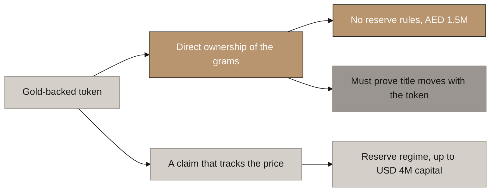

```mermaid
%%{init: {'theme': 'base', 'themeVariables': {
    'primaryColor': '#B8956E',
    'primaryTextColor': '#1A1714',
    'primaryBorderColor': '#1A1714',
    'lineColor': '#1A1714',
    'secondaryColor': '#FAF8F5',
    'tertiaryColor': '#D4CFC8',
    'fontFamily': 'Libre Franklin, sans-serif',
    'edgeLabelBackground': '#D4CFC8',
    'clusterBkg': '#FAF8F5',
    'clusterBorder': '#B8956E'
}}}%%
graph LR
    A["Token transfer instructs"] --> B["Title register update"]
    B --> C["Against allocated bars"]
    C --> D["Under bailment terms"]
    D --> E["Between verified holders only"]

    style A fill:#D4CFC8,stroke:#9A9590,color:#1A1714
    style B fill:#B8956E,stroke:#1A1714,color:#FAF8F5
    style C fill:#B8956E,stroke:#1A1714,color:#FAF8F5
    style D fill:#B8956E,stroke:#1A1714,color:#FAF8F5
    style E fill:#B8956E,stroke:#1A1714,color:#FAF8F5
```

# Aurumix Process Maps: The Ownership Question

> Draft for the client call. One decision: does the investor **own the gold**, or own a **claim on Aurumix**?
>
> Reasoning and all follow-on work: `_draft_entities-licensing-and-payments.md`, sections 2 and 4.

## Diagram Plan

| # | Diagram Name | Type | Direction | Nodes | Placement | Source Section |
|---|---|---|---|---|---|---|
| 1 | The Two Doors, and What Each Costs | Flowchart | LR | 6 | Inline | The fork |
| 2 | How Ownership Is Proved | Flowchart | LR | 5 | Inline | The four layers |

## Consistency Convention

- **Flowchart direction:** LR throughout.
- **Gold node convention:** the recommended path and outcomes that hold.
- **Concrete node convention:** the unresolved blocker.
- **Stone node convention:** starting points and the alternative branch.
- **Text style:** regular, no bold.

---

## 1. The Two Doors, and What Each Costs

<!-- SPEAKER NOTES:
"There is a choice in VARA's rulebook that your document does not make explicitly, and everything else follows from it. VARA's issuance guidance uses gold as its worked example, and it splits gold-backed tokens in two.

The lower branch is a token that tracks the gold price. Aurumix owns the gold, the investor owns a claim on Aurumix, and VARA applies the full Reserve Asset regime: licensed custodians, segregation, no pledging, and minimum capital of one and a half million dirhams or two percent of reserves, whichever is higher. At your Year 10 target that two percent could be around four million dollars, locked and doing nothing.

The upper branch is a token that gives the investor direct ownership of the gold itself. VARA's own words: where the token provides direct ownership, the Reserve Asset requirements do not apply.

Your Individual Gold Receipt is already describing the upper branch. We agree with it, for two reasons: the capital difference is real money, and the lower branch quietly deletes the Gold Receipt, because a claim holder does not own grams, they are a creditor.

Now the honest part, and this is the trade-off. The upper branch does not remove a burden, it swaps it. You have to be able to prove the investor really owns the gold, including when the token moves. Put it as simply as possible: an investor sells their AURX to someone else, the token moves on the chain, does the gold move with it? Normally, moving ownership of a physical object needs a handover, a signed assignment, or a register entry. No UAE law says a blockchain transaction is any of those, and no UAE court has ruled on it.

So: the lower branch costs money you can pay. The upper branch costs an answer you have to go and get. We think the upper branch is worth it, and the next slide is how it gets proved."
-->

---

## 2. How Ownership Is Proved

<!-- SPEAKER NOTES:
"This is solvable, and this is how.

The mistake is expecting the blockchain to do the legal work on its own. It cannot, and no regulator will accept that it does. The token has to be the instruction that sets off a transfer which is already effective under law by another route.

Four layers. The bars are allocated and serial-numbered, so there is a specific thing being owned rather than a share of the vault's general stock. The customer terms establish a bailment: the investor owns the grams and Aurumix only holds them, so they are never Aurumix's asset. A title register outside our own systems records who owns what, and DMCC Tradeflow is the Dubai instrument built for exactly that. And the token is permissioned, so it can only move to another verified holder, which makes the register update and the token transfer the same event.

The opinion then says title passes by the register and the contract, and the token is what instructs it. That is a construction a lawyer can sign.

One thing worth drawing out. We had already recommended a permissioned token because ICS standing, credit eligibility and buyback rights all break the moment a token lands in an anonymous wallet. There is now a second and larger reason: an anonymous token cannot satisfy this test at all, because if anyone can hold it, you cannot say who owns the gold. So choosing direct ownership decides the token standard for you."
-->

---

## The Ask

Answered now, an unfavourable result changes one decision. Answered after launch, it means rebuilding the token, rewriting the whitepaper, returning to VARA, and telling existing investors that what they own is not what they were told they own.

**One question for the client's counsel, phrased so it can be forwarded as written:**

> Can you provide an opinion that, under UAE law, legal title to allocated gold held in a Dubai vault validly transfers to a new holder when the corresponding token transfers on-chain, where the bars are allocated and serial-numbered, the customer terms establish a bailment, the transfer is registered on DMCC Tradeflow, and the token is permissioned so that only verified holders may receive it?

If the answer is yes, Aurumix is a direct-ownership ARVA and the product stands as designed.

If the answer is no, Aurumix is a stable-value ARVA, the Individual Gold Receipt has to be reworded, and the capital requirement changes.
