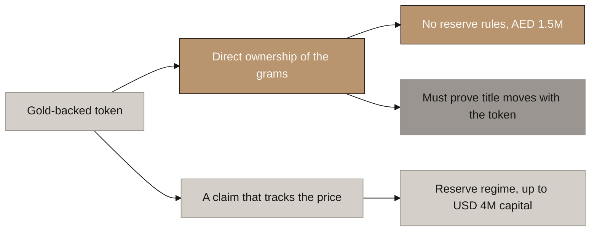
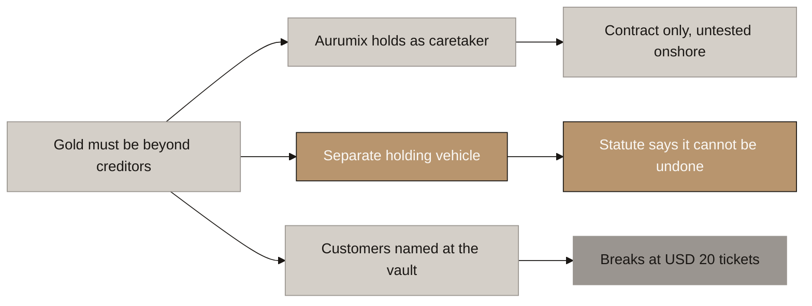
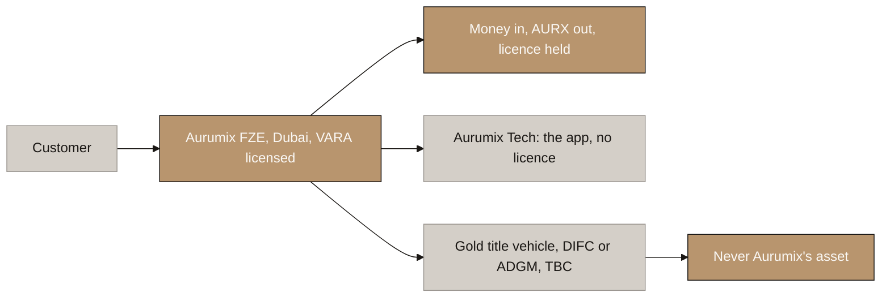

```mermaid
%%{init: {'theme': 'base', 'themeVariables': {
    'primaryColor': '#B8956E',
    'primaryTextColor': '#1A1714',
    'primaryBorderColor': '#1A1714',
    'lineColor': '#1A1714',
    'secondaryColor': '#FAF8F5',
    'tertiaryColor': '#D4CFC8',
    'fontFamily': 'Libre Franklin, sans-serif',
    'edgeLabelBackground': '#D4CFC8',
    'clusterBkg': '#FAF8F5',
    'clusterBorder': '#B8956E'
}}}%%
graph LR
    A["Token transfer instructs"] --> B["Title register update"]
    B --> C["Against allocated bars"]
    C --> D["Under bailment terms"]
    D --> E["Between verified holders only"]

    style A fill:#D4CFC8,stroke:#9A9590,color:#1A1714
    style B fill:#B8956E,stroke:#1A1714,color:#FAF8F5
    style C fill:#B8956E,stroke:#1A1714,color:#FAF8F5
    style D fill:#B8956E,stroke:#1A1714,color:#FAF8F5
    style E fill:#B8956E,stroke:#1A1714,color:#FAF8F5
```

# Aurumix Process Maps: The Ownership Question

> Draft for the client call. Two linked decisions: does the investor **own the gold** or own a **claim on Aurumix**, and once he owns it, **who holds it and in which company**?
>
> Reasoning and all follow-on work: `_draft_entities-licensing-and-payments.md`, sections 2, 3.4 and 4. Plain-English version: `_explainer_ownership-structure-plain-english.md`.
>
> ⚠ **The holding vehicle in diagram 4 is provisional.** Both it and the ownership model are settled by the two legal questions at the end.

## Diagram Plan

| # | Diagram Name | Type | Direction | Nodes | Placement | Source Section |
|---|---|---|---|---|---|---|
| 1 | The Two Doors, and What Each Costs | Flowchart | LR | 6 | Inline | The fork |
| 2 | How Ownership Is Proved | Flowchart | LR | 5 | Inline | The four layers |
| 3 | Three Ways to Put the Gold Beyond Reach | Flowchart | LR | 7 | Inline | The routes |
| 4 | The Entity Map | Flowchart | LR | 6 | Inline | Recommended structure |

## Consistency Convention

- **Flowchart direction:** LR throughout.
- **Gold node convention:** the recommended path and outcomes that hold.
- **Concrete node convention:** ruled out, and the unresolved blocker.
- **Stone node convention:** starting points, the viable alternative, and anything pending counsel.
- **Text style:** regular, no bold.
- **Sequence:** diagrams 1 and 2 answer what the customer owns. Diagrams 3 and 4 answer who holds it.

---

# Part 1: What the customer owns

## 1. The Two Doors, and What Each Costs

<!-- SPEAKER NOTES:
"There is a choice in VARA's rulebook that your document does not make explicitly, and everything else follows from it. VARA's issuance guidance uses gold as its worked example, and it splits gold-backed tokens in two.

The lower branch is a token that tracks the gold price. Aurumix owns the gold, the investor owns a claim on Aurumix, and VARA applies the full Reserve Asset regime: licensed custodians, segregation, no pledging, and minimum capital of one and a half million dirhams or two percent of reserves, whichever is higher. At your Year 10 target that two percent could be around four million dollars, locked and doing nothing.

The upper branch is a token that gives the investor direct ownership of the gold itself. VARA's own words: where the token provides direct ownership, the Reserve Asset requirements do not apply.

Your Individual Gold Receipt is already describing the upper branch. We agree with it, for two reasons: the capital difference is real money, and the lower branch quietly deletes the Gold Receipt, because a claim holder does not own grams, they are a creditor.

Now the honest part, and this is the trade-off. The upper branch does not remove a burden, it swaps it. You have to be able to prove the investor really owns the gold, including when the token moves. Put it as simply as possible: an investor sells their AURX to someone else, the token moves on the chain, does the gold move with it? Normally, moving ownership of a physical object needs a handover, a signed assignment, or a register entry. No UAE law says a blockchain transaction is any of those, and no UAE court has ruled on it.

So: the lower branch costs money you can pay. The upper branch costs an answer you have to go and get. We think the upper branch is worth it, and the next slide is how it gets proved."
-->

---

## 2. How Ownership Is Proved

<!-- SPEAKER NOTES:
"This is solvable, and this is how.

The mistake is expecting the blockchain to do the legal work on its own. It cannot, and no regulator will accept that it does. The token has to be the instruction that sets off a transfer which is already effective under law by another route.

Four layers. The bars are allocated and serial-numbered, so there is a specific thing being owned rather than a share of the vault's general stock. The customer terms establish a bailment: the investor owns the grams and Aurumix only holds them, so they are never Aurumix's asset. A title register outside our own systems records who owns what, and DMCC Tradeflow is the Dubai instrument built for exactly that. And the token is permissioned, so it can only move to another verified holder, which makes the register update and the token transfer the same event.

Be precise about which layer does what, because it is easy to hear this as the register doing all the work. The bailment terms and the allocation are what create the ownership. The register is the independent proof of it, held outside our own systems, and it may also be the mechanism that transfers it, which is one of the things we are asking your lawyer to confirm. DMCC calls a warrant a document of title, but that sits in DMCC's contractual framework rather than in a UAE statute, and no court has tested it. So we lean on it, we do not stand on it alone.

Which is also why the question to your lawyer is not "is a Tradeflow warrant a document of title, yes or no." It asks whether the four together achieve the transfer, which leaves counsel free to tell us which component is actually carrying it. We do not need to know that in advance. We need to know the package works.

And what we mean by transfer is worth spelling out, because the bars never move. They sit in the vault throughout. What moves is who owns them. Before: A owns twelve grams and the register says A. A sends the token to B. After: does B own those twelve grams, and does A no longer own them, as a matter of law rather than just according to our records? If the answer is no, then B holds the token while A still holds the ownership, and the consequence is not abstract. If A later goes bankrupt, A's creditors could claim gold that B paid for and believes he owns. That is the scenario this whole question exists to rule out.

One thing worth drawing out. We had already recommended a permissioned token because ICS standing, credit eligibility and buyback rights all break the moment a token lands in an anonymous wallet. There is now a second and larger reason: an anonymous token cannot satisfy this test at all, because if anyone can hold it, you cannot say who owns the gold. So choosing direct ownership decides the token standard for you."
-->

---

# Part 2: Who holds it

## 3. Three Ways to Put the Gold Beyond Reach

<!-- SPEAKER NOTES:
"By saying the customer owns the gold, you have made a promise you now have to make true in fact, not just in the terms. So: how?

Picture the only moment this is ever tested. Aurumix fails, a liquidator walks in, and asks one question. What does Aurumix own? They look at whose name is on the vault account, on the title register, on the bank account. Anything in Aurumix's name goes into the pot unless somebody can show it is not really Aurumix's.

Three ways to answer that.

The top route: Aurumix holds the gold, but under terms saying it is not ours, we only hold it. Kinesis does exactly this and it costs almost nothing. The weakness is that your customer is arguing with a liquidator. They will probably win, but they have to win, and we could not establish from any UAE statute or case whether fungible gold can be pulled back out of an onshore bankruptcy estate. Not a bad answer, an absent one.

The bottom route is the strongest in theory: never be in the chain of title at all, with every customer named directly at the vault or on the register. It does not survive your ticket size. Each customer would need their own vault account or Tradeflow membership, a one kilogram bar cannot be split across eighty named owners on a register, and the per-account fees would exceed a twenty dollar contribution. It becomes possible for large institutional tickets later. It cannot be the model for the SIP book.

The middle route is what we recommend. A separate passive company holds the title, in DIFC or ADGM, where the statute says in writing that a transfer in cannot be undone by the transferor's bankruptcy. There is no argument to have, because the gold was never Aurumix's.

One thing to be clear about, and it is worth saying twice. This is not because the law forces a second company. It is because we could not get an answer to one question, and there is a jurisdiction a few kilometres away that answers it in writing."
-->

---

## 4. The Entity Map

<!-- SPEAKER NOTES:
"This is what it looks like built, and there is less of it than you might expect.

The customer deals with one company and only one. Aurumix FZE in Dubai, VARA-licensed. It takes the money, it issues AURX, it carries the licence, it holds the customer relationship, it runs the agents. Everything the customer experiences is this box.

The app sits in a separate technology company on an ordinary software licence. No financial licence needed. That is not a legal requirement, it is housekeeping: it keeps software liability and the code away from the licensed balance sheet, and it makes hiring developers simpler.

The gold title sits in a small passive company in DIFC or ADGM. Be clear about what that is and is not. No staff, no customers, no licence, no revenue, no business activity. It holds title to gold for the benefit of AURX holders and does nothing else. And Aurumix has to stay in Dubai rather than moving everything across, because DIFC sits outside VARA's remit, so you cannot hold a VARA licence from inside it.

The result is the last box. The gold is never Aurumix's asset, so there is nothing for a creditor to reach.

Two things to hear honestly. This box is marked TBC because it depends on one legal answer, and if that answer is reassuring we drop it and save you the money. And it does cost: setup, annual fees, a second jurisdiction's filings, and VARA will want to understand the arrangement as part of your application.

Everything else you need is a contract, not a company. The dealer, the vault, the assayer, the lending partner and the card sponsor are five signatures. None of them is a company you build."
-->

---

## The Ask

Answered now, an unfavourable result changes one decision. Answered after launch, it means rebuilding the token, rewriting the whitepaper, returning to VARA, and telling existing investors that what they own is not what they were told they own.

**Two questions for the client's counsel, phrased so they can be forwarded as written.**

**Question 1, which settles Part 1:**

> Can you provide an opinion that, under UAE law, legal title to allocated gold held in a Dubai vault validly transfers to a new holder when the corresponding token transfers on-chain, where the bars are allocated and serial-numbered, the customer terms establish a bailment, the transfer is registered on DMCC Tradeflow, and the token is permissioned so that only verified holders may receive it?

If yes, Aurumix is a direct-ownership ARVA and the product stands as designed. If no, Aurumix is a stable-value ARVA, the Individual Gold Receipt has to be reworded, and the capital requirement changes.

**Question 2, which settles Part 2:**

> Under onshore UAE law, where a company holds physical gold that is allocated to identified customers under bailment terms and registered to them on DMCC Tradeflow, can that gold be reclaimed from the company's bankruptcy estate, given that gold is fungible? If the position is uncertain, does a DIFC or ADGM holding vehicle materially improve it?

If reassuring, route 1: Aurumix holds as caretaker with Tradeflow as the independent record. One company, no second jurisdiction, no extra cost. If uncertain or unfavourable, route 2: the passive holding vehicle in diagram 4, and the cost that comes with it.

Route 3 is ruled out either way at retail ticket sizes, and can be revisited for large institutional purchases later.
