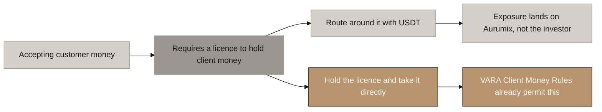
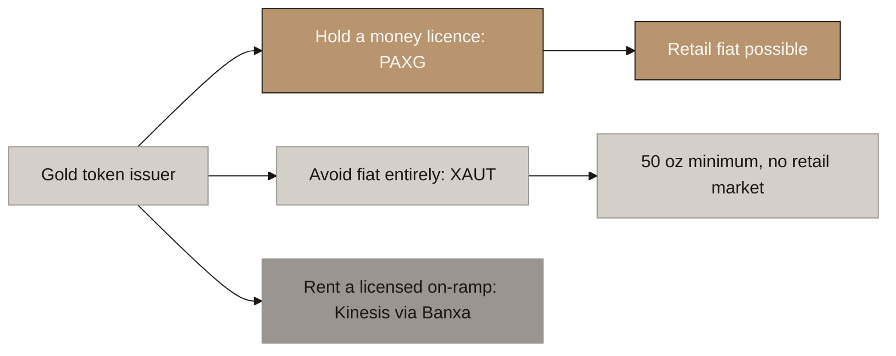
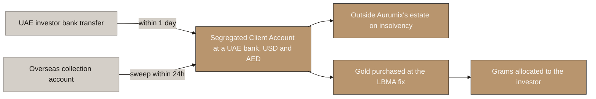
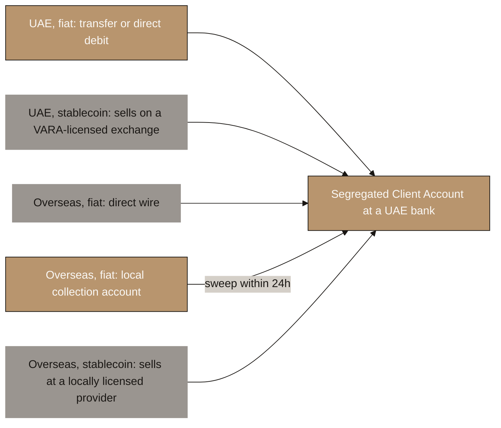
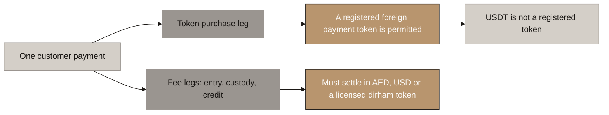
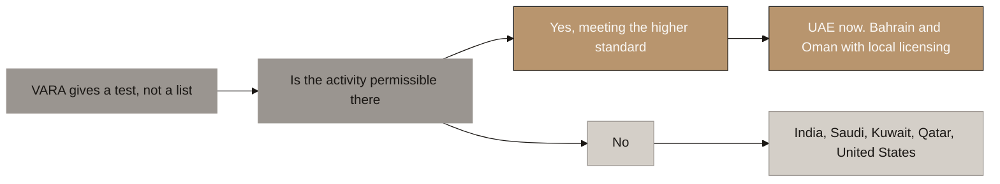
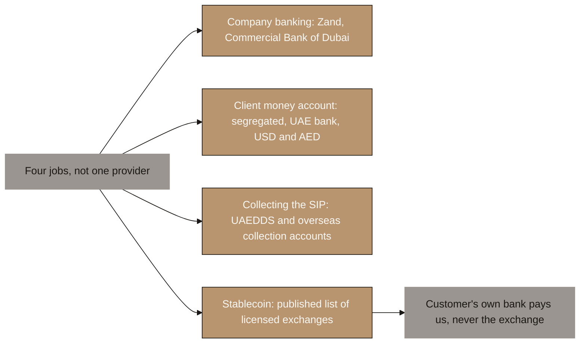

# Aurumix Process Maps: How We Take Money

> Draft for the client call. Answers additions 1, 2 and 3 of 28 July 2026: accept stablecoin as well as fiat, determine which countries we can accept from, and identify the service providers.
>
> Reasoning and sources: `_explainer_how-we-take-money.md` and `_draft_entities-licensing-and-payments.md` section 5.
>
> **The single message: the USDT route was solving a problem Aurumix does not have.** The VARA licence already permits taking bank transfers directly.
>
> Scope note: cards, investor-type mapping and geographic persona diagrams are deliberately out of this set. This file covers the payment flow only.

## Diagram Plan

| # | Diagram Name | Type | Direction | Nodes | Placement | Source Section |
|---|---|---|---|---|---|---|
| 1 | Why the USDT Route Exists | Flowchart | LR | 6 | Inline | Explainer 1 |
| 2 | How the Market Solves It | Flowchart | LR | 6 | Inline | Explainer 2 |
| 3 | How Aurumix Takes Money | Flowchart | LR | 6 | Inline | Explainer 3 |
| 4 | The Four Payment Paths | Flowchart | LR | 6 | Inline | Explainer 3 |
| 5 | The Two Legs of a Payment | Flowchart | LR | 6 | Inline | Explainer 4 |
| 6 | Which Countries We Can Accept From | Flowchart | LR | 6 | Inline | Explainer 5 |
| 7 | Which Service Providers, and for Which Job | Flowchart | LR | 6 | Inline | Explainer 6 |

## Call set

**Three diagrams answer the client's three questions. The rest is backup, to be used only if he pushes on a specific point.**

| Client question | Diagram |
|---|---|
| 1. Accept stablecoin as well as fiat | 5, The Two Legs of a Payment |
| 2. Which countries can we accept from | 6, Which Countries We Can Accept From |
| 3. Which service providers | 7, Which Service Providers, and for Which Job |

Diagram 4 is the operational detail behind all three and is the one to leave with him.

## Consistency Convention

- **Flowchart direction:** LR throughout.
- **Gold node convention:** the recommended path and outcomes that hold.
- **Concrete node convention:** the problem, and routes that are ruled out.
- **Stone node convention:** starting points, tests, and anything pending confirmation.
- **Text style:** regular, no bold.

---

# Part 1: How we take money

## 1. Why the USDT Route Exists

<!-- SPEAKER NOTES:
"Before we talk about what to change, I want to say what your document got right, because it diagnosed a real problem.

Section 11.2 routes Indian residents through USDT bought peer to peer or over the counter. Nobody writes that for a customer who could simply send a bank transfer. That row exists because someone already worked out that the banking channel was closed. So the instinct was correct.

Here is the rule underneath it. You can only accept customer money if your company is licensed to hold customer money. That is not a crypto rule, it is ordinary financial regulation, and it is the single thing that shapes how every gold token in the market takes payment.

Taking stablecoin looks like it avoids that requirement. That is the appeal, and it is why the row is there.

The problem is where the exposure lands. Your document's stated mitigation is that the investor bears the Indian tax disclosure obligation. That addresses the investor. It does not address Aurumix, and Aurumix is the party receiving the funds and holding the VARA licence.

And the good news, which is the rest of this section: you do not need the workaround. The licence you are already applying for permits you to take the money directly."
-->

---

## 2. How the Market Solves It

<!-- SPEAKER NOTES:
"We checked how the five closest comparables actually take money, because this is a solved problem and there was no reason to invent an answer.

There are exactly three models.

The first is Pax Gold. Paxos holds a New York trust charter, which permits it to hold customer dollars, so it simply accepts wire transfers. It is a licensed financial institution first and a token issuer second.

The second is Tether Gold. Their gold entity has no banking, money transmitter or e-money licence anywhere that we could find. So they never touch retail fiat. That is why their direct minimum is fifty ounces, roughly one hundred and seventy thousand dollars, and wholesale only. Everyone else buys on an exchange. They did not choose a wholesale model for strategic reasons. They have no licence to do anything else.

The third is Kinesis. No money licence either, so they rent one: Banxa takes the card or bank payment, holds the licences, converts, and Kinesis receives crypto.

Comtech in Dubai is a fourth pattern and I would not copy it. They collect dirhams in-app while appearing nowhere on VARA's register.

Two findings I want you to take from this. First, not one of them built their own payment rail. The two that serve retail properly both rented it. Second, and this is the one that matters for your question about stablecoins: the protocols that do accept USDT for issuance are the ones with no licence. The ones with a licence take bank transfers."
-->

---

## 3. How Aurumix Takes Money

<!-- SPEAKER NOTES:
"This is the recommendation, and it is simpler than what is in the document today.

VARA's Client Money Rules, Part Four, say a licensed provider may receive and hold customer fiat. There are four conditions and they are all reasonable.

One: the money is Client Money. It is not yours. If Aurumix ever became insolvent, that money is not part of the estate. That is a protection for your investor and it is worth saying out loud in your marketing.

Two: it goes into a designated Client Account within one calendar day of receipt.

Three: money from UAE clients sits with a third-party bank in the UAE.

Four: money from clients outside the UAE can land in a collection account abroad, which is how you serve an NRI in London or Singapore cheaply, but it has to be moved to a UAE bank within twenty-four hours.

One clarification worth making, because it is easy to assume otherwise: the rule is about where the account sits and that it is segregated. It says nothing about currency. Your product is priced in dollars and gold settles against a dollar fix, so run dollars as the primary client account with dirhams alongside. Forcing everything into dirhams would add an FX leg you do not need.

No stablecoin required. No peer to peer. No workaround. And no second licence: you do not need a Central Bank payment licence to collect payment for your own token. You would need one to issue a dirham stablecoin or to process payments for other businesses, and we are not proposing either."
-->

---

## 4. The Four Payment Paths

<!-- SPEAKER NOTES:
"This is the operational answer, and it is the page I would leave with you. Every customer you will ever have falls into one of four paths, and all four end in the same place.

Path one. A UAE resident paying in cash. Bank transfer, or better, UAE Direct Debit so the monthly contribution collects itself. Dirhams or dollars into the client account. This is the easy path and it should be the default for everybody who can use it.

Path two. A UAE resident who holds USDT and wants to use it. He sells it himself, on a VARA-licensed exchange. There are fourteen of them holding Exchange Services licences, including Binance, OKX, Crypto.com, Gate and HashKey, plus BitOasis and CoinMENA as the established regional names. He withdraws the dirhams to his own bank account and then transfers to us. We publish the list. We do not integrate, we take no fee, and we never see a token.

Path three. An investor outside the UAE paying in cash. Two options. He wires directly to our UAE account, which is simple but expensive for him. Or he pays into a local collection account we hold in his country, which is cheap for him, and we sweep it to the UAE within twenty-four hours as the rules require.

Path four. An investor outside the UAE holding stablecoin. Same as path two, except he uses a provider licensed in his own country, not a Dubai one. A Singapore NRI uses a Singapore-licensed exchange. He is acting on his own account, in his own jurisdiction, so his rules apply, not ours.

Two rules make all four work, and I would ask your developers to treat them as absolute. We only ever receive bank money, into a segregated client account at a UAE bank. And conversion always happens on the customer's own account, with a provider licensed where the customer is, before he pays us.

The line that decides everything is whose bank account sends us the money. If it is the customer's, we are clean. If it is an exchange's, we have arranged a payment service and we need a further Central Bank registration."
-->

---

# Part 2: What we can accept, and from where

## 5. The Two Legs of a Payment

<!-- SPEAKER NOTES:
"You asked whether we can accept stablecoin as well as fiat. The answer is yes, in a restricted form, and not the coin the document names.

The Central Bank's Payment Token Services Regulation has been in full force since June last year, and it splits a customer payment into two legs that are treated differently.

The token purchase leg. A foreign stablecoin may be used to buy virtual assets. AURX is a virtual asset, so buying AURX with a foreign stablecoin sits inside that permission. That is the good half.

The fee legs. Your entry fee, custody fee and credit fees are payments for a service, not for a virtual asset. They fall outside the permission and must settle in dirhams, dollars, or a licensed dirham stablecoin.

Now the part that changes your plan. A foreign stablecoin only qualifies if its issuer is registered with the Central Bank. As at the end of January this year, the first registered foreign payment token was USDU, from Universal Digital in ADGM. We found no evidence that Tether or Circle have registered, and no evidence they have been refused either. Silence, not rejection.

So accepting USDT directly is not on the table today. And to be clear about a route we tested and ruled out: you cannot fix this by having a payment processor convert it for you, because the token's own status still governs and using a licensed processor does not cure it.

What does work is the customer converting on his own account before he pays you, which is path two on the previous page.

My recommendation is to design for fiat first and treat stablecoin as a supplementary rail, because fiat is already covered by the licence and it is cheaper. In the UAE, stablecoin is the harder path, not the easier one.

One item I want to flag as unfinished: I want that registration list confirmed directly with the Central Bank before you build anything on it."
-->

---

## 6. Which Countries We Can Accept From

<!-- SPEAKER NOTES:
"You asked which countries we can accept investment from. The honest answer is that VARA does not hand you a list. It hands you a test.

The wording is that a licensee may serve global customers where the activity is permissible, and that where you operate outside Dubai you must meet the higher of the two regulatory standards. So every country is a separate decision with its own cost, and the perimeter is something we build rather than something we are given.

Applying the test: the UAE is open now. Bahrain and Oman are open but you would need local authorisation. The United Kingdom, Singapore, Canada and Australia are all reachable but each needs its own licence, so none of them is a launch market. The United States we exclude, because it means federal registration plus a licence in every state, plus live securities risk.

Now two things you will not like, and I would rather you heard them from me.

India is closed. Not by marketing, by law, and on more than one ground.

And this one is newer. Saudi Arabia, Kuwait and Qatar are all difficult, because their central banks restrict financial institutions from processing virtual asset transactions. That is a banking problem, not a marketing problem, so no amount of agent network fixes it.

One point that follows, and it matters for how we size the market: when we say the NRI market, the figure usually quoted is around nine million Indians in the Gulf. Once you remove Saudi, Kuwait and Qatar, the cleanly addressable base at launch is closer to three and a half to four million, concentrated in the UAE. Your Year 10 target needs two to three percent of UAE-resident Indians, so it survives comfortably. But I would rather correct the number now than let you build a plan on it."
-->

---

## 7. Which Service Providers, and for Which Job

<!-- SPEAKER NOTES:
"Your third question was which service providers we can use. The answer is that this is not one supplier, it is four different jobs, and treating them as one is why the question has felt unanswerable. I am leaving cards aside here because you asked about the payment flow.

Job one, banking for the company. Two banks in Dubai are documented as serving licensed virtual asset businesses: Zand Bank, which also holds a VARA custody licence granted in December 2024, and Commercial Bank of Dubai, which built dedicated virtual asset banking and publicly onboarded Nomura's licensed arm. One warning on sequencing: approach a bank before you hold the licence and you create a refusal record that other banks can see. So this conversation happens after the licence, not before.

Job two, the client money account itself. A segregated account at a third-party UAE bank, in dollars primarily with dirhams alongside. This is where every path ends and it is the only place customer money ever sits.

Job three, collecting the monthly contribution. Domestically that is UAE Direct Debit. For investors abroad it is local collection accounts through a provider like Airwallex, Wise Business or Currencycloud, with the twenty-four hour sweep to the UAE built in.

Job four, stablecoin. The lightest thing possible: publish a list of licensed exchanges. For UAE customers that means the VARA register, which currently shows fourteen entities with Exchange Services licences. For customers elsewhere it means a provider licensed where they live. No integration, no referral fee, no data passed. If instead the exchange pays us directly, we have arranged a payment service and we need a further Central Bank registration.

One honest gap, and I will not paper over it: no payment provider in this market publishes a policy on serving gold or virtual asset merchants. It sits in private onboarding criteria. We cannot close that by research, and it sits alongside the bullion dealer as a conversation you need to have."
-->

---

# The exchange list, for the signpost

**VARA-licensed and usable by a UAE customer converting stablecoin to fiat.** Pulled from VARA's public register, which currently shows 52 licensed VASPs.

| Entity | Licensed activities | Since |
|---|---|---|
| Binance FZE | Exchange incl. derivatives, Broker-Dealer, Lending, Management | 2024/04/15 |
| OKX Middle East Fintech FZE | Exchange incl. derivatives, Broker-Dealer, Lending, Management | 2024/09/17 |
| Foris DAX Middle East FZE, trading as Crypto.com | Exchange incl. derivatives, Broker-Dealer, Lending, Management | 2024/04/03 |
| Gate Technology FZE | Exchange Services | 2025/04/25 |
| HashKey MENA FZE | Exchange, Broker-Dealer | 2025/04/14 |
| BitOasis Technologies FZE | Broker-Dealer | 2024/11/29 |
| CoinMENA FZE | Broker-Dealer | 2023/11/30 |

⚠ BitOasis and CoinMENA hold Broker-Dealer rather than Exchange permissions. Confirm which category covers a customer sell-side conversion before publishing the list.

# What we need from the client

1. **Agreement to delete section 11.2's USDT peer-to-peer route** and replace the funding column with bank transfer into a segregated client account.
2. **Agreement that fiat is the default rail and stablecoin is supplementary**, on the understanding that USDT specifically is not currently available and the customer converts on their own account.
3. **A decision on the country perimeter at launch**, which we recommend is the UAE first, with Bahrain and Oman as the first additions.

# What we still owe

- [ ] Confirm the registered foreign payment token list directly with CBUAE.
- [ ] **For counsel.** Confirm that a published list of exchanges, with no commercial arrangement, is not "arranging" a payment token service. **This is the only load-bearing assumption in the design.**
- [ ] **For counsel.** VARA requires overseas client money to sit in *"Client Accounts with Third-Party **Banks** outside of the UAE."* Most local-collection providers (Airwallex, Wise Business, Currencycloud, Payoneer, OpenPayd) are **e-money institutions, not banks**, and their virtual accounts typically sit at a partner bank **in the provider's name, not Aurumix's**. Does that satisfy the rule? **This decides which providers are usable and therefore whether a small recurring cross-border contribution is economically viable at all.**
- [ ] Establish whether any VARA-licensed exchange also holds a CBUAE Non-Objection Registration for payment token services.
- [ ] Re-verify the Saudi Arabia and Kuwait positions against SAMA and CBK primary sources.
- [ ] Establish whether a UAE payment provider will underwrite a gold-token merchant taking small recurring collections.
