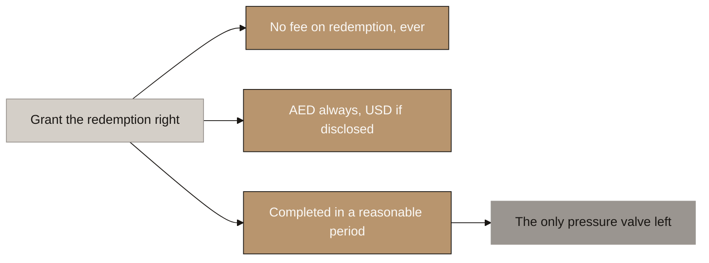
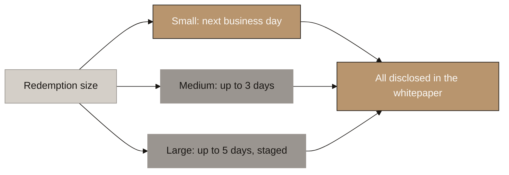
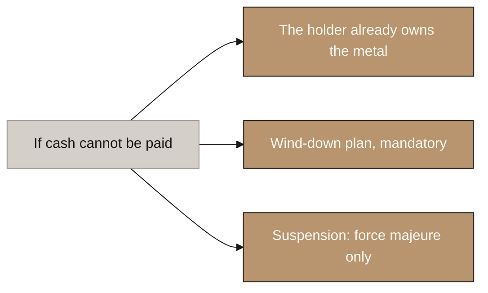

# Aurumix Process Maps: The Redemption Cycle

> Draft for the client call and for the build. How gold becomes cash again, and why VARA's prohibition on exit fees turns out to be survivable.
>
> Reasoning: `_draft_purchase-structure.md` sections 5.1 to 5.5. Rule text verified at `rulebooks.vara.ae/rulebook/e-redemptions`. Companion set: `Aurumix_Process_Maps_Minting.md`.
>
> ⚠ **Drawn assuming route 2 and a permissioned token**, as with the minting set. The five open switches in that file apply here too and change the same single step.
>
> 🔴 **The headline for the call: VARA Rule III.E.4 prohibits charging any fee on redemption.** The decaying spot redemption fee is dead.
>
> ⚠ **The replacement mechanism is deliberately not in this set.** The tenure rebate proposed in `_draft_purchase-structure.md` §5.2 is parked for now. This file covers the exit mechanism only.

## Diagram Plan

| # | Diagram Name | Type | Direction | Nodes | Placement | Source Section |
|---|---|---|---|---|---|---|
| 1 | The Exit Path | Flowchart | LR | 5 | Inline | Purchase draft 5.3 |
| 2 | The Exit Checks | Flowchart | LR | 6 | Inline | Purchase draft 5.3 |
| 3 | Worked Example: What 0.6518 AURX Returns | Flowchart | LR | 6 | Inline | Purchase draft 5.3 |
| 4 | What VARA Forbids on the Way Out | Flowchart | LR | 5 | Inline | Purchase draft 5.1 |
| 5 | Why a Zero-Fee Exit Is Affordable | Flowchart | LR | 5 | Inline | Purchase draft 5.4 |
| 6 | When the Float Is Not Enough | Flowchart | LR | 5 | Inline | Purchase draft 5.5 |
| 7 | Three Protections, None of Them a Fee | Flowchart | LR | 4 | Inline | Purchase draft 5.5 |

## Consistency Convention

- **Flowchart direction:** LR throughout.
- **Gold node convention:** the step as designed, and outcomes that hold.
- **Stone node convention:** pending counsel, pending the dealer, or the stress case.
- **Concrete node convention:** starting points, inputs, and anything prohibited.
- **Text style:** regular, no bold.
- **Sequence:** diagram 1 is the mechanism. Diagrams 2 to 4 are the rule and what it forced. Diagrams 5 and 6 are the stress case.

---

## 1. The Exit Path

<!-- SPEAKER NOTES:
"This is the mint run backwards, and it is deliberately the same shape so there is only one thing to learn.

The customer requests an exit, in grams or in a cash amount, and it can be partial. We re-screen sanctions, we confirm the payout account is the same name matched account they funded from, and we check there is no unreleased credit pledge sitting over those grams.

The price is struck at the next fix after the request. Same rule as the entry, and the reason is the same: if they could exit at the last published fix, they would only ever ask after the market had fallen since it, and we would be handing them a free option.

Then the tokens are burned. Then the grams move out of their sub account and back into the float. Then cash goes to their own bank account, target next day, and there is no fee on any of it.

Note what does not appear anywhere in this diagram: a fee. Not a redemption fee, not an admin fee, not a spread we keep. VARA forbids all of it."
-->

---

## 2. The Exit Checks

<!-- SPEAKER NOTES:
"We spent a whole slide on the checks at the front door. This is the back door, and for anti money laundering purposes it matters more, because money leaving is where laundering completes. Buying gold and selling it shortly afterwards is the oldest cleaning pattern there is, and a product that lets somebody do it from a phone will be looked at closely.

Five checks, and they run before the price is struck rather than after, so nobody can lock in a price and then fail a check.

Sanctions, PEP and residence are re-screened. Not the screening we did at onboarding, a fresh one. People get listed after you onboard them, and people move.

Onboarding status is confirmed, and this one is a rule rather than good practice. VARA's redemption rule says requests must be processed provided the owner or holder, or their designee, has successfully onboarded. That wording is doing real work for us: it is what lets us identify people at entry and at exit rather than watching them continuously. But it only works if we actually check it at the exit.

The payout account is name matched. The same test as the front door, run backwards. Money must return to the same person and the same account it came from. This is the single strongest control we have, and it is why the front door name match is worth the friction.

No unreleased credit pledge sits over the grams, because pledged gold cannot be sold out from under a lender.

And a pattern flag for rapid in and out. Large in, short hold, straight out is the shape we should always look at by hand.

One thing to be clear about: none of this is a reason to delay. Checks run in minutes and the target is still next day settlement. A check is not a liquidity valve and must never be used as one."
-->

```mermaid
%%{init: {'theme': 'base', 'themeVariables': {
    'primaryColor': '#B8956E',
    'primaryTextColor': '#1A1714',
    'primaryBorderColor': '#1A1714',
    'lineColor': '#1A1714',
    'secondaryColor': '#FAF8F5',
    'tertiaryColor': '#D4CFC8',
    'fontFamily': 'Libre Franklin, sans-serif',
    'edgeLabelBackground': '#D4CFC8',
    'clusterBkg': '#FAF8F5',
    'clusterBorder': '#B8956E'
}}}%%
graph LR
    A["Redemption requested"] --> B["Sanctions, PEP and residence re-screened"]
    B --> C["Onboarding confirmed, Rule III.E.3"]
    C --> D["Payout account name-matched"]
    D --> E["No pledge, rapid in-out flagged"]
    E --> F["Only then is the price struck"]

    style A fill:#D4CFC8,stroke:#9A9590,color:#1A1714
    style B fill:#B8956E,stroke:#1A1714,color:#FAF8F5
    style C fill:#B8956E,stroke:#1A1714,color:#FAF8F5
    style D fill:#B8956E,stroke:#1A1714,color:#FAF8F5
    style E fill:#B8956E,stroke:#1A1714,color:#FAF8F5
    style F fill:#B8956E,stroke:#1A1714,color:#FAF8F5
```

> ⚠ **Checks run before the price is struck, never after.** Otherwise a customer can lock a price and then fail a check, and unwinding that means either honouring a stale price or explaining why you did not.

> ⚠ **A check is not a liquidity valve.** Screening runs in minutes and the settlement target stays T+1. The moment checks are used to slow payouts under stress, they stop being controls and become a gate on the customer's own property. Rule III.E.3's "reasonable period" is the valve, and it is disclosed in advance.

---

## 3. Worked Example: What 0.6518 AURX Returns

<!-- SPEAKER NOTES:
"Same customer as the minting example, so you can follow one seventy five dollar contribution all the way through.

They hold nought point six five one eight AURX, which is nought point six five one eight grams. Say they exit twelve months later and gold has moved from thirty four hundred an ounce to thirty six hundred. That is one hundred and fifteen dollars seventy five per gram.

Nought point six five one eight grams times one fifteen seventy five is seventy five dollars forty four. No fee is deducted, because none may be. Seventy five forty four goes to their bank.

Now the honest part, and it is the reason the entry fee conversation matters so much. They put in seventy five and they got back seventy five forty four, on a gold move of nearly six percent. The gap is the entry fee. Gold has to rise about five point three percent before this customer is back to even.

Do not hide that. It is the strongest argument in the room for two things we have already recommended. It is why the ICS entry fee discount is the most valuable thing a loyal saver earns, because it lowers that break even directly. And it is why the fee has to fall as bar denomination improves, from five percent at year one to about three percent at year ten. That is a real scale economy and it is worth selling.

It is also the honest answer to anyone who calls this a savings product with no yield. The return is the gold price. What Aurumix controls is how much of it the customer keeps."
-->

```mermaid
%%{init: {'theme': 'base', 'themeVariables': {
    'primaryColor': '#B8956E',
    'primaryTextColor': '#1A1714',
    'primaryBorderColor': '#1A1714',
    'lineColor': '#1A1714',
    'secondaryColor': '#FAF8F5',
    'tertiaryColor': '#D4CFC8',
    'fontFamily': 'Libre Franklin, sans-serif',
    'edgeLabelBackground': '#D4CFC8',
    'clusterBkg': '#FAF8F5',
    'clusterBorder': '#B8956E'
}}}%%
graph LR
    A["Holds 0.6518 AURX"] --> B["Exit requested"]
    B --> C["Next fix USD 3,600/oz = USD 115.75/g"]
    C --> D["0.6518 g x 115.75 = USD 75.44"]
    D --> E["No fee deducted"]
    E --> F["USD 75.44 to their own bank"]

    style A fill:#D4CFC8,stroke:#9A9590,color:#1A1714
    style B fill:#B8956E,stroke:#1A1714,color:#FAF8F5
    style C fill:#B8956E,stroke:#1A1714,color:#FAF8F5
    style D fill:#B8956E,stroke:#1A1714,color:#FAF8F5
    style E fill:#B8956E,stroke:#1A1714,color:#FAF8F5
    style F fill:#B8956E,stroke:#1A1714,color:#FAF8F5
```

**The round trip, one contribution, end to end.**

| | |
|---|---|
| Paid in | USD 75.00 |
| Grams bought at USD 3,400/oz | 0.6518 g |
| Gold price at exit | USD 3,600/oz, up 5.9% |
| Value of the grams | USD 75.44 |
| Exit fee | **USD 0.00** |
| **Received** | **USD 75.44** |

> ⚠ **The break-even point, and do not hide it.** Gold must rise about **5.3%** before this customer is back to even, and that gap is the entry fee. It is why the ICS fee discount is the most valuable thing a loyal saver earns, and why the fee falling from 5% at Y1 to about 3% at Y10 is a real scale economy worth selling.

⚠ Gold prices illustrative. The grams never change; only what they are worth does.

---

## 4. What VARA Forbids on the Way Out

<!-- SPEAKER NOTES:
"This is the finding that changed a mechanism, and I want to give you the rule text rather than a summary of it, because it is short and it is absolute.

Rule three E four, Annex two of the Virtual Asset Issuance Rulebook: VASPs licensed to issue asset referenced virtual assets shall process and complete redemption requests without charging any fees. That is the whole sentence. No fees. Not reduced fees, not fees below a threshold.

That prohibits the decaying spot redemption fee in your model outright.

Two other things in the same rule. Redemption must be available in dirhams always, and in other currencies only if you disclose them in the whitepaper. Your product is dollar priced and gold settles on a dollar fix, so disclose both. And requests must be completed within a reasonable period, which is now the only pressure valve you have, because the price valve is gone.

There is an escape and I want to name it so you know we considered it. All of rule three E is conditional on the opening words, to the extent an ARVA provides a right of redemption. So you could simply not grant one, and none of this applies.

We recommend against it, for three reasons. Your own section three point two already promises a buyback floor, and a published formulaic commitment to buy back at a defined price will be read as a redemption right whatever you label it, because regulators read substance. Second, no redemption right means no price floor, and that is exactly the Midas XGZ case in our research: restrict the exit and the token trades at a discount, not a premium. Third, it is worse for your customer, and the entire direct ownership argument is that their position is genuinely strong.

So: grant it deliberately, accept no fee on the way out, and recover everything at the door."
-->

---

## 5. Why a Zero-Fee Exit Is Affordable

<!-- SPEAKER NOTES:
"The obvious objection to a zero fee exit is that you still pay the dealer's spread every time somebody leaves, and you cannot charge for it. That objection assumes an exit sells gold. It does not.

When a customer exits, their grams go back into the float. They do not go to a dealer. The next person who buys takes those same grams. The metal never leaves the vault and no spread is paid.

So the cost of the redemption promise is the dealer spread on net outflow, not on gross exits. In a growing book, net outflow is zero. If eight percent of assets flow in and three percent flows out, the float absorbs all of it and you sell nothing. Even in a flat book, in and out cancel and you sell nothing.

You only touch the physical market when the float breaches a band, in either direction. Too much gold in the float and you sell some. Too little and you buy.

Make this argument to the client in exactly this form, because it does something useful. It takes a regulatory constraint that looks expensive and turns it into an argument for the float he is already being asked to fund. The float was already doing three jobs. This is the fourth, and it is the one that makes rule three E four survivable.

One caveat I have to give you honestly. This works cleanly if Aurumix owns the float. If the dealer carries it, an exit means the dealer has to take grams back, on demand, at a fair price. That is a separate commitment from carrying inventory and they may decline it or price it. So the dealer conversation now has two questions in it, not one."
-->

```mermaid
%%{init: {'theme': 'base', 'themeVariables': {
    'primaryColor': '#B8956E',
    'primaryTextColor': '#1A1714',
    'primaryBorderColor': '#1A1714',
    'lineColor': '#1A1714',
    'secondaryColor': '#FAF8F5',
    'tertiaryColor': '#D4CFC8',
    'fontFamily': 'Libre Franklin, sans-serif',
    'edgeLabelBackground': '#D4CFC8',
    'clusterBkg': '#FAF8F5',
    'clusterBorder': '#B8956E'
}}}%%
graph LR
    A["Customer exits"] --> B["Grams return to the float"]
    B --> C["The next buyer consumes them"]
    C --> D["No physical gold sold"]
    D --> E["Spread paid on net outflow only"]

    style A fill:#D4CFC8,stroke:#9A9590,color:#1A1714
    style B fill:#B8956E,stroke:#1A1714,color:#FAF8F5
    style C fill:#B8956E,stroke:#1A1714,color:#FAF8F5
    style D fill:#B8956E,stroke:#1A1714,color:#FAF8F5
    style E fill:#B8956E,stroke:#1A1714,color:#FAF8F5
```

**The same point as a table.**

| Book state | Inflow | Gross exits | Net | Physical gold sold |
|---|---|---|---|---|
| Growing | 8% | 3% | +5% | **None.** Float absorbs |
| Flat | 4% | 4% | 0% | **None.** Float absorbs |
| Shrinking | 2% | 6% | −4% | Yes, on the 4% net only |
| Run | 1% | 25% | −24% | Yes, in size, at bid |

---

## 6. When the Float Is Not Enough

<!-- SPEAKER NOTES:
"Row four of the previous table is real and it needs a disclosed mechanism, because rule three E three's reasonable period is now the only valve you have.

The answer is a settlement window that scales with size, published in the whitepaper. Small redemptions next business day, absorbed by the float. Medium up to three days, which may need a dealer sale. Large up to five days, physical sale, possibly staged.

All three have to be disclosed. A tiered window that a customer could read before they invested is defensible as reasonable. An undisclosed delay applied when you are under pressure is not, and it will be read as a gate on the customer's own property.

The thresholds are deliberately not set in the draft, because they depend on the float size, and the float size depends on the dealer we have not found yet. That is not evasion, it is the honest dependency.

What you must not do is reintroduce a fee here. The temptation under stress is to price the exit. Rule three E four removes that option entirely, so time is the only lever."
-->

⚠ **Thresholds deliberately unset.** They depend on float size, which depends on the dealer.

---

## 7. Three Protections, None of Them a Fee

<!-- SPEAKER NOTES:
"If Aurumix genuinely cannot pay cash on a given day, three things protect the customer and none of them costs them anything.

First, and this is the strongest single argument for the separate holding vehicle: the customer already owns the metal. Their claim is not on Aurumix's balance sheet. It is on gold they own, held by a vehicle outside Aurumix's estate. Rule three E two contemplates a fallback against reserve assets, and under direct ownership the customer's position is materially better than the rule assumes.

Second, the wind-down plan, which VARA makes mandatory under the Company Rulebook. Rule one point k requires that selling client assets is explicitly excluded from, and not necessary for, completing it. Direct ownership is what makes that rule satisfiable rather than aspirational, because you are returning gold rather than liquidating it.

Third, a disclosed suspension right, and it has to be drawn narrowly. Market closure, custodian failure, force majeure. Never liquidity management. The moment suspension can be triggered because you are short of cash, it stops being a protection and becomes a discretionary gate on the customer's own property, and that is the thing that kills trust in this category."
-->

---

## Open items this set surfaces

- [ ] 🔴 **The spot "time lever" is now empty.** `_draft_sip-spot-and-ics.md` differentiates SIP from spot on three levers: price, credit and time. The time lever was a decaying redemption fee, which III.E.4 prohibits. With the tenure rebate parked, **spot and SIP currently differ on two levers, not three.** Either accept two, or design a replacement. This needs a decision before the SIP/spot draft is finalised.
- [ ] **If the tenure rebate is revived**, note the sequencing point: crediting a rebate in grams must happen **before** the burn, or you are crediting a holder whose tokens no longer exist. `_draft_purchase-structure.md` §5.3 currently lists it as step 7, after the burn at step 4, while its own description says "before the burn". The table is wrong either way and should be corrected when the mechanism is settled.
- [ ] 🆕 **Three exit checks are owed to `_draft_purchase-structure.md` §5.3**, which currently lists only sanctions re-screen, name-match and pledge. Add: **onboarding status confirmed per Rule III.E.3** (this is a rule requirement, and it is what makes identify-at-entry-and-exit sufficient); **residence re-checked**, since a customer may have moved into a jurisdiction that changes how they can be paid; and a **rapid in-and-out pattern flag**, which is the money-laundering shape a gold product is most exposed to.
- [ ] **Confirm the checks run before the price is struck**, not after. Otherwise a customer can lock a price and then fail a check.
- [ ] **Settlement-window thresholds unset**, pending float size, pending the dealer.
- [ ] **[COUNSEL] Does "equal value" in III.E.1 mean full prevailing value, or realisable value net of the dealer's bid?** It decides who absorbs the two-way spread on every exit. Design assumes the safe reading.
- [ ] 🔴 **The zero-fee-exit argument assumes Aurumix owns the float.** Under a dealer-carried float, an exit requires the dealer to **take grams back on demand**, which is a second commitment. **The dealer batch must ask this explicitly**, not only whether they will carry inventory.
- [ ] **Custody recovery has no clean route left.** III.E.4 killed the exit half of decision 5. Four options, all flawed, in `_draft_purchase-structure.md` §7. The unasked question underneath: **is 0.8 to 1% a cost or a revenue line?** Get the vault quote.
- [ ] **FIFO lot accounting is no longer required** while the rebate is parked, since the rebate was the only thing FIFO decided. Grams are fungible for settlement. Reinstate only if the rebate returns.
- [ ] Confirm AED and USD are both disclosed in the whitepaper, per III.E.1.
