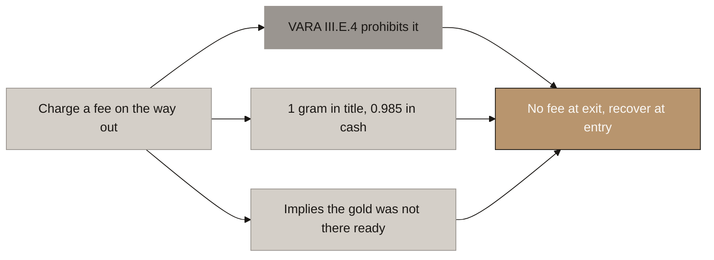

# Aurumix Process Map: Why We Cannot Charge a Redemption Fee

> **DECIDED, 2026-08-06. Aurumix cannot charge any fee on redemption, and will not look for a route around it.** VARA Rule III.E.4, Annex 2, verified verbatim at `rulebooks.vara.ae/rulebook/e-redemptions`: *"VASPs Licensed to issue ARVAs shall process and complete redemption requests without charging any fees."*
>
> Reasoning and the full exit lifecycle: `_draft_purchase-structure.md` §5. Recorded as decision 32 in `handoff.md`.

## Three independent reasons, one answer

The rule is only the first of them. **The other two would stand even if VARA permitted a fee**, which is what makes this a design decision rather than a compliance concession.

1. **The rule prohibits it.** All of III.E is conditional on the opening words *"to the extent an ARVA provides a right of redemption"*, so the ban binds only because Aurumix chooses to promise an exit. That escape is available and is declined: the client's own §3.2 already promises a Buyback Floor, and removing the exit removes the price floor rather than creating a premium.
2. **A fee breaks the peg.** An exit fee is the exact width of the discount band. Today it breaks the promise in realised value, since one AURX would be one gram in title but 0.985 grams in cash. The day any trading venue exists it breaks it visibly in price. PAXG trades at or extremely near NAV because its exit is credible. Midas XGZ restricts its exit and trades at a discount.
3. **A load-bearing exit fee means the product is not a fully backed redeemable claim.** Under direct ownership the customer already owns the grams, so charging them to receive their own property is incoherent. Redemption is a handover, not a service. If the economics need the fee, the gold was not sitting there ready.

⚠ Reason 3 is policy logic, not a published VARA position. **VARA gives no rationale for III.E.4.** Never present it as a quotation.

---

## Why We Cannot Charge a Redemption Fee

<!-- SPEAKER NOTES:
"One rule changes a mechanism that is already in your document, and we want to put it in front of you rather than let you find it later.

VARA Annex 2, Rule III.E.4. The words are: VASPs licensed to issue asset-referenced tokens shall process and complete redemption requests without charging any fees. That is pulled from the rulebook itself, not from a summary of it. There are no exceptions written into it.

There is one door out, and you should know it exists because it is the first thing a lawyer will offer you. The whole section opens with the phrase 'to the extent an ARVA provides a right of redemption', so the rule binds you only because you are choosing to promise people they can cash out. Promise nothing and none of it applies. We are not recommending that, and the reason is the rest of this slide.

Because even if VARA allowed the fee, we would still tell you not to charge it. Two reasons, and they are independent of each other and of the rulebook.

The first is your own promise. One AURX is one gram. Charge one and a half percent to leave and one AURX is one gram of gold but only 0.985 grams of cash. It holds in title and breaks in value, and the customer experiences the second one. There is a longer-term version of the same problem: an exit fee is the exact amount by which your token can sit below the value of its own gold before it is worth anyone's while to correct it. Right now you have no trading venue, so nobody sees it. The day you have one, everybody does. Pax Gold trades at the value of its gold because its exit is credible. Midas restricts its exit and trades at a discount. Restricting the way out does not create a premium, it removes the floor.

The second is what the fee would say about the product. You are telling customers they own the gold outright, not a claim on you. If that is true, then giving it back is a handover, not a service, and there is nothing to charge for. A business that needs an exit fee to work is telling you the metal was not sitting there ready. We would rather the design never invite that question.

So all three point the same way, which is unusual and worth saying out loud. What replaces the fee is a tenure rebate: you charge everything at the door, and pay some of it back in grams to people who stay. Same economics, opposite direction, and legal instead of prohibited. That is the next conversation, not this one."
-->

---

## Reconciliations this decision forces

- [ ] `_draft_sip-spot-and-ics.md`: **lever 3 changes from a decaying redemption fee to a tenure rebate.** The lever still exists and still does the same job; only its direction changes.
- [ ] `_draft_allocation-and-float.md`: reconcile the buyback against the no-fee rule, and note that **the exit half of custody recovery is gone.** Custody recovery now has four flawed options and no clean one.
- [ ] Confirm the ~1.5% rebate is funded by an **uplift to the spot entry fee**, not taken from the 0.85% margin implied by a 5% fee against a 4.15% build-up. **If it comes out of margin the spot lane is loss-making by design.**
- [ ] Size the III.E.3 settlement window against the **wholesale settlement cycle**, since it is also the valve that funds Aurumix standing as principal before the dealer leg settles.

## Two questions for counsel, both cheap, both already logged

1. Does "equal value" in III.E.1 mean **full prevailing value**, or realisable value net of the dealer's bid? It decides who absorbs the two-way spread on every exit. Design assumes the safe reading.
2. Is a published, formulaic buyback commitment a **right of redemption** for III.E purposes, even if the whitepaper never uses the word? Assume yes. If no, the whole of III.E is optional and the design loosens considerably.
