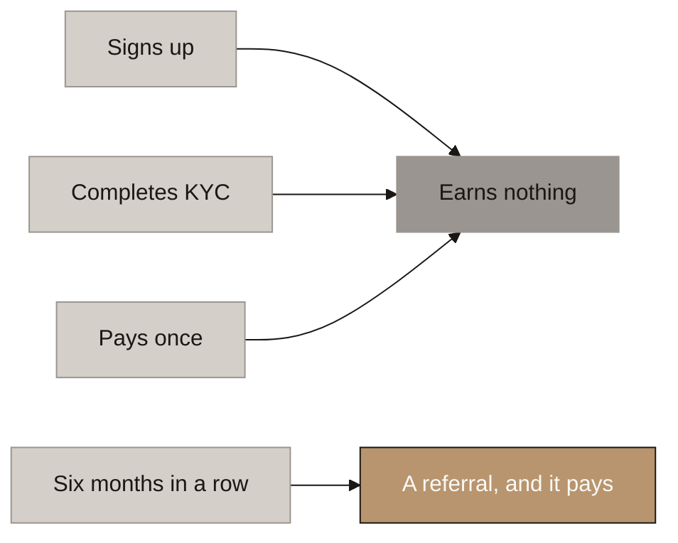
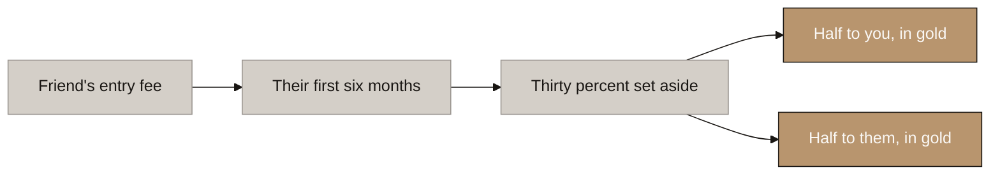
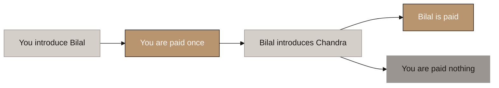

# Aurumix Process Maps: How Referrals Work

> Companion to `_draft_referral-system.md` (B5, the referral layer). Deliberately short: **four diagrams, because it is a simple mechanism and padding it would suggest otherwise.**
>
> The single message: **a referral pays when your friend has actually saved for six months, it comes out of the fee they paid, you both get gold, and it stops at one level.**
>
> Related decisions: 13, 20, 22, 42, 44, 46, 47. Written against the design as settled 2026-08-13.

## Diagram Plan

| # | Diagram Name | Type | Direction | Nodes | Placement | What it answers |
|---|---|---|---|---|---|---|
| 0 | How a Referral Works | Flowchart | LR | 5 | Inline | What actually happens, start to finish |
| 1 | What Counts as a Referral | Flowchart | LR | 6 | Inline | When do we pay, and what earns nothing |
| 2 | Where the Money Comes From | Flowchart | LR | 5 | Inline | Who funds it, and does it cost us anything new |
| 3 | One Level, and It Stops There | Flowchart | LR | 5 | Inline | Why this is not a network scheme |

**Call set.** Five minutes is **0 and 3**. Ten minutes adds **2**. Map 1 is the one to reach for if the client asks why a signup does not pay, which they will, because their own document says *"new investors onboarded"*.

**Map 0 is the leave-behind.**

## Consistency Convention

- **Flowchart direction:** LR throughout.
- **Gold node convention:** solutions, outcomes that hold, where the customer lands.
- **Concrete node convention:** problems, honest warnings, ruled-out routes.
- **Stone node convention:** starting points, mechanism steps, pending items.
- **Text style:** regular, no bold.

---

## 0. How a Referral Works

<!-- SPEAKER NOTES:
"This is the whole thing on one slide, and there is nothing hidden behind it.

You share your code. Your friend opens their own account, in their own name, funded from their own bank account. Then they save. Six months in a row, at whatever amount suits them, minimum twenty dollars. When they finish that sixth month, they have earned the same Confirmed SIP that opens their own score, and at that moment the referral has succeeded.

Thirty days later, gold lands in both accounts. Not points, not a badge, not a discount voucher. Gold, in their holding and in yours.

Two things to draw out. First, the shortest possible path from sharing a code to being paid is seven months. That is not a delay we added, it is the product: six months is what it takes to become a real customer here, and we pay for real customers.

Second, notice who the payment is not from. It is not from a pool, it is not from other savers, and it is not from profit. Map 2 shows exactly where it comes from."
-->

```mermaid
%%{init: {'theme': 'base', 'themeVariables': {
    'primaryColor': '#B8956E',
    'primaryTextColor': '#1A1714',
    'primaryBorderColor': '#1A1714',
    'lineColor': '#1A1714',
    'secondaryColor': '#FAF8F5',
    'tertiaryColor': '#D4CFC8',
    'fontFamily': 'Libre Franklin, sans-serif',
    'edgeLabelBackground': '#D4CFC8',
    'clusterBkg': '#FAF8F5',
    'clusterBorder': '#B8956E'
}}}%%
graph LR
    A["You share your code"] --> B["Friend opens own account"]
    B --> C["Six months in a row"]
    C --> D["Thirty day settling period"]
    D --> E["Gold to both of you"]

    style A fill:#D4CFC8,stroke:#9A9590,color:#1A1714
    style B fill:#D4CFC8,stroke:#9A9590,color:#1A1714
    style C fill:#D4CFC8,stroke:#9A9590,color:#1A1714
    style D fill:#D4CFC8,stroke:#9A9590,color:#1A1714
    style E fill:#B8956E,stroke:#1A1714,color:#FAF8F5
```

⚠ **The code is attached when the account is created and never moves.** No entering it later, no transferring a referral, no dispute path. Any window in which attribution can still change is a window in which it gets sold.

⚠ **The thirty days is not a test of your friend.** It exists because a prefunded balance is refundable, so without it someone could prefund six months, collect, then ask for the money back. Any reversal in the run voids the reward.

⚠ **There is no limit on how many people you can introduce.** This is what VARA's own guidance describes: referral codes shared *"with any person, with no maximum number of referrals"*.

---

## 1. What Counts as a Referral

<!-- SPEAKER NOTES:
"This is the departure from your document worth spending a minute on. Your section 8.2 says a referral is 'new investors onboarded'. We need to be more precise than that, because onboarded could mean four different things and three of them pay for nothing.

A signup is a form. A completed KYC is a form we checked. A first payment is a person who tried it once. None of those is a customer, and in a savings product with this persistency curve, paying for any of them means paying for people who will be gone by spring.

So we use a definition the product already has. Six consecutive contributions is what earns Confirmed SIP, it is what opens their own score, and it is what we mean by a real customer everywhere else in the design. We are not inventing a referral test. We are reusing the one we already trust.

That choice does a lot of quiet work. Six months cannot be compressed, bought, backdated or paid off in arrears, because the product only counts one period per calendar month. There is a hard twenty dollar floor, so nobody farms it with small change. Every account passes its own gate, so nobody rides in on someone else's record. We inherited all of that for free.

The market agrees, by the way. Jar pays on the fifth transaction. Tanishq gives nothing below six instalments. Nobody serious pays on a signup."
-->

⚠ **Miss a month at four of six and the run restarts.** The referral is not lost, the clock is. There is no revival anywhere in this design and there is none here.

⚠ **A regulatory pause freezes the run rather than breaking it**, exactly as it does for the score. We never penalise anyone for a month in which we refused their money.

✅ **The by-product nobody has to be told about: self-referral cannot make money.** Six months of your own money at a 5% fee to recover 1.5% of it. **The design does not detect this attack, it prices it out.**

---

## 2. Where the Money Comes From

<!-- SPEAKER NOTES:
"The question behind this slide is the one a regulator asks and the one your finance director asks, and they are the same question: whose money is this?

The answer is that it is the entry fee your friend paid, and only that. Take the six contributions of their qualifying run, take the entry fee on those six, set aside thirty percent, and split it in half.

Three things follow, and each of them closes a risk.

It is not a pool. Nothing is collected from savers generally and divided among savers generally. That shape is a profit share, it is what we removed when we replaced the ICS Dividend, and it would put a securities regulator into your regulator set.

It does not scale with what anyone is holding. It scales with what the new customer actually contributed, which is a commission on business written, not a return on capital.

And it is capped by construction. We can never pay out more than we took in on that run, because thirty percent of a number is smaller than the number. Nobody has to watch this.

One honest note. Thirty percent is a placeholder. It sits here so the mechanism can be reasoned about, and it gets locked when the revenue model is built, alongside the agent rate. Nothing in the design depends on it being thirty."
-->

**Worked example.** A friend contributing USD 75 a month for six months pays USD 450, of which the 5% entry fee is **USD 22.50**. Thirty percent of that is **USD 6.75**, so **USD 3.38 each, about 0.031 grams**. At USD 500 a month it is **USD 22.50 each**. It scales with what they actually saved, with no ceiling.

⚠ **Both sides are paid, and that is a design choice with evidence behind it.** Published research finds referral rewards can **backfire for unfamiliar products** unless both parties benefit, and a tokenised gold instrument sold to a first-time saver is exactly that product. It also changes the conversation from *"I am paid if you sign"* to *"we both get gold"*, which is a materially better conduct position.

⚠ **It is an acquisition cost, not a benefit.** The five ICS benefits are closed and this is not a sixth. It earns no score, no points and no tier: **the score measures saving, and it will not be moved by recruiting.**

---

## 3. One Level, and It Stops There

<!-- SPEAKER NOTES:
"This is the protection slide, and it is the one I would not cut for time.

If you introduce Bilal, you are paid for Bilal. If Bilal then introduces Chandra, Bilal is paid for Chandra and you receive nothing. Not a smaller share, not an override, not a percentage. Nothing. The chain is one link long and it stops.

Here is why that matters more than it looks. We went through every case we could find where a regulator reclassified something as a pyramid or an MLM: Forsage, BitConnect, OneCoin and Karatbars. Every single one turned on the same feature, which is paying people for the activity of people they recruited. Not on the number of referrals. On the depth.

Karatbars is the one to sit with, because it was a gold-backed token sold through a multi-level structure. It is the comparison a journalist or a regulator will reach for first when they see a gold savings product with a referral programme, and a single-level rule written into the terms is very cheap insurance against a comparison that is otherwise free to make.

I should also say what we could not verify. We tried to retrieve the UAE statute on pyramid selling and network marketing and the government portals refused automated access. So we do not know that multi-level compensation is lawful here. When you cannot verify a permission, you do not design against it.

One more thing your own documents should hear. Your earlier version listed MLM risk in two places, including a risk register entry naming the referral, status and Masterclass structure together. The current version keeps the three-level cap but has dropped the reason for it, and dropped the risk entry. We are putting that back."
-->

⚠ **One payment per referral, never a share of what they go on to generate.** In August 2024 the NSE prohibited brokers from paying referral commissions to unregistered persons, and Zerodha ended its 10% brokerage share within ten days. **The regulator's objection was the ongoing revenue share, not the referral.** A one-off bounty survived. An annuity did not.

⚠ **The agent network is a separate population, not a level above this one.** Agents are registered, contracted, trained and disclosed, and they are designed elsewhere. **A member is a customer who told a friend.** No referral count promotes anyone.

⚠ **One rule spans both, and it exists to stop double payment:** an account is either agent-originated or member-referred, never both.

---

## Departures from the client's document

Recorded here rather than as a fifth diagram, because they are conversation points and not mechanism.

| # | Their document | This design |
|---|---|---|
| 1 | §8.2 makes the referral network an **ICS component**, *"supplementary, capped, cannot dominate"* | **Referrals earn no score at all.** They are paid in gold instead. A capped supplementary point that cannot dominate is a point that changes nothing; a gram is worth a gram on the day it lands |
| 2 | §8.2 defines a referral as *"new investors onboarded"* | **Six consecutive contributions.** Onboarded has four possible meanings and three of them pay for nothing |
| 3 | **No reward is specified anywhere.** Not cash, not gold, not a discount, and no number of any kind | **30% of the referee's entry fee over their qualifying run, split two ways, in gold.** Placeholder rate, locks with the revenue model |
| 4 | **V2 carried MLM risk in two places. V3 dropped both**, keeping the three-level cap but deleting the stated reason for it | **Single level, in the terms**, with the reclassification precedents behind it |
| 5 | No fraud, self-referral or sybil controls anywhere | **Priced out rather than policed:** pay 5% to recover 1.5% |

> 🔴 **And one item that is schedule, not design.** VARA Marketing Regulation I.C.2.l(iii) requires incentives to *"receive a compliance confirmation from VARA"*, and VARA's own guidance case study treats a referral programme as approved **as part of the licensing application**. **The referral programme therefore has to be designed before the application goes in, not after launch.** It also means the reward must never be framed with urgency or a deadline, which rules out limited-time bonuses (I.C.2.h).
