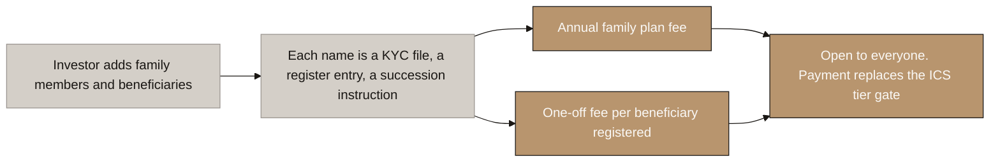
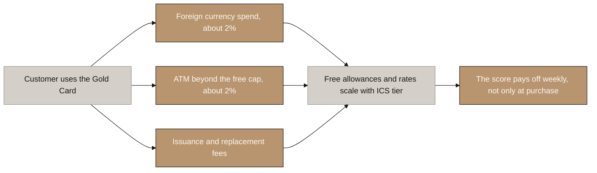
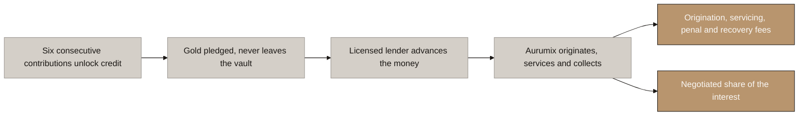
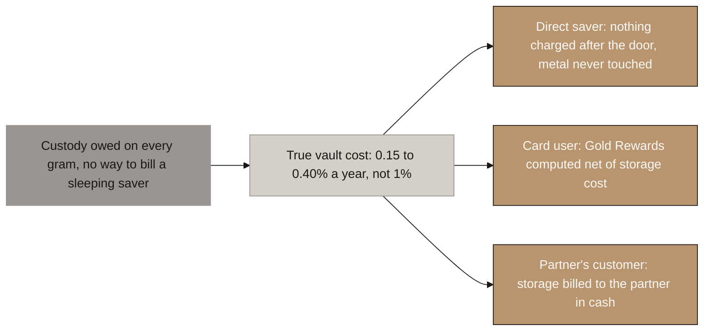

# Aurumix Process Maps: The Six Revenue Streams

> Draft for the client call. Answers the question underneath the ICS Dividend problem: **where does the money actually come from, if not from the investors themselves?**
>
> Reasoning and sources: this file. Related decisions: 6 (Gold Rewards), 9 (entry fee at the top of range), 32 (no fee on redemption), 41 (grams are fungible), 42 (the storage resolution and the platform fee).
>
> **The single message: the current model charges the investor at one moment and against one base, which is why the dividend was circular. Three of the six streams are paid by somebody who is not the investor.**
>
> Scope note: custody is deliberately folded into the entry fee for the direct saver and is not a separate retail stream. The transfer fee, physical delivery, advisory fees, insurance attach and any exit-side charge are all out of this set.
>
> 🆕 **2026-08-10: stream 6 added, the B2B platform fee, agreed with Abdur.** Two maps, 6a and 6b: the storage-economics decision that motivates it, then the fee flow itself. White-label moves out of the excluded table. The FX corridor margin was considered the same day and parked: GCC currency pegs make it thin at launch. Recorded as decision 42 in `handoff.md`.

## Diagram Plan

| # | Diagram Name | Type | Direction | Nodes | Placement | Who pays |
|---|---|---|---|---|---|---|
| 1 | The Entry Fee, Charged Once | Flowchart | LR | 5 | Inline | The investor |
| 2 | Merchant Interchange | Flowchart | LR | 6 | Inline | The shop |
| 3 | Family Portfolio and Digital Will | Flowchart | LR | 5 | Inline | The investor |
| 4 | Cardholder Fees | Flowchart | LR | 6 | Inline | The cardholder |
| 5 | Lending Fees | Flowchart | LR | 6 | Inline | The borrower |
| 6a | Who Pays for Storage | Decision map | LR | 5 | Inline | Aurumix, the reward pool, the partner |
| 6b | The B2B Platform Fee | Flowchart | LR | 5 | Inline | The partner |

## The six streams at a glance

| # | Stream | Who pays | Charged when |
|---|---|---|---|
| 1 | Entry fee, custody included | The investor | Once, at every contribution |
| 2 | Merchant interchange | The shop | Every card purchase |
| 3 | Family plan and Digital Will | The investor | Annually, plus once per beneficiary |
| 4 | Cardholder fees | The cardholder | On foreign spend, ATM use, card issue |
| 5 | Lending fees | The borrower | At drawdown, then monthly |
| 6 | B2B platform fee | The partner | Monthly, in bps on the partner's book |

**Three of the six are charged on activity rather than on the balance, and one of those is paid by a third party. The sixth is the only line that scales directly with assets under management, and it is billed to a business, never to a saver.** That is the point of the set.

## Consistency Convention

- **Flowchart direction:** LR throughout.
- **Gold node convention:** where money lands, and outcomes that hold.
- **Concrete node convention:** the problem, and routes that are ruled out.
- **Stone node convention:** starting points, mechanism steps, and anything pending confirmation.
- **Text style:** regular, no bold.

> **Numbering note: 1 to 6 are stream identifiers, not a sequence.** Stream 6 carries two maps: 6a is the decision that motivates it, 6b is the flow. The diagrams below are grouped by who pays, so they do not run in numerical order.

---

# Paid by the investor

## 1. The Entry Fee, Charged Once

<!-- SPEAKER NOTES:
"This is the stream you already have, with one change, and the change makes the product easier to sell rather than harder.

Today your document has two investor-facing charges: an entry fee of two to five percent, and an annual custody fee of point eight to one percent taken in grams. We want to collapse those into one.

The reason is not tidiness. It is that the annual charge cannot be collected. Six in ten of your investors will have stopped contributing by year five, on Indian life insurance persistency, but they will still be holding gold that still costs money to store. So the monthly bill arrives at exactly the people who no longer have a monthly touchpoint with you. There is a token in the market called Cache Gold that architected precisely this problem: it had a storage fee on paper and a collection mechanism that could only fire on a transaction, and it died of it. Having a fee on paper is not the same as having revenue.

The second reason is your own promise. Under the ownership structure we are recommending, those grams belong to the customer, not to you. Taking a slice of them every year to pay for storage means selling the customer's property, which needs express contractual authority and which contradicts the one sentence we want the whole product to stand on: you can lose your status, you can never lose your gold.

So: charge everything at the door. The entry fee covers the fabrication premium on the bar, the payment rail, the lifetime custody, and your margin. After that the customer sees one number that only ever goes up.

The honest caveat, and you should hear it from us. This front-loads a long-term cost into a single moment, which means a one-year holder subsidises a ten-year holder. We think that is the right trade, because the alternative is a bill you cannot collect. But it does mean the entry fee has to sit at the top of your stated range at launch, not the bottom. At two percent you lose money on every contribution."
-->

```mermaid
%%{init: {'theme': 'base', 'themeVariables': {
    'primaryColor': '#B8956E',
    'primaryTextColor': '#1A1714',
    'primaryBorderColor': '#1A1714',
    'lineColor': '#1A1714',
    'secondaryColor': '#FAF8F5',
    'tertiaryColor': '#D4CFC8',
    'fontFamily': 'Libre Franklin, sans-serif',
    'edgeLabelBackground': '#D4CFC8',
    'clusterBkg': '#FAF8F5',
    'clusterBorder': '#B8956E'
}}}%%
graph LR
    A["Customer contributes"] --> B["Entry fee taken at the door"]
    B --> C["Covers fabrication, rail, lifetime custody, margin"]
    C --> D["Balance buys gold at the next fix"]
    D --> E["Grams allocated. No annual bill, ever"]

    style A fill:#D4CFC8,stroke:#9A9590,color:#1A1714
    style B fill:#B8956E,stroke:#1A1714,color:#FAF8F5
    style C fill:#D4CFC8,stroke:#9A9590,color:#1A1714
    style D fill:#D4CFC8,stroke:#9A9590,color:#1A1714
    style E fill:#B8956E,stroke:#1A1714,color:#FAF8F5
```

⚠ **Open and load-bearing: is 0.8 to 1.0% a cost or a margin line?** Commercial allocated vaulting and insurance runs 0.10 to 0.50% a year, and gold ETFs charge 0.15 to 0.40%. If the true vault cost is at the bottom of that range, the folded custody component is largely margin, and pricing it at 0.40 to 0.50% would still earn money while becoming a marketing advantage over every competitor. **Get the vault quote. It sits in the same conversation as the bullion dealer.**

---

## 3. Family Portfolio and Digital Will

<!-- SPEAKER NOTES:
"Two of the best features in your product are currently free, and we think that is a mistake for a reason that has nothing to do with greed.

The Family Portfolio lets an investor split their gold across named family members, each with their own sub-account and their own credit line. The Digital Will transfers gold to named beneficiaries on a time or event trigger. Nobody else in this market has either. We looked at nineteen tokenised gold protocols and not one has a family structure or a succession mechanism.

Here is why they should be paid for. Every name added is a separate KYC file, a separate entry in the title register, and a succession instruction that has to survive the customer's death and stand up in front of a court in whichever country the beneficiary lives. There is a legal will integration partner in your own architecture diagram. That is real work, real cost and real liability, and it recurs.

Charging for it also solves a problem in the loyalty score that we found and have not been able to fix any other way. Right now family portfolios appear twice: as something that raises your ICS tier, and as a benefit that only unlocks at a certain ICS tier. So you need the tier to unlock the thing that gives you the tier. That is a deadlock, and it is also regressive, because it hands the feature to the customers who least need help.

Pricing it removes the deadlock cleanly. Open the feature to everyone, charge for it, and let the score reward the behaviour you actually want, which is more family members contributing.

Two prices, not one: a flat annual family plan, and a one-off fee each time a beneficiary is registered. The second one matters because it prices the actual cost driver. Ten beneficiaries is ten times the work of one."
-->

⚠ **No published comparable exists** for a digital will or family sub-portfolio fee anywhere in the gold-token set or the wider consumer market we surveyed. Price it on cost, not on benchmark. Subscription tiers do sustain in adjacent retail crypto products, so the format is proven even where the price point is not.

---

# Paid by the merchant

## 2. Merchant Interchange

<!-- SPEAKER NOTES:
"This is the most important diagram in the set, because it is the only place in your entire model where somebody other than your own investor pays you.

That matters because of the dividend. Your document distributes fifteen to twenty percent of operating profit back to investors. But operating profit is just the entry fees, the custody fees and the credit fees those same investors paid. So the dividend is not a return on a business, it is investors' own money handed back and concentrated into the top ten percent. We have to fix that, and interchange is the fix.

Here is how card money works. When your customer pays a hundred dirhams at a shop, the shop does not receive a hundred. It receives about ninety seven and a half. The missing two and a half is split three ways, and the largest slice, called interchange, goes to whoever issued the card. That is the pool we want.

You cannot be the issuer. The Central Bank holds the sole right to issue card numbers, so a licensed UAE bank has to be named. What you become is the programme manager: you own the customer, the app, the credit decision and the brand, the bank holds the licence and the liability, and the interchange is split between you by contract. There is a live example in this market already, Abu Dhabi Islamic Bank sponsoring a programme run by Al Fardan Exchange.

Now the part that decides how big this is, and it is a single design choice.

Since October 2024 the Central Bank has capped interchange on debit and prepaid cards at three quarters of a percent in person and one percent online. Credit cards are not capped. So if the Gold Card is built as a prepaid wallet, this revenue line has a ceiling of about one percent forever. If it is built as a credit card drawing on the gold facility, it does not.

Your product is already designed the right way, because the card draws on the credit line. We just need that written down before your team builds it, because it costs nothing now and cannot be undone later.

One more thing in your favour. Your customers are Indians in the Gulf. When they spend, the transaction is usually cross border, and cross border interchange sits above domestic and outside the cap. For most card issuers foreign spend is the exception. For you it is the norm.

And this is what makes the reward honest. Gold Rewards is paid out of interchange and capped at what that individual customer generated. The merchant funds it. Nobody's entry fee is being recycled to anybody else."
-->

🔴 **Build it as credit, not prepaid.** UAE debit and prepaid interchange is capped at 0.75% in person (max AED 37.50) and 1.00% online (max AED 50) since 1 October 2024. Credit is uncapped. This single choice sets the ceiling on the only externally funded revenue in the model.

⚠ **Two numbers to verify before this is modelled.** First, confirm the credit-card exemption from the cap directly with CBUAE; it currently rests on a payments-industry source rather than the rulebook, which blocks automated access. Second, get the programme-manager share of interchange from a sponsor bank. Nobody publishes it and it sets the size of everything above.

⚠ **No precedent in the category.** Of nineteen tokenised gold protocols, only Kinesis has a card, and its card is a cost centre: zero sign-up, zero monthly, zero transaction fee, and 2% cashback paid out. **If Aurumix models interchange as revenue it will be the first in this market to do so.** That is either the whitespace or the warning, and the sponsor bank conversation decides which.

---

# Paid by the cardholder

## 4. Cardholder Fees

<!-- SPEAKER NOTES:
"Same card, different payer. The last diagram was the shop's money. This one is the customer's.

Every card in the market charges these and no cardholder treats them as unusual. About two percent on spend in a foreign currency. Free cash withdrawals up to a monthly limit and then about two percent. A fee to issue the card and a larger one to replace a lost one. Nexo, Crypto dot com and Wirex all land on the same two percent, independently, which tells you it is the market clearing rate rather than anybody being clever.

Two things make this line bigger for you than for a normal issuer.

The first is that foreign currency is your default. A UAE issued card spending rupees in India crosses a currency boundary on almost every transaction. For most issuers foreign spend is a small tail. For yours it is the main event.

The second is the comparison your customer is actually making. An Indian in Dubai sending money home today pays somewhere between three and five percent all in, once you count the fee and the exchange rate margin the exchange house does not show them. Two percent on a card is cheaper than what they already accept without complaining. You are not adding a cost to their life. You are undercutting one.

Now the design move, and it is the one worth arguing for.

Tier the free allowances by ICS. Higher score, bigger free cash withdrawal allowance and a lower foreign exchange margin. Nexo and Crypto dot com both run loyalty exactly this way.

This fixes something real. At the moment your score pays off in two places: a discount on the entry fee, and a better borrowing ratio. But the discount only helps at the moment you are buying, and the borrowing ratio only helps if you borrow. So a disciplined saver who does neither can climb the whole ladder and feel nothing. Card benefits pay off every week, in something they can see. It is the difference between a score that is a number in an app and a score that is a reason to keep paying.

And it is cheap for you, because the benefit is a fee you waive rather than cash you hand over."
-->

⚠ **No annual fee and no monthly fee.** The market has moved away from both and Kinesis charges zero on sign-up, zero monthly and zero per transaction. Charging either would be the one line here that looks out of step.

⚠ **VAT.** Cardholder fees are a supply of services, standard rated at 5% for UAE residents. Supplies to customers resident outside the UAE may be zero rated under the export of services rules. Given the base is deliberately NRI and GCC, this may be a structural margin advantage rather than a cost, but it is unverified and touches every fee line. Worth a tax opinion before pricing hardens.

---

# Paid by the borrower

## 5. Lending Fees

<!-- SPEAKER NOTES:
"The third payer. Not the shop, not the cardholder, the borrower.

Walk the flow. After six consecutive contributions the customer's gold is registered as collateral. Their tier sets how much of it they can borrow against. The gold does not move: it stays in the vault and is simply flagged as pledged, which is the whole promise of the product. You never sell your gold. You borrow against it and it keeps growing.

Now, you are not the lender. Lending money in the UAE needs a Central Bank finance company licence, which requires a hundred and fifty million dirhams of capital and sixty percent UAE national ownership. That is not a hurdle you clear with a bigger raise. It is a different company.

So a licensed lender advances the money and owns the loan book. Aurumix originates the loan, runs the app, prices the collateral, services the account and does the collections. And Aurumix gets paid for that work: an origination fee when the customer draws, a servicing fee on the outstanding balance, a penal charge if they run past term, recovery costs if it goes bad, and a negotiated share of the interest.

That last list is not us inventing charges. It is the published schedule of the largest gold lender in India, line for line. Manappuram itemises its recovery costs to the rupee: printing, advertisement, transport, insurance, the auctioneer's fee, postage. Every one of them reads as cost recovery rather than margin, which is exactly why customers accept them.

And now the one question that decides whether this is a small business or a real one.

Their rulebook says lending virtual assets is a VARA activity. Lending dirhams is a Central Bank activity. If the credit facility advances tokens rather than cash, the whole thing may sit inside VARA at two hundred thousand dirhams and five hundred thousand of capital, instead of a hundred and fifty million. Same product to the customer. Two completely different businesses to you.

We do not know the answer. Nobody does, because nobody has asked. It is the first thing we would put to your counsel, ahead of everything else on our list, because the difference is roughly three hundred fold."
-->

🔴 **The question that dwarfs everything else in this file: can the facility advance tokens rather than dirhams?** VARA's Lending and Borrowing Services licence covers lending virtual assets: AED 200,000 extension, AED 200,000 a year, AED 500,000 capital. Lending fiat to consumers is a CBUAE Finance Company matter: **AED 150,000,000 capital plus 60% UAE-national ownership**, which is an ownership constraint no amount of money solves. **Put this to counsel first.**

⚠ **Correct the LTV before this is built.** §9.3 of the client document states Sovereign credit at "up to 110% of gold value" and then works the example at USD 8,500 on USD 10,000, which is 85%. The row contradicts itself, 110% was almost certainly never intended, and the warning and liquidation thresholds need re-spacing to 90 to 95%.

---

# Paid by the partner

## 6a. Who Pays for Storage

<!-- SPEAKER NOTES:
"Stream one folded custody into the entry fee, and we left one honest question open on that slide: is 0.8 to 1 percent a cost or a margin line? We now have the shape of the answer, subject to one quote. Institutional allocated storage runs somewhere between 0.15 and 0.40 percent a year, not 1 percent. That changes what the line is for.

For the direct saver the answer is: nothing is ever charged after the door, and the metal is never touched. That sentence is a marketing asset no competitor can honestly match. Pax Gold charges nothing today but reserves the right to recover custody by issuing new tokens, which dilutes every holder. Matrixdock charges nothing and reserves the right to start on thirty days' notice. Comtech says nil fees and reserves a nominal fee after twenty-four months. Goldmoney, the profitable comparison, charges up to 0.98 percent a year. The ones that charge zero can do it because a parent company pays. Aurumix would charge zero because the design pays, and can put that in writing.

Two recoveries survive, and neither one sends a bill to a saver. First, card users: Gold Rewards is already defined as capped by the revenue that customer generates, so the reward is computed net of that customer's storage cost. The reward is slightly smaller, no bill exists, nothing is chased. Second, partner books: the partner is a company, and invoicing a company monthly is ordinary commerce. That is the next diagram, and it is where the storage economics we give away at retail are collected instead.

One number decides all of this: the vault quote. It sits in the same conversation as the bullion dealer. If it comes back near one percent rather than a third of one percent, this structure is revisited."
-->

⚠ **The 0.15 to 0.40% figure is research-derived, not quoted.** It came from a market sweep, not a rate card, because the major vaults publish nothing. **The vault quote upgrades from cost check to pricing decision: it validates the retail absorption and prices stream 6.** It sits in the dealer conversation batch.

**Rejected on the way, so nobody re-proposes them:** custody riding the monthly debit with arrears collected on revival (impractical to chase, and a back-bill at the moment a customer returns punishes the exact behaviour the product wants back); gram deduction with matching token burn (mechanically peg-safe, the invariant holds, but it breaks "you can never lose your gold" and needs express authority to sell the customer's metal); dilution (breaks 1 AURX = 1 gram outright); any exit-side recovery (VARA III.E.4, decision 32).

---

## 6b. The B2B Platform Fee

<!-- SPEAKER NOTES:
"By launch you will hold a set of assets nobody else in the region has together: a VARA issuance licence, a title register, a custody stack and compliant payment rails. Every other company that wants to offer gold inside its app must either build that, which takes years and millions, or rent it from someone who has it. The natural first renters are the exchange houses: millions of monthly remittance relationships with exactly your customer, and no gold product.

Here is how the money works. Their customer buys gold in their app and sees one all-in price, the same way your own app shows one price. Behind that price the entry spread splits, and the partner keeps the larger share, seventy to eighty percent, paid once at the moment of sale. That split is the going rate for distribution: it is what the comparable gold infrastructure businesses in India pay their channels, and it is what makes the integration worth the partner's while.

Then follow the gram. It lands in your vault, on your register, under your licence, and it stays there for ten or twenty years. The partner has no claim on it after the sale. From that point the partner pays a platform fee on the whole book their customers hold with you: monthly, in cash, in basis points. That fee is the storage economics you chose to give away at retail, collected instead from the one counterparty where collection is frictionless. The partner is paid once at the till. You are paid on the stock, every year, for as long as the gold sits.

The result is the only line in your model that scales directly with assets under management, and it costs you no customer acquisition. One partner with a hundred-million-dollar book at sixty basis points is six hundred thousand dollars a year, recurring, growing with their book rather than with your marketing.

One thing has to happen now for this to be possible later. The September build must make the register and the mint able to serve more than one front end. That is a small architectural choice today and an expensive retrofit in two years, and it sits in the same conversation as the upgradeable proxy."
-->

```mermaid
%%{init: {'theme': 'base', 'themeVariables': {
    'primaryColor': '#B8956E',
    'primaryTextColor': '#1A1714',
    'primaryBorderColor': '#1A1714',
    'lineColor': '#1A1714',
    'secondaryColor': '#FAF8F5',
    'tertiaryColor': '#D4CFC8',
    'fontFamily': 'Libre Franklin, sans-serif',
    'edgeLabelBackground': '#D4CFC8',
    'clusterBkg': '#FAF8F5',
    'clusterBorder': '#B8956E'
}}}%%
graph LR
    A["Customer buys in the partner's app: one all-in price"] --> B["Entry spread splits: partner keeps 70 to 80%, paid once"]
    B --> C["The gram lands in Aurumix custody, on the Aurumix register"]
    C --> D["Partner invoiced monthly: platform fee in bps on their whole book"]
    D --> E["Revenue scales with partner AUM, no new sale needed"]

    style A fill:#D4CFC8,stroke:#9A9590,color:#1A1714
    style B fill:#D4CFC8,stroke:#9A9590,color:#1A1714
    style C fill:#D4CFC8,stroke:#9A9590,color:#1A1714
    style D fill:#B8956E,stroke:#1A1714,color:#FAF8F5
    style E fill:#B8956E,stroke:#1A1714,color:#FAF8F5
```

⚠ **Precedent, and the reason to believe the split works: SafeGold in India.** Reported ~90% of revenue partner-originated, with 70 to 80% of the 2.5% spread paid to the distribution channel, and the platform still the more profitable side because it earns on every partner's flow. Research-derived from a market sweep; verify against primary sources before this reaches the client in numbers.

⚠ **The bps rate is a placeholder.** 0.5 to 0.75% a year covers the true vault cost several times over and stays below what the partner could build for. It hardens only after the vault quote and the first partner conversation, in Phase 4.

🔴 **Timing: this is a Year 2 to 3 stream with a Week 1 build requirement.** Multi-tenant capability at the register and the mint costs little in September and cannot be retrofitted cheaply. Raise it alongside the proxy recommendation.

---

# What this set deliberately leaves out

| Not included | Why |
|---|---|
| Any charge at exit or on redemption | VARA Annex 2 Rule III.E.4 prohibits it. Locked as decision 32 |
| Transfer fee on peer-to-peer AURX | Client decision: not doing it |
| Physical delivery and making charges | Not a current feature. The largest number on the table and worth reopening later |
| Insurance attach on the loan and the SIP | Out of scope at client instruction |
| Dealer volume rebates | Treated as compression of the fabrication premium inside the entry fee, not a separate stream |
| Custody as a separate annual line | Folded into diagram 1 for the direct saver; billed to the partner under stream 6 |
| Advisory fees, float income, broker-dealer exit spread | Each needs a new licence, a new feature, or a rulebook answer we do not have. White-label left this list on 2026-08-10 and became stream 6 |
| FX margin on contributions | Considered 2026-08-10 and parked: GCC currency pegs make it thin at launch. Real only with expansion beyond pegged currencies, Year 3+, and it leans on the counsel batch 2 answers |
| Gold leasing for yield | Refused even though it is the biggest margin line in the adjacent Indian market: it encumbers the metal, the holder-protection precedent is poor, and it re-imports the securities risk Gold Rewards exists to avoid |

---

# Reconciliations this set forces

- [ ] `_draft_allocation-and-float.md`: the entry-fee build-up must now carry the **lifetime custody component**, not just fabrication, rail and float cost. This raises the required fee and needs re-running against the 5% ceiling.
- [ ] `_draft_sip-spot-and-ics.md`: **ICS gains a fourth benefit lever, card allowances.** The existing three were price, credit and time, and time is empty since the decaying redemption fee died. Card benefits fill it better than the tenure rebate did, and they pay off weekly rather than at exit.
- [ ] `_draft_sip-spot-and-ics.md`: the **family portfolio circularity is resolved by pricing**. Remove the tier gate, keep the ICS credit for family members contributing.
- [ ] `_draft_entities-licensing-and-payments.md`: **the licence-extension fee is wrong and in the expensive direction.** We record "+50% of the lower application fee". VARA Schedule 2 has a separate Licence Extension Fee column at **AED 200,000** for Broker-Dealer, Custody, Exchange, Lending and VA Management. The 50% formulation appears in one cell only, Advisory Services. Also: **paid-up capital stacks per activity and does not merge** (Company Rulebook Part VI.B).
- [ ] `handoff.md` §5: same two corrections.
- [ ] Decision 6: **Gold Rewards is now arithmetically bounded by the interchange rate**, since the merchant funds it. State the cap explicitly rather than leaving it at "0.10 to 0.75% by tier".
- [ ] Decision 6 again, from stream 6a: **Gold Rewards is computed net of that customer's custody cost**, inside the existing cap. One line of arithmetic, no bill, and the most engaged customers quietly cover their own storage.
- [ ] 🔴 **The September build must be multi-tenant capable at the register and the mint** (stream 6b). Same class as the upgradeable-proxy recommendation: a small choice now, an expensive retrofit later. Raise the two together.
- [ ] **The Phase 4 revenue model** picks up: the platform fee as the only AUM-linked line, custody absorption as a cost line on the direct book at the quoted vault rate, and the Gold Rewards netting as a partial recovery.

# Questions for the client

1. **Is the Gold Card credit or prepaid?** It is the single choice that sets the ceiling on the only externally funded revenue in the model, and it must be settled before the September build.
2. **Are the Family Portfolio and Digital Will free features or paid ones?** We recommend paid, and it resolves a deadlock in the loyalty score at the same time.
3. **Who is the sponsor bank, and who is the lending partner?** Neither is named. Both are commercial gates, not design gates, and they sit alongside the bullion dealer on the critical path.
4. **Does he want the B2B channel in the Year 2 to 3 plan?** A yes in principle is enough for now, but it changes the September build (multi-tenant register and mint) and the Phase 4 model, so it cannot wait for Year 2.
