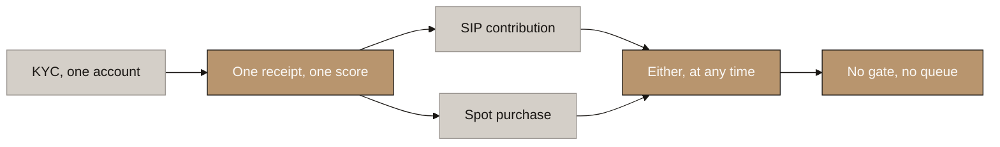
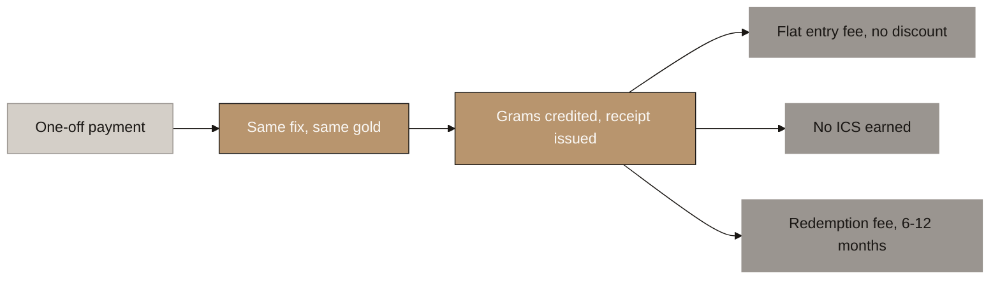
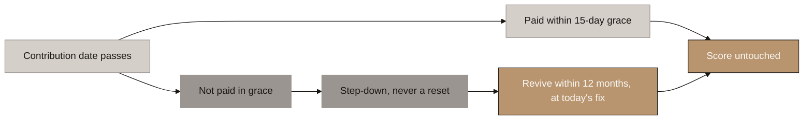
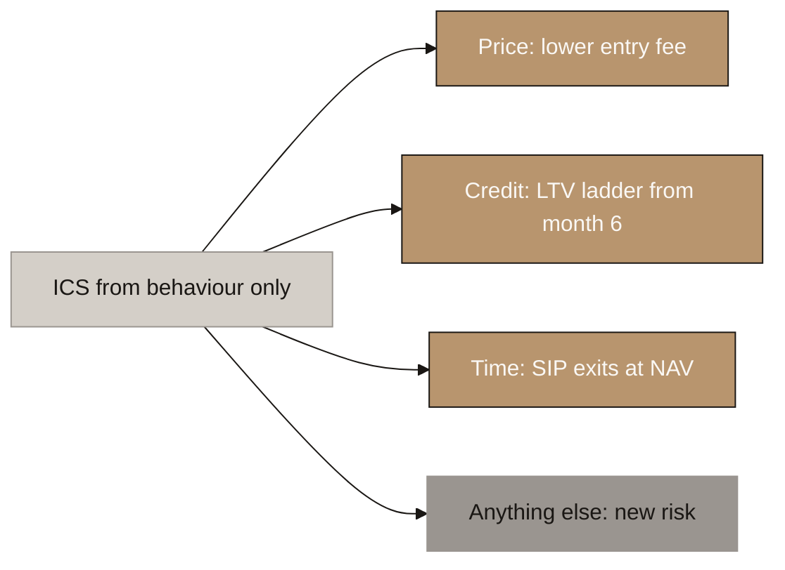

```mermaid
%%{init: {'theme': 'base', 'themeVariables': {
    'primaryColor': '#B8956E',
    'primaryTextColor': '#1A1714',
    'primaryBorderColor': '#1A1714',
    'lineColor': '#1A1714',
    'secondaryColor': '#FAF8F5',
    'tertiaryColor': '#D4CFC8',
    'fontFamily': 'Libre Franklin, sans-serif',
    'edgeLabelBackground': '#D4CFC8',
    'clusterBkg': '#FAF8F5',
    'clusterBorder': '#B8956E'
}}}%%
graph LR
    A["Declared amount and date"] --> B["Debit on own anniversary"]
    B --> C["Allocated at next fix, T+1"]
    C --> D["Grams credited, receipt issued"]
    D --> E["ICS accrues for the period"]

    style A fill:#D4CFC8,stroke:#9A9590,color:#1A1714
    style B fill:#D4CFC8,stroke:#9A9590,color:#1A1714
    style C fill:#B8956E,stroke:#1A1714,color:#FAF8F5
    style D fill:#B8956E,stroke:#1A1714,color:#FAF8F5
    style E fill:#B8956E,stroke:#1A1714,color:#FAF8F5
```

# Aurumix Process Maps: SIP, Spot and the ICS Score

> Five diagrams for the client call. They run in chronological order and walk one investor from the front door to the exit: opening an account, a SIP contribution, a spot purchase, a missed payment, and what consistent contribution earns. Everything else lives in the speaker notes.
>
> **Diagram 5 of `Aurumix_Process_Maps.md` ("Spot Lane: Benefits, Not Supply") is superseded by this set**, because the lanes no longer exist. Spot is a transaction type, not a lane.
>
> A longer 16-diagram breakdown of the same material sits in `_reserve_sip-spot-ics-diagrams.md`. Use it if a single point needs unpacking on the call, not as the running order.

## Diagram Plan

| # | Diagram Name | Type | Direction | Nodes | The one thing it says | Source Section |
|---|---|---|---|---|---|---|
| 1 | One Account, Two Transaction Types | Flowchart | LR | 6 | SIP and spot are things you do, not things you are | §1 |
| 2 | A SIP Contribution, End to End | Flowchart | LR | 5 | Money in, gold out, score up, in under 24 hours | §1, §5 |
| 3 | A Spot Purchase, End to End | Flowchart | LR | 6 | Same gold, different wrapper | §1, §2 |
| 4 | Missing a Payment | Flowchart | LR | 6 | You can lose your status, never your gold | §5, §6 |
| 5 | What Consistency Buys | Flowchart | LR | 5 | Behaviour sets the rate, amount sizes the base | §2, §4 |

## Consistency Convention

- **Flowchart direction:** LR throughout. All five are flows through an investor's life with the product.
- **Gold node convention:** the design as decided, and outcomes where the investor's score or gold is safe.
- **Concrete node convention:** adverse outcomes and the things a channel does not receive.
- **Stone node convention:** intermediate steps that are neither a decision nor an outcome.
- **Text style:** regular, no bold, short labels so they read at meeting distance.
- **Open parameters:** component weights, tier thresholds, step-down size, rebuild rate and the redemption-fee decay schedule are not set yet. No diagram shows a number that is still open.

---

## 1. One Account, Two Transaction Types

<!-- SPEAKER NOTES:
"Start with the front door, because in the current design there isn't one. Your document says three things, each reasonable alone. Spot is the entry point for new investors. Spot earns no ICS. Spot access is gated on ICS. Put those three sentences together and a new investor arrives with a score of zero and the only route open to them requires a score they can only earn by already being here.

That happened because the two types were originally separated by supply: SIP contributors had a guaranteed allocation, spot buyers competed for the remainder, and the score decided the queue. Once minting became continuous at NAV there is no queue, so the thing the two classes were separating disappeared.

So SIP and spot become two transaction types on one account rather than two classes of investor. One KYC, one Gold Receipt, one score. The holder can do either at any time. That dissolves the deadlock, and it restores three things: an existing contributor can add a lump sum without changing category, a spot buyer can start contributing at any point, which is your growth funnel, and a large ticket is discouraged by earning nothing rather than by being capped out. Worth saying plainly, a large spot order is genuinely useful to the treasury: it funds a whole bar outright."
-->

---

## 2. A SIP Contribution, End to End

<!-- SPEAKER NOTES:
"Here is a single contribution from declaration to gold in the account. The investor declares a monthly amount and a contribution date. Minimum 20 USD, your target 75 USD, and the amount can vary month to month. The debit runs on their own anniversary date rather than a shared calendar day, the way an insurance premium does. Funds clear, allocation happens at the first LBMA morning fix after clearing, so under twenty four hours. Grams credited, Gold Receipt issued, ICS accrues for that period.

Two things to flag on this one.

First, the last node. ICS accrues because a contribution arrived, not because of how large it was. A 20 USD contribution and a 2,000 USD contribution both register as one period contributed.

Second, what the declaration now is. The contractual commitment is deleted. It is a declared savings goal: an amount, a date, and optionally a target, which drives the debit schedule and shows as progress in the app. It scores nothing and can be changed or abandoned at any time. A commitment with no penalty for breaking it is free to make, so every rational investor picks the longest term and the choice tells you nothing about them. It also bought nothing: your own section 6.2 table activates credit at month six in all six rows. Removing it costs no retention, because breaking the commitment and simply not paying already had identical consequences, and it gains real acquisition, because the hardest moment in a 20 USD product is asking a stranger to commit for twenty-five years.

Confirmed SIP survives, but backward-looking: after six consecutive contributions have actually been made, the status exists. The investor never promises anything. Someone who stops at month three has forfeited nothing."
-->

---

## 3. A Spot Purchase, End to End

<!-- SPEAKER NOTES:
"The same walk for a spot purchase, so you can see exactly where the two paths diverge. A one-off payment, no declaration, no schedule. Then the middle of the flow is identical: same fix, same allocation, same gold, same receipt.

Three things differ and all three sit outside the metal. The entry fee is flat at the top of the range, around 4 to 5%, with no tier discount. No ICS accrues. And a redemption fee attaches to those specific grams, decaying over 6 to 12 months.

That last point is the design rule underneath this diagram: the gold must never differ by channel. Same token, same fix, same backing, same receipt. The moment the metal itself differs by channel you have two economic classes of one instrument, which is the securities shape that deleting the scarcity layer was meant to remove. All differentiation sits in the fees and services wrapped around the metal.

Which is also why we are restricting benefits rather than capping supply. Capping spot supply looks like a rationed offering. Denying score, credit and card tier is a loyalty programme. Same commercial effect, completely different classification."
-->

---

## 4. Missing a Payment

<!-- SPEAKER NOTES:
"This is where retention is won or lost, so follow the bad month all the way through.

Fifteen days of grace run from the investor's own contribution date, which is the IRDAI standard for monthly-mode premiums. Pay inside it and the score is untouched, allocated at the fix on the day funds clear. Two other cases also leave the score intact: paying less than usual but at or above the declared minimum simply buys proportionally less gold, and a spot purchase in the same period earns nothing but costs nothing. Only one case in five steps the score down.

Miss the grace and the score steps down one level. It does not reset. A reset punishes several good years for one bad month and leaves the investor with nothing left to protect, which is exactly the moment they leave. Rebuilding is slower than the step-down, which is your own stated intent expressed as a rule. The size of the step and the rebuild rate wait for the formula.

Then twelve months to revive by paying the arrears, which restores the streak, the tier and Confirmed SIP status. One financial rule has to sit under that, and getting it wrong is expensive: arrears buy gold at the fix on the day the payment clears, never at the fix of the period being made good. Otherwise revival is a free look-back option on gold. Everyone revives after the price has risen, nobody after it has fallen, and you cannot hedge it because the investor chooses when to exercise. Priced at today's fix, the payment buys the score position rather than the price, and there is no adverse selection to underwrite, which is why twelve months is affordable here where a life insurer needs three years plus interest plus fresh medical underwriting.

And the promise that governs all of it, in exactly these words: you can lose your status, you can never lose your gold. Every consequence in this design falls on tier, fee or credit ratio. The gram count only ever rises."
-->

---

## 5. What Consistency Buys

<!-- SPEAKER NOTES:
"Last one, and it is the decision the whole block rests on. Amount decides the size of your holding. Behaviour decides your rate on it.

So the score measures behaviour only. Continuity, which is the current unbroken streak, and tenure, which is total periods actually contributed, are the two primary components. They look like one and must stay as two, because without tenure a flawless eight-month investor sits at the top tier beside a five year customer. Referrals, family portfolios and Masterclass are capped supplementaries. Investment Value comes out entirely: it was being counted twice, once inside the score and again as the multiplier applied to the score, and more seriously, if the score rises with amount then the fee, the credit ratio and the rebate all improve with amount, which is a return proportional to investment.

The score then buys exactly three things and nothing else. Price: the entry fee falls with tier inside the 2 to 5% range. Credit: the loan-to-value ratio rises with tier in the 90 to 95% band, as a ladder from month six rather than a switch, because a switch means month seven and month sixty hold identical borrowing power and the facility does no retention work after the month it fires. Time: spot grams carry the decaying redemption fee and SIP grams exit at NAV with no penalty. Anything a future feature adds outside those three is a new classification question, not a product decision.

One test on the formula, and it is checkable: a 20 USD per month saver who never misses must be able to reach the top tier. If it cannot deliver that, what we have built is a preference class for larger investors rather than a loyalty programme.

Two items still open that I want to flag rather than paper over: whether the credit ratio applies to all grams or only SIP-acquired grams, and whether SIP or spot grams are sold first on a partial exit, since only spot grams carry the fee."
-->

