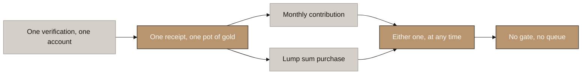
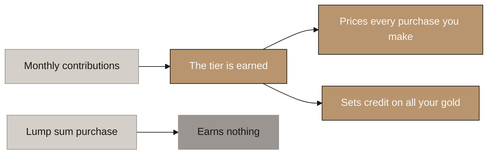
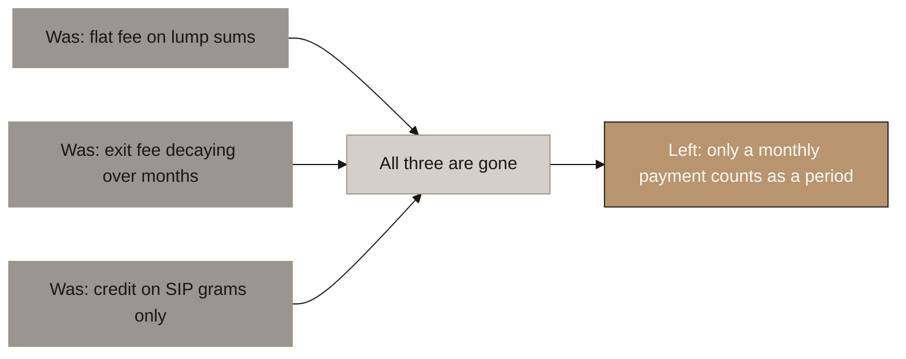
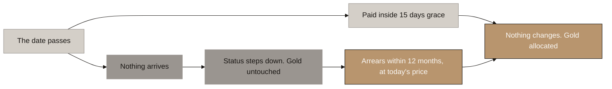
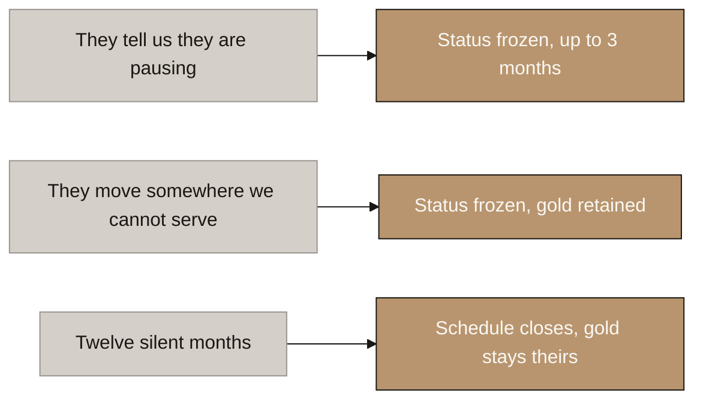
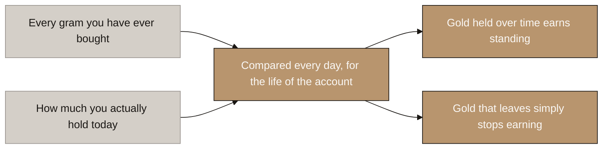
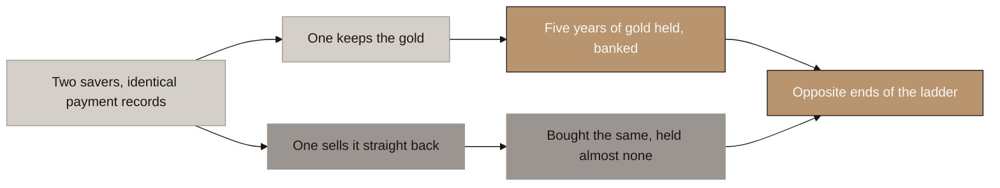
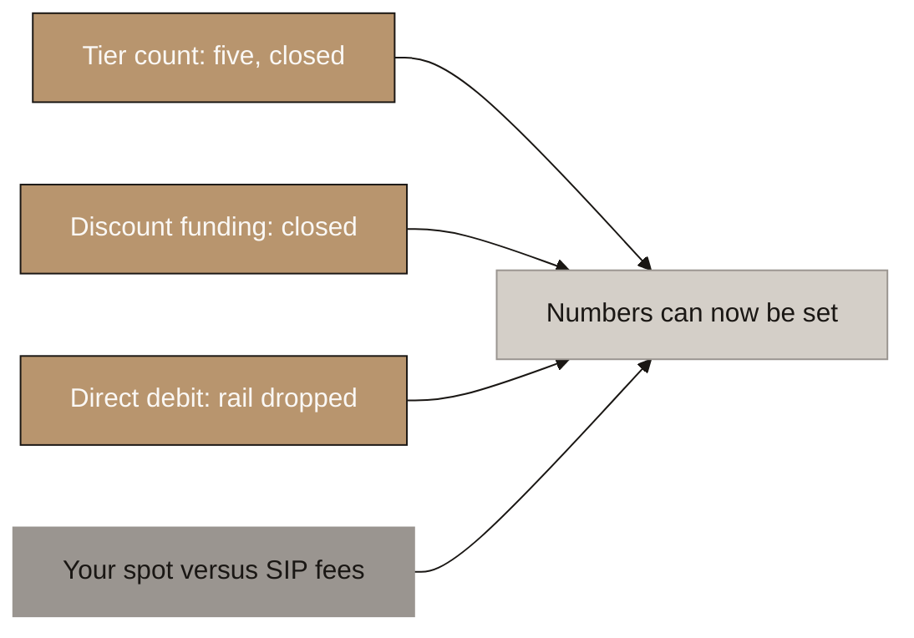

```mermaid
%%{init: {'theme': 'base', 'themeVariables': {
    'primaryColor': '#B8956E',
    'primaryTextColor': '#1A1714',
    'primaryBorderColor': '#1A1714',
    'lineColor': '#1A1714',
    'secondaryColor': '#FAF8F5',
    'tertiaryColor': '#D4CFC8',
    'fontFamily': 'Libre Franklin, sans-serif',
    'edgeLabelBackground': '#D4CFC8',
    'clusterBkg': '#FAF8F5',
    'clusterBorder': '#B8956E'
}}}%%
graph LR
    A["Declare an amount and a date"] --> B["Gold from the first payment"]
    B --> C["Six consecutive months"]
    C --> D["Confirmed. Benefits switch on"]
    D --> E["Kept for life, never re-earned"]

    style A fill:#D4CFC8,stroke:#9A9590,color:#1A1714
    style B fill:#B8956E,stroke:#1A1714,color:#FAF8F5
    style C fill:#D4CFC8,stroke:#9A9590,color:#1A1714
    style D fill:#B8956E,stroke:#1A1714,color:#FAF8F5
    style E fill:#B8956E,stroke:#1A1714,color:#FAF8F5
```

# Aurumix Process Maps: How SIP and Spot Work Together

> Nine diagrams covering the SIP and spot structure end to end: the front door, what each one earns, the six month gate, what a bad month costs, the states where life interrupts, and why buying and selling in circles gets nobody anywhere.
>
> Reasoning: `_draft_sip-rulebook.md` throughout. Earlier structure: `_draft_sip-spot-and-ics.md`. Lane mechanics: `_draft_purchase-structure.md` sections 3 and 4.
>
> ⚠ **This set supersedes `Aurumix_Process_Maps_SIP_Spot_ICS.md` (29 July) entirely.** That set is stale in five places: it shows the decaying spot redemption fee (prohibited by VARA Rule III.E.4), the flat spot entry fee (superseded), the declared minimum (deleted), Confirmed SIP as something that suspends and is restored (it is now permanent), and it has no concept of whether the investor kept the gold.
>
> ⚠ **No diagram here shows a weight, a threshold or a tier count, deliberately.** The scoring formula and the tier ladder are set in B4 and every number in them is relative to the others. These diagrams show the machine. The numbers go in afterwards and nothing here changes when they do.
>
> ⚠ **The minting plumbing is a separate set.** `Aurumix_Process_Maps_Minting.md` covers how money becomes gold becomes a token. This set covers what sits around it.

## Diagram Plan

| # | Diagram Name | Type | Direction | Nodes | The one thing it says | Source |
|---|---|---|---|---|---|---|
| 1 | One Account, Two Ways to Buy | Flowchart | LR | 6 | SIP and spot are things you do, not things you are | Rule book §1 |
| 2 | Earn With One, Spend On Both | Flowchart | LR | 6 | Monthly saving earns the tier. The tier then prices everything | Rule book §1.1 |
| 3 | The Only Difference That Survives | Flowchart | LR | 5 | Three differences died. One is left | Rule book §1, §1.1 |
| 4 | The Six Month Gate | Flowchart | LR | 5 | Earned backwards, never promised forwards, never lost | Rule book §4 |
| 5 | A Month That Goes Wrong | Flowchart | LR | 6 | You can lose your status, you can never lose your gold | Rule book §7 |
| 6 | When Life Interrupts | Flowchart | LR | 6 | A forced stop is not a broken promise | Rule book §8 |
| 7 | **What We Actually Track** | Flowchart | LR | 5 | Two counters per account, compared every day | Rule book §5.2 |
| 8 | Why Cycling Gets You Nowhere | Flowchart | LR | 6 | Identical payment records, opposite outcomes | Rule book §5.3 |
| 9 | Three Layers, So No Single Rule Has To Be Perfect | Flowchart | LR | 5 | Foolproof means not worth doing | Rule book §9 |
| 10 | What Is Still Open | Flowchart | LR | 5 | Appendix. What blocks the numbers | Rule book §13 |

## Consistency Convention

- **Flowchart direction:** LR throughout. All nine are flows through an investor's life with the product.
- **Gold node convention:** the design as decided, and outcomes where the investor's gold or standing is safe.
- **Concrete node convention:** starting points and inputs.
- **Stone node convention:** adverse outcomes, superseded design, and anything still open.
- **Text style:** regular, no bold, short labels so they read at meeting distance.
- **Numbers:** only durations that are settled appear (six months, fifteen days, twelve months). No weights, no thresholds, no tier counts, no percentages.

---

## 1. One Account, Two Ways to Buy

<!-- SPEAKER NOTES:
"Start with the front door, because in the current design there isn't one. Your document says three things, each reasonable on its own. Spot is the entry point for new investors. Spot earns no score. Spot access is gated on score. Put those three sentences together and a new investor arrives with a score of zero, and the only route open to them requires a score they can only earn by already being here.

That happened for a good reason. The two types were originally separated by supply. SIP contributors had a guaranteed allocation, spot buyers competed for the remainder, and the score decided the queue. Once minting became continuous at the market price there is no queue, so the thing those two classes were separating no longer exists.

So SIP and spot become two things you can do on one account, rather than two kinds of person. One verification, one receipt, one pot of gold, one score. You can do either at any time, in any order.

That dissolves the deadlock and it restores three things you had lost. An existing saver can add a lump sum without changing category. A spot buyer can start saving monthly at any point, which is your growth funnel and the most valuable conversion in the product. And a large ticket is discouraged by earning nothing rather than by being capped, which matters because a large spot order is genuinely useful to the treasury. It funds a whole bar outright, which is the opposite of the problem the float exists to solve.

The one rule underneath this: the gold must never differ between them. Same token, same price, same backing, same receipt. The moment the metal itself differs by channel you have two economic classes of one instrument, and that is the securities shape the whole design is built to avoid."
-->

---

## 2. Earn With One, Spend On Both

<!-- SPEAKER NOTES:
"This is the rule that makes the whole thing coherent, and it is one sentence. You earn your tier by saving monthly. You then spend that tier on everything you buy.

Earning and spending are two separate questions and we had been answering them as if they were one.

On earning, nothing changes and nothing loosens. Only monthly contributions earn standing. A lump sum earns you nothing at all, no matter how large it is. That is not a detail, it is the thing that keeps the product on the right side of the securities line. If putting in more money bought you a better rate, then your terms would improve with your capital, and a benefit proportional to capital invested is the defining feature of a security. Behaviour earns the rate. Amount only sizes the base it applies to.

On spending, we had been inconsistent without noticing. Your credit ratio already applies to all your gold, lump sums included, because grams are fungible and there is no such thing as a SIP gram. Your card tier is an attribute of the account. But the entry fee discount was fenced off to monthly payments only, and nobody ever wrote down why.

There is also a practical reason to fix it. Your monthly amount is variable with no maximum. So a top tier saver who wants to add fifty thousand dollars can simply declare that as this month's contribution and receive the discount anyway. It still counts as one payment in one month, so there is no scoring advantage. The same money, from the same person, on the same day, gets two different prices depending on which button they press, and the customer controls the button. A rule a customer can defeat by relabelling a payment is not a control. It only catches the people who did not think of it.

So the discount applies to every purchase. Nothing else moves. Lump sums still earn no score, no credit, no card and no family features."
-->

---

## 3. The Only Difference That Survives

<!-- SPEAKER NOTES:
"Worth pausing on this one, because it is a bigger simplification than it looks and it happened by accumulation rather than by decision.

We originally had three things separating a lump sum from a monthly contribution. Price, where spot paid a flat top of range fee with no discount. Time, where spot grams carried a redemption fee that decayed over six to twelve months. And credit, where it was unclear whether the ratio applied to spot grams at all.

All three are now gone, and each for its own reason.

The redemption fee is gone because VARA Rule III.E.4 prohibits charging any fee on redemption. That is not our choice and there is no route around it. We checked.

The credit question is gone because grams are fungible. Nothing downstream can tell a SIP gram from a spot gram, so tagging them would be engineering with no purpose.

And the price difference is gone for the reason in the last diagram: it was unenforceable.

So what is left is exactly one thing. A monthly contribution counts as a period toward your standing. A lump sum does not. That is the entire difference between the two.

I would encourage you to see that as a good outcome rather than a loss. You do not have two products competing for the same customer. You have one product, and a savings habit that earns you a better rate on it. That is far easier to explain to a customer, far easier to build, and it removes a whole category of edge case about which grams are which.

One consequence for our own drafts, and I would rather flag it than let you find it. Our earlier language said we differentiate on three levers: price, credit and time. That is now wrong. Those levers no longer separate spot from SIP. They separate one tier from another. The differentiation is between behaviours, not between channels."
-->

---

## 4. The Six Month Gate

<!-- SPEAKER NOTES:
"Your six month qualification survives, and it survives in a form that is stronger than the original.

The investor declares an amount and a date. Gold is allocated from the very first payment, so nobody waits six months to own something. What waits is the benefits. After six consecutive months of payment, they are a confirmed investor, and the discount, the credit ladder and the card become available.

The direction matters more than the duration, and this is the part worth landing carefully. A commitment is forward looking. The investor promises six months in advance and is bound by the promise. Confirmed status is backward looking. After six months have actually happened, the status exists. The investor never agreed to anything, so there is nothing to breach. Someone who stops at month three has broken nothing and forfeited nothing. They simply do not yet hold a status they had not yet earned.

Never write or say six month commitment anywhere in the product. Write six consecutive contributions. An investor who believes they are bound will behave as though a penalty exists, and there is no penalty.

Two decisions inside this that were previously undefined.

First, the score should be visible and accruing from month one, even though nothing unlocks until month six. Do not leave the first five months blank. Year one is where you lose most of the customers you will ever lose, and a visible number moving toward a visible milestone is the cheapest retention tool in the product. It costs nothing because no benefit is actually granted early.

Second, and this was genuinely undefined until now: once earned, confirmed status is never lost. It cannot be. It is a record of something that happened, and a fact cannot stop being true because of something that happens three years later. If someone misses payments, their tier steps down and their credit ladder stops climbing, and that is already a proportionate consequence. Taking the status away as well would be punishing one event four times, and it would be the only reset in a design built entirely on step downs."
-->

---

## 5. A Month That Goes Wrong

<!-- SPEAKER NOTES:
"This is where retention is won or lost, so follow the bad month all the way through.

Fifteen days of grace run from the investor's own date. That is the standard for monthly premiums in Indian life insurance, so your customer already knows the shape. Pay inside it and nothing at all changes. The gold is allocated at the price on the day the money clears.

Two other cases also leave the investor untouched. If they pay something but less than the minimum, the gold is allocated immediately and they have the rest of the grace window to top it up. If a bank debit is rejected, that is a failure rather than a decision, and we treat it as one.

On that point, one policy that runs against the standard playbook and I want to explain why. The normal answer to a failed debit is to retry it, three or four times. Here that is actively harmful, because a returned direct debit costs the customer around a hundred dirhams charged by their own bank. On a twenty dollar payment, three retries could charge a customer with a thin balance roughly eighty five dollars in bank fees to collect twenty, and you would never see the money or the reason they left. So we never re presented a failed debit automatically. We tell them, we switch that month to a request they can approve with one tap, which costs nothing if ignored, and after two failures we move them to that rail permanently.

Only one case actually costs anything: nothing arrives, and the grace window closes. Then the status steps down. It does not reset. A reset punishes several good years for one bad month and leaves the investor with nothing left worth protecting, which is precisely the moment they leave.

Then twelve months to make it good by paying the arrears, which restores the position fully.

One financial rule has to sit under that and getting it wrong is expensive. Arrears buy gold at the price on the day the payment clears, never the price of the month being made good. Otherwise the customer holds a free option: everyone makes good after the gold price has risen and nobody after it has fallen, you cannot hedge it because they choose when to use it, and you would be buying at today's price to deliver at last year's. Priced at today's fix, an arrears payment is just a payment made today, and what it buys back is the standing rather than the price. That is also why twelve months is affordable here, where a life insurer needs three years plus interest plus fresh medical underwriting to offer the same thing.

And the promise that governs the whole diagram, in exactly these words: you can lose your status, you can never lose your gold. Every consequence in this design falls on tier, fee or credit. The gram count only ever rises."
-->

---

## 6. When Life Interrupts

<!-- SPEAKER NOTES:
"Three situations exist in reality and were in none of the drafts, including yours. Without them the system treats every one of these people as though they had walked away.

First, the declared pause. The investor tells you they are stopping for a few months. Every Indian mutual fund platform offers this and investors use it constantly. Their status freezes rather than stepping down, for up to three months, once in any twelve. The reasoning is worth stating because it sounds like leniency and it is not: telling you is itself the behaviour the score exists to reward. Someone who tells you they are pausing is worth considerably more to you than someone who silently stops paying, and the design should price that difference. The cap is what stops it being abused.

Second, the regulatory pause, and this one closes a real gap. An NRI who moves back to India cannot legally keep contributing. They have not changed their mind and they have not broken anything. The law stopped them. So the gold is retained, contributions are blocked, the status freezes rather than falling, confirmed status is kept, existing credit runs to its term with no new borrowing, and they can still sell and take their money out. A forced stop is not a broken promise and it must never be scored as one.

Third, dormancy. After twelve consecutive silent months the schedule closes as an instruction. The mandate is cancelled and the account becomes hold only. The gold stays theirs, forever, and they can sell whenever they want. For comparison, Indian fund houses purge a SIP after three missed months. Twelve is deliberately far more generous and it lines up with the arrears window.

And the fourth case, which is simply stopping. No penalty, nothing forfeited, gold untouched. Restarting is never a reset either, in any of these states. Whatever standing they had is where they resume. Nothing is re earned and nothing is forgiven."
-->

---

## 7. What We Actually Track

<!-- SPEAKER NOTES:
"This is the mechanism, and it is the one genuinely new idea in the design, so it is worth two minutes rather than thirty seconds.

Until now the score measured one thing: did the payment arrive. That is the hole. Someone can pay twenty dollars, sell the gold two days later, and repeat. Perfect payment record, no money at risk.

So we now track two things per account rather than one, and both are simple running totals.

The first is every gram you have ever bought. That only goes up. The second is how much gold you actually hold, and we look at that every single day.

Then we compare the two, across the entire life of the account. Someone who never sells has held everything they ever bought, every day, since the beginning. Someone cycling has bought a lot and held almost nothing, on almost every day. That gap is the whole mechanism.

Four properties make this work where our earlier attempts failed, and each one closes a specific hole.

It is a proportion of everything you have ever bought, not a direction of travel. Our previous attempt asked whether your balance went up over the month, and that is defeated by keeping a tiny fraction back. Here the bar rises with every gram you have ever purchased, so a token fraction is worth nothing.

It is measured every day and accumulated, not checked at a moment. So buying back the day before a review buys you exactly one day of credit. You cannot dress the window.

It is measured against yourself. A twenty dollar saver who never sells and a two thousand dollar saver who never sells produce the identical result. Amount does not enter the calculation anywhere, which is precisely what keeps this on the right side of the securities line. If holding more gold produced a better rate, we would have reintroduced the problem we removed from the score in the first place.

And it needs no new data and no new engineering. Two counters per account and a comparison. We never have to tag individual grams or track which purchase they came from, which matters because grams are fungible and tagging them would have been real work for no benefit.

One framing point that matters legally, and I would ask you to keep the wording. Describe this as gold held over time earning standing. Never describe it as selling costing you standing. The economics are identical and the shape is not. The rulebook prohibits charging any fee on redemption, and a rule that fires a punishment the moment someone redeems invites the argument that it penalises redemption in substance. A rule where holding earns, and gold that leaves simply stops earning, does not invite that argument at all. Nothing is deducted and no event fires on the sale."
-->

---

## 8. Why Cycling Gets You Nowhere

<!-- SPEAKER NOTES:
"Now the consequence, which is the version to use if someone challenges whether the system can be gamed.

Two customers. Five years each. Neither has missed a single payment. On the old score they are identical, because the old score only knew whether the money arrived.

One kept their gold. Over five years they have accumulated five years of gold sitting in the account, every day, against everything they bought. They are at the top.

The other sold it back every month. They bought exactly as much gold as the first customer and held almost none of it, on almost every day. They are at the bottom, and they cannot climb, because the only way to climb is to leave gold alone for months and that is the one thing they are not doing.

The reason this is worth stating so plainly is the constraint underneath it. You cannot charge these people. VARA prohibits any fee on redemption, so the normal commercial defence, which is to make churning expensive, is unavailable to you by law. That is why the scoring has to carry the whole load, and it is worth explaining in exactly that order if your board asks why the design looks like this.

The line that summarises it: you can fake a payment record. You cannot fake gold sitting still. Time is the one input nobody can buy, borrow or accelerate.

And it does not punish real customers, which is the test any rule like this has to pass. Someone who takes out half their gold after three years for a genuine reason drops one tier and climbs back. It moves slowly in both directions, because it is measured across the whole life of the account rather than month to month. There is no cliff, nothing is confiscated, and their gold is never touched."
-->

---

## 9. Three Layers, So No Single Rule Has To Be Perfect

<!-- SPEAKER NOTES:
"If you are asked whether this can be gamed, this is the diagram to answer with, and the honest answer is better than a claim of perfection.

Three layers, and they do different jobs.

The first layer is the measure in diagrams 7 and 8. It stops the attack itself. Someone cycling money cannot accumulate standing, because the thing being measured is gold sitting still over time, and time cannot be bought, borrowed or accelerated.

The second layer removes the prize, so that even if someone found a way through the first, there is nothing worth having on the other side. Gold has to be held ninety days before it can be borrowed against, so a fast in and out cannot be turned into credit. Agent commission vests over twelve months and is clawed back if the client sells inside it, which matters because the sharpest version of this exploit is not an investor at all, it is an agent coaching clients to churn to farm commission. Referral points accrue for each month a referral actually pays, scaled by whether that referral is themselves keeping their gold, so recruiting people who churn earns nothing. And Gold Rewards is capped at what that customer actually generated in revenue, so it cannot be drained.

The third layer is a review right rather than a rule. Repeated buying and selling inside thirty days, several times a year, freezes tier progression pending a human look. Nothing is taken and no gold is touched. This exists for the case the first layer provably cannot see, which is a large steady holder cycling a small monthly payment alongside a position that hides it, and for whatever nobody has thought of yet.

Then the honest part, and I would say this plainly rather than claim the system is unbreakable. Foolproof does not mean impossible. No scoring system in any product is impossible to game. It means the cheapest way to get the benefit is to do the thing the benefit exists to reward. After these three layers, that is true. Gaming this costs more effort and more money than simply saving twenty dollars a month, which is all we are asking for in the first place."
-->

---

## 10. What Is Still Open

<!-- SPEAKER NOTES:
"Appendix, and only if asked. Three of the four things that used to block the numbers are now closed, and none of them ever blocked the structure. Everything in the previous eight diagrams still holds.

Closed: the tier count and the thresholds. We came back with five rather than seven, and the argument is your own benefit set rather than our preference. Seven tiers cut a fixed ladder into six steps too small to feel, about nineteen cents a month on the entry fee discount. At five, the borrowing steps double, the rewards steps double, and the card maps one to one onto the three levels a sponsor bank actually operates. The score runs zero to a hundred and the rungs sit at twenty five, fifty, seventy five and a hundred: six months, one year, three years, five years.

Closed: how the discount ladder is funded, and the answer is that the ask may be nothing at all. The ceiling is a point and a half. But nobody is above the first rung in year one, so the most you ever give away at launch is four tenths of a point, and the first top tier customer appears at month sixty, by which time your cost of delivering a contribution has fallen from four point one five toward three. The ladder gets more expensive on exactly the same curve your costs get cheaper. Hold the headline at five percent and it may pay for itself.

Closed: the direct debit question is gone because the rail is gone. We are not using the UAE direct debit system. Launch is a request to pay in the customer's own banking app, one tap a month, plus a prefunded balance drawn automatically for anyone who wants genuine set and forget.

Still open, and it is yours: the differential fee structure for lump sums against monthly payments, which is in the folder we still do not have access to."

It never changed a single arrow in this set, and neither did the three we closed."
-->

---

## Running Order for the Call

**If you have ten minutes, use 1, 3 and 8.** One establishes there is a single product. Three shows the difference has collapsed to one thing. Eight shows the integrity question is answered. Everything else is detail that can follow in writing.

**If you have thirty minutes, add 2, 4, 5 and 7**, which is the full customer story from the front door through the first bad month, plus the mechanism that makes the score honest.

**Diagrams 6, 9 and 10 are for questions**, not for the running order. Six answers "what about someone who moves country". Nine answers "can this be gamed" if diagram 8 alone does not settle it. Ten answers "so what is left to decide".

⚠ **7 and 8 are a pair and should never be split.** Seven is the mechanism and eight is the consequence. Seven alone sounds like bookkeeping. Eight alone sounds like an assertion.

## Reconciliation Owed

- [ ] `Aurumix_Process_Maps_SIP_Spot_ICS.md` is **superseded by this set**. Mark it, do not delete it, since it holds the reasoning history.
- [ ] `_reserve_sip-spot-ics-diagrams.md` (16 diagrams) predates every decision here and should not be used for unpacking until it is reviewed.
- [ ] `Aurumix_Process_Maps.md` diagram 5 still says "Spot Lane" and was already superseded once.
- [ ] 🔴 **The three levers language is now wrong in `_draft_sip-spot-and-ics.md` §2 and in decision 8.** Price, credit and time were described as separating spot from SIP. They no longer do. **They separate one tier from another.** Diagram 3 speaker notes carry the corrected framing.
- [ ] A **SIP failure and revival ladder** set was owed in `handoff.md` and diagram 5 now covers the spine of it. Decide whether a dedicated deeper set is still wanted once the tier ladder exists.
