# Aurumix Process Maps: SIP, Spot and the ICS Score

> Draft for the client call. Covers the SIP and spot decisions, the removal of the contractual commitment, the ICS score components, the miss-and-recover ladder and the exit. Ordered chronologically: it walks an investor's life with the product from the front door to the exit. **Diagram 5 of `Aurumix_Process_Maps.md` ("Spot Lane: Benefits, Not Supply") is superseded by this set**, because the lanes no longer exist: spot is a transaction type, not a lane.

## Diagram Plan

| # | Diagram Name | Type | Direction | Nodes | Placement | Source Section |
|---|---|---|---|---|---|---|
| 1 | The Old Split and Why It Deadlocks | Flowchart | LR | 5 | Inline | §1 The problem |
| 2 | One Account, Two Transaction Types | Flowchart | LR | 6 | Inline | §1 The solution |
| 3 | Day One: Opening an Account | Flowchart | LR | 5 | Inline | §1 The solution |
| 4 | A SIP Contribution, End to End | Flowchart | LR | 6 | Inline | §1 comparison table |
| 5 | A Spot Purchase, End to End | Flowchart | LR | 6 | Inline | §1 comparison table |
| 6 | Same Gold, Different Wrapper | Flowchart | LR | 6 | Inline | §1 The gold must never differ |
| 7 | Three Levers, and Only Three | Flowchart | LR | 5 | Inline | §2 The solution |
| 8 | What Happened to the Commitment Period | Flowchart | LR | 5 | Inline | §3 The problem |
| 9 | Confirmed SIP Is Backward-Looking | Flowchart | LR | 5 | Inline | §3 No minimum commitment survives |
| 10 | The Five Monthly Cases | Flowchart | LR | 6 | Inline | §5 The solution |
| 11 | Miss, Grace, Step-Down, Revival | Flowchart | LR | 6 | Inline | §5 Settled here |
| 12 | Arrears Price at Today's Fix | Flowchart | LR | 5 | Inline | §6 |
| 13 | What the ICS Score Measures | Flowchart | LR | 6 | Inline | §4 The solution |
| 14 | Why Amount Cannot Be Scored | Flowchart | LR | 5 | Inline | §4 Why |
| 15 | Credit Is a Ladder, Not a Switch | Flowchart | LR | 5 | Inline | §5 Why |
| 16 | Two Doors Out | Flowchart | LR | 6 | Inline | §1 table, §5 governing promise |

**Nothing was collapsed.** Diagrams 6 and 7 look adjacent but answer opposite questions: 6 fixes what may never differ by channel, 7 fixes the only three things that may. Diagrams 8 and 9 are likewise separate: 8 is why the contract was deleted, 9 is the direction of the thing that replaced it, and the direction is the whole point.

## Consistency Convention

- **Flowchart direction:** LR for every diagram. These are all flows through an investor's life with the product.
- **Gold node convention:** the design as decided, solution outcomes, and outcomes where the investor's score or gold is safe.
- **Concrete node convention:** rejected designs, problem outcomes, dead ends, and the one adverse outcome in the monthly cycle.
- **Stone node convention:** intermediate and supporting steps that are neither a decision nor an outcome.
- **Text style:** regular, no bold.
- **Sequence:** Act 1 is the front door (1 to 3). Act 2 is the two transaction types (4 to 7). Act 3 is the commitment that went away (8 to 9). Act 4 is the monthly cycle (10 to 12). Act 5 is the score (13 to 15). Act 6 is the exit (16).
- **Open parameters:** weights, tier thresholds, step-down size, rebuild rate and the exact redemption-fee schedule are not set here. Where a diagram touches one, it says "to be set with the formula" rather than showing a number.

---

## 1. The Old Split and Why It Deadlocks

<!-- SPEAKER NOTES:
"Start with the front door, because in the current design there isn't one. The document says three things and each one is reasonable on its own. Spot is the entry point for new investors. Spot earns no ICS. And access to spot is gated on your ICS score.

Put those three sentences next to each other and a new investor cannot get in. They arrive on day one with a score of zero, and the only route open to them is the one that requires a score they can only earn by being here already. That is not a hard onboarding, it is a closed loop.

The reason the split existed at all was supply. SIP contributors had a guaranteed allocation, spot buyers competed for what was left, and the score decided the queue. Once minting became continuous at NAV there is no queue, so the thing the two classes were separating disappeared. What was left was two named customer types with no defined difference between them."
-->

---

## 2. One Account, Two Transaction Types

<!-- SPEAKER NOTES:
"The fix is to stop treating these as two kinds of person. SIP and spot become two things you can do, not two things you can be. One account, one KYC, one Gold Receipt, one score attached to that account.

That dissolves the deadlock, because everyone opens the same account and then chooses what to do with it. It also restores three things the class model was blocking. An existing contributor can add a lump sum without changing category. A spot buyer can start contributing at any time, which is your growth funnel. And large tickets are discouraged by earning nothing rather than by being capped out, which removes the last remaining argument for a supply cap.

Worth saying plainly: a large spot order is genuinely useful to the treasury. It funds a whole bar outright. It is the inverse of the lumpiness problem the float exists to solve."
-->

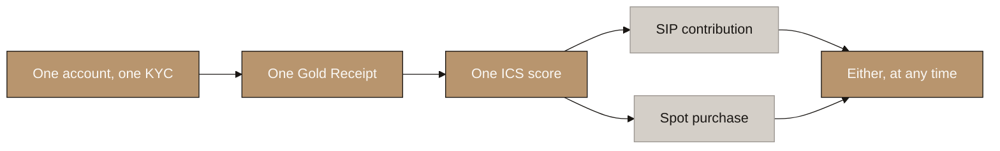

---

## 3. Day One: Opening an Account

<!-- SPEAKER NOTES:
"This is what the first five minutes now looks like. The investor completes KYC, the account opens, and from that moment three doors are open to them: buy spot, start a SIP, or do both on the same day.

There is no gate and no queue. Nothing is checked against a score they do not yet have. The score starts accruing the moment they make their first SIP contribution, and until then it is simply zero, which costs them nothing except the tier discount they have not earned yet."
-->

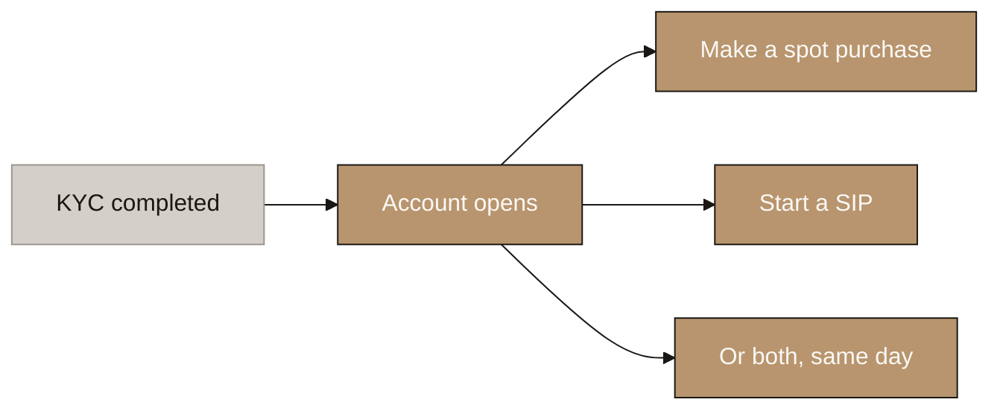

---

## 4. A SIP Contribution, End to End

<!-- SPEAKER NOTES:
"Here is a single SIP contribution from declaration to gold in the account. The investor declares a monthly amount and a contribution date. The minimum is 20 USD and the target you have set is 75 USD. The debit runs on their own anniversary date, not on a shared calendar day, exactly as an insurance premium does.

Funds clear, and allocation happens at the first LBMA morning fix after clearing, so under twenty four hours. Grams are credited, the Gold Receipt is issued, and ICS accrues for that period.

The important part is the last node. ICS accrues because a contribution arrived, not because of how large it was. A 20 USD contribution and a 2,000 USD contribution both register as one period contributed."
-->

```mermaid
%%{init: {'theme': 'base', 'themeVariables': {
    'primaryColor': '#B8956E',
    'primaryTextColor': '#1A1714',
    'primaryBorderColor': '#1A1714',
    'lineColor': '#1A1714',
    'secondaryColor': '#FAF8F5',
    'tertiaryColor': '#D4CFC8',
    'fontFamily': 'Libre Franklin, sans-serif',
    'edgeLabelBackground': '#D4CFC8',
    'clusterBkg': '#FAF8F5',
    'clusterBorder': '#B8956E'
}}}%%
graph LR
    A["Declared amount and date"] --> B["Debit on own anniversary"]
    B --> C["Funds clear"]
    C --> D["Allocated at next fix, T+1"]
    D --> E["Grams credited, receipt issued"]
    E --> F["ICS accrues"]

    style A fill:#D4CFC8,stroke:#9A9590,color:#1A1714
    style B fill:#D4CFC8,stroke:#9A9590,color:#1A1714
    style C fill:#D4CFC8,stroke:#9A9590,color:#1A1714
    style D fill:#B8956E,stroke:#1A1714,color:#FAF8F5
    style E fill:#B8956E,stroke:#1A1714,color:#FAF8F5
    style F fill:#B8956E,stroke:#1A1714,color:#FAF8F5
```

---

## 5. A Spot Purchase, End to End

<!-- SPEAKER NOTES:
"Now the same walk for a spot purchase, so you can see where the two paths diverge. A one-off payment, no declaration, no schedule. Then the middle of the flow is identical: same fix, same allocation, same gold, same receipt.

Three things differ, and all three sit outside the metal. The entry fee is flat at the top of the range, around 4 to 5%, with no tier discount. No ICS accrues. And a redemption fee attaches to those specific grams, decaying over 6 to 12 months.

That is the whole difference. A spot buyer gets clean gold exposure at a fair price and nothing else. If they want the tier discount, the credit line and the family features, the route to them is open the moment they start contributing."
-->

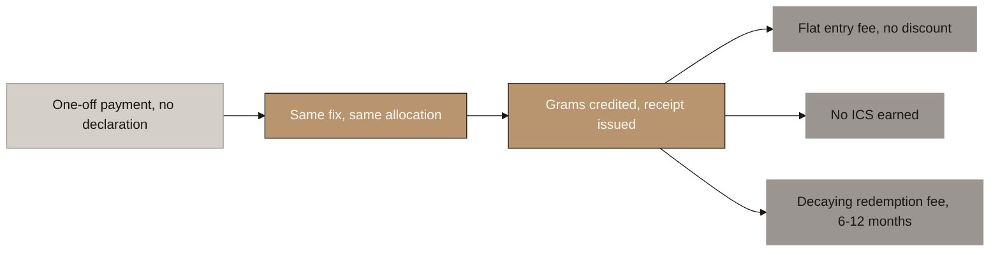

---

## 6. Same Gold, Different Wrapper

<!-- SPEAKER NOTES:
"This is the line that must not move. The gold itself is identical by channel: same token, same fix, same backing, same receipt. Those four things are shown in gold here because they are the invariant.

Only the wrapper differs, and the wrapper is fees and services. The moment the metal itself differs by channel, you have two economic classes of one instrument, and that is precisely the securities shape that deleting the scarcity layer was meant to remove. It would put back the problem we just spent a section taking out.

So when someone asks what a spot buyer is missing, the answer is never 'different gold'. It is a fee discount, a credit line and a set of account services."
-->

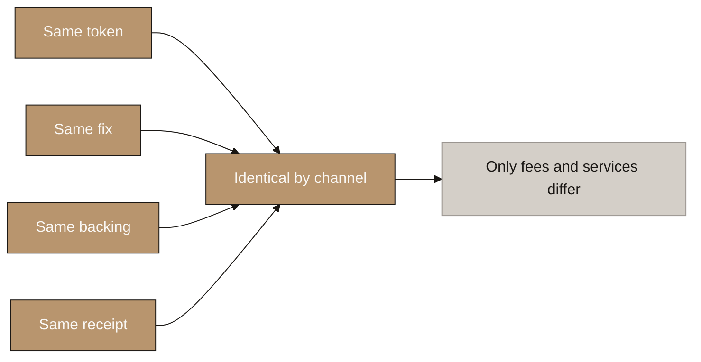

---

## 7. Three Levers, and Only Three

<!-- SPEAKER NOTES:
"If the gold cannot differ, the benefits have to sit somewhere, and there are exactly three places they can safely sit. Price: the entry fee falls with ICS tier, inside the 2 to 5% range. Credit: the loan-to-value ratio rises with ICS tier, in the 90 to 95% band, and spot-only accounts get none. Time: spot grams carry a decaying redemption fee and SIP grams do not.

All three are loyalty-programme shaped. None of them rations supply, all three are levers you genuinely control rather than ones the market sets, and none of them promises a return of any kind. Restricting benefits is a loyalty programme. Restricting supply is a rationed offering.

That is the entire safe surface. Anything a future feature adds outside these three should be treated as a new classification question, not as a product decision."
-->

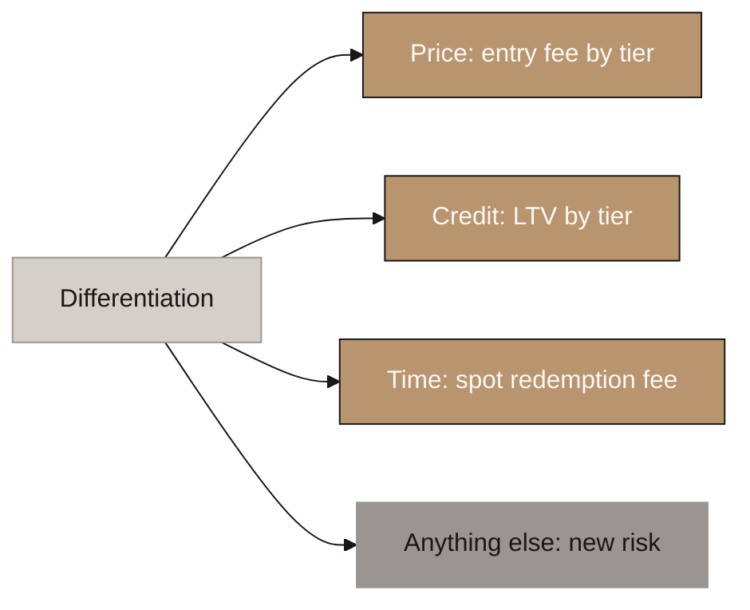

---

## 8. What Happened to the Commitment Period

<!-- SPEAKER NOTES:
"The design asked an investor to select a commitment of six months to twenty-five years, and missing a payment carried no financial penalty, only a loss of score. A commitment that costs nothing to break is free to make. Every rational investor should therefore select the longest term available, which means the choice tells you nothing about the investor. It cannot be scored, because a field on which everyone selects the same value does not discriminate between customers.

It also bought nothing. Look at your own section 6.2 table: the credit facility activates at month six in all six rows. It never varied by term at all. Buyback gated on term expiry would have locked a twenty-five year investor in for twenty-five years on a token that is also meant to trade. And the dividend multiplier scaled a payment that is now a rebate capped at the fees that customer generated.

So the contract is deleted and replaced with a declared savings goal. The investor declares a monthly amount, a date, and optionally a target. That drives the debit schedule and shows as progress in the app. It scores nothing and can be changed or abandoned at any time. Removing it costs no retention, because breaking the commitment and simply not paying already had identical consequences. It gains real acquisition, because the hardest moment in a 20 USD product is asking a stranger to commit for twenty-five years."
-->

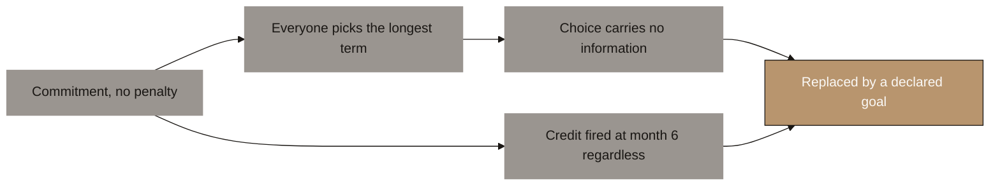

---

## 9. Confirmed SIP Is Backward-Looking

<!-- SPEAKER NOTES:
"The obvious objection is that Confirmed SIP requires six periods, so haven't we just put the commitment back in through the back door. No, and the difference is direction.

A commitment is forward-looking. The investor promises six months in advance and is bound by the promise. Confirmed SIP is backward-looking: after six consecutive contributions have actually been made, the status exists. The investor never agrees to anything at any point.

The practical consequence is the whole point. Someone who stops at month three has broken nothing and forfeited nothing. No lapse, no penalty, no arrears owed. They simply do not hold a status they had not yet earned. This is the same shape as the cumulative bonus in health insurance, where the policyholder does not promise to be claim-free for a year, but the bonus appears at renewal if they were.

One terminology rule attaches to this and it is not cosmetic. Never write 'six month commitment' anywhere in the product, the documentation or the interface. Write 'six consecutive contributions'. An investor who believes they are bound will behave as though a penalty exists, and that is the acquisition cost we just removed."
-->

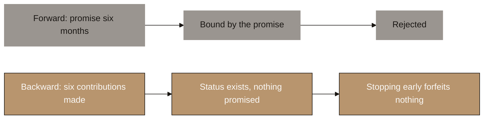

---

## 10. The Five Monthly Cases

<!-- SPEAKER NOTES:
"Five cases cover everything that can happen to an account in a given period, and each one has a defined ICS consequence.

Pays on time: gold allocated, ICS accrues. Pays less than usual but at or above the declared minimum: proportionally less gold, and the ICS is unaffected, because the score counts periods contributed rather than amounts. Pays late but within the 15-day grace: gold allocated at the fix on the day funds clear, ICS unaffected. Makes a spot purchase: gold allocated, no ICS, and the decaying redemption fee attaches to those grams.

Only one case steps the score down, and that is failing to pay within grace. Note what is gold on this diagram and what is not: four of the five outcomes leave the score intact. That is deliberate. The score should punish a pattern, not an administrative accident."
-->

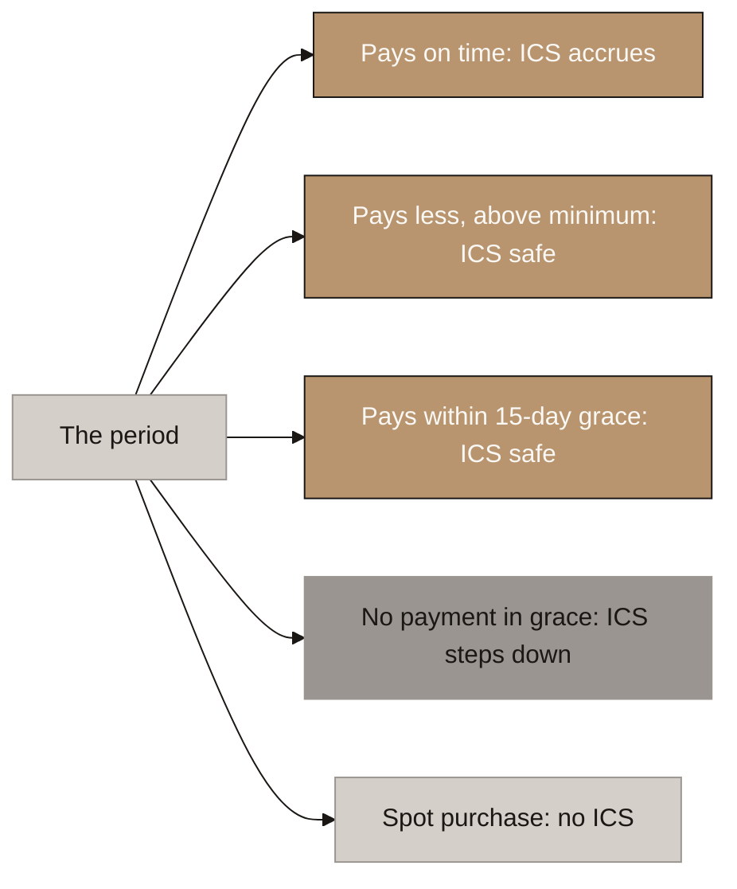

---

## 11. Miss, Grace, Step-Down, Revival

<!-- SPEAKER NOTES:
"Follow the one bad case all the way through, because this is where retention is won or lost.

The contribution date passes. Fifteen days of grace run from the investor's own date, which is the IRDAI standard for monthly-mode premiums. Miss that, and the score steps down one level. It does not reset. A reset punishes several good years for one bad month and leaves the investor with nothing left to protect, which is exactly the moment they leave. Rebuilding is slower than the step-down, which is your own stated intent expressed as a rule. The size of the step and the rebuild rate wait for the formula.

Then the revival window: twelve months to make good the missed period through arrears, which restores the streak and the tier. And running underneath all of it, the gold is untouched. Every consequence in this model falls on tier, fee or credit ratio. The gram count only ever rises."
-->

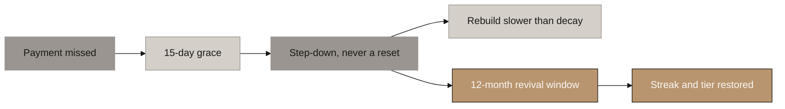

---

## 12. Arrears Price at Today's Fix

<!-- SPEAKER NOTES:
"One financial rule has to sit under the revival window, and getting it wrong is expensive.

If arrears purchase gold at the price of the period being made good, revival becomes a free look-back option on gold. Every investor revives after the price has risen and nobody revives after it has fallen. Aurumix buys at today's price to deliver at a historic one, the exposure runs in one direction only, and it cannot be hedged because the investor chooses when to exercise it.

So arrears buy gold at the fix on the day the payment clears, never at the fix of the period being made good. Priced that way an arrears payment is economically identical to a contribution made today, and no option value exists. What the payment buys is the score position, not the price. The investor gets their streak, their tier and their Confirmed SIP status back, and they pay the current market price for the metal like everyone else.

That is also why a twelve month window is affordable here. There is no adverse selection to underwrite against, which is why a life insurer needs three years, interest on arrears and fresh medical underwriting to offer the same thing."
-->

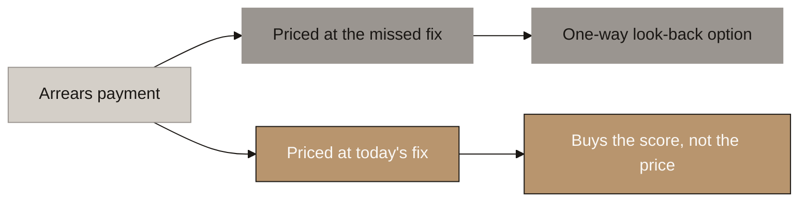

---

## 13. What the ICS Score Measures

<!-- SPEAKER NOTES:
"Here is what goes into the score and what comes out of it.

Two primary components. Continuity is the current unbroken streak of contributions. Tenure is the total number of periods actually contributed. They look like one component and they must stay as two, because without tenure an investor who contributes flawlessly for eight months sits at the top tier beside a five year customer. They also fail in opposite directions: a long-standing customer who has become unreliable and a flawless newcomer should not score the same, in either direction.

Then three supplementaries, each capped: referrals, family portfolios where sub-accounts make their own contributions, and Masterclass engagement. Capped, so none of them can substitute for actually contributing.

And Investment Value comes out entirely. It was being counted twice already, once inside the score and again as the multiplier applied to the score. The weights on all of these wait for the formula, but the structure is settled."
-->

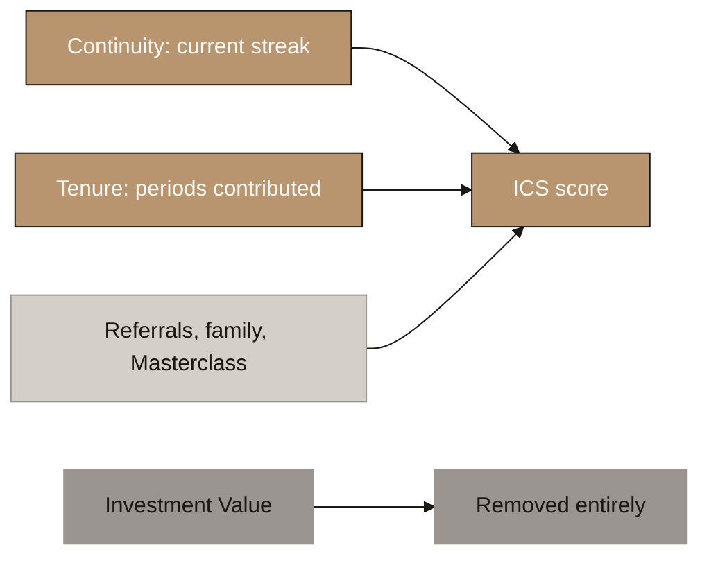

---

## 14. Why Amount Cannot Be Scored

<!-- SPEAKER NOTES:
"This is the reasoning behind removing Investment Value, and it is worth doing slowly because it is the load-bearing argument in the whole block.

Amount is already rewarded, automatically and proportionally. Every benefit in the product is a percentage. A larger contributor receives more gold, a larger absolute credit line and a larger absolute rebate, because all three are percentages of a larger base. The score does not need to do anything for that to happen.

Reward amount a second time inside the score and you convert a proportional benefit into a preferential rate. A better percentage bought with capital is a return proportional to investment, which is the defining feature of a security. It is the same defect that forced the dividend to be replaced.

That gives you one binding test on the formula, and it is checkable: a 20 USD per month saver who never misses a payment must be able to reach the top tier. If the formula cannot deliver that, what you have built is not a loyalty programme. It is a preference class for larger investors."
-->

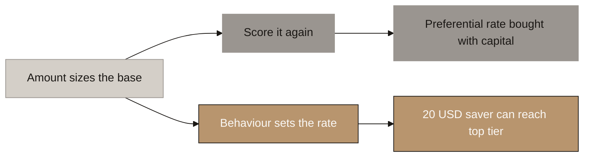

---

## 15. Credit Is a Ladder, Not a Switch

<!-- SPEAKER NOTES:
"One structural change to how the credit facility works, and it is about retention rather than compliance.

Under a single activation point, credit switches on at month six and then does nothing. An investor at month seven and an investor at month sixty hold identical borrowing power, so the facility does no retention work at all after the month it arrives. You spent the feature and got one month of value from it.

Make it a ladder instead. It still starts at month six, and then the loan-to-value ratio rises with tenure and tier inside the 90 to 95% band. Every additional month of contributions buys something. Which means leaving always costs the climb, and it costs more the longer they have been climbing. Given that your persistency problem is steepest in year two, that is exactly where you want the pull to be strongest.

The step sizes on the ladder wait for the tier structure."
-->

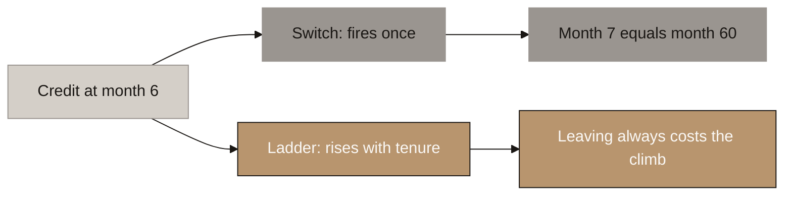

---

## 16. Two Doors Out

<!-- SPEAKER NOTES:
"Finally, the exit, because a savings product is judged on how it lets people leave.

SIP grams: buyback at NAV, no exit penalty. The investor contributed consistently and there is nothing to discourage on the way out. Spot grams: buyback at NAV less a redemption fee that decays over 6 to 12 months, so a spot buyer holding for a year exits on the same terms as everyone else. The exact decay schedule is still to be set. Both doors are cash buyback. There is no physical redemption at these ticket sizes.

Two details are still open and I want to flag them rather than pretend they are closed: whether SIP or spot grams are sold first on a partial exit, since only spot grams carry the fee, and whether the credit ratio applies to all grams or only SIP-acquired ones.

And the promise that governs all of it, in exactly these words: you can lose your status, you can never lose your gold. Every consequence in this design falls on tier, fee or credit ratio. The gram count only ever rises."
-->

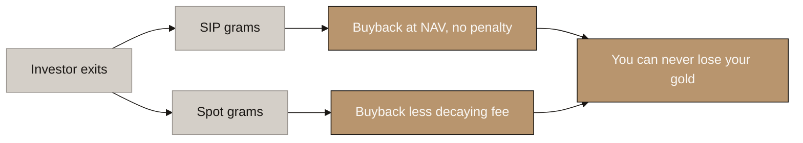
