# Aurumix Process Maps

> The diagram set for the Aurumix Mechanism Design Document. Each diagram is
> numbered by the document section it belongs to. Extracted from the Phase 2
> map sets and verified against the decision log; the full sets with speaker
> notes remain in `deliverables/2-mechanism-design/`.

## 2a. Token denomination: 1 AURX = 1 gram

Why the token count is the gram count, and what that fixes.

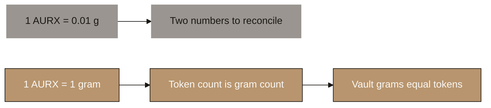

---

## 2b. The premium: three ways it fails

Liquid markets arbitrage it away, illiquid markets cannot express it, and it is not Aurumix's to promise.

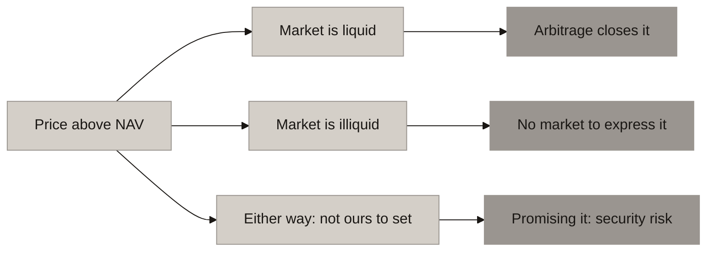

---

## 3a. The classification fork

Direct-ownership ARVA against stable-value ARVA: what each costs.

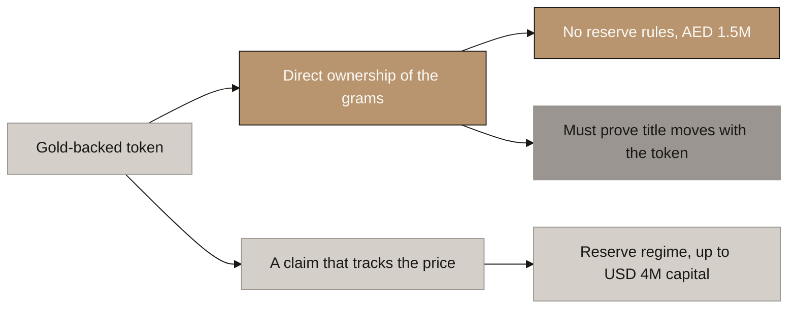

---

## 3b. Three ways to put the gold beyond reach

Caretaker contract, DIFC vehicle, or naming customers at the vault.

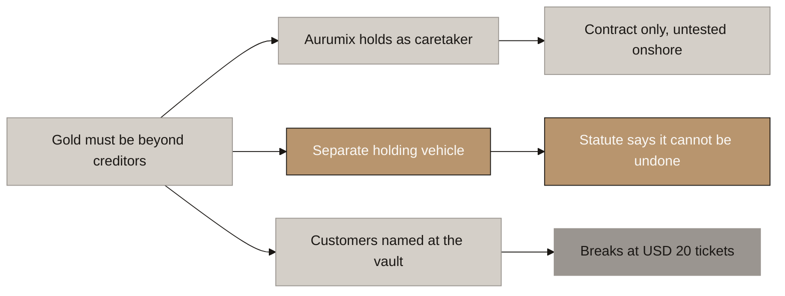

---

## 3c. The entity map

Issuer, technology company, holding vehicle and the contracted partners.

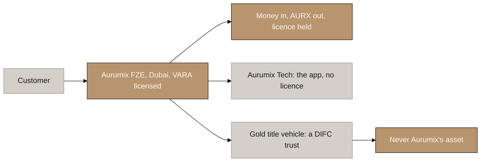

---

## 3d. What moves when the token moves

Under the class-defined trust, the transfer is the change of ownership.

```mermaid
%%{init: {'theme': 'base', 'themeVariables': {
    'primaryColor': '#B8956E',
    'primaryTextColor': '#1A1714',
    'primaryBorderColor': '#1A1714',
    'lineColor': '#1A1714',
    'secondaryColor': '#FAF8F5',
    'tertiaryColor': '#D4CFC8',
    'fontFamily': 'Libre Franklin, sans-serif',
    'edgeLabelBackground': '#D4CFC8',
    'clusterBkg': '#FAF8F5',
    'clusterBorder': '#B8956E'
}}}%%
graph LR
    A["Ali sends AURX to Sara"] --> B["Gold stays in the vehicle"]
    B --> C["Trust deed reads the ledger"]
    C --> D["Sara owns the grams"]
    D --> E["No register write, no approval"]

    style A fill:#D4CFC8,stroke:#9A9590,color:#1A1714
    style B fill:#B8956E,stroke:#1A1714,color:#FAF8F5
    style C fill:#B8956E,stroke:#1A1714,color:#FAF8F5
    style D fill:#B8956E,stroke:#1A1714,color:#FAF8F5
    style E fill:#B8956E,stroke:#1A1714,color:#FAF8F5
```

---

## 4a. Identity at the two doors

KYC at mint and redemption; freedom in the room.

```mermaid
%%{init: {'theme': 'base', 'themeVariables': {
    'primaryColor': '#B8956E',
    'primaryTextColor': '#1A1714',
    'primaryBorderColor': '#1A1714',
    'lineColor': '#1A1714',
    'secondaryColor': '#FAF8F5',
    'tertiaryColor': '#D4CFC8',
    'fontFamily': 'Libre Franklin, sans-serif',
    'edgeLabelBackground': '#D4CFC8',
    'clusterBkg': '#FAF8F5',
    'clusterBorder': '#B8956E'
}}}%%
graph LR
    A["Money in, full KYC"] --> B["Gold bought, tokens issued"]
    B --> C["Hold and trade, no checks"]
    C --> D["Cash out, full KYC"]
    D --> E["VARA requires this exit check"]

    style A fill:#B8956E,stroke:#1A1714,color:#FAF8F5
    style B fill:#B8956E,stroke:#1A1714,color:#FAF8F5
    style C fill:#D4CFC8,stroke:#9A9590,color:#1A1714
    style D fill:#B8956E,stroke:#1A1714,color:#FAF8F5
    style E fill:#9A9590,stroke:#9A9590,color:#1A1714
```

---

## 4b. One hook, two settings

The blocklist ships; the allowlist is the engineered fallback.

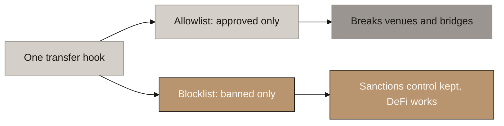

---

## 4c. Why the wrapper fails

A permissioned base with an open wrapper gives the wrapped holder no gold.

```mermaid
%%{init: {'theme': 'base', 'themeVariables': {
    'primaryColor': '#B8956E',
    'primaryTextColor': '#1A1714',
    'primaryBorderColor': '#1A1714',
    'lineColor': '#1A1714',
    'secondaryColor': '#FAF8F5',
    'tertiaryColor': '#D4CFC8',
    'fontFamily': 'Libre Franklin, sans-serif',
    'edgeLabelBackground': '#D4CFC8',
    'clusterBkg': '#FAF8F5',
    'clusterBorder': '#B8956E'
}}}%%
graph LR
    A["AURX locked in a wrapper"] --> B["The contract is the owner"]
    B --> C["Wrapped holder owns a claim"]
    C --> D["Direct ownership dies in DeFi"]
    D --> E["Kinesis does this today"]

    style A fill:#D4CFC8,stroke:#9A9590,color:#1A1714
    style B fill:#9A9590,stroke:#9A9590,color:#1A1714
    style C fill:#D4CFC8,stroke:#9A9590,color:#1A1714
    style D fill:#D4CFC8,stroke:#9A9590,color:#1A1714
    style E fill:#9A9590,stroke:#9A9590,color:#1A1714
```

---

## 5a. One pipe, two doors

SIP and spot run the identical purchase pipeline.

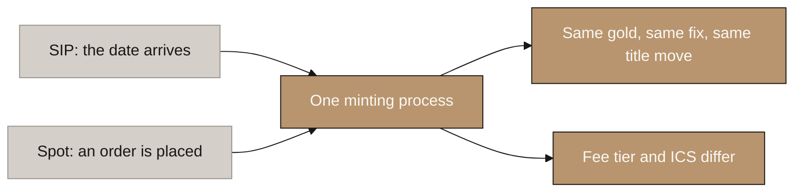

---

## 5b. Money, then title, then token

The ordering rule on every purchase, and why the mint halts if title cannot be recorded.

```mermaid
%%{init: {'theme': 'base', 'themeVariables': {
    'primaryColor': '#B8956E',
    'primaryTextColor': '#1A1714',
    'primaryBorderColor': '#1A1714',
    'lineColor': '#1A1714',
    'secondaryColor': '#FAF8F5',
    'tertiaryColor': '#D4CFC8',
    'fontFamily': 'Libre Franklin, sans-serif',
    'edgeLabelBackground': '#D4CFC8',
    'clusterBkg': '#FAF8F5',
    'clusterBorder': '#B8956E'
}}}%%
graph LR
    A["Funds clear into the Client Account"] --> B["Price struck at the next LBMA fix"]
    B --> C["Title crosses: float to trust"]
    C --> D["Token minted, 1 AURX per gram"]
    D --> E["Entry fee becomes Aurumix's"]

    style A fill:#D4CFC8,stroke:#9A9590,color:#1A1714
    style B fill:#B8956E,stroke:#1A1714,color:#FAF8F5
    style C fill:#B8956E,stroke:#1A1714,color:#FAF8F5
    style D fill:#B8956E,stroke:#1A1714,color:#FAF8F5
    style E fill:#B8956E,stroke:#1A1714,color:#FAF8F5
```

---

## 5c. What USD 75 buys

One contribution walked end to end.

```mermaid
%%{init: {'theme': 'base', 'themeVariables': {
    'primaryColor': '#B8956E',
    'primaryTextColor': '#1A1714',
    'primaryBorderColor': '#1A1714',
    'lineColor': '#1A1714',
    'secondaryColor': '#FAF8F5',
    'tertiaryColor': '#D4CFC8',
    'fontFamily': 'Libre Franklin, sans-serif',
    'edgeLabelBackground': '#D4CFC8',
    'clusterBkg': '#FAF8F5',
    'clusterBorder': '#B8956E'
}}}%%
graph LR
    A["Contribution USD 75.00"] --> B["Less 5% entry fee, USD 3.75"]
    B --> C["USD 71.25 buys gold"]
    C --> D["LBMA fix USD 3,400/oz = USD 109.31/g"]
    D --> E["0.6518 grams"]
    E --> F["0.6518 AURX, since 1 AURX = 1 g"]

    style A fill:#D4CFC8,stroke:#9A9590,color:#1A1714
    style B fill:#B8956E,stroke:#1A1714,color:#FAF8F5
    style C fill:#B8956E,stroke:#1A1714,color:#FAF8F5
    style D fill:#B8956E,stroke:#1A1714,color:#FAF8F5
    style E fill:#B8956E,stroke:#1A1714,color:#FAF8F5
    style F fill:#B8956E,stroke:#1A1714,color:#FAF8F5
```

---

## 5d. A month that goes wrong

The 5-day grace window, the hard floor, and what a miss does and does not cost.

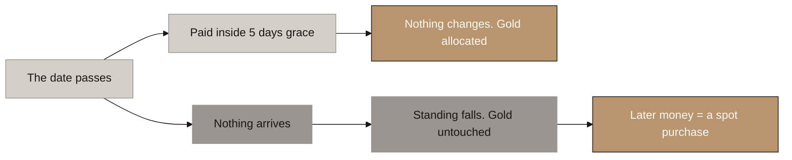

---

## 6a. The lumpiness problem

Retail tickets against wholesale bars.

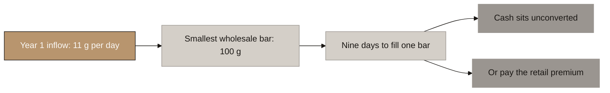

---

## 6b. The float: how it works

Grams move from the float to the customer the same day; the treasury replenishes on a threshold.

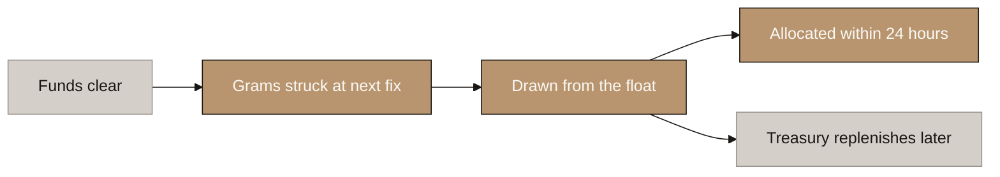

---

## 6c. The float fixes the buyback

Exits return grams to the float; the next buyer consumes them.

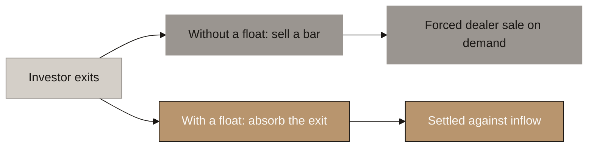

---

## 7a. The exit path

Checks, next fix, burn, title return, payout.

```mermaid
%%{init: {'theme': 'base', 'themeVariables': {
    'primaryColor': '#B8956E',
    'primaryTextColor': '#1A1714',
    'primaryBorderColor': '#1A1714',
    'lineColor': '#1A1714',
    'secondaryColor': '#FAF8F5',
    'tertiaryColor': '#D4CFC8',
    'fontFamily': 'Libre Franklin, sans-serif',
    'edgeLabelBackground': '#D4CFC8',
    'clusterBkg': '#FAF8F5',
    'clusterBorder': '#B8956E'
}}}%%
graph LR
    A["Request, then checks"] --> B["Price struck at the next fix"]
    B --> C["Tokens burned"]
    C --> D["Grams return to the float"]
    D --> E["Cash to their own bank, T+1"]

    style A fill:#D4CFC8,stroke:#9A9590,color:#1A1714
    style B fill:#B8956E,stroke:#1A1714,color:#FAF8F5
    style C fill:#B8956E,stroke:#1A1714,color:#FAF8F5
    style D fill:#B8956E,stroke:#1A1714,color:#FAF8F5
    style E fill:#B8956E,stroke:#1A1714,color:#FAF8F5
```

---

## 7b. Why a zero-fee exit is affordable

The dealer spread is paid on net outflow, not gross exits.

```mermaid
%%{init: {'theme': 'base', 'themeVariables': {
    'primaryColor': '#B8956E',
    'primaryTextColor': '#1A1714',
    'primaryBorderColor': '#1A1714',
    'lineColor': '#1A1714',
    'secondaryColor': '#FAF8F5',
    'tertiaryColor': '#D4CFC8',
    'fontFamily': 'Libre Franklin, sans-serif',
    'edgeLabelBackground': '#D4CFC8',
    'clusterBkg': '#FAF8F5',
    'clusterBorder': '#B8956E'
}}}%%
graph LR
    A["Customer exits"] --> B["Grams return to the float"]
    B --> C["The next buyer consumes them"]
    C --> D["No physical gold sold"]
    D --> E["Spread paid on net outflow only"]

    style A fill:#D4CFC8,stroke:#9A9590,color:#1A1714
    style B fill:#B8956E,stroke:#1A1714,color:#FAF8F5
    style C fill:#B8956E,stroke:#1A1714,color:#FAF8F5
    style D fill:#B8956E,stroke:#1A1714,color:#FAF8F5
    style E fill:#B8956E,stroke:#1A1714,color:#FAF8F5
```

---

## 7c. When the float is not enough

The disclosed, size-tiered settlement windows.

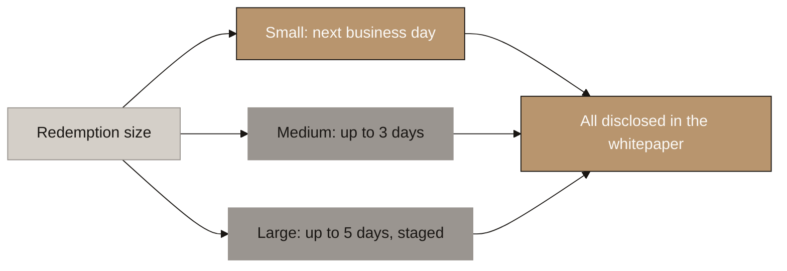

---

## 8a. The gate

Six consecutive contributions open the score. Permanent once earned.

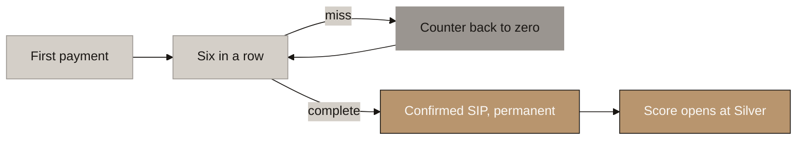

---

## 8b. The formula

min(Record, Standing) x Retention.

```mermaid
%%{init: {'theme': 'base', 'themeVariables': {
    'primaryColor': '#B8956E',
    'primaryTextColor': '#1A1714',
    'primaryBorderColor': '#1A1714',
    'lineColor': '#1A1714',
    'secondaryColor': '#FAF8F5',
    'tertiaryColor': '#D4CFC8',
    'fontFamily': 'Libre Franklin, sans-serif',
    'edgeLabelBackground': '#D4CFC8',
    'clusterBkg': '#FAF8F5',
    'clusterBorder': '#B8956E'
}}}%%
graph LR
    A["Record, from months paid"] --> C["min ( Record , Standing )"]
    B["Standing, from last twelve"] --> C
    C --> D["× Retention"]
    D --> E["ICS, 0 to 100"]

    style A fill:#D4CFC8,stroke:#9A9590,color:#1A1714
    style B fill:#D4CFC8,stroke:#9A9590,color:#1A1714
    style C fill:#B8956E,stroke:#1A1714,color:#FAF8F5
    style D fill:#B8956E,stroke:#1A1714,color:#FAF8F5
    style E fill:#B8956E,stroke:#1A1714,color:#FAF8F5
```

---

## 8c. The ladder

Five tiers, four named, at 25 / 50 / 75 / 100.

```mermaid
%%{init: {'theme': 'base', 'themeVariables': {
    'primaryColor': '#B8956E',
    'primaryTextColor': '#1A1714',
    'primaryBorderColor': '#1A1714',
    'lineColor': '#1A1714',
    'secondaryColor': '#FAF8F5',
    'tertiaryColor': '#D4CFC8',
    'fontFamily': 'Libre Franklin, sans-serif',
    'edgeLabelBackground': '#D4CFC8',
    'clusterBkg': '#FAF8F5',
    'clusterBorder': '#B8956E'
}}}%%
graph LR
    A["No tier, no score"] --> B["Silver, 25"]
    B --> C["Gold, 50"]
    C --> D["Platinum, 75"]
    D --> E["Sovereign, 100"]

    style A fill:#9A9590,stroke:#9A9590,color:#1A1714
    style B fill:#D4CFC8,stroke:#9A9590,color:#1A1714
    style C fill:#B8956E,stroke:#1A1714,color:#FAF8F5
    style D fill:#B8956E,stroke:#1A1714,color:#FAF8F5
    style E fill:#B8956E,stroke:#1A1714,color:#FAF8F5
```

---

## 8d. The climb

Silver at six months, Gold at one year, Platinum at three, Sovereign at five.

```mermaid
%%{init: {'theme': 'base', 'themeVariables': {
    'primaryColor': '#B8956E',
    'primaryTextColor': '#1A1714',
    'primaryBorderColor': '#1A1714',
    'lineColor': '#1A1714',
    'secondaryColor': '#FAF8F5',
    'tertiaryColor': '#D4CFC8',
    'fontFamily': 'Libre Franklin, sans-serif',
    'edgeLabelBackground': '#D4CFC8',
    'clusterBkg': '#FAF8F5',
    'clusterBorder': '#B8956E'
}}}%%
graph LR
    A["Six payments"] --> B["Silver at six months"]
    B --> C["Gold at one year"]
    C --> D["Platinum at three years"]
    D --> E["Sovereign at five years"]

    style A fill:#D4CFC8,stroke:#9A9590,color:#1A1714
    style B fill:#B8956E,stroke:#1A1714,color:#FAF8F5
    style C fill:#B8956E,stroke:#1A1714,color:#FAF8F5
    style D fill:#B8956E,stroke:#1A1714,color:#FAF8F5
    style E fill:#B8956E,stroke:#1A1714,color:#FAF8F5
```

---

## 8e. The miss

A miss reduces Recent for twelve months, then ages out. Nothing else happens.

```mermaid
%%{init: {'theme': 'base', 'themeVariables': {
    'primaryColor': '#B8956E',
    'primaryTextColor': '#1A1714',
    'primaryBorderColor': '#1A1714',
    'lineColor': '#1A1714',
    'secondaryColor': '#FAF8F5',
    'tertiaryColor': '#D4CFC8',
    'fontFamily': 'Libre Franklin, sans-serif',
    'edgeLabelBackground': '#D4CFC8',
    'clusterBkg': '#FAF8F5',
    'clusterBorder': '#B8956E'
}}}%%
graph LR
    A["Miss one month"] --> B["Recent falls by one"]
    B --> C["Ages out after twelve"]
    C --> D["Gold untouched throughout"]
    E["Four in a row"] --> F["One tier lost"]

    style A fill:#D4CFC8,stroke:#9A9590,color:#1A1714
    style B fill:#D4CFC8,stroke:#9A9590,color:#1A1714
    style C fill:#D4CFC8,stroke:#9A9590,color:#1A1714
    style D fill:#B8956E,stroke:#1A1714,color:#FAF8F5
    style E fill:#9A9590,stroke:#9A9590,color:#1A1714
    style F fill:#9A9590,stroke:#9A9590,color:#1A1714
```

---

## 8f. The cycler

A flawless payment record with no held gold floors at Silver forever.

```mermaid
%%{init: {'theme': 'base', 'themeVariables': {
    'primaryColor': '#B8956E',
    'primaryTextColor': '#1A1714',
    'primaryBorderColor': '#1A1714',
    'lineColor': '#1A1714',
    'secondaryColor': '#FAF8F5',
    'tertiaryColor': '#D4CFC8',
    'fontFamily': 'Libre Franklin, sans-serif',
    'edgeLabelBackground': '#D4CFC8',
    'clusterBkg': '#FAF8F5',
    'clusterBorder': '#B8956E'
}}}%%
graph LR
    A["Pays every month, perfectly"] --> B["Sells it all, monthly"]
    B --> C["Retention reads zero"]
    C --> D["Score zero, floored at Silver"]
    D --> E["Three tiers below a saver"]

    style A fill:#D4CFC8,stroke:#9A9590,color:#1A1714
    style B fill:#9A9590,stroke:#9A9590,color:#1A1714
    style C fill:#9A9590,stroke:#9A9590,color:#1A1714
    style D fill:#B8956E,stroke:#1A1714,color:#FAF8F5
    style E fill:#B8956E,stroke:#1A1714,color:#FAF8F5
```

---

## 9a. What unlocks at each tier

The full tier by benefit matrix.

```mermaid
%%{init: {'theme': 'base', 'themeVariables': {
    'primaryColor': '#B8956E',
    'primaryTextColor': '#1A1714',
    'primaryBorderColor': '#1A1714',
    'lineColor': '#1A1714',
    'secondaryColor': '#FAF8F5',
    'tertiaryColor': '#D4CFC8',
    'fontFamily': 'Libre Franklin, sans-serif',
    'edgeLabelBackground': '#D4CFC8',
    'clusterBkg': '#FAF8F5',
    'clusterBorder': '#B8956E'
}}}%%
graph TD
    A["Silver"] --> A1["0.4pp off entry fee"]
    A1 --> A2["Will plan 10% off"]
    B["Gold"] --> B1["Credit unlocks at 50%"]
    B1 --> B2["Card L1, Rewards 0.15%"]
    B2 --> B3["0.8pp off, will 20%"]
    C["Platinum"] --> C1["Credit 65%, card L2"]
    C1 --> C2["Rewards 0.45%, 1.2pp off"]
    C2 --> C3["Will 35%, beneficiary 10%"]
    D["Sovereign"] --> D1["Credit 80%, card L3"]
    D1 --> D2["Rewards 0.75%, 1.5pp off"]
    D2 --> D3["Will 50%, beneficiary 20%"]

    style A fill:#D4CFC8,stroke:#9A9590,color:#1A1714
    style B fill:#B8956E,stroke:#1A1714,color:#FAF8F5
    style C fill:#B8956E,stroke:#1A1714,color:#FAF8F5
    style D fill:#B8956E,stroke:#1A1714,color:#FAF8F5
    style A1 fill:#D4CFC8,stroke:#9A9590,color:#1A1714
    style A2 fill:#D4CFC8,stroke:#9A9590,color:#1A1714
    style B1 fill:#D4CFC8,stroke:#9A9590,color:#1A1714
    style B2 fill:#D4CFC8,stroke:#9A9590,color:#1A1714
    style B3 fill:#D4CFC8,stroke:#9A9590,color:#1A1714
    style C1 fill:#D4CFC8,stroke:#9A9590,color:#1A1714
    style C2 fill:#D4CFC8,stroke:#9A9590,color:#1A1714
    style C3 fill:#D4CFC8,stroke:#9A9590,color:#1A1714
    style D1 fill:#D4CFC8,stroke:#9A9590,color:#1A1714
    style D2 fill:#D4CFC8,stroke:#9A9590,color:#1A1714
    style D3 fill:#D4CFC8,stroke:#9A9590,color:#1A1714
```

---

## 9b. The entry-fee discount, worked

What the ladder is worth to a USD 75 saver, in grams.

```mermaid
%%{init: {'theme': 'base', 'themeVariables': {
    'primaryColor': '#B8956E',
    'primaryTextColor': '#1A1714',
    'primaryBorderColor': '#1A1714',
    'lineColor': '#1A1714',
    'secondaryColor': '#FAF8F5',
    'tertiaryColor': '#D4CFC8',
    'fontFamily': 'Libre Franklin, sans-serif',
    'edgeLabelBackground': '#D4CFC8',
    'clusterBkg': '#FAF8F5',
    'clusterBorder': '#B8956E'
}}}%%
graph LR
    A["First payment: USD 75"] --> B["Base fee 5%"]
    B --> C["0.6518 g allocated"]
    D["60th payment: USD 75"] --> E["Sovereign fee 3.5%"]
    E --> F["0.6621 g allocated"]

    style A fill:#D4CFC8,stroke:#9A9590,color:#1A1714
    style B fill:#D4CFC8,stroke:#9A9590,color:#1A1714
    style C fill:#D4CFC8,stroke:#9A9590,color:#1A1714
    style D fill:#D4CFC8,stroke:#9A9590,color:#1A1714
    style E fill:#B8956E,stroke:#1A1714,color:#FAF8F5
    style F fill:#B8956E,stroke:#1A1714,color:#FAF8F5
```

---

## 10a. One facility, two draws

The cash channel and the card channel spend the same limit.

```mermaid
%%{init: {'theme': 'base', 'themeVariables': {
    'primaryColor': '#B8956E',
    'primaryTextColor': '#1A1714',
    'primaryBorderColor': '#1A1714',
    'lineColor': '#1A1714',
    'secondaryColor': '#FAF8F5',
    'tertiaryColor': '#D4CFC8',
    'fontFamily': 'Libre Franklin, sans-serif',
    'edgeLabelBackground': '#D4CFC8',
    'clusterBkg': '#FAF8F5',
    'clusterBorder': '#B8956E'
}}}%%
graph LR
    A["Pledged gold, one facility"] --> B["Cash draw to the bank"]
    A --> C["Card tap at a shop"]
    B --> D["Lending revenue"]
    C --> D
    C --> E["Plus merchant interchange"]

    style A fill:#D4CFC8,stroke:#9A9590,color:#1A1714
    style B fill:#D4CFC8,stroke:#9A9590,color:#1A1714
    style C fill:#D4CFC8,stroke:#9A9590,color:#1A1714
    style D fill:#B8956E,stroke:#1A1714,color:#FAF8F5
    style E fill:#B8956E,stroke:#1A1714,color:#FAF8F5
```

---

## 10b. A card tap in three seconds

Just-in-time authorisation against live collateral headroom.

```mermaid
%%{init: {'theme': 'base', 'themeVariables': {
    'primaryColor': '#B8956E',
    'primaryTextColor': '#1A1714',
    'primaryBorderColor': '#1A1714',
    'lineColor': '#1A1714',
    'secondaryColor': '#FAF8F5',
    'tertiaryColor': '#D4CFC8',
    'fontFamily': 'Libre Franklin, sans-serif',
    'edgeLabelBackground': '#D4CFC8',
    'clusterBkg': '#FAF8F5',
    'clusterBorder': '#B8956E'
}}}%%
graph LR
    A["Customer taps"] --> B["Network asks the processor"]
    B --> C["Processor asks Aurumix"]
    C --> D["Grams times fix times ratio"]
    D --> E["Approve, decline or partial"]
    E --> F["Three seconds or auto-decline"]

    style A fill:#D4CFC8,stroke:#9A9590,color:#1A1714
    style B fill:#D4CFC8,stroke:#9A9590,color:#1A1714
    style C fill:#D4CFC8,stroke:#9A9590,color:#1A1714
    style D fill:#D4CFC8,stroke:#9A9590,color:#1A1714
    style E fill:#B8956E,stroke:#1A1714,color:#FAF8F5
    style F fill:#B8956E,stroke:#1A1714,color:#FAF8F5
```

---

## 10c. The liquidation ladder

Notice at 85, cure at 88, partial sale at 92 restoring 88.

```mermaid
%%{init: {'theme': 'base', 'themeVariables': {
    'primaryColor': '#B8956E',
    'primaryTextColor': '#1A1714',
    'primaryBorderColor': '#1A1714',
    'lineColor': '#1A1714',
    'secondaryColor': '#FAF8F5',
    'tertiaryColor': '#D4CFC8',
    'fontFamily': 'Libre Franklin, sans-serif',
    'edgeLabelBackground': '#D4CFC8',
    'clusterBkg': '#FAF8F5',
    'clusterBorder': '#B8956E'
}}}%%
graph LR
    A["85 percent: notice only"] --> B["88 percent: 14 days to cure"]
    B --> C["Add gold, repay or top up"]
    C --> D["Cured, facility continues"]
    B --> E["92 percent: partial sale"]
    E --> F["Sold back to 88, no further"]

    style A fill:#D4CFC8,stroke:#9A9590,color:#1A1714
    style B fill:#D4CFC8,stroke:#9A9590,color:#1A1714
    style C fill:#D4CFC8,stroke:#9A9590,color:#1A1714
    style D fill:#B8956E,stroke:#1A1714,color:#FAF8F5
    style E fill:#9A9590,stroke:#9A9590,color:#1A1714
    style F fill:#B8956E,stroke:#1A1714,color:#FAF8F5
```

---

## 10d. Who is actually exposed

The gold fall each tier needs before the ladder bites.

```mermaid
%%{init: {'theme': 'base', 'themeVariables': {
    'primaryColor': '#B8956E',
    'primaryTextColor': '#1A1714',
    'primaryBorderColor': '#1A1714',
    'lineColor': '#1A1714',
    'secondaryColor': '#FAF8F5',
    'tertiaryColor': '#D4CFC8',
    'fontFamily': 'Libre Franklin, sans-serif',
    'edgeLabelBackground': '#D4CFC8',
    'clusterBkg': '#FAF8F5',
    'clusterBorder': '#B8956E'
}}}%%
graph LR
    A["Gold tier, drawn at 50"] --> B["Needs a 46 percent fall"]
    C["Platinum, drawn at 65"] --> D["Needs a 29 percent fall"]
    E["Sovereign, drawn at 80"] --> F["Needs a 13 percent fall"]

    style A fill:#D4CFC8,stroke:#9A9590,color:#1A1714
    style B fill:#B8956E,stroke:#1A1714,color:#FAF8F5
    style C fill:#D4CFC8,stroke:#9A9590,color:#1A1714
    style D fill:#B8956E,stroke:#1A1714,color:#FAF8F5
    style E fill:#D4CFC8,stroke:#9A9590,color:#1A1714
    style F fill:#9A9590,stroke:#9A9590,color:#1A1714
```

---

## 11a. The family product, end to end

Registration, triggers, authority, execution.

```mermaid
%%{init: {'theme': 'base', 'themeVariables': {
    'primaryColor': '#B8956E',
    'primaryTextColor': '#1A1714',
    'primaryBorderColor': '#1A1714',
    'lineColor': '#1A1714',
    'secondaryColor': '#FAF8F5',
    'tertiaryColor': '#D4CFC8',
    'fontFamily': 'Libre Franklin, sans-serif',
    'edgeLabelBackground': '#D4CFC8',
    'clusterBkg': '#FAF8F5',
    'clusterBorder': '#B8956E'
}}}%%
graph LR
    A["You name your family"] --> B["They watch it grow"]
    B --> C["The moment arrives"]
    C --> D["Already named and verified"]
    D --> E["Transferred in days"]

    style A fill:#D4CFC8,stroke:#9A9590,color:#1A1714
    style B fill:#D4CFC8,stroke:#9A9590,color:#1A1714
    style C fill:#D4CFC8,stroke:#9A9590,color:#1A1714
    style D fill:#D4CFC8,stroke:#9A9590,color:#1A1714
    style E fill:#B8956E,stroke:#1A1714,color:#FAF8F5
```

---

## 11b. Three triggers, three different legal events

Date and condition are lifetime gifts; death is succession.

```mermaid
%%{init: {'theme': 'base', 'themeVariables': {
    'primaryColor': '#B8956E',
    'primaryTextColor': '#1A1714',
    'primaryBorderColor': '#1A1714',
    'lineColor': '#1A1714',
    'secondaryColor': '#FAF8F5',
    'tertiaryColor': '#D4CFC8',
    'fontFamily': 'Libre Franklin, sans-serif',
    'edgeLabelBackground': '#D4CFC8',
    'clusterBkg': '#FAF8F5',
    'clusterBorder': '#B8956E'
}}}%%
graph LR
    A["A date you choose"] --> D["A gift. No court"]
    B["An event you name"] --> D
    C["When you die"] --> E["A court must sign off"]

    style A fill:#D4CFC8,stroke:#9A9590,color:#1A1714
    style B fill:#D4CFC8,stroke:#9A9590,color:#1A1714
    style C fill:#D4CFC8,stroke:#9A9590,color:#1A1714
    style D fill:#B8956E,stroke:#1A1714,color:#FAF8F5
    style E fill:#9A9590,stroke:#9A9590,color:#1A1714
```

---

## 11c. Where your family lives changes the answer

The residence matrix, and why India inverts it.

```mermaid
%%{init: {'theme': 'base', 'themeVariables': {
    'primaryColor': '#B8956E',
    'primaryTextColor': '#1A1714',
    'primaryBorderColor': '#1A1714',
    'lineColor': '#1A1714',
    'secondaryColor': '#FAF8F5',
    'tertiaryColor': '#D4CFC8',
    'fontFamily': 'Libre Franklin, sans-serif',
    'edgeLabelBackground': '#D4CFC8',
    'clusterBkg': '#FAF8F5',
    'clusterBorder': '#B8956E'
}}}%%
graph LR
    A["Family in UAE or Gulf"] --> B["Give during your life"]
    C["Family in India"] --> D["Only on death"]
    D --> E["Settled in cash"]

    style A fill:#D4CFC8,stroke:#9A9590,color:#1A1714
    style B fill:#B8956E,stroke:#1A1714,color:#FAF8F5
    style C fill:#D4CFC8,stroke:#9A9590,color:#1A1714
    style D fill:#9A9590,stroke:#9A9590,color:#1A1714
    style E fill:#B8956E,stroke:#1A1714,color:#FAF8F5
```

---

## 11d. What happens when someone dies

Freeze, grant of probate, verification, then one token movement.

```mermaid
%%{init: {'theme': 'base', 'themeVariables': {
    'primaryColor': '#B8956E',
    'primaryTextColor': '#1A1714',
    'primaryBorderColor': '#1A1714',
    'lineColor': '#1A1714',
    'secondaryColor': '#FAF8F5',
    'tertiaryColor': '#D4CFC8',
    'fontFamily': 'Libre Franklin, sans-serif',
    'edgeLabelBackground': '#D4CFC8',
    'clusterBkg': '#FAF8F5',
    'clusterBorder': '#B8956E'
}}}%%
graph LR
    A["Death is reported"] --> B["Account frozen"]
    B --> C["Court paperwork"]
    C --> D["Everything already prepared"]
    D --> E["Transferred in days"]

    style A fill:#D4CFC8,stroke:#9A9590,color:#1A1714
    style B fill:#D4CFC8,stroke:#9A9590,color:#1A1714
    style C fill:#9A9590,stroke:#9A9590,color:#1A1714
    style D fill:#D4CFC8,stroke:#9A9590,color:#1A1714
    style E fill:#B8956E,stroke:#1A1714,color:#FAF8F5
```

---

## 11e. If you borrowed against your gold

The lender outranks the beneficiary; the beneficiary may redeem by paying.

```mermaid
%%{init: {'theme': 'base', 'themeVariables': {
    'primaryColor': '#B8956E',
    'primaryTextColor': '#1A1714',
    'primaryBorderColor': '#1A1714',
    'lineColor': '#1A1714',
    'secondaryColor': '#FAF8F5',
    'tertiaryColor': '#D4CFC8',
    'fontFamily': 'Libre Franklin, sans-serif',
    'edgeLabelBackground': '#D4CFC8',
    'clusterBkg': '#FAF8F5',
    'clusterBorder': '#B8956E'
}}}%%
graph LR
    A["You borrowed against gold"] --> B["Lender is repaid first"]
    B --> C["Family inherits the rest"]
    C --> D["Or they pay the debt"]
    D --> E["And keep it whole"]

    style A fill:#D4CFC8,stroke:#9A9590,color:#1A1714
    style B fill:#9A9590,stroke:#9A9590,color:#1A1714
    style C fill:#D4CFC8,stroke:#9A9590,color:#1A1714
    style D fill:#D4CFC8,stroke:#9A9590,color:#1A1714
    style E fill:#B8956E,stroke:#1A1714,color:#FAF8F5
```

---

## 12a. How a referral works

The referee passes their own gate; both sides are paid in grams.

```mermaid
%%{init: {'theme': 'base', 'themeVariables': {
    'primaryColor': '#B8956E',
    'primaryTextColor': '#1A1714',
    'primaryBorderColor': '#1A1714',
    'lineColor': '#1A1714',
    'secondaryColor': '#FAF8F5',
    'tertiaryColor': '#D4CFC8',
    'fontFamily': 'Libre Franklin, sans-serif',
    'edgeLabelBackground': '#D4CFC8',
    'clusterBkg': '#FAF8F5',
    'clusterBorder': '#B8956E'
}}}%%
graph LR
    A["You share your code"] --> B["Friend opens own account"]
    B --> C["Six months in a row"]
    C --> D["Gold to both of you"]

    style A fill:#D4CFC8,stroke:#9A9590,color:#1A1714
    style B fill:#D4CFC8,stroke:#9A9590,color:#1A1714
    style C fill:#D4CFC8,stroke:#9A9590,color:#1A1714
    style D fill:#B8956E,stroke:#1A1714,color:#FAF8F5
```

---

## 12b. One level, and it stops there

The wall between a bounty and an annuity.

```mermaid
%%{init: {'theme': 'base', 'themeVariables': {
    'primaryColor': '#B8956E',
    'primaryTextColor': '#1A1714',
    'primaryBorderColor': '#1A1714',
    'lineColor': '#1A1714',
    'secondaryColor': '#FAF8F5',
    'tertiaryColor': '#D4CFC8',
    'fontFamily': 'Libre Franklin, sans-serif',
    'edgeLabelBackground': '#D4CFC8',
    'clusterBkg': '#FAF8F5',
    'clusterBorder': '#B8956E'
}}}%%
graph LR
    A["You introduce Bilal"] --> B["You are paid once"]
    B --> C["Bilal introduces Chandra"]
    C --> D["Bilal is paid"]
    C --> E["You are paid nothing"]

    style A fill:#D4CFC8,stroke:#9A9590,color:#1A1714
    style B fill:#B8956E,stroke:#1A1714,color:#FAF8F5
    style C fill:#D4CFC8,stroke:#9A9590,color:#1A1714
    style D fill:#B8956E,stroke:#1A1714,color:#FAF8F5
    style E fill:#9A9590,stroke:#9A9590,color:#1A1714
```

---

## 13a. The four payment paths

Every customer ends in the same client account; Aurumix only ever receives bank money.

```mermaid
%%{init: {'theme': 'base', 'themeVariables': {
    'primaryColor': '#B8956E',
    'primaryTextColor': '#1A1714',
    'primaryBorderColor': '#1A1714',
    'lineColor': '#1A1714',
    'secondaryColor': '#FAF8F5',
    'tertiaryColor': '#D4CFC8',
    'fontFamily': 'Libre Franklin, sans-serif',
    'edgeLabelBackground': '#D4CFC8',
    'clusterBkg': '#FAF8F5',
    'clusterBorder': '#B8956E'
}}}%%
graph LR
    A["UAE, fiat: transfer or Request to Pay"] --> F["Segregated Client Account at a UAE bank"]
    B["UAE, stablecoin: sells on a VARA-licensed exchange"] --> F
    C["Overseas, fiat: direct wire"] --> F
    D["Overseas, fiat: local collection account"] -->|"sweep within 24h"| F
    E["Overseas, stablecoin: sells at a locally licensed provider"] --> F

    style A fill:#B8956E,stroke:#1A1714,color:#FAF8F5
    style B fill:#9A9590,stroke:#9A9590,color:#1A1714
    style C fill:#9A9590,stroke:#9A9590,color:#1A1714
    style D fill:#B8956E,stroke:#1A1714,color:#FAF8F5
    style E fill:#9A9590,stroke:#9A9590,color:#1A1714
    style F fill:#B8956E,stroke:#1A1714,color:#FAF8F5
```

---

## 13b. The B2B platform fee

Partners pay monthly on the assets their customers hold.

```mermaid
%%{init: {'theme': 'base', 'themeVariables': {
    'primaryColor': '#B8956E',
    'primaryTextColor': '#1A1714',
    'primaryBorderColor': '#1A1714',
    'lineColor': '#1A1714',
    'secondaryColor': '#FAF8F5',
    'tertiaryColor': '#D4CFC8',
    'fontFamily': 'Libre Franklin, sans-serif',
    'edgeLabelBackground': '#D4CFC8',
    'clusterBkg': '#FAF8F5',
    'clusterBorder': '#B8956E'
}}}%%
graph LR
    A["Customer buys in the partner's app: one all-in price"] --> B["Entry spread splits: partner keeps 70 to 80%, paid once"]
    B --> C["The gram lands in Aurumix custody, on the Aurumix register"]
    C --> D["Partner invoiced monthly: platform fee in bps on their whole book"]
    D --> E["Revenue scales with partner AUM, no new sale needed"]

    style A fill:#D4CFC8,stroke:#9A9590,color:#1A1714
    style B fill:#D4CFC8,stroke:#9A9590,color:#1A1714
    style C fill:#D4CFC8,stroke:#9A9590,color:#1A1714
    style D fill:#B8956E,stroke:#1A1714,color:#FAF8F5
    style E fill:#B8956E,stroke:#1A1714,color:#FAF8F5
```

---

## 15a. The four links composability rests on

The assumptions register drawn: what breaks if each link fails.

```mermaid
%%{init: {'theme': 'base', 'themeVariables': {
    'primaryColor': '#B8956E',
    'primaryTextColor': '#1A1714',
    'primaryBorderColor': '#1A1714',
    'lineColor': '#1A1714',
    'secondaryColor': '#FAF8F5',
    'tertiaryColor': '#D4CFC8',
    'fontFamily': 'Libre Franklin, sans-serif',
    'edgeLabelBackground': '#D4CFC8',
    'clusterBkg': '#FAF8F5',
    'clusterBorder': '#B8956E'
}}}%%
graph LR
    A["Ownership follows the token"] --> B["1. Owners as a rule"]
    B --> C["2. Transfer alone moves it"]
    C --> D["3. Outsiders must accept it"]
    D --> E["4. VARA accepts it"]
    E --> F["Any link fails: flip the hook"]

    style A fill:#D4CFC8,stroke:#9A9590,color:#1A1714
    style B fill:#9A9590,stroke:#9A9590,color:#1A1714
    style C fill:#9A9590,stroke:#9A9590,color:#1A1714
    style D fill:#9A9590,stroke:#9A9590,color:#1A1714
    style E fill:#9A9590,stroke:#9A9590,color:#1A1714
    style F fill:#B8956E,stroke:#1A1714,color:#FAF8F5
```

---
