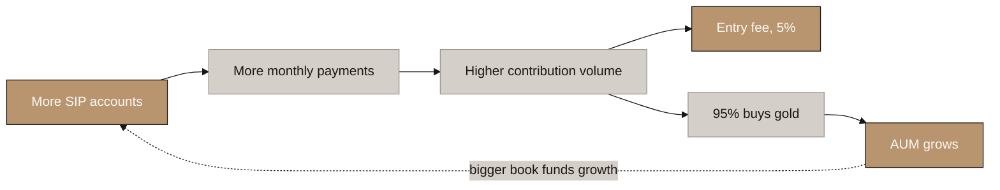
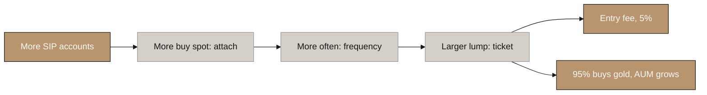
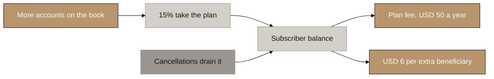
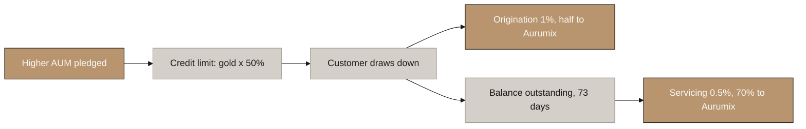

# Aurumix Process Maps: How Each Revenue Stream Grows

> Companion to `2-mechanism-design/Aurumix_Process_Maps_Revenue_Streams.md`, which answers **who pays**. This set answers a different question: **what has to get bigger for each stream to get bigger.**
>
> Built from the live model, `tools/Aurumix_Revenue_Model.xlsx`, at Y7 base case. Every number in the callouts is read from the workbook, not restated from memory.

## Diagram Plan

| # | Diagram Name | Type | Direction | Nodes | Placement | What must grow |
|---|---|---|---|---|---|---|
| 1 | Entry Fee on the SIP | Flowchart | LR | 6 | Inline | Accounts paying every month |
| 2 | Entry Fee on Spot | Flowchart | LR | 6 | Inline | Accounts, and how often they buy |
| 3 | Card Interchange | Flowchart | LR | 6 | Inline | AUM, directly |
| 4 | Family Plan and Digital Will | Flowchart | LR | 6 | Inline | Subscribers on the book |
| 5 | Lending Revenue Share | Flowchart | LR | 6 | Inline | AUM, directly |
| 6 | B2B Platform Fee | Flowchart | LR | 6 | Inline | The partner's AUM |

## Consistency Convention

- **Flowchart direction:** LR throughout.
- **Gold node:** the revenue that lands, and the growth lever that produces it.
- **Stone node:** intermediate mechanics.
- **Text style:** regular, no bold, 2 to 6 words per node.

## The six at a glance

| # | Stream | Y7 | Share | The thing that must get bigger |
|---|---|---|---|---|
| 1a | Entry fee, SIP | 1,164,460 | 30.3% | Accounts × monthly ticket |
| 1b | Entry fee, spot | 93,518 | 2.4% | Accounts × attach × ticket |
| 2 | Card interchange | 28,496 | 0.7% | **AUM** → credit limit |
| 3 | Family plan and Will | 390,321 | 10.1% | Subscribers on the book |
| 4 | Cardholder fees | 582,031 | 15.1% | Cards issued |
| 6 | B2B platform fee | 1,559,250 | 40.5% | **Partner AUM** |
| 5 | Lending | 28,141 | 0.7% | **AUM** → drawn balance |

---

## 1. Entry Fee on the SIP

<!-- SPEAKER NOTES:
"This is the engine and everything else sits downstream of it.

A customer commits to a monthly amount, about thirty-four dollars in the UAE. Five percent of every contribution is Aurumix's, taken at the moment the money arrives. The other ninety-five percent buys gold, and that gold lands in the vault and becomes AUM.

So this stream and the AUM build from the same act. Every dollar of entry fee has a matching nineteen dollars of gold going into the book. You cannot grow one without the other.

Three things make it bigger, and only three. More accounts paying. A bigger monthly ticket. And customers staying longer, because a customer who stops paying stops generating fee immediately even though their gold stays.

That last one is why persistency is the most valuable number in the model. Raising retention from fifty-five to sixty-five percent adds only four percent more customers but twenty-seven percent more gold, because a retained customer keeps paying every single month."
-->

**Y7: USD 1,164,460.** The fee and the AUM are the same act split two ways: 5% to Aurumix, 95% into gold.

**The three levers, measured:** persistency 55% → 65% adds **+27% gold**; marketing +50% adds **+29%**; ticket +20% adds **+19%**.

---

## 2. Entry Fee on Spot

<!-- SPEAKER NOTES:
"Same fee, same gold, different trigger. The SIP is a standing instruction. Spot is a one-off: Diwali, Dhanteras, a wedding, a bonus.

The customer buys a lump rather than an instalment, and Aurumix takes the same five percent on it. The remaining ninety-five percent buys gold and joins the same AUM.

What makes it grow is a chain of three: how many customers buy spot at all in a year, how often those buyers come back, and how big each purchase is.

The size is the interesting one, because it varies enormously by market and it is affordability that decides it, not appetite. A UAE customer's spot purchase costs nearly six months of their saving, so few do it. In India it costs five weeks, so a third of them do. That is why India carries an attach rate almost three times the UAE's despite being the poorest market in the set."
-->

**Y7: USD 93,518.** Spot buyers come from the SIP base — there is no separate spot funnel, by design.

⚠ **Affordability sets attach, not appetite.** UAE 12% (ticket = 5.7 months of saving), India 35% (1.3 months).

---

## 3. Card Interchange

<!-- SPEAKER NOTES:
"This is the first stream where AUM is not a by-product. It is the input.

The card is not a normal credit card. It is a drawdown against the customer's own gold. So the chain starts at the vault: however much gold that customer has accumulated, half of it becomes their credit limit. Fifty percent loan to value.

They draw about half of that limit at a time, roughly twice a year, and spend it across four purchases. Every one of those purchases pays interchange, and Aurumix keeps forty percent of it after the programme manager's share.

The line to draw for the client is this. A customer who has been saving for three years has three times the gold of a customer who joined last year, therefore three times the credit limit, therefore three times the card spend and three times the interchange. Nothing else changes. The customer does not spend more because they earn more. They spend more because they own more gold.

That is the cleanest AUM-to-revenue link in the model, and it is why this stream compounds with the age of the book rather than the size of the marketing budget."
-->

```mermaid
%%{init: {'theme': 'base', 'themeVariables': {
    'primaryColor': '#B8956E',
    'primaryTextColor': '#1A1714',
    'primaryBorderColor': '#1A1714',
    'lineColor': '#1A1714',
    'secondaryColor': '#FAF8F5',
    'tertiaryColor': '#D4CFC8',
    'fontFamily': 'Libre Franklin, sans-serif',
    'edgeLabelBackground': '#D4CFC8',
    'clusterBkg': '#FAF8F5',
    'clusterBorder': '#B8956E'
}}}%%
graph LR
    A["Higher AUM per customer"] --> B["Credit limit: gold x 50%"]
    B --> C["Draws half the limit"]
    C --> D["Spends across 4 purchases"]
    D --> E["Shop pays interchange 1.8%"]
    E --> F["Aurumix keeps 40%"]

    style A fill:#B8956E,stroke:#1A1714,color:#FAF8F5
    style B fill:#D4CFC8,stroke:#9A9590,color:#1A1714
    style C fill:#D4CFC8,stroke:#9A9590,color:#1A1714
    style D fill:#D4CFC8,stroke:#9A9590,color:#1A1714
    style E fill:#D4CFC8,stroke:#9A9590,color:#1A1714
    style F fill:#B8956E,stroke:#1A1714,color:#FAF8F5
```

**Y7: USD 28,496.** Credit limit at Y7 is **USD 604** per customer, up from USD 115 at M12 — purely because the gold accumulated.

⚠ **Only customers still paying get a credit line.** A lapsed customer keeps the card but loses the ICS score, so **6,197 of 18,582 cards** carry credit.

---

## 4. Family Plan and Digital Will

<!-- SPEAKER NOTES:
"This one does not run off the gold. It runs off the number of people on the book.

Fifteen percent of new customers take the plan when they join. They pay fifty dollars a year, plus six dollars for every beneficiary they name beyond the first, so about fifty-nine dollars a head.

The mechanic worth explaining is the leak. Subscribers do not stay forever. They leave two ways: they quit Aurumix entirely, or they stay and cancel the plan. Combined, about seven percent of subscribers go every month. So fifteen percent join, but only about eleven percent of the book holds a plan at any moment.

That gap is deliberate and it was not in the earlier version of this model, which treated the plan as a fixed share of the book that could never fall. It could only shrink if customers left. Now it can shrink because people cancel, which is what a real subscription does.

Growth here is simple: more accounts on the book, a higher share taking the plan, and fewer cancelling. It correlates with AUM because both follow the customer count, but the gold itself does not touch this line."
-->

**Y7: USD 390,321.** 15% of new customers join, but churn of ~7%/month means only **10.6% of the book** holds a plan at any moment.

---

## 5. Lending Revenue Share

<!-- SPEAKER NOTES:
"Same facility as the card, second way of earning from it. The card earns from the shop; this earns from the borrower.

The chain starts in the same place: gold in the vault, half of it available as credit. When the customer draws, two fees arise. An origination fee of one percent on the amount drawn, of which Aurumix keeps half. And a servicing fee of half a percent a year on whatever is outstanding, of which Aurumix keeps seventy percent.

Aurumix is not the lender and cannot be. Lending dirhams needs a Central Bank finance company licence at a hundred and fifty million of capital and sixty percent Emirati ownership. So a licensed partner funds the loan and Aurumix originates, services and collects, and takes a contracted share.

The reason this stream is small is not the rate. It is duration. The average loan is outstanding about seventy-three days, so the balance at any moment is a fraction of the annual drawdown. More AUM raises the limit, raises the draw and raises both fees — but on a book that turns over five times a year."
-->

**Y7: USD 28,141.** Small because of duration, not rate — loans run ~73 days, so the balance is a fraction of the annual drawdown.

⚠ **Aurumix is not the lender.** A licensed partner funds it; Aurumix originates, services and takes a contracted share.

---

## 6. B2B Platform Fee

<!-- SPEAKER NOTES:
"The largest stream in the model, and the purest AUM line in it. There is no customer to acquire and no card to issue. Aurumix charges a partner three quarters of a percent a year on the gold their customers hold in Aurumix's vault.

The chain is short. Sign a partner. Their users adopt gold inside their own app. That gold lands on Aurumix's register and stays. Aurumix invoices the partner monthly on the whole book.

The important property is that it earns on the stock rather than the sale. The partner is paid once at the till; Aurumix is paid every year the gold sits. A partner book that keeps growing pays a bigger fee every year without a single new sale.

The numbers behind it are anchored on a real platform. Botim's gold feature has seventy-five thousand active users out of one point seven million active fintech users, which is four point four percent adoption, and it holds roughly three hundred and sixty dollars of gold per active user. Those are the two figures we use, matured slightly. Our own direct book runs at three hundred and two dollars per customer, which is the cross-check.

One caution. This is forty percent of the model resting on eleven signed partners out of about twenty nameable candidates in the Gulf. The per-partner economics are anchored. The win rate is not."
-->

```mermaid
%%{init: {'theme': 'base', 'themeVariables': {
    'primaryColor': '#B8956E',
    'primaryTextColor': '#1A1714',
    'primaryBorderColor': '#1A1714',
    'lineColor': '#1A1714',
    'secondaryColor': '#FAF8F5',
    'tertiaryColor': '#D4CFC8',
    'fontFamily': 'Libre Franklin, sans-serif',
    'edgeLabelBackground': '#D4CFC8',
    'clusterBkg': '#FAF8F5',
    'clusterBorder': '#B8956E'
}}}%%
graph LR
    A["More partners signed"] --> B["More of their users adopt"]
    B --> C["Gold lands in Aurumix vault"]
    C --> D["Partner AUM grows"]
    D --> E["Fee: 0.75% a year"]
    E --> F["Recurring, no new sale needed"]

    style A fill:#B8956E,stroke:#1A1714,color:#FAF8F5
    style B fill:#D4CFC8,stroke:#9A9590,color:#1A1714
    style C fill:#D4CFC8,stroke:#9A9590,color:#1A1714
    style D fill:#B8956E,stroke:#1A1714,color:#FAF8F5
    style E fill:#B8956E,stroke:#1A1714,color:#FAF8F5
    style F fill:#B8956E,stroke:#1A1714,color:#FAF8F5
```

**Y7: USD 1,559,250** on **USD 207.9m** of partner AUM — 11 partners × USD 18.9m each.

**Per-partner AUM is derived, not asserted:** 900,000 active users × 6% adopting gold × USD 350 each. Adoption is anchored on **O Gold's 75,000 active of Botim's 1.7m** (4.4%, matured to 6%); the USD 350 on **Botim's AED 100m across 128,000 trades**, cross-checked against Aurumix's own USD 302 per customer.

⚠ **40.5% of the model on 11 partners of ~20 nameable Gulf candidates.** The per-partner economics are anchored; the win rate is not.

---

# The common thread

Every stream scales with the book, but they attach to it at different points:

| Attaches to | Streams | Y7 share |
|---|---|---|
| **The stock** — gold sitting in the vault | 2, 5, and the partner book in 6 | 41.2% |
| **The flow** — money arriving each month | 1a, 1b | 32.7% |
| **The headcount** — people on the book | 3, 4 | 25.2% |

⚠ **Worth knowing before the client call.** Streams 2 and 5 are the only ones that read **Aurumix's own AUM** directly, and together they are **1.5% of Y7 revenue**. Stream 6 is 40.5% but reads the **partner's** book, not Aurumix's. So "grow AUM and revenue follows" is true of the business as a whole — the flow that builds AUM also pays the entry fees — but if a client asks *which line moves when our own AUM moves*, the honest answer is the card and lending streams, and they are small today.

**The compounding argument that does hold:** an older book earns more per customer without any new marketing. Credit limit per customer rises from **USD 115 at M12 to USD 604 at Y7** purely from accumulated gold, and every card and lending dollar follows it.
