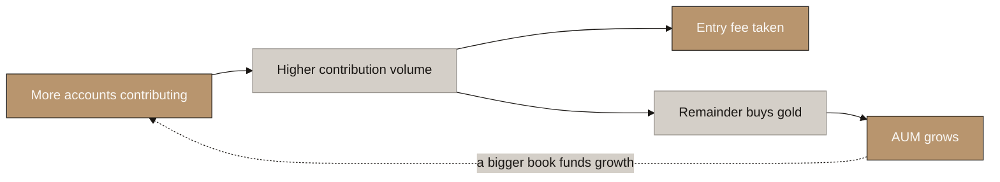
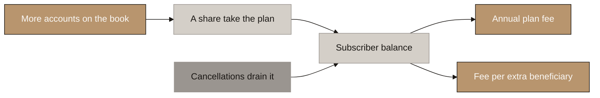
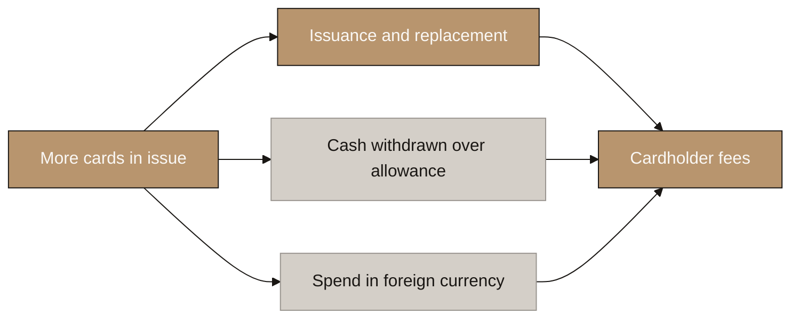
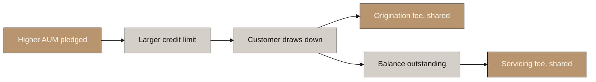

# Aurumix Process Maps: How Each Revenue Stream Grows

> Companion to `2-mechanism-design/Aurumix_Process_Maps_Revenue_Streams.md`, which answers **who pays**. This set answers a different question: **what has to get bigger for each stream to get bigger.**
>
> Nodes are deliberately abstract. Rates, ticket sizes and transaction counts live in the speaker notes and callouts, never in the diagram, so a parameter change does not invalidate a slide. Figures are read from the live model, `tools/Aurumix_Revenue_Model.xlsx`, at Y7 base case.

## Diagram Plan

| # | Diagram Name | Type | Direction | Nodes | Placement | What must grow |
|---|---|---|---|---|---|---|
| 1 | The Entry Fee | Flowchart | LR | 6 | Inline | Accounts paying every month |
| 2 | Card Interchange | Flowchart | LR | 6 | Inline | AUM, directly |
| 3 | Family Plan and Digital Will | Flowchart | LR | 6 | Inline | Subscribers on the book |
| 4 | Cardholder Fees | Flowchart | LR | 6 | Inline | Cards in issue |
| 5 | Lending Revenue Share | Flowchart | LR | 6 | Inline | AUM, directly |
| 6 | B2B Platform Fee | Flowchart | LR | 6 | Inline | The partner's AUM |

## Consistency Convention

- **Flowchart direction:** LR throughout.
- **Gold node:** the revenue that lands, and the growth lever that produces it.
- **Stone node:** intermediate mechanics.
- **Concrete node:** the drain on a balance.
- **Text style:** regular, no bold, no figures, 2 to 6 words per node.

## The six streams at a glance

| Stream | Y7 | Share | The thing that must get bigger |
|---|---|---|---|
| Entry fee, SIP and spot | 1,257,978 | 32.7% | Accounts × what each contributes |
| Card interchange | 28,496 | 0.7% | **AUM** → credit limit |
| Family plan and Will | 390,321 | 10.1% | Subscribers on the book |
| Cardholder fees | 582,031 | 15.1% | Cards in issue |
| Lending | 28,141 | 0.7% | **AUM** → drawn balance |
| B2B platform fee | 1,559,250 | 40.5% | **Partner AUM** |

---

## 1. The Entry Fee

<!-- SPEAKER NOTES:
"This is the engine and everything else sits downstream of it.

A customer commits to a monthly amount, about thirty-four dollars in the UAE. Five percent of every contribution is Aurumix's, taken the moment the money arrives. The other ninety-five percent buys gold, and that gold lands in the vault and becomes AUM.

So the fee and the AUM are the same act split two ways. Every dollar of entry fee has nineteen dollars of gold going into the book behind it. You cannot grow one without the other.

The same fee applies to one-off purchases as well: a lump at Diwali or a wedding pays the identical five percent and the remainder buys the identical gold. There is no separate spot business, and no separate spot funnel, by design. It is the same customer buying the same product on a different rhythm.

Three things make this stream bigger and only three. More accounts paying. A bigger monthly ticket. And customers staying longer, because a customer who stops paying stops generating fee immediately even though their gold stays in the vault.

That last one is worth dwelling on. Raising retention from fifty-five to sixty-five percent adds only four percent more customers but twenty-seven percent more gold, because a retained customer keeps paying every single month. Retention is the highest-leverage number in the model and it is an execution improvement, not a spending decision."
-->

**Y7: USD 1,257,978 — 32.7% of revenue.** The fee is 5% of every contribution; the other 95% becomes the gold. One-off purchases pay the same fee on the same terms, so they are the same stream on a different rhythm.

**The three levers, measured on the model:** persistency 55% → 65% adds **+27% gold**; marketing +50% adds **+29%**; average ticket +20% adds **+19%**.

---

## 2. Card Interchange

<!-- SPEAKER NOTES:
"This is the first stream where AUM is not a by-product. It is the input.

The card is not a normal credit card. It is a drawdown against the customer's own gold. So the chain starts at the vault: however much gold that customer has accumulated, half of it becomes their credit limit.

They draw about half of that limit at a time, roughly twice a year, and spend it across a handful of purchases. Every purchase pays interchange, and Aurumix keeps a contracted share of it after the programme manager takes theirs.

The line to draw for the client is this. A customer who has been saving for three years has three times the gold of one who joined last year, therefore three times the credit limit, therefore three times the card spend and three times the interchange. Nothing else changes. They do not spend more because they earn more. They spend more because they own more gold.

That is the cleanest AUM-to-revenue link in the model. In our numbers the credit limit per customer goes from a hundred and fifteen dollars at month twelve to six hundred and four by year seven, purely from accumulated gold.

One caution. Only customers still paying have a live score, so only they get a credit line. A lapsed customer keeps the plastic but the facility closes, and by year seven two thirds of cardholders are in that position."
-->

```mermaid
%%{init: {'theme': 'base', 'themeVariables': {
    'primaryColor': '#B8956E',
    'primaryTextColor': '#1A1714',
    'primaryBorderColor': '#1A1714',
    'lineColor': '#1A1714',
    'secondaryColor': '#FAF8F5',
    'tertiaryColor': '#D4CFC8',
    'fontFamily': 'Libre Franklin, sans-serif',
    'edgeLabelBackground': '#D4CFC8',
    'clusterBkg': '#FAF8F5',
    'clusterBorder': '#B8956E'
}}}%%
graph LR
    A["Higher AUM per customer"] --> B["Larger credit limit"]
    B --> C["Draws against the gold"]
    C --> D["Spends across purchases"]
    D --> E["Merchant pays interchange"]
    E --> F["Aurumix keeps a share"]

    style A fill:#B8956E,stroke:#1A1714,color:#FAF8F5
    style B fill:#D4CFC8,stroke:#9A9590,color:#1A1714
    style C fill:#D4CFC8,stroke:#9A9590,color:#1A1714
    style D fill:#D4CFC8,stroke:#9A9590,color:#1A1714
    style E fill:#D4CFC8,stroke:#9A9590,color:#1A1714
    style F fill:#B8956E,stroke:#1A1714,color:#FAF8F5
```

**Y7: USD 28,496.** Credit limit per customer rises from **USD 115 at M12 to USD 604 at Y7**, purely from accumulated gold. Interchange is 1.8% of spend; Aurumix keeps 40% after the programme manager's share.

⚠ **Only paying customers hold a credit line.** A lapsed customer keeps the card but loses the score, so **6,197 of 18,582 cards** carry credit.

---

## 3. Family Plan and Digital Will

<!-- SPEAKER NOTES:
"This one does not run off the gold. It runs off the number of people on the book.

Some share of new customers take the plan when they join, currently fifteen percent. They pay fifty dollars a year, plus six dollars for every beneficiary they name beyond the first, so about fifty-nine a head.

The mechanic worth explaining is the leak. Subscribers do not stay forever. They leave two ways: they quit Aurumix entirely, or they stay and cancel the plan. Combined, about seven percent go every month. So fifteen percent join, but only about eleven percent of the book holds a plan at any given moment.

That gap is deliberate, and it was not in the earlier version of this model. The old version treated the plan as a fixed share of the book, which meant it could only shrink if customers left the business. Nobody could simply cancel. Now they can, which is what a real subscription does.

Growth here is three things: more accounts, a higher share taking it, and fewer cancelling. It correlates with AUM because both follow the customer count, but the gold itself never touches this line."
-->

**Y7: USD 390,321.** 15% of new customers join at USD 50/yr plus USD 6 per beneficiary beyond the first. Churn of ~7%/month means only **10.6% of the book** holds a plan at any moment.

---

## 4. Cardholder Fees

<!-- SPEAKER NOTES:
"Same card as the interchange diagram, but this is the customer's money rather than the shop's, and it grows off a different thing.

Three fees sit here. A margin on spend in a foreign currency. A fee on cash withdrawals beyond a free monthly allowance. And a fee to issue a card, plus a larger one to replace a lost one.

The surprise when you look at the numbers is which of those dominates. Issuance and replacement are more than three quarters of this stream. The foreign exchange margin, which sounds like the obvious one, is about a twentieth.

That changes what the stream is. It behaves like a subscription rather than a transaction line: it scales with how many cards exist, not with how much gets spent on them. And issuance is the one part that applies to every cardholder, including the lapsed ones who no longer have a credit line, because they still carry plastic that gets lost and replaced.

So the growth lever here is card issuance, not card usage."
-->

**Y7: USD 582,031.** The split is the point: **issuance and replacement 77%**, ATM 18%, FX margin 5%. This scales with **cards in issue**, not with card usage.

**Issuance applies to every cardholder**, including lapsed customers with no credit line — which is why this stream fell least when the credit split was applied.

---

## 5. Lending Revenue Share

<!-- SPEAKER NOTES:
"Same facility as the card, second way of earning from it. The card earns from the shop; this earns from the borrower.

The chain starts in the same place: gold in the vault, half of it available as credit. When the customer draws, two fees arise. An origination fee on the amount drawn, of which Aurumix keeps half. And a servicing fee on whatever is outstanding, of which Aurumix keeps most.

Aurumix is not the lender and cannot be. Lending dirhams in the UAE requires a Central Bank finance company licence: a hundred and fifty million of capital and sixty percent Emirati ownership. That is not a hurdle you clear with a bigger raise, it is a different company. So a licensed partner funds the loan and Aurumix originates, services and collects, taking a contracted share of both fees.

The reason this stream is small is not the rate. It is duration. The average loan is outstanding about seventy-three days, so the balance at any moment is a fraction of what is drawn across a year. More AUM raises the limit, raises the draw and raises both fees, but on a book that turns over roughly five times a year."
-->

**Y7: USD 28,141.** Origination is 1% of the draw with half to Aurumix; servicing is 0.5%/yr with 70% to Aurumix.

**Small because of duration, not rate.** Loans run ~73 days, so the outstanding balance is a fraction of the annual drawdown — a figure that independently corroborates Manappuram's published 71-day realised tenor.

⚠ **Aurumix is not the lender.** A licensed partner funds it; Aurumix originates, services and takes a contracted share.

---

## 6. B2B Platform Fee

<!-- SPEAKER NOTES:
"The largest stream in the model, and the purest AUM line in it. There is no customer to acquire and no card to issue. Aurumix charges a partner an annual fee on the gold their customers hold in Aurumix's vault.

The chain is short. Sign a partner. Their users adopt gold inside the partner's own app. That gold lands on Aurumix's register and stays there. Aurumix invoices the partner monthly on the whole book.

The important property is that it earns on the stock rather than the sale. The partner is paid once at the till; Aurumix is paid every year the gold sits. A partner book that keeps growing pays a bigger fee every year without a single new sale, and this is the one place in the model where that is literally true: the fee is the partner's AUM multiplied by a rate.

The numbers behind it are anchored on a real platform rather than asserted. Botim's gold feature has seventy-five thousand active users out of one point seven million active fintech users, and holds roughly three hundred and sixty dollars of gold per active user. Those two figures give us adoption and value per user. Our own direct book runs at three hundred and two dollars per customer, which is the cross-check, and the two routes land close.

One caution to carry into the room. This is forty percent of the model resting on eleven signed partners out of about twenty nameable candidates in the Gulf. The per-partner economics are anchored. The win rate is not."
-->

```mermaid
%%{init: {'theme': 'base', 'themeVariables': {
    'primaryColor': '#B8956E',
    'primaryTextColor': '#1A1714',
    'primaryBorderColor': '#1A1714',
    'lineColor': '#1A1714',
    'secondaryColor': '#FAF8F5',
    'tertiaryColor': '#D4CFC8',
    'fontFamily': 'Libre Franklin, sans-serif',
    'edgeLabelBackground': '#D4CFC8',
    'clusterBkg': '#FAF8F5',
    'clusterBorder': '#B8956E'
}}}%%
graph LR
    A["More partners signed"] --> B["More of their users adopt"]
    B --> C["Gold lands in Aurumix custody"]
    C --> D["Partner AUM grows"]
    D --> E["Annual fee on their book"]
    E --> F["Recurring, no new sale"]

    style A fill:#B8956E,stroke:#1A1714,color:#FAF8F5
    style B fill:#D4CFC8,stroke:#9A9590,color:#1A1714
    style C fill:#D4CFC8,stroke:#9A9590,color:#1A1714
    style D fill:#B8956E,stroke:#1A1714,color:#FAF8F5
    style E fill:#B8956E,stroke:#1A1714,color:#FAF8F5
    style F fill:#B8956E,stroke:#1A1714,color:#FAF8F5
```

**Y7: USD 1,559,250** on **USD 207.9m** of partner AUM — 11 partners at USD 18.9m each, charged 0.75%/yr.

**Per-partner AUM is derived, not asserted:** 900,000 active users × 6% adopting gold × USD 350 each. Adoption is anchored on **O Gold's 75,000 active of Botim's 1.7m** (4.4%, matured to 6%); the USD 350 on **Botim's AED 100m across 128,000 trades**, cross-checked against Aurumix's own USD 302 per customer.

⚠ **40.5% of the model on 11 partners of ~20 nameable Gulf candidates.** The per-partner economics are anchored; the win rate is not.

---

# The common thread

Every stream scales with the book. They attach to it at different points:

| Attaches to | Streams | Y7 share |
|---|---|---|
| **The stock** — gold sitting in the vault | Interchange, lending, and the partner book in B2B | 41.2% |
| **The flow** — money arriving each month | Entry fee | 32.7% |
| **The headcount** — people and cards on the book | Family plan, cardholder fees | 25.2% |

**The compounding argument, and the strongest one in the set:** an older book earns more per customer with no new marketing at all. Credit limit per customer rises from **USD 115 at M12 to USD 604 at Y7** purely from accumulated gold, and every card and lending dollar follows it upward.

⚠ **One distinction worth having ready.** Interchange and lending are the only lines that read **Aurumix's own AUM** directly, and together they are **1.5% of Y7 revenue**. B2B is 40.5% but reads the **partner's** book. "Grow AUM and revenue follows" is true of the business as a whole, because the same contributions that build AUM pay the entry fees — but if asked which line moves when Aurumix's own AUM moves, the honest answer is the card and lending streams, and they are small today.
