# Aurumix: Revenue Model Explainer

**Companion to:** `tools/Aurumix_Revenue_Model.xlsx` (seven-year revenue, cost and funding model)
**Prepared by:** Tokenomics.net, Custom Data Room Engagement, Phase 4
**Date:** September 2026

---

## 1. How to read the model

### 1.1 Purpose and two caveats

- **The product.** A gold-backed savings product from Dubai, licensed by VARA. A 5% entry fee is taken on each contribution and 95% buys gold at one AURX per gram.
- **The model.** Seven years from January 2027: customers, gold, six revenue streams, costs and funding.
- **The method.** One set of inputs gives one answer. Three scenarios and four switches show how it moves.

Two caveats apply wherever profit appears:

- **Profit is an upper bound.** Headcount and tax are outside the cost base, covered only by a 15% contingency. Profit, payback and funding figures are all upper bounds.
- **Stream 1 rows show the full 5% entry fee.** The fabrication premium paid to the dealer is a separate cost-of-goods-sold line.

### 1.2 Colour code

| Colour | Meaning | Editable? |
|---|---|---|
| **Blue text** | Hardcoded inputs on Assumptions and Scenario Parameters | Yes. The only cells to change |
| **Green text** | Cross-sheet links to the live value on Scenario Parameters | No |
| **Black text** | In-sheet formulas | No |

### 1.3 Five tabs

| Tab | What it holds |
|---|---|
| **Cover** | Scope, period structure and colour legend |
| **Summary** | Y1 to Y7 side by side, pulled from the Model |
| **Assumptions** | Every input with its value, unit and source note |
| **Scenario Parameters** | The least certain inputs in three scenarios, the selector (cell B6) and the four switches |
| **Model** | The engine over 29 periods: M1 to M24 (January 2027 to December 2028), then Y3 to Y7 (2029 to 2033) |

### 1.4 Units

- Currency is USD. AED converts at the Central Bank peg of 3.6725 AED per USD.
- From Y3 each column is a full year. Flows are annual totals and balances are year-end positions.
- Tickets, CAC, card fees and the B2B fee stay in 2027 dollars. Only the gold price moves.

---

## 2. Key results

### 2.1 Seven-year Base case

Money figures in USD. Net profit is an upper bound, before headcount and tax.

| | Y1 | Y2 | Y3 | Y4 | Y5 | Y6 | Y7 |
|---|---:|---:|---:|---:|---:|---:|---:|
| **Revenue by stream** | | | | | | | |
| 1a Entry fee, SIP | 26,885 | 114,194 | 308,423 | 584,044 | 931,153 | 1,201,849 | 1,326,088 |
| 1b Entry fee, spot | 2,037 | 8,932 | 24,337 | 45,404 | 72,328 | 94,980 | 107,358 |
| 2 Card interchange | 0 | 1,070 | 6,038 | 13,770 | 25,796 | 40,723 | 56,241 |
| 3 Family plan and Digital Will | 3,496 | 42,686 | 116,114 | 219,919 | 343,720 | 426,313 | 448,317 |
| 4 Cardholder fees | 0 | 80,919 | 167,425 | 336,870 | 560,077 | 773,910 | 952,508 |
| 5 Lending revenue share | 0 | 841 | 4,780 | 10,902 | 20,422 | 32,239 | 44,524 |
| 6 B2B platform fee | 0 | 141,750 | 425,250 | 708,750 | 992,250 | 1,275,750 | 1,559,250 |
| **Total revenue** | **32,418** | **390,391** | **1,052,367** | **1,919,659** | **2,945,746** | **3,845,764** | **4,494,287** |
| **Costs** | | | | | | | |
| Cost of goods sold (fabrication premium) | 8,067 | 33,594 | 91,384 | 167,996 | 259,138 | 317,073 | 321,408 |
| Operating expenses | 648,974 | 378,425 | 363,649 | 409,573 | 465,599 | 513,233 | 549,459 |
| ICS benefit costs | 533 | 11,945 | 78,368 | 151,196 | 243,563 | 319,681 | 364,168 |
| Acquisition costs | 91,541 | 280,231 | 394,172 | 639,739 | 973,844 | 1,384,530 | 1,787,063 |
| Card programme costs | 0 | 91,599 | 50,938 | 73,943 | 103,543 | 130,066 | 149,822 |
| Contingency (15%) | 112,367 | 119,369 | 146,777 | 216,367 | 306,853 | 399,687 | 475,788 |
| **Total cost base** | **861,482** | **915,164** | **1,125,287** | **1,658,815** | **2,352,540** | **3,064,270** | **3,647,708** |
| **Net profit (upper bound)** | **-829,064** | **-524,773** | **-72,920** | **260,844** | **593,205** | **781,494** | **846,578** |
| Cumulative net profit (upper bound) | -829,064 | -1,353,837 | -1,426,757 | -1,165,913 | -572,707 | 208,787 | 1,055,365 |
| **Customers and gold (year end)** | | | | | | | |
| New customers in year | 3,285 | 10,140 | 15,653 | 30,264 | 44,511 | 50,058 | 47,935 |
| Paying customers | 2,483 | 9,114 | 16,622 | 31,586 | 50,383 | 64,834 | 71,208 |
| Holders (stopped paying, still hold gold) | 801 | 4,311 | 12,456 | 27,756 | 53,471 | 89,077 | 130,638 |
| Active cards | 0 | 2,416 | 5,234 | 10,682 | 18,694 | 27,704 | 36,332 |
| Gold under custody (grams) | 3,802 | 18,447 | 55,302 | 117,978 | 207,412 | 308,641 | 403,565 |
| Gold under custody (USD) | 537,774 | 2,820,959 | 9,141,690 | 21,081,925 | 40,065,399 | 64,448,873 | 91,096,411 |

### 2.2 Takeaways

- Revenue reaches USD 4.49m in Y7 and USD 14.68m over the seven years.
- B2B is the largest Y7 stream at 34.7%, ahead of the SIP entry fee (29.5%) and cardholder fees (21.2%).
- Stream 1 net of the fabrication premium is USD 1.11m in Y7.
- Net profit (upper bound) turns positive in Y4. Cumulative profit bottoms at -USD 1.43m in Y3 and turns positive in Y6.
- The peak funding need is USD 2.29m (upper bound), at the end of Y3.
- At Y7, 71,208 customers are paying and 130,638 are holders. The vault holds 403,565 grams, worth USD 91.1m (USD 57.1m at the launch price).

---

## 3. Customers and gold

### 3.1 How the engine works

Each region runs this balance every period:

> opening paying customers + new customers - customers who stop paying = closing paying customers

- A customer who stops paying keeps their gold and moves to the holders balance.
- Paying customers plus holders always equals everyone ever acquired. A check row confirms it.
- Holders keep gold in the vault, sell back faster, and keep their card and credit line.

### 3.2 Regions and market size

| Region | Who | Opens | Reachable SIP accounts |
|---|---|---|---:|
| **UAE** | UAE residents of Indian and other South Asian origin | M1 | 142,637 |
| **Oman and Bahrain** | Expatriate workers in Oman and Bahrain | M13 | 35,978 |
| **India** | India-resident retail investors | M1 | 125,000 |
| **Total** | | | **303,615** |

- **Funnel.** Source population × 80% economically active (UAE only) × 57% payment capable × 40% money capable × penetration ceiling.
- **Source population.** UAE 4.36m Indian and 3.46m other South Asian, Oman and Bahrain 2.63m workers, India 12.5m gold investors.
- **Penetration ceiling (working assumption).** 10% UAE, 6% Oman and Bahrain, 1% India.
- **Cross-check.** The UAE ceiling is 1.90 times O Gold's 75,000 active users.
- **Saturation.** By Y7 India has used 83.5% of its ceiling, Oman and Bahrain 58.5%, the UAE 53.6%.

### 3.3 Acquisition channels

| Channel | Base inputs | Basis |
|---|---|---|
| Paid marketing | USD 90k in Y1 to 1.65m in Y7 (USD 5.16m total). UAE 74%, Oman and Bahrain 18%, India 8% | Management decision |
| Cost per acquired customer (CAC) | UAE USD 85, Oman and Bahrain USD 75, India USD 15 in Y1, falling to 55, 45 and 10 | Dubai fintech USD 65-220. Ramp per client (2026-08-26) |
| Organic | A further 25% on paid signups | Client instruction |
| Referrals | 0.6 a year per paying customer, 62% convert, from M13 | Client instruction |
| Agents (India only) | 40 in Y1 to 420 in Y7, 6 accounts a month each | Angel One's Authorised Person curve |

- **Seasonality.** Monthly acquisition follows seasonal gold-buying peaks, damped to about ±25%. Annual totals are unchanged.

### 3.4 Retention

- **Persistency.** 55% of customers still pay twelve months after joining. Monthly churn is 4.86%.
- **Basis.** IRDAI life insurance persistency, adjusted down because a saver loses nothing by stopping.
- By Y7, 64.7% of everyone ever acquired are holders.

### 3.5 Activation calendar

| Item | Opens | Why then |
|---|---|---|
| Streams 1a and 1b, entry fee | M1 | The core product |
| Stream 3, family plan | M7 | Needs the Digital Will build |
| Streams 2 and 4, card | M13 | Needs a programme partner and Visa certification |
| Stream 5, lending | M13 | Needs a lender and seasoned collateral |
| Stream 6, B2B | M13 | Needs a signed partner |
| Referrals | M13 | Referrers must first clear six payments |
| Oman and Bahrain | M13 | Needs two more authorisations |
| India | M1 | Assumes the payment route is solved |

### 3.6 Gold assumptions

| Input | Base | Basis |
|---|---|---|
| SIP ticket | USD 33.60 a month UAE, 26.00 Oman and Bahrain, 30.00 India | Joyalukkas and Malabar instalment schemes. AMFI SIP average USD 34 |
| Gold price | USD 141.46 per gram at M1, +8.1% a year to USD 225.73 by Y7 | Gold's compound growth since 1971 |
| Buyback | 6% of gold a year, × 1.6 for holders | PAXG's 5.9% annual turnover |
| Gold moved to own wallets | 6% a year | Lowers collateral-eligible gold only |

- **Gold under custody.** Everything in the vault: USD 91.1m at Y7.
- **Collateral-eligible AUM.** The part that can back a credit line: USD 82.66m at Y7.

---

## 4. Revenue streams

### 4.1 Stream 1: Entry fees

**In plain words:** 1a = paying customers × monthly ticket × 5%. 1b = paying customers × spot attach × purchases per buyer × spot ticket × 5%.

**Y7: USD 1,326,088 (1a) and USD 107,358 (1b).** Both are the full fee. The ICS discount applies to the SIP fee only (section 5.2).

| Assumption | Base | Reason and source |
|---|---|---|
| Entry fee | 5% of each contribution | Client decision 9 |
| Spot ticket | UAE USD 190, Oman and Bahrain USD 145, India USD 40 | Botim gold AED 700, Augmont INR 3,300 |
| Spot attach | 12% UAE, 10% Oman and Bahrain, 35% India a year | Affordability, no benchmark |
| Frequency | 1.7 purchases per buyer a year | About two seasonal buying occasions a year |

### 4.2 Stream 2: Card interchange

**In plain words:** card spend × 1.80% interchange × Aurumix's 40% share.

**Y7: USD 56,241.** On USD 7.81m of card spend.

**Who gets the card.** The Gold Card is open to the whole book, with 18% take-up. The ICS tier sets only the benefits (fee discounts, FX rates, rebates). A customer who stops paying keeps the card and credit line, which only the collateral rules, the customer or the lender can close (decisions 54 and 57).

The chain in the model:

1. **Card-eligible base** = paying customers + holders (201,846 at Y7).
2. **Active cards** = 18% of that base (36,332 at Y7).
3. **Credit limit** = collateral-eligible gold per customer × 50% LTV (about USD 205).
4. **Spend per card** = limit × 50% drawn × 2.1 draws a year.
5. **Interchange** = spend × 1.80% × (1 - 60%).

```mermaid
%%{init: {'theme': 'base', 'themeVariables': {
    'primaryColor': '#B8956E',
    'primaryTextColor': '#1A1714',
    'primaryBorderColor': '#1A1714',
    'lineColor': '#1A1714',
    'secondaryColor': '#FAF8F5',
    'tertiaryColor': '#D4CFC8',
    'fontFamily': 'Libre Franklin, sans-serif',
    'edgeLabelBackground': '#D4CFC8',
    'clusterBkg': '#FAF8F5',
    'clusterBorder': '#B8956E'
}}}%%
graph LR
    A["Higher AUM per customer"] --> B["Larger credit limit"]
    B --> C["Draws against the gold"]
    C --> D["Spends across purchases"]
    D --> E["Merchant pays interchange"]
    E --> F["Aurumix keeps a share"]

    style A fill:#B8956E,stroke:#1A1714,color:#FAF8F5
    style B fill:#D4CFC8,stroke:#9A9590,color:#1A1714
    style C fill:#D4CFC8,stroke:#9A9590,color:#1A1714
    style D fill:#D4CFC8,stroke:#9A9590,color:#1A1714
    style E fill:#D4CFC8,stroke:#9A9590,color:#1A1714
    style F fill:#B8956E,stroke:#1A1714,color:#FAF8F5
```

| Assumption | Base | Reason and source |
|---|---|---|
| Interchange | 1.80% of spend | Visa UAE Gold rate, 18 October 2025 |
| Programme manager share | 60%, so Aurumix keeps 40% | Researched range 36-85% |
| Facility take-up | 18% of the whole book | Client decision. First input to test |
| LTV and drawn share | 50% and 50% | ICS design. Revolving facilities draw 40-55% |

### 4.3 Stream 3: Family plan and Digital Will

**In plain words:** plan subscribers × (USD 50 + USD 6 for each beneficiary beyond the first).

**Y7: USD 448,317.** From 7,599 subscribers, about 10.7% of paying customers.

| Assumption | Base | Reason and source |
|---|---|---|
| Price | USD 50 a year | Client instruction. Trust & Will charges USD 49 |
| Extra beneficiary fee | USD 6 a year | Recovers AML check cost |
| Beneficiaries per plan | 2.5 | Large South Asian households |
| Attach | 15% of new customers | Client instruction |
| Cancellation | 25% a year | Within subscription benchmarks |

### 4.4 Stream 4: Cardholder fees

**In plain words:** FX margin on foreign spend + ATM fees above the free allowance + issuance, reissue and replacement fees.

**Y7: USD 952,508.** ATM fees are 59.8%, issuance 18.5%, reissue and replacement 16.1% and FX margin 5.6%. The stream moves with the card count.

| Assumption | Base | Reason and source |
|---|---|---|
| FX margin | 2% of foreign spend, on a 34% foreign share | Market rate, four comparables |
| ATM | AED 1,000 a month free, 2% on the excess | About AED 4.80 per cardholder a month |
| Issuance | AED 75 per new card | Rate assumed |
| Reissue and replacement | 6% a year at AED 75, 11% at AED 100 | Industry loss rate 8-15% |

### 4.5 Stream 5: Lending revenue share

**In plain words:** Aurumix's share of the origination fee on each draw + its share of the servicing fee on the average balance.

**Y7: USD 44,524.** A licensed partner funds the loans. Aurumix originates, services and collects.

| Assumption | Base | Reason and source |
|---|---|---|
| Origination fee | 1% of each draw, Aurumix takes 50% | 1% from Finance House UAE gold loan Key Facts Statement. The 50% split is a working assumption |
| Servicing fee | 0.5% a year of the drawn balance, Aurumix takes 70% | Working assumptions |
| Facility turnover | 0.42 | Manappuram's realised gold loan tenor of 71 days |

### 4.6 Stream 6: B2B platform fee

**In plain words:** partners signed × gold held per partner × 0.75% a year.

**Y7: USD 1,559,250.** On USD 207.9m of partner gold from 11 partners, the largest stream.

Gulf wallets and exchange houses white-label Aurumix's gold infrastructure.

| Assumption | Base | Reason and source |
|---|---|---|
| Partners | 0, 1, 3, 5, 7, 9, 11 by Y1 to Y7 | About 20 Gulf candidates. Win rate has no anchor |
| Active users per partner | 900,000 | Botim-scale and smaller wallets |
| Gold adoption | 6% | O Gold's observed 4.4%, matured |
| Gold per adopting user | USD 350 | Botim gold, about USD 363 |
| Fee | 0.75% a year | Top of the cited 0.5-0.75% band |

Gold per partner is USD 18.9m, charged in full from signing.

---

## 5. Costs, profit and funding

### 5.1 Cost base

| Line | Basis | Y7 cost (USD) |
|---|---|---:|
| Vault storage | 0.12% a year, minimum USD 25 a day | 110,238 |
| VARA supervision | AED 400,000 a year | 108,918 |
| DMCC company licence | AED 20,265 a year | 5,518 |
| KYC and AML | USD 1.85 per verification | 88,680 |
| Insurance | USD 45,000 a year | 45,000 |
| Audit and attestation | USD 25,000 a year | 25,000 |
| Technology audit | USD 15,000 a year | 15,000 |
| Buyback handling | USD 1.85 per event | 31,105 |
| Technology build | USD 350,000 in Y1, 150,000 in Y2 | 0 |
| Technology maintenance | USD 120,000 a year from Y3 | 120,000 |
| **Operating expenses** | | **549,459** |
| Fabrication premium (cost of goods sold) | 1.5% over spot on net new grams | 321,408 |
| Acquisition | Marketing, agent commission, referral reward | 1,787,063 |
| ICS benefit costs | See 5.2 | 364,168 |
| Card programme costs | See 5.3 | 149,822 |
| Contingency | 15% of all modelled costs | 475,788 |
| **Total cost base** | | **3,647,708** |

- Y1 operating expenses of USD 648,974 carry the technology build and one-off licensing.
- Blended acquisition cost is USD 37 per new customer in Y7.

### 5.2 ICS benefit costs

The Investor Conviction Score (ICS) rewards consistent saving with rising benefits. Each rate applies only to the 55% of customers who reach a benefit tier, so the cost is roughly half the headline rate.

| Benefit | Rate for qualifying customers | Y7 cost (USD) |
|---|---|---:|
| Entry fee discount | 25% of the SIP fee | 182,337 |
| Card fee discount | 20% of stream 4 | 104,776 |
| Gold rebate | 5% of card revenue | 27,741 |
| Family wallet and will discount | 20% of stream 3 | 49,315 |
| **Total** | | **364,168** |

- The total is 8.1% of Y7 revenue.
- Aurumix breaks even on the entry fee at a 71.5% discount.

### 5.3 Card programme costs

| Line | Basis | Y7 cost (USD) |
|---|---|---:|
| Platform and scheme fees | USD 30,000 a year | 30,000 |
| Programme setup | USD 50,000 one-off in M13 | 0 |
| Card production and delivery | USD 4 per new card | 34,513 |
| Authorisation and switching | USD 0.03 per authorisation | 9,705 |
| Fraud and chargebacks | 0.08% of spend | 6,249 |
| Cross-border scheme assessment | 1.40% of cross-border spend | 69,355 |
| **Total** | | **149,822** |

- Card costs are 14.9% of card revenue in Y7. In Y2, costs of USD 91,599 exceed card revenue of USD 81,989.
- The cross-border assessment (0.89% of all card spend at Y7) exceeds Aurumix's 0.72% interchange share. The FX margin (USD 53k at Y7) covers the gap.

### 5.4 Contingency and missing costs

- **Contingency.** 15% of modelled costs, by client instruction. It stands in for headcount, legal, security, overhead, tax and minting.
- **Shortfall.** Headcount alone is about USD 588,000 in Y1, against a Y1 contingency of USD 112,367.
- **Minting.** Roughly USD 8,500 a year on a layer-2 network by Y7, or about USD 1.7m on Ethereum mainnet.

### 5.5 Net profit and payback

All figures here are upper bounds (section 1.1).

- **Net profit.** A loss of USD 829,064 in Y1, positive in Y4 (USD 260,844) and USD 846,578 in Y7, an 18.8% margin.
- **Contribution per paying customer.** USD 19 in Y3, rising to USD 37 in Y7.
- **Payback.** 15.6 months in Y3, 8.9 in Y4, 8.4 in Y5, 9.9 in Y6 and 12.1 in Y7. It lengthens after Y5 as marketing keeps rising and saturation slows new customers.
- **Treadmill.** 1.8 new customers per net addition in Y1, 2.1 in Y3, 3.5 in Y6 and 7.5 in Y7.

### 5.6 Funding, capital and float

Funding figures are upper bounds (section 1.1).

- **Peak funding need.** USD 2.29m at the end of Y3: USD 1.43m of cumulative loss plus USD 864,412 of capital. It rises once headcount lands.
- **Regulatory capital.** USD 571,818: VA Issuance AED 1.5m plus Broker-Dealer AED 600,000, held on the balance sheet.
- **Gold float.** At least two 100 g bars. 200 g at M1, 3,406 g (USD 780,282) at Y7.
- **Card settlement prefunding.** USD 100,000 from M13.
- **Total capital tied up.** USD 1,452,099 at Y7.

---

## 6. Scenarios, sensitivities and limits

### 6.1 Scenario results

Y7 values. Aggressive and Conservative move every uncertain input at once, so both are unlikely outer bounds. Profit and funding rows are upper bounds.

| Y7 | Conservative | Base | Aggressive |
|---|---:|---:|---:|
| Total revenue | USD 0.89m | USD 4.49m | USD 20.83m |
| Net profit | -USD 2.75m | USD 0.85m | USD 16.20m |
| Cumulative net profit | -USD 12.76m | USD 1.06m | USD 56.70m |
| Peak funding need | USD 14.32m | USD 2.29m | USD 1.65m |
| Paying customers | 34,951 | 71,208 | 102,176 |
| Gold under custody | USD 21.42m | USD 91.10m | USD 276.36m |

In the Conservative case the business does not reach profit within seven years.

### 6.2 Structural switches

| Switch | Default | Y7 effect of changing it |
|---|---|---|
| **Holders keep the card** | ON (decisions 54 and 57) | OFF: revenue USD 3.88m (-13.7%), net profit USD 0.58m. The fall is all in stream 4 |
| **Prepaid instead of credit** | Credit | Prepaid: revenue USD 4.42m, net profit USD 0.78m |
| **Fabrication premium borne by** | Aurumix | Customer: net profit USD 1.22m, peak funding USD 2.14m |
| **Premium on gross inflow** | Net new | Gross: net profit USD 0.75m |

### 6.3 Sensitivities

Each row moves one input to its Conservative and then Aggressive value, with everything else at Base. Base Y7 net profit is USD 0.85m and peak funding USD 2.29m (both upper bounds).

| Input (Conservative / Base / Aggressive) | Y7 net profit, Conservative | Y7 net profit, Aggressive | Peak funding, Conservative |
|---|---:|---:|---:|
| B2B partner gold adoption (3% / 6% / 10%) | USD 0.07m | USD 1.89m | USD 2.95m |
| B2B partner user base (0.5m / 0.9m / 1.4m) | USD 0.15m | USD 1.71m | USD 2.80m |
| B2B partners by Y7 (5 / 11 / 17) | -USD 4k | USD 1.70m | USD 3.23m |
| B2B gold per adopting user (USD 220 / 350 / 500) | USD 0.27m | USD 1.51m | USD 2.66m |
| B2B platform fee (0.50% / 0.75% / 0.90%) | USD 0.33m | USD 1.16m | USD 2.61m |
| Contingency (30% / 15% / 10%) | USD 0.37m | USD 1.01m | USD 2.78m |
| Facility take-up (8% / 18% / 30%) | USD 0.42m | USD 1.36m | USD 2.44m |
| Marketing CAC, all regions and years (UAE at launch: USD 140 / 85 / 55) | USD 0.55m | USD 1.09m | USD 2.40m |
| Persistency (45% / 55% / 65%) | USD 0.61m | USD 1.14m | USD 2.32m |
| Family plan attach (8% / 15% / 25%) | USD 0.66m | USD 1.11m | USD 2.36m |
| Technology build and maintenance (Y1 build: USD 600k / 350k / 200k) | USD 0.73m | USD 0.90m | USD 2.88m |
| Referral rate (0.25 / 0.6 / 1.1 a year) | USD 0.76m | USD 0.95m | USD 2.31m |
| Programme manager share (85% / 60% / 36%) | USD 0.81m | USD 0.88m | USD 2.30m |
| Gold price appreciation (0% / 8.1% / 12%) | USD 0.84m | USD 0.85m | USD 2.29m |

The levers that matter most:

- **B2B.** The top five rows are B2B inputs. Each partner is worth USD 141,750 a year.
- **Missing costs.** A 30% contingency cuts Y7 profit to USD 0.37m.
- **Card take-up.** At 8%, Y7 profit falls to USD 0.42m.
- **Retention.** At 45% persistency Y7 paying customers fall to 54,457.

### 6.4 Workbook and Phase 5 simulation

- **The workbook.** One deterministic path. Use it to understand and change the plan.
- **The simulation.** Runs individual customers 2,000 times. Use it to decide how much to raise.
- **Shared inputs.** 55% persistency and the 55% benefit-tier share. The workbook and simulation reconcile line by line at Y7.

### 6.5 Limitations and working assumptions

- **Incomplete costs.** Profit, payback and peak funding are upper bounds.
- **Simplified engine.** One average customer, and annual periods from Y3.
- **Frozen prices.** Tickets and fees stay in 2027 dollars while gold rises 8.1% a year.
- **No B2B adoption ramp.** Technology maintenance is also flat.
- **India's payment route is assumed solved.** India is 30.2% of Y7 revenue.

These inputs rest on judgement or client instruction:

| Input | Base | What would confirm it |
|---|---|---|
| Penetration ceilings | 10% / 6% / 1% | First-year sign-up rates |
| Referral rate | 0.6 a year | First 12 months of referral data |
| Organic share | 25% | Launch campaign attribution |
| Facility take-up | 18% of the book | First card cohorts |
| Spot attach and frequency | 12% / 10% / 35%; 1.7 a year | First seasonal peak |
| Family plan attach and cancellation | 15%; 25% a year | Take-up at the M7 launch |
| Holder buyback multiplier | 1.6 | Buyback behaviour of lapsed customers |
| B2B partner count | 11 by Y7 | Signed term sheets |

### 6.6 Conventions and using the workbook

- **Y1 and Y2 ratio rows.** On the Summary these are M12 and M24 month-end run rates.
- **Oman and Bahrain marketing.** 18% of the budget is spent from M1, but the region opens at M13, so its Y1 spend acquires no customers.
- **Buyback earns no revenue.** VARA forbids any fee on redemption.
- **Edit blue cells only.** Uncertain inputs sit on Scenario Parameters, fixed inputs on Assumptions.
- **Switching scenario.** Use cell B6. The structural switches sit in rows 130 to 133.
- **Checks.** `verify_model.py` runs 219 checks on the recalculated workbook.

### 6.7 Glossary

| Term | Meaning |
|---|---|
| **AURX** | Aurumix's token. One AURX is one gram of allocated gold |
| **Buyback** | The customer exit: Aurumix buys the gold back for cash |
| **CAC** | Marketing spend per customer acquired through paid marketing |
| **Collateral-eligible AUM** | Gold that can back a credit line |
| **Fabrication premium** | What the dealer charges above spot for 100 g bars |
| **Float** | Aurumix's own whole bars, so customers can buy fractions of a gram |
| **Holder** | A customer who has stopped paying and keeps their gold, card and credit line |
| **ICS** | Investor Conviction Score. Sets each customer's benefits |
| **Interchange** | The fee a merchant's bank pays the card issuer on each purchase |
| **LTV** | Loan-to-value: the credit limit as a share of the gold pledged |
| **Peak funding need** | The largest total, at any point, of cumulative losses plus capital tied up |
| **Persistency** | The share of customers still paying twelve months after joining |
| **Programme manager** | The licensed partner that runs the card programme |
| **Redemption** | The legal category the buyback falls under. VARA forbids any fee on it |
| **SIP** | Systematic Investment Plan, the monthly savings commitment |

### 6.8 Sources

1. Visa. UAE Interchange Reimbursement Fees, 18 October 2025, and International Service Assessment rates.
2. Khaleej Times. Botim gold (O Gold) ticket, users and volume. November 2025.
3. Times of India. Augmont festive-season purchase. September 2025.
4. AMFI. SIP contribution data, July 2026.
5. Joyalukkas and Malabar Gold. Gold instalment scheme minimums.
6. IRDAI. Handbook on Indian Insurance Statistics 2024-25 and Annual Report FY25.
7. Angel One. Authorised Person counts, FY18 to FY22.
8. Consulate General of India, Dubai. Indian community in the UAE, December 2024.
9. Finance House (UAE). Gold loan Key Facts Statement.
10. Manappuram Finance. Realised gold loan tenor.
11. Paxos. PAXG turnover data.
12. Trust & Will. Published membership pricing.
13. goldtrade.ae. 100 g bar premiums, 19 August 2026.
14. VARA. Regulations 2023 Schedule 2, Issuance Rulebook (ARVA Rules G.1, Annex 2 Rule III.E.4) and Company Rulebook Part VI.
15. DMCC, Sumsub and BullionVault. Published charges and tariffs, 26 August 2026.
16. Tokenomics.net. Aurumix Architecture Brief, Mechanism Design Document, decision log and Phase 5 Simulation.
