# Aurumix Whitepaper Process Maps

> The diagram set for the Aurumix Whitepaper (`deliverables/6-whitepaper/Aurumix_Whitepaper.md`).
> One diagram per placeholder, WP-01 to WP-25, in document order. Brand theme on every diagram.

## Diagram index

| ID | Title | Section | Type |
|---|---|---|---|
| WP-01 | Aurumix at a glance | 1. Aurumix in brief | Flowchart LR |
| WP-02 | One token, one gram | 3.3 What you own and who holds it | Flowchart TD (two columns) |
| WP-03 | Who does what | 3.4 Who does what | Flowchart LR (fan) |
| WP-19 | Getting started | 5.2 Getting started | Flowchart TD (ladder) |
| WP-20 | Two ways to pay | 5.3 How you pay | Sequence |
| WP-04 | What happens when you pay | 5.4 What happens when you pay | Sequence |
| WP-21 | Large purchases | 5.6 Large purchases | Flowchart TD (ladder) |
| WP-05 | The gold float | 5.7 The gold float | Flowchart LR (loop) |
| WP-06 | Selling your gold back | 6. Selling your gold back | Sequence |
| WP-07 | The first six months | 7.2 The first six months | Flowchart LR |
| WP-22 | How the score is worked out | 7.3 How the score works | Flowchart TD |
| WP-08 | The tiers | 7.4 The tiers | Flowchart BT (ladder) |
| WP-09 | What a missed month costs | 7.5 What a missed month costs | Flowchart TD |
| WP-10 | The five benefits by tier | 8.1 What each tier gets | Flowchart LR (fan) |
| WP-11 | One credit line, two ways to use it | 9.1 One credit line, two ways to use it | Flowchart TD |
| WP-23 | Your borrowing limit | 9.2 Your borrowing limit | Flowchart LR |
| WP-24 | The Gold Card by tier | 9.3 The Gold Card | Flowchart BT (ladder) |
| WP-12 | If the gold price falls | 9.4 If the gold price falls | Flowchart BT |
| WP-13 | How Gold Rewards is paid | 10. Gold Rewards | Sequence |
| WP-14 | How family gold moves | 11.2 Triggers | Flowchart TD |
| WP-15 | The partner channel | 12.1 The partner channel | Sequence |
| WP-16 | Identity at the two doors | 13.2 Identity at the two doors | Flowchart TD |
| WP-17 | Layers of protection | 14.2 The monthly Allocation Report | Flowchart LR (nested) |
| WP-18 | How Aurumix earns | 15.2 How Aurumix earns | Flowchart LR (fan-in) |
| WP-25 | Path to launch | 16.2 Licence | Flowchart TD (ladder) |

---

## WP-01. Aurumix at a glance

Bank money in, gold held in trust, one AURX per gram, and cash back at the next LBMA price.

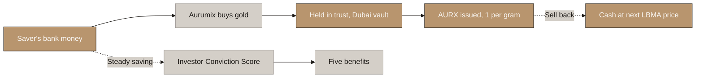
```mermaid
%%{init: {'theme': 'base', 'themeVariables': {
    'primaryColor': '#B8956E',
    'primaryTextColor': '#1A1714',
    'primaryBorderColor': '#1A1714',
    'lineColor': '#1A1714',
    'secondaryColor': '#FAF8F5',
    'tertiaryColor': '#D4CFC8',
    'fontFamily': 'Libre Franklin, sans-serif',
    'edgeLabelBackground': '#D4CFC8',
    'clusterBkg': '#FAF8F5',
    'clusterBorder': '#B8956E'
}}}%%
graph LR
    A["Saver's bank money"] --> B["Aurumix buys gold"]
    B --> C["Held in trust, Dubai vault"]
    C --> D["AURX issued, 1 per gram"]
    A -.->|"Steady saving"| E["Investor Conviction Score"]
    E --> F["Five benefits"]
    D -.->|"Sell back"| H["Cash at next LBMA price"]

    style A fill:#B8956E,stroke:#1A1714,color:#FAF8F5
    style C fill:#B8956E,stroke:#1A1714,color:#FAF8F5
    style D fill:#B8956E,stroke:#1A1714,color:#FAF8F5
    style B fill:#D4CFC8,stroke:#9A9590,color:#1A1714
    style E fill:#D4CFC8,stroke:#9A9590,color:#1A1714
    style F fill:#D4CFC8,stroke:#9A9590,color:#1A1714
    style H fill:#B8956E,stroke:#1A1714,color:#FAF8F5
```

<!-- Speaker notes: The whole product on one line. Money comes from the saver's own bank, Aurumix buys gold, the gold sits in a Dubai vault owned by the DIFC trust for AURX holders, and one AURX is issued per gram. Regular monthly saving builds the ICS, which sets the terms of the five benefits. Selling back pays cash at the next LBMA Gold Price with no exit fee. -->

---

## WP-02. One token, one gram

The bar, the trust, the ledger and the app all describe the same gram. A transfer changes only the ledger.

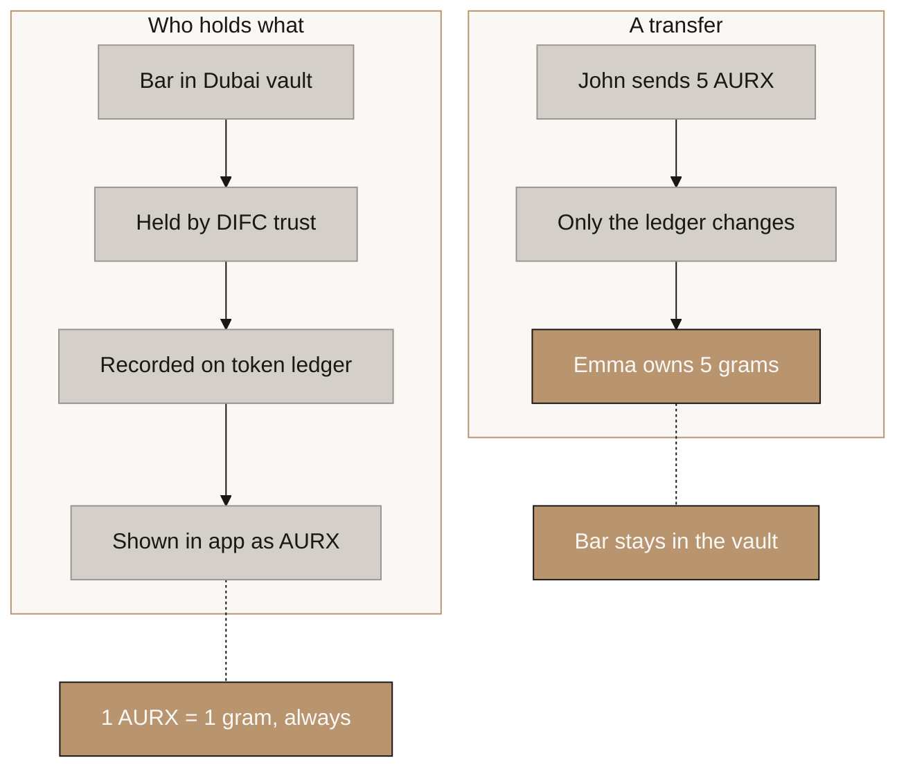
```mermaid
%%{init: {'theme': 'base', 'themeVariables': {
    'primaryColor': '#B8956E',
    'primaryTextColor': '#1A1714',
    'primaryBorderColor': '#1A1714',
    'lineColor': '#1A1714',
    'secondaryColor': '#FAF8F5',
    'tertiaryColor': '#D4CFC8',
    'fontFamily': 'Libre Franklin, sans-serif',
    'edgeLabelBackground': '#D4CFC8',
    'clusterBkg': '#FAF8F5',
    'clusterBorder': '#B8956E'
}}}%%
graph TD
    subgraph OWN["Who holds what"]
        V["Bar in Dubai vault"] --> T["Held by DIFC trust"]
        T --> L["Recorded on token ledger"]
        L --> P["Shown in app as AURX"]
    end
    subgraph MOVE["A transfer"]
        J["John sends 5 AURX"] --> U["Only the ledger changes"]
        U --> E["Emma owns 5 grams"]
    end
    P -.- K["1 AURX = 1 gram, always"]
    E -.- B["Bar stays in the vault"]

    style V fill:#D4CFC8,stroke:#9A9590,color:#1A1714
    style T fill:#D4CFC8,stroke:#9A9590,color:#1A1714
    style L fill:#D4CFC8,stroke:#9A9590,color:#1A1714
    style P fill:#D4CFC8,stroke:#9A9590,color:#1A1714
    style J fill:#D4CFC8,stroke:#9A9590,color:#1A1714
    style U fill:#D4CFC8,stroke:#9A9590,color:#1A1714
    style K fill:#B8956E,stroke:#1A1714,color:#FAF8F5
    style E fill:#B8956E,stroke:#1A1714,color:#FAF8F5
    style B fill:#B8956E,stroke:#1A1714,color:#FAF8F5
    style OWN fill:#FAF8F5,stroke:#B8956E,color:#1A1714
    style MOVE fill:#FAF8F5,stroke:#B8956E,color:#1A1714
```

<!-- Speaker notes: Left column: the bar in the vault is legally owned by the DIFC trust, the token ledger records who the trust holds it for, and the app shows that as AURX. One AURX is one gram, always. Right column: when John sends 5 AURX to Emma, the bar does not move. Only the ledger changes, and Emma now owns 5 grams. -->

---

## WP-03. Who does what

Aurumix is the issuer. Licensed partners hold, check, lend and issue the card.

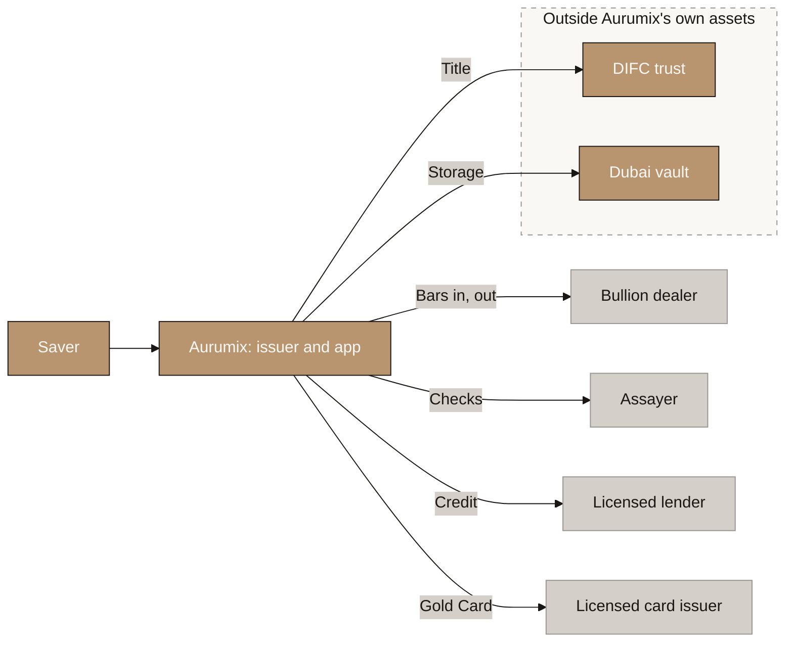
```mermaid
%%{init: {'theme': 'base', 'themeVariables': {
    'primaryColor': '#B8956E',
    'primaryTextColor': '#1A1714',
    'primaryBorderColor': '#1A1714',
    'lineColor': '#1A1714',
    'secondaryColor': '#FAF8F5',
    'tertiaryColor': '#D4CFC8',
    'fontFamily': 'Libre Franklin, sans-serif',
    'edgeLabelBackground': '#D4CFC8',
    'clusterBkg': '#FAF8F5',
    'clusterBorder': '#B8956E'
}}}%%
graph LR
    U["Saver"] --> A["Aurumix: issuer and app"]
    subgraph OUT["Outside Aurumix's own assets"]
        T["DIFC trust"]
        V["Dubai vault"]
    end
    A -->|"Title"| T
    A -->|"Storage"| V
    A -->|"Bars in, out"| D["Bullion dealer"]
    A -->|"Checks"| Y["Assayer"]
    A -->|"Credit"| L["Licensed lender"]
    A -->|"Gold Card"| C["Licensed card issuer"]

    style U fill:#B8956E,stroke:#1A1714,color:#FAF8F5
    style A fill:#B8956E,stroke:#1A1714,color:#FAF8F5
    style T fill:#B8956E,stroke:#1A1714,color:#FAF8F5
    style V fill:#B8956E,stroke:#1A1714,color:#FAF8F5
    style D fill:#D4CFC8,stroke:#9A9590,color:#1A1714
    style Y fill:#D4CFC8,stroke:#9A9590,color:#1A1714
    style L fill:#D4CFC8,stroke:#9A9590,color:#1A1714
    style C fill:#D4CFC8,stroke:#9A9590,color:#1A1714
    style OUT fill:#FAF8F5,stroke:#9A9590,color:#1A1714,stroke-dasharray:5 5
```

<!-- Speaker notes: The saver deals with Aurumix, the issuer; Aurumix Technologies runs the app. Each spoke is a separate party with one job: the DIFC trust holds title, the vault stores the bars, the bullion dealer sells and buys whole bars, the assayer checks each bar on arrival, a licensed lender provides credit and a licensed card issuer issues the Gold Card. The dashed box shows that the trust and vault sit outside Aurumix's own assets. -->

---

## WP-19. Getting started

Six steps from opening an account to the first monthly payment.

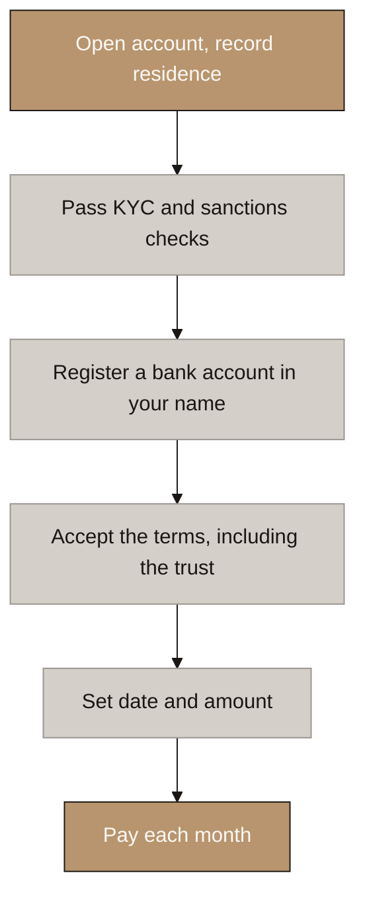
```mermaid
%%{init: {'theme': 'base', 'themeVariables': {
    'primaryColor': '#B8956E',
    'primaryTextColor': '#1A1714',
    'primaryBorderColor': '#1A1714',
    'lineColor': '#1A1714',
    'secondaryColor': '#FAF8F5',
    'tertiaryColor': '#D4CFC8',
    'fontFamily': 'Libre Franklin, sans-serif',
    'edgeLabelBackground': '#D4CFC8',
    'clusterBkg': '#FAF8F5',
    'clusterBorder': '#B8956E'
}}}%%
graph TD
    A["Open account, record residence"] --> B["Pass KYC and sanctions checks"]
    B --> C["Register a bank account in your name"]
    C --> D["Accept the terms, including the trust"]
    D --> E["Set date and amount"]
    E --> F["Pay each month"]

    style A fill:#B8956E,stroke:#1A1714,color:#FAF8F5
    style F fill:#B8956E,stroke:#1A1714,color:#FAF8F5
    style B fill:#D4CFC8,stroke:#9A9590,color:#1A1714
    style C fill:#D4CFC8,stroke:#9A9590,color:#1A1714
    style D fill:#D4CFC8,stroke:#9A9590,color:#1A1714
    style E fill:#D4CFC8,stroke:#9A9590,color:#1A1714
```

<!-- Speaker notes: No gold is bought until identity, sanctions and residence checks pass. The bank account must be in the saver's own name, because buyback cash is paid only there. The terms include the trust arrangement. Aurumix accepts bank money only: no cryptocurrency or stablecoins. -->

---

## WP-20. Two ways to pay

A one-tap request each month, or one prefund that Aurumix draws from on your date.

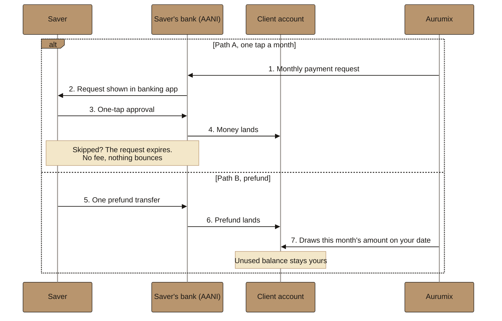
```mermaid
%%{init: {'theme': 'base', 'themeVariables': {
    'primaryColor': '#B8956E',
    'primaryTextColor': '#1A1714',
    'primaryBorderColor': '#1A1714',
    'lineColor': '#1A1714',
    'secondaryColor': '#FAF8F5',
    'tertiaryColor': '#D4CFC8',
    'fontFamily': 'Libre Franklin, sans-serif',
    'actorBkg': '#B8956E',
    'actorBorder': '#1A1714',
    'actorTextColor': '#1A1714',
    'actorLineColor': '#9A9590',
    'signalColor': '#1A1714',
    'signalTextColor': '#1A1714',
    'noteBkgColor': '#F3E7C9',
    'noteBorderColor': '#B8956E',
    'noteTextColor': '#1A1714'
}}}%%
sequenceDiagram
    participant S as Saver
    participant B as Saver's bank (AANI)
    participant C as Client account
    participant A as Aurumix
    alt Path A, one tap a month
        A->>B: 1. Monthly payment request
        B->>S: 2. Request shown in banking app
        S->>B: 3. One-tap approval
        B->>C: 4. Money lands
        Note over S,B: Skipped? The request expires.<br/>No fee, nothing bounces
    else Path B, prefund
        S->>B: 5. One prefund transfer
        B->>C: 6. Prefund lands
        A->>C: 7. Draws this month's amount on your date
        Note over C: Unused balance stays yours
    end
```

<!-- Speaker notes: Aurumix never pulls money. In path A a request arrives through AANI, the UAE's instant payment system, and the saver approves it with one tap; a skipped request simply expires. In path B the saver sends one transfer covering several months, and Aurumix draws each month's amount on the chosen date. The unused balance stays the saver's. -->

---

## WP-04. What happens when you pay

Money, then title, then token: every purchase runs in this order.

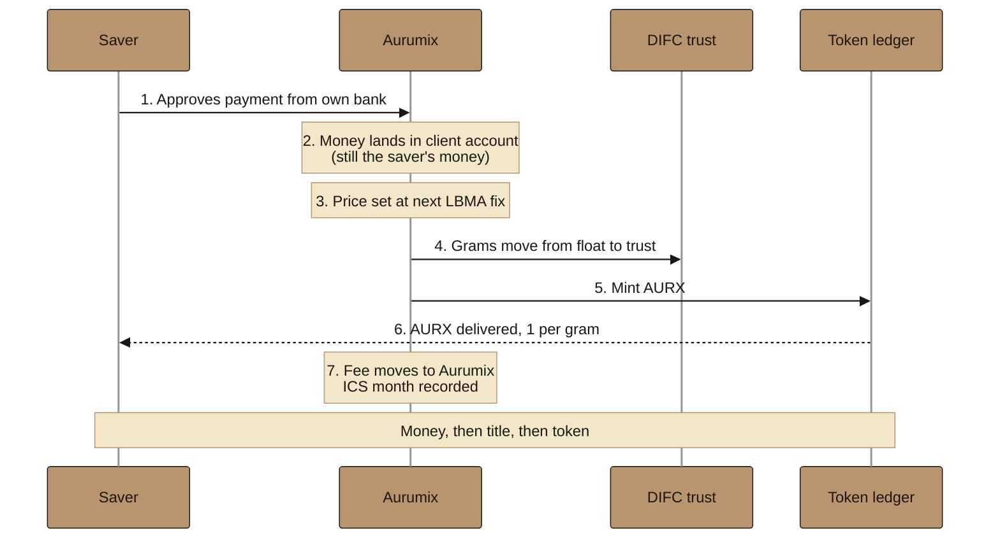
```mermaid
%%{init: {'theme': 'base', 'themeVariables': {
    'primaryColor': '#B8956E',
    'primaryTextColor': '#1A1714',
    'primaryBorderColor': '#1A1714',
    'lineColor': '#1A1714',
    'secondaryColor': '#FAF8F5',
    'tertiaryColor': '#D4CFC8',
    'fontFamily': 'Libre Franklin, sans-serif',
    'actorBkg': '#B8956E',
    'actorBorder': '#1A1714',
    'actorTextColor': '#1A1714',
    'actorLineColor': '#9A9590',
    'signalColor': '#1A1714',
    'signalTextColor': '#1A1714',
    'noteBkgColor': '#F3E7C9',
    'noteBorderColor': '#B8956E',
    'noteTextColor': '#1A1714'
}}}%%
sequenceDiagram
    participant S as Saver
    participant A as Aurumix
    participant T as DIFC trust
    participant L as Token ledger
    S->>A: 1. Approves payment from own bank
    Note over A: 2. Money lands in client account<br/>(still the saver's money)
    Note over A: 3. Price set at next LBMA fix
    A->>T: 4. Grams move from float to trust
    A->>L: 5. Mint AURX
    L-->>S: 6. AURX delivered, 1 per gram
    Note over A: 7. Fee moves to Aurumix<br/>ICS month recorded
    Note over S,L: Money, then title, then token
```

<!-- Speaker notes: If the gold cannot be placed in the saver's name, no token is created. The price is the first LBMA Gold Price after the money clears; nobody chooses it. The entry fee becomes Aurumix's money only once the gold is the saver's. Target: within 24 hours of cleared funds. Worked example: John pays USD 75, the 5% fee is USD 3.75, USD 71.25 buys gold at USD 109.31 per gram, and he receives 0.6518 g and 0.6518 AURX. The client account and the gold float are both run by Aurumix, so they sit on the Aurumix line. -->

---

## WP-21. Large purchases

Checks step up with the size of the purchase.

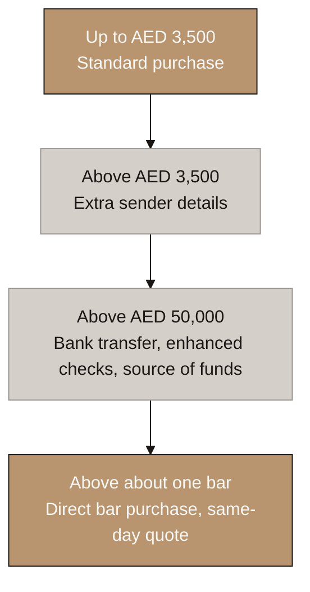
```mermaid
%%{init: {'theme': 'base', 'themeVariables': {
    'primaryColor': '#B8956E',
    'primaryTextColor': '#1A1714',
    'primaryBorderColor': '#1A1714',
    'lineColor': '#1A1714',
    'secondaryColor': '#FAF8F5',
    'tertiaryColor': '#D4CFC8',
    'fontFamily': 'Libre Franklin, sans-serif',
    'edgeLabelBackground': '#D4CFC8',
    'clusterBkg': '#FAF8F5',
    'clusterBorder': '#B8956E'
}}}%%
graph TD
    A["Up to AED 3,500<br/>Standard purchase"] --> B["Above AED 3,500<br/>Extra sender details"]
    B --> C["Above AED 50,000<br/>Bank transfer, enhanced checks, source of funds"]
    C --> D["Above about one bar<br/>Direct bar purchase, same-day quote"]

    style A fill:#B8956E,stroke:#1A1714,color:#FAF8F5
    style D fill:#B8956E,stroke:#1A1714,color:#FAF8F5
    style B fill:#D4CFC8,stroke:#9A9590,color:#1A1714
    style C fill:#D4CFC8,stroke:#9A9590,color:#1A1714
```

<!-- Speaker notes: The AED 3,500 step follows VARA's Travel Rule. Above AED 50,000 the payment comes by bank transfer with enhanced checks and a source-of-funds review. Above about one bar the saver can buy a whole bar directly at a quoted same-day price. The one-bar threshold is shown in the app. -->

---

## WP-05. The gold float

A small stock of Aurumix's own bars lets savers buy and sell fractions of a gram.

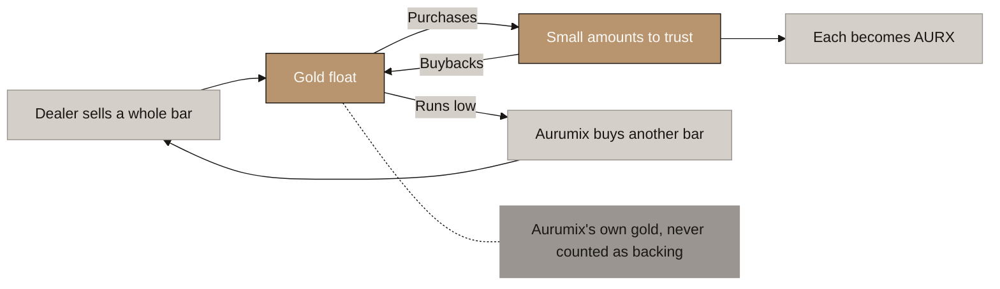
```mermaid
%%{init: {'theme': 'base', 'themeVariables': {
    'primaryColor': '#B8956E',
    'primaryTextColor': '#1A1714',
    'primaryBorderColor': '#1A1714',
    'lineColor': '#1A1714',
    'secondaryColor': '#FAF8F5',
    'tertiaryColor': '#D4CFC8',
    'fontFamily': 'Libre Franklin, sans-serif',
    'edgeLabelBackground': '#D4CFC8',
    'clusterBkg': '#FAF8F5',
    'clusterBorder': '#B8956E'
}}}%%
graph LR
    D["Dealer sells a whole bar"] --> F["Gold float"]
    F -->|"Purchases"| T["Small amounts to trust"]
    T --> X["Each becomes AURX"]
    T -->|"Buybacks"| F
    F -->|"Runs low"| B["Aurumix buys another bar"]
    B --> D
    F -.- N["Aurumix's own gold, never counted as backing"]

    style D fill:#D4CFC8,stroke:#9A9590,color:#1A1714
    style B fill:#D4CFC8,stroke:#9A9590,color:#1A1714
    style X fill:#D4CFC8,stroke:#9A9590,color:#1A1714
    style F fill:#B8956E,stroke:#1A1714,color:#FAF8F5
    style T fill:#B8956E,stroke:#1A1714,color:#FAF8F5
    style N fill:#9A9590,stroke:#9A9590,color:#1A1714
```

<!-- Speaker notes: Dealers sell whole bars; a 100 g bar is worth about USD 11,000. Aurumix buys bars into the float with its own money. Each purchase moves a small amount from the float into the trust the same day, where it becomes AURX. Gold sold back refills the float, so most exits never need a dealer sale. When the float runs low, Aurumix buys another bar. The float is never counted as backing, and Aurumix carries its price risk. -->

---

## WP-06. Selling your gold back

Checks first, then the next LBMA price, then cash to your own bank.

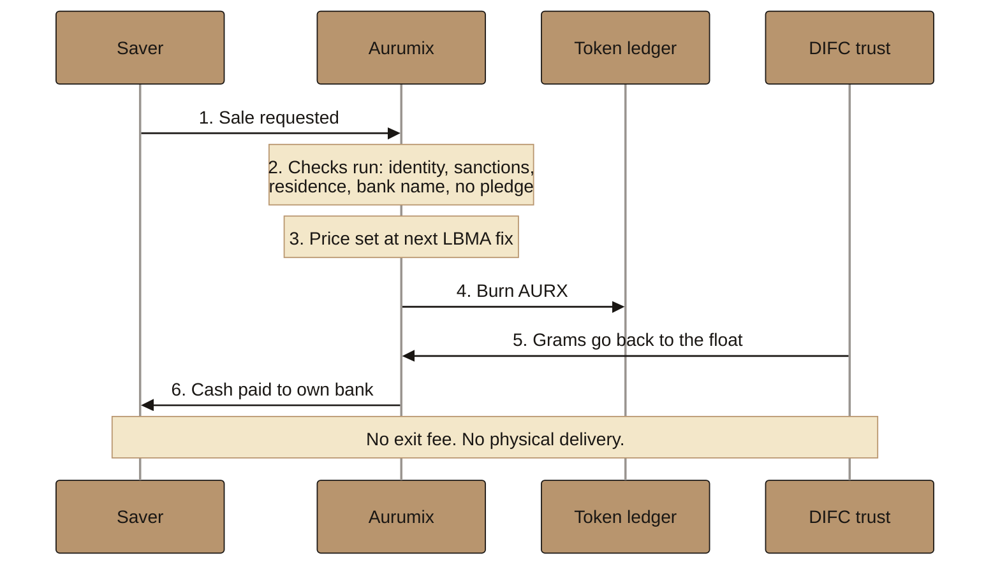
```mermaid
%%{init: {'theme': 'base', 'themeVariables': {
    'primaryColor': '#B8956E',
    'primaryTextColor': '#1A1714',
    'primaryBorderColor': '#1A1714',
    'lineColor': '#1A1714',
    'secondaryColor': '#FAF8F5',
    'tertiaryColor': '#D4CFC8',
    'fontFamily': 'Libre Franklin, sans-serif',
    'actorBkg': '#B8956E',
    'actorBorder': '#1A1714',
    'actorTextColor': '#1A1714',
    'actorLineColor': '#9A9590',
    'signalColor': '#1A1714',
    'signalTextColor': '#1A1714',
    'noteBkgColor': '#F3E7C9',
    'noteBorderColor': '#B8956E',
    'noteTextColor': '#1A1714'
}}}%%
sequenceDiagram
    participant S as Saver
    participant A as Aurumix
    participant L as Token ledger
    participant T as DIFC trust
    S->>A: 1. Sale requested
    Note over A: 2. Checks run: identity, sanctions,<br/>residence, bank name, no pledge
    Note over A: 3. Price set at next LBMA fix
    A->>L: 4. Burn AURX
    T->>A: 5. Grams go back to the float
    A->>S: 6. Cash paid to own bank
    Note over S,T: No exit fee. No physical delivery.
```

<!-- Speaker notes: Checks run before the price is set, including that the grams are not pledged to a loan. Payment goes only to the saver's own bank account, in AED, or USD where available. Example: Sophie sells 10 g at USD 110.00 per gram and receives USD 1,100.00 with nothing deducted. Small sales are paid the next business day, larger ones within three to five. The gold float sits on the Aurumix line. -->

---

## WP-07. The first six months

Six payments in a row unlock Confirmed SIP, which is permanent and starts the score at 25.

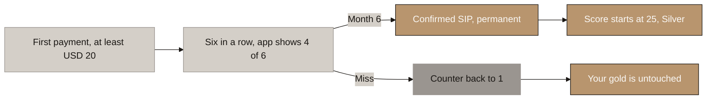
```mermaid
%%{init: {'theme': 'base', 'themeVariables': {
    'primaryColor': '#B8956E',
    'primaryTextColor': '#1A1714',
    'primaryBorderColor': '#1A1714',
    'lineColor': '#1A1714',
    'secondaryColor': '#FAF8F5',
    'tertiaryColor': '#D4CFC8',
    'fontFamily': 'Libre Franklin, sans-serif',
    'edgeLabelBackground': '#D4CFC8',
    'clusterBkg': '#FAF8F5',
    'clusterBorder': '#B8956E'
}}}%%
graph LR
    A["First payment, at least USD 20"] --> B["Six in a row, app shows 4 of 6"]
    B -->|"Month 6"| C["Confirmed SIP, permanent"]
    C --> D["Score starts at 25, Silver"]
    B -->|"Miss"| X["Counter back to 1"]
    X --> Y["Your gold is untouched"]

    style A fill:#D4CFC8,stroke:#9A9590,color:#1A1714
    style B fill:#D4CFC8,stroke:#9A9590,color:#1A1714
    style C fill:#B8956E,stroke:#1A1714,color:#FAF8F5
    style D fill:#B8956E,stroke:#1A1714,color:#FAF8F5
    style Y fill:#B8956E,stroke:#1A1714,color:#FAF8F5
    style X fill:#9A9590,stroke:#9A9590,color:#1A1714
```

<!-- Speaker notes: The app counts the run, for example 4 of 6. After six monthly payments in a row of at least USD 20, the saver reaches Confirmed SIP. It is permanent: the score starts at 25 (Silver) and never falls below it. A miss before month 6 sends the counter back to 1, but no gold is touched. Before Confirmed SIP the saver can still buy, sell, and use credit and the card at base terms. -->

---

## WP-22. How the score is worked out

Record and Recent set the score. Kept reduces it only after heavy selling.

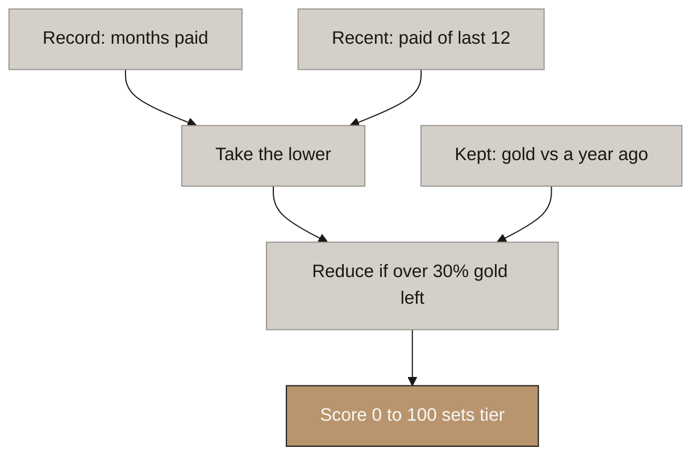
```mermaid
%%{init: {'theme': 'base', 'themeVariables': {
    'primaryColor': '#B8956E',
    'primaryTextColor': '#1A1714',
    'primaryBorderColor': '#1A1714',
    'lineColor': '#1A1714',
    'secondaryColor': '#FAF8F5',
    'tertiaryColor': '#D4CFC8',
    'fontFamily': 'Libre Franklin, sans-serif',
    'edgeLabelBackground': '#D4CFC8',
    'clusterBkg': '#FAF8F5',
    'clusterBorder': '#B8956E'
}}}%%
graph TD
    R["Record: months paid"] --> M["Take the lower"]
    N["Recent: paid of last 12"] --> M
    M --> X["Reduce if over 30% gold left"]
    K["Kept: gold vs a year ago"] --> X
    X --> Z["Score 0 to 100 sets tier"]

    style R fill:#D4CFC8,stroke:#9A9590,color:#1A1714
    style N fill:#D4CFC8,stroke:#9A9590,color:#1A1714
    style K fill:#D4CFC8,stroke:#9A9590,color:#1A1714
    style M fill:#D4CFC8,stroke:#9A9590,color:#1A1714
    style X fill:#D4CFC8,stroke:#9A9590,color:#1A1714
    style Z fill:#B8956E,stroke:#1A1714,color:#FAF8F5
```

<!-- Speaker notes: Record counts months paid since the six-month run began; it reaches 50 after year one and 100 after five years and never goes down. Recent counts how many of the last 12 months were paid. The score takes the lower of the two. Kept compares the gold held now with a year ago, and lowers the score only if more than 30% of the gold left this year. Any amount from USD 20 counts the same, and there is a 5-day grace period. -->

---

## WP-08. The tiers

Five rungs, set by months paid and paid months in the last 12.

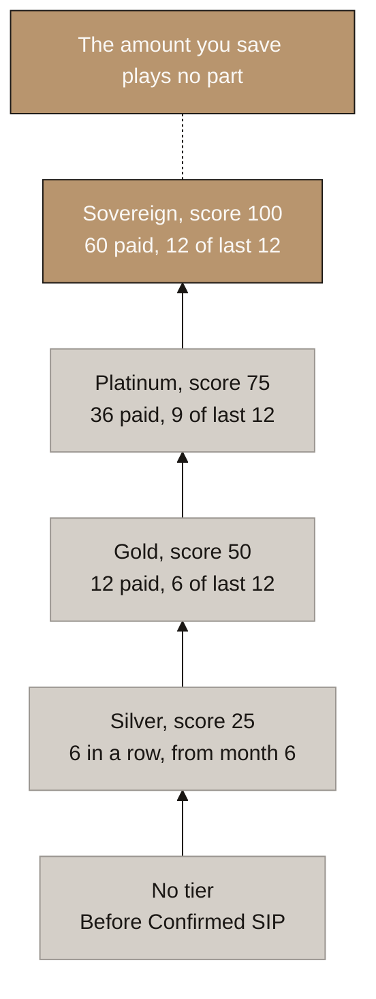
```mermaid
%%{init: {'theme': 'base', 'themeVariables': {
    'primaryColor': '#B8956E',
    'primaryTextColor': '#1A1714',
    'primaryBorderColor': '#1A1714',
    'lineColor': '#1A1714',
    'secondaryColor': '#FAF8F5',
    'tertiaryColor': '#D4CFC8',
    'fontFamily': 'Libre Franklin, sans-serif',
    'edgeLabelBackground': '#D4CFC8',
    'clusterBkg': '#FAF8F5',
    'clusterBorder': '#B8956E'
}}}%%
graph BT
    A["No tier<br/>Before Confirmed SIP"] --> B["Silver, score 25<br/>6 in a row, from month 6"]
    B --> C["Gold, score 50<br/>12 paid, 6 of last 12"]
    C --> D["Platinum, score 75<br/>36 paid, 9 of last 12"]
    D --> E["Sovereign, score 100<br/>60 paid, 12 of last 12"]
    E -.- N["The amount you save plays no part"]

    style A fill:#D4CFC8,stroke:#9A9590,color:#1A1714
    style B fill:#D4CFC8,stroke:#9A9590,color:#1A1714
    style C fill:#D4CFC8,stroke:#9A9590,color:#1A1714
    style D fill:#D4CFC8,stroke:#9A9590,color:#1A1714
    style E fill:#B8956E,stroke:#1A1714,color:#FAF8F5
    style N fill:#B8956E,stroke:#1A1714,color:#FAF8F5
```

<!-- Speaker notes: Earliest months: Silver at 6, Gold at 12, Platinum at 36, Sovereign at 60. Sovereign also needs no more than 30% of the gold sold in the last year. Thresholds are fixed, so other customers cannot push anyone down, and tiers update once a month. A saver paying USD 20 a month and one paying USD 2,000 reach the top tier on the same day. -->

---

## WP-09. What a missed month costs

Mark misses four months as a Sovereign saver. His tier dips and recovers. His grams never move.

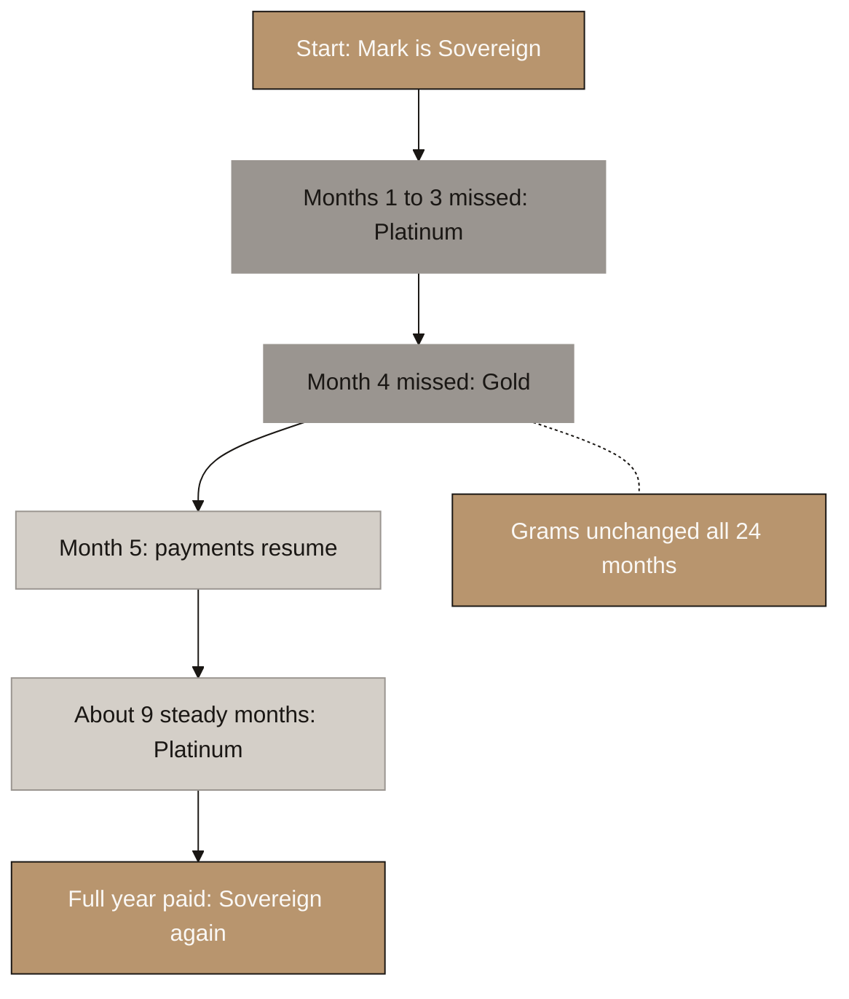
```mermaid
%%{init: {'theme': 'base', 'themeVariables': {
    'primaryColor': '#B8956E',
    'primaryTextColor': '#1A1714',
    'primaryBorderColor': '#1A1714',
    'lineColor': '#1A1714',
    'secondaryColor': '#FAF8F5',
    'tertiaryColor': '#D4CFC8',
    'fontFamily': 'Libre Franklin, sans-serif',
    'edgeLabelBackground': '#D4CFC8',
    'clusterBkg': '#FAF8F5',
    'clusterBorder': '#B8956E'
}}}%%
graph TD
    A["Start: Mark is Sovereign"] --> B["Months 1 to 3 missed: Platinum"]
    B --> C["Month 4 missed: Gold"]
    C --> D["Month 5: payments resume"]
    D --> E["About 9 steady months: Platinum"]
    E --> F["Full year paid: Sovereign again"]
    C -.- G["Grams unchanged all 24 months"]

    style A fill:#B8956E,stroke:#1A1714,color:#FAF8F5
    style F fill:#B8956E,stroke:#1A1714,color:#FAF8F5
    style G fill:#B8956E,stroke:#1A1714,color:#FAF8F5
    style B fill:#9A9590,stroke:#9A9590,color:#1A1714
    style C fill:#9A9590,stroke:#9A9590,color:#1A1714
    style D fill:#D4CFC8,stroke:#9A9590,color:#1A1714
    style E fill:#D4CFC8,stroke:#9A9590,color:#1A1714
```

<!-- Speaker notes: A missed payment lowers the Recent count for 12 months, then drops out. One to three misses in a row take Mark to Platinum; a fourth takes him to Gold; seven or more would reach the Silver floor. His record stays, so about nine steady months restore Platinum, where a new saver would need 36. Once the missed months leave the 12-month window he is back at Sovereign. His grams fall only if he sells or sends gold, or gold is sold to repay a loan. -->

---

## WP-10. The five benefits by tier

Each benefit improves from No tier to Sovereign. Base credit and the L1 card are open to everyone.

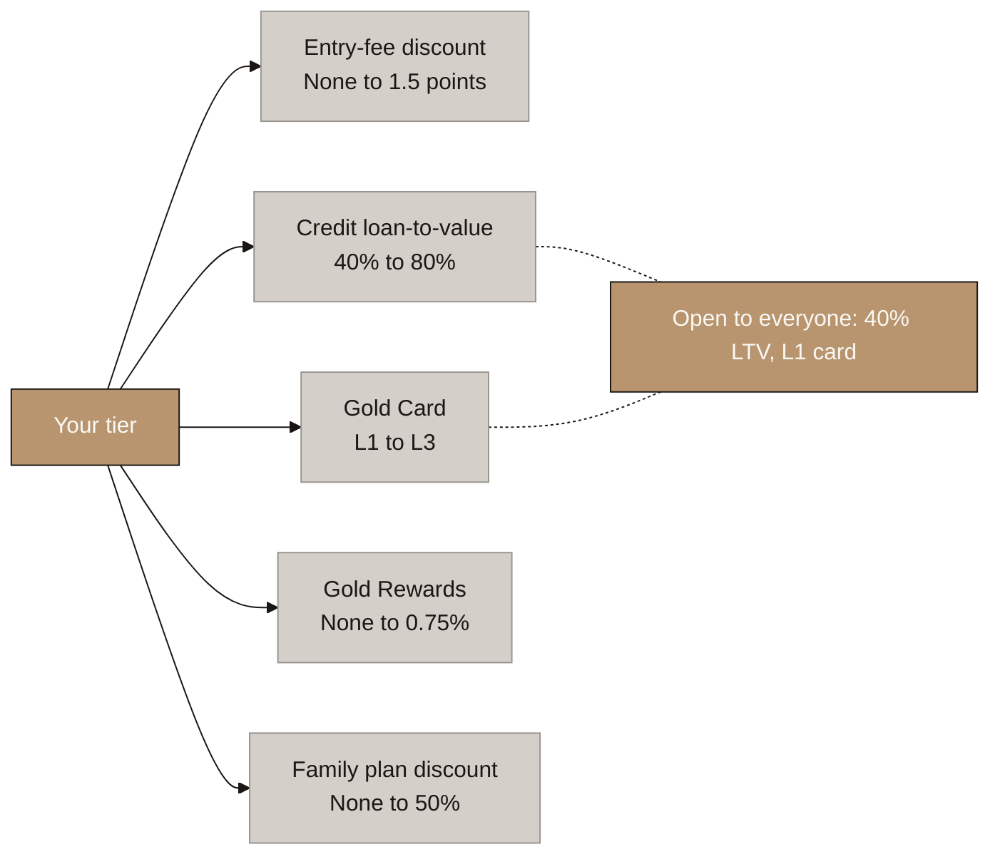
```mermaid
%%{init: {'theme': 'base', 'themeVariables': {
    'primaryColor': '#B8956E',
    'primaryTextColor': '#1A1714',
    'primaryBorderColor': '#1A1714',
    'lineColor': '#1A1714',
    'secondaryColor': '#FAF8F5',
    'tertiaryColor': '#D4CFC8',
    'fontFamily': 'Libre Franklin, sans-serif',
    'edgeLabelBackground': '#D4CFC8',
    'clusterBkg': '#FAF8F5',
    'clusterBorder': '#B8956E'
}}}%%
graph LR
    T["Your tier"] --> B1["Entry-fee discount<br/>None to 1.5 points"]
    T --> B2["Credit loan-to-value<br/>40% to 80%"]
    T --> B3["Gold Card<br/>L1 to L3"]
    T --> B4["Gold Rewards<br/>None to 0.75%"]
    T --> B5["Family plan discount<br/>None to 50%"]
    B2 -.- E["Open to everyone: 40% LTV, L1 card"]
    B3 -.- E

    style T fill:#B8956E,stroke:#1A1714,color:#FAF8F5
    style E fill:#B8956E,stroke:#1A1714,color:#FAF8F5
    style B1 fill:#D4CFC8,stroke:#9A9590,color:#1A1714
    style B2 fill:#D4CFC8,stroke:#9A9590,color:#1A1714
    style B3 fill:#D4CFC8,stroke:#9A9590,color:#1A1714
    style B4 fill:#D4CFC8,stroke:#9A9590,color:#1A1714
    style B5 fill:#D4CFC8,stroke:#9A9590,color:#1A1714
```

<!-- Speaker notes: Ranges run from No tier to Sovereign. Entry-fee discount: none, 0.4, 0.8, 1.2, 1.5 points. Loan-to-value: 40, 40, 50, 65, 80%. Card: L1, L1, L1, L2, L3. Gold Rewards: none, none, 0.15, 0.45, 0.75%. Family plan discount: none, 10, 20, 35, 50%. The biggest step is Silver to Gold. No benefit grows with the amount saved, and a lower tier never takes back what was already received. -->

---

## WP-11. One credit line, two ways to use it

Pledged grams back one line, drawn as cash or spent on the Gold Card.

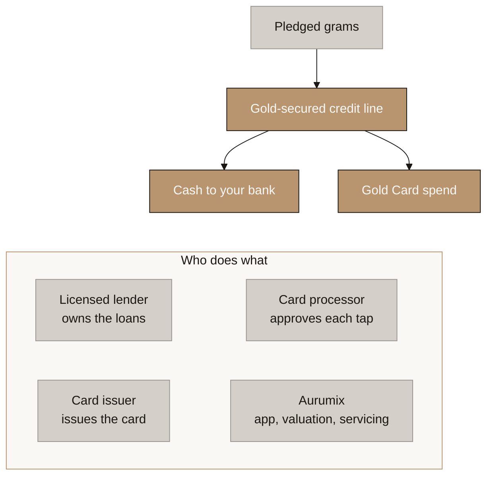
```mermaid
%%{init: {'theme': 'base', 'themeVariables': {
    'primaryColor': '#B8956E',
    'primaryTextColor': '#1A1714',
    'primaryBorderColor': '#1A1714',
    'lineColor': '#1A1714',
    'secondaryColor': '#FAF8F5',
    'tertiaryColor': '#D4CFC8',
    'fontFamily': 'Libre Franklin, sans-serif',
    'edgeLabelBackground': '#D4CFC8',
    'clusterBkg': '#FAF8F5',
    'clusterBorder': '#B8956E'
}}}%%
graph TD
    G["Pledged grams"] --> P["Gold-secured credit line"]
    P --> A["Cash to your bank"]
    P --> B["Gold Card spend"]
    subgraph ROLES["Who does what"]
        L["Licensed lender<br/>owns the loans"]
        I["Card issuer<br/>issues the card"]
        R["Card processor<br/>approves each tap"]
        M["Aurumix<br/>app, valuation, servicing"]
        L ~~~ R
        I ~~~ M
    end
    A ~~~ ROLES

    style G fill:#D4CFC8,stroke:#9A9590,color:#1A1714
    style P fill:#B8956E,stroke:#1A1714,color:#FAF8F5
    style A fill:#B8956E,stroke:#1A1714,color:#FAF8F5
    style B fill:#B8956E,stroke:#1A1714,color:#FAF8F5
    style L fill:#D4CFC8,stroke:#9A9590,color:#1A1714
    style I fill:#D4CFC8,stroke:#9A9590,color:#1A1714
    style R fill:#D4CFC8,stroke:#9A9590,color:#1A1714
    style M fill:#D4CFC8,stroke:#9A9590,color:#1A1714
    style ROLES fill:#FAF8F5,stroke:#B8956E,color:#1A1714
```

<!-- Speaker notes: The saver uses the gold's value without selling it. Cash draws and card spending come from the same line. The licensed lender owns the loans, the card issuer issues the card, the card processor approves each payment against the gold, and Aurumix runs the app, values the gold and services the account. -->

---

## WP-23. Your borrowing limit

Limit = eligible grams × gold price × loan-to-value.

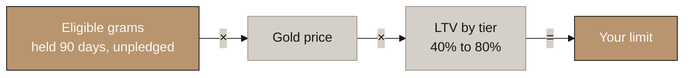
```mermaid
%%{init: {'theme': 'base', 'themeVariables': {
    'primaryColor': '#B8956E',
    'primaryTextColor': '#1A1714',
    'primaryBorderColor': '#1A1714',
    'lineColor': '#1A1714',
    'secondaryColor': '#FAF8F5',
    'tertiaryColor': '#D4CFC8',
    'fontFamily': 'Libre Franklin, sans-serif',
    'edgeLabelBackground': '#D4CFC8',
    'clusterBkg': '#FAF8F5',
    'clusterBorder': '#B8956E'
}}}%%
graph LR
    E["Eligible grams<br/>held 90 days, unpledged"] -->|"×"| P["Gold price"]
    P -->|"×"| L["LTV by tier<br/>40% to 80%"]
    L -->|"="| Y["Your limit"]

    style E fill:#B8956E,stroke:#1A1714,color:#FAF8F5
    style Y fill:#B8956E,stroke:#1A1714,color:#FAF8F5
    style P fill:#D4CFC8,stroke:#9A9590,color:#1A1714
    style L fill:#D4CFC8,stroke:#9A9590,color:#1A1714
```

<!-- Speaker notes: LTV is 40% for everyone, rising to 50%, 65% and 80% at Gold, Platinum and Sovereign. The ratio is set when the line opens and reset at an annual review, never below 40%. Example: Emma holds 100 g at USD 109.31, which is USD 10,931 of gold. Her limit is USD 4,372.40 at 40%, USD 5,465.50 at 50% and USD 8,744.80 at 80%. -->

---

## WP-24. The Gold Card by tier

Every customer gets the L1 card. Higher tiers improve the level, FX margin and ATM allowance.

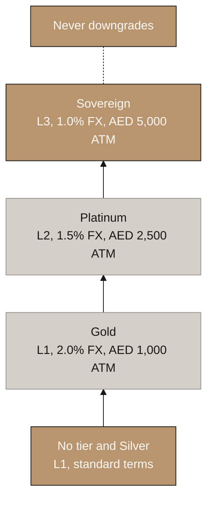
```mermaid
%%{init: {'theme': 'base', 'themeVariables': {
    'primaryColor': '#B8956E',
    'primaryTextColor': '#1A1714',
    'primaryBorderColor': '#1A1714',
    'lineColor': '#1A1714',
    'secondaryColor': '#FAF8F5',
    'tertiaryColor': '#D4CFC8',
    'fontFamily': 'Libre Franklin, sans-serif',
    'edgeLabelBackground': '#D4CFC8',
    'clusterBkg': '#FAF8F5',
    'clusterBorder': '#B8956E'
}}}%%
graph BT
    A["No tier and Silver<br/>L1, standard terms"] --> B["Gold<br/>L1, 2.0% FX, AED 1,000 ATM"]
    B --> C["Platinum<br/>L2, 1.5% FX, AED 2,500 ATM"]
    C --> D["Sovereign<br/>L3, 1.0% FX, AED 5,000 ATM"]
    D -.- N["Never downgrades"]

    style A fill:#B8956E,stroke:#1A1714,color:#FAF8F5
    style D fill:#B8956E,stroke:#1A1714,color:#FAF8F5
    style B fill:#D4CFC8,stroke:#9A9590,color:#1A1714
    style C fill:#D4CFC8,stroke:#9A9590,color:#1A1714
    style N fill:#B8956E,stroke:#1A1714,color:#FAF8F5
```

<!-- Speaker notes: ATM allowances are per month. A card upgrade follows three months in a row at the higher tier. The card never downgrades, and a tier fall never closes it. Card fees follow the saver's tier on each statement. Each payment is checked live against the gold, so a lower gold price lowers the available limit. -->

---

## WP-12. If the gold price falls

Warnings at 85% and 88%. Only at 92% is some gold sold, just enough to get back to 88%.

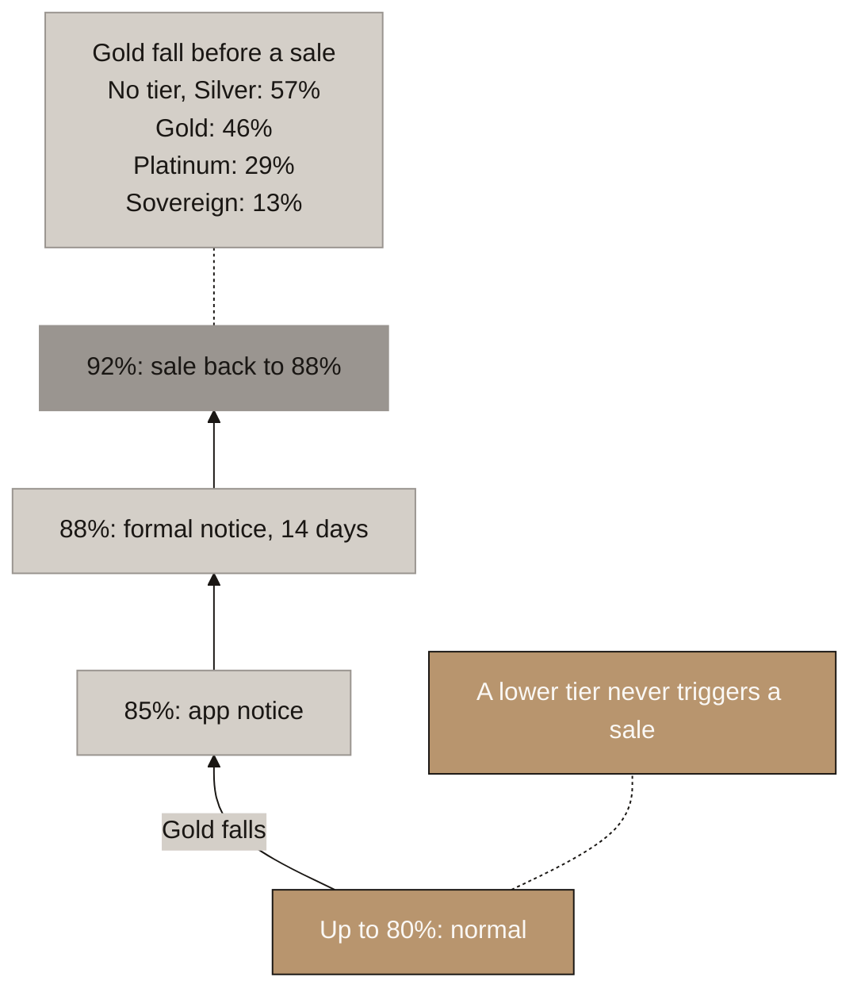
```mermaid
%%{init: {'theme': 'base', 'themeVariables': {
    'primaryColor': '#B8956E',
    'primaryTextColor': '#1A1714',
    'primaryBorderColor': '#1A1714',
    'lineColor': '#1A1714',
    'secondaryColor': '#FAF8F5',
    'tertiaryColor': '#D4CFC8',
    'fontFamily': 'Libre Franklin, sans-serif',
    'edgeLabelBackground': '#D4CFC8',
    'clusterBkg': '#FAF8F5',
    'clusterBorder': '#B8956E'
}}}%%
graph BT
    A["Up to 80%: normal"] -->|"Gold falls"| B["85%: app notice"]
    B --> C["88%: formal notice, 14 days"]
    C --> D["92%: sale back to 88%"]
    D -.- P["Gold fall before a sale<br/>No tier, Silver: 57%<br/>Gold: 46%<br/>Platinum: 29%<br/>Sovereign: 13%"]
    A -.- N["A lower tier never triggers a sale"]

    style A fill:#B8956E,stroke:#1A1714,color:#FAF8F5
    style B fill:#D4CFC8,stroke:#9A9590,color:#1A1714
    style C fill:#D4CFC8,stroke:#9A9590,color:#1A1714
    style D fill:#9A9590,stroke:#9A9590,color:#1A1714
    style P fill:#D4CFC8,stroke:#9A9590,color:#1A1714
    style N fill:#B8956E,stroke:#1A1714,color:#FAF8F5
```

<!-- Speaker notes: The scale is the loan as a share of the pledged gold. At 85% the saver gets an app notice. At 88% a formal notice gives 14 days to add gold, repay or add cash. At 92% Aurumix sells just enough gold at the LBMA price to bring the loan back to 88%; any surplus is the saver's and the credit line stays open. The side panel shows how far gold must fall at a full limit: 57% at 40% LTV, 46% at 50%, 29% at 65%, 13% at 80%. Borrowing less than the limit gives more room. -->

---

## WP-13. How Gold Rewards is paid

Cashback in gold on card spending, funded by card revenue.

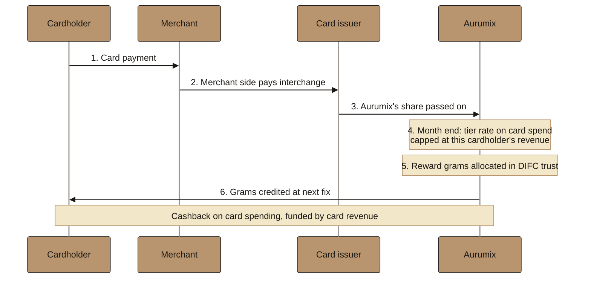
```mermaid
%%{init: {'theme': 'base', 'themeVariables': {
    'primaryColor': '#B8956E',
    'primaryTextColor': '#1A1714',
    'primaryBorderColor': '#1A1714',
    'lineColor': '#1A1714',
    'secondaryColor': '#FAF8F5',
    'tertiaryColor': '#D4CFC8',
    'fontFamily': 'Libre Franklin, sans-serif',
    'actorBkg': '#B8956E',
    'actorBorder': '#1A1714',
    'actorTextColor': '#1A1714',
    'actorLineColor': '#9A9590',
    'signalColor': '#1A1714',
    'signalTextColor': '#1A1714',
    'noteBkgColor': '#F3E7C9',
    'noteBorderColor': '#B8956E',
    'noteTextColor': '#1A1714'
}}}%%
sequenceDiagram
    participant H as Cardholder
    participant M as Merchant
    participant I as Card issuer
    participant A as Aurumix
    H->>M: 1. Card payment
    M->>I: 2. Merchant side pays interchange
    I->>A: 3. Aurumix's share passed on
    Note over A: 4. Month end: tier rate on card spend<br/>capped at this cardholder's revenue
    Note over A: 5. Reward grams allocated in DIFC trust
    A->>H: 6. Grams credited at next fix
    Note over H,A: Cashback on card spending, funded by card revenue
```

<!-- Speaker notes: Rates on card spend: none at No tier and Silver, 0.15% at Gold, 0.45% at Platinum, 0.75% at Sovereign. The reward is capped at the revenue the cardholder's own card and credit use brings in, and the gold balance plays no part. Example: Emma at Platinum spends USD 800 in March; her reward is USD 3.60, which buys 0.0329 g at USD 109.31. Reward grams do not count as a monthly payment. The DIFC trust step is shown as a note on the Aurumix line. -->

---

## WP-14. How family gold moves

Three triggers, one path: re-verify the beneficiary, settle any loan, then move the gold.

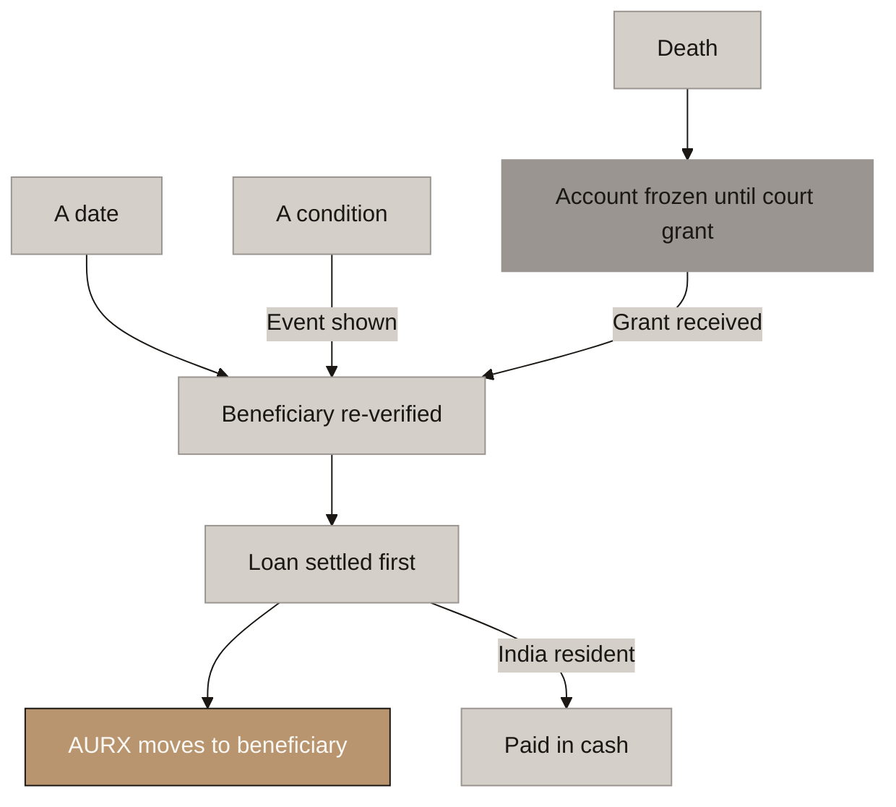
```mermaid
%%{init: {'theme': 'base', 'themeVariables': {
    'primaryColor': '#B8956E',
    'primaryTextColor': '#1A1714',
    'primaryBorderColor': '#1A1714',
    'lineColor': '#1A1714',
    'secondaryColor': '#FAF8F5',
    'tertiaryColor': '#D4CFC8',
    'fontFamily': 'Libre Franklin, sans-serif',
    'edgeLabelBackground': '#D4CFC8',
    'clusterBkg': '#FAF8F5',
    'clusterBorder': '#B8956E'
}}}%%
graph TD
    D1["A date"] --> R["Beneficiary re-verified"]
    D2["A condition"] -->|"Event shown"| R
    D3["Death"] --> F["Account frozen until court grant"]
    F -->|"Grant received"| R
    R --> L["Loan settled first"]
    L --> M["AURX moves to beneficiary"]
    L -->|"India resident"| X["Paid in cash"]

    style D1 fill:#D4CFC8,stroke:#9A9590,color:#1A1714
    style D2 fill:#D4CFC8,stroke:#9A9590,color:#1A1714
    style D3 fill:#D4CFC8,stroke:#9A9590,color:#1A1714
    style F fill:#9A9590,stroke:#9A9590,color:#1A1714
    style R fill:#D4CFC8,stroke:#9A9590,color:#1A1714
    style L fill:#D4CFC8,stroke:#9A9590,color:#1A1714
    style M fill:#B8956E,stroke:#1A1714,color:#FAF8F5
    style X fill:#D4CFC8,stroke:#9A9590,color:#1A1714
```

<!-- Speaker notes: A date trigger moves gold on the date, for example a child's 18th birthday. A condition moves it once the event is shown to have happened, such as starting university. On death the account is frozen until a court grant of probate; because beneficiaries are verified in advance, the transfer can follow within days. Any loan is paid first, then estate costs; a beneficiary can repay the loan to receive the gold in full. Beneficiaries resident in India cannot receive lifetime gifts and are paid in cash. -->

---

## WP-15. The partner channel

Partners sell Aurumix gold inside their own apps and pay a platform fee.

```mermaid
%%{init: {'theme': 'base', 'themeVariables': {
    'primaryColor': '#B8956E',
    'primaryTextColor': '#1A1714',
    'primaryBorderColor': '#1A1714',
    'lineColor': '#1A1714',
    'secondaryColor': '#FAF8F5',
    'tertiaryColor': '#D4CFC8',
    'fontFamily': 'Libre Franklin, sans-serif',
    'actorBkg': '#B8956E',
    'actorBorder': '#1A1714',
    'actorTextColor': '#1A1714',
    'actorLineColor': '#9A9590',
    'signalColor': '#1A1714',
    'signalTextColor': '#1A1714',
    'noteBkgColor': '#F3E7C9',
    'noteBorderColor': '#B8956E',
    'noteTextColor': '#1A1714'
}}}%%
sequenceDiagram
    participant C as Partner's customer
    participant P as Partner app
    participant A as Aurumix
    participant T as DIFC trust and vault
    C->>P: 1. Buys at partner's all-in price
    P->>A: 2. Order through Aurumix's register
    A->>T: 3. Grams allocated
    Note over A: 4. AURX minted
    Note over C,T: Same gold and protections as a direct customer
    A->>P: 5. Monthly invoice
    P->>A: 6. Platform fee paid
    Note over A: Partner books kept separate
```

<!-- Speaker notes: Aurumix supplies the gold, storage, token and licence. The partner sets its own all-in price and pays Aurumix a platform fee of about 0.50 to 0.75% a year on its customers' gold, set in each contract. Partner customers have no ICS score, because Aurumix cannot see their saving pattern. -->

---

## WP-16. Identity at the two doors

Identity is checked when AURX is created and when it is sold back. In between it moves freely.

```mermaid
%%{init: {'theme': 'base', 'themeVariables': {
    'primaryColor': '#B8956E',
    'primaryTextColor': '#1A1714',
    'primaryBorderColor': '#1A1714',
    'lineColor': '#1A1714',
    'secondaryColor': '#FAF8F5',
    'tertiaryColor': '#D4CFC8',
    'fontFamily': 'Libre Franklin, sans-serif',
    'edgeLabelBackground': '#D4CFC8',
    'clusterBkg': '#FAF8F5',
    'clusterBorder': '#B8956E'
}}}%%
graph TD
    A["Create<br/>Identity check, AURX issued"] --> B["Hold and send<br/>Moves freely between wallets"]
    B --> C["Sell back<br/>Identity check, AURX burned"]
    C --> D["Cash to your own bank"]
    B -.- G["Blocklist gate"]
    A -.- N["Score, credit, family see Aurumix account only"]

    style A fill:#B8956E,stroke:#1A1714,color:#FAF8F5
    style C fill:#B8956E,stroke:#1A1714,color:#FAF8F5
    style D fill:#B8956E,stroke:#1A1714,color:#FAF8F5
    style B fill:#D4CFC8,stroke:#9A9590,color:#1A1714
    style G fill:#9A9590,stroke:#9A9590,color:#1A1714
    style N fill:#D4CFC8,stroke:#9A9590,color:#1A1714
```

<!-- Speaker notes: Creating AURX needs an identity check, money in and gold allocated. Once issued, AURX moves between wallets like any ERC-20 token, subject to a blocklist. Selling back needs a second identity check; the AURX is burned and cash goes to the seller's own bank. Sending AURX moves ownership of the gold, and the bars stay in the vault. Score, credit and family features see only gold held in the Aurumix account. -->

---

## WP-17. Layers of protection

Four layers record that the gold is held for you, checked by a monthly report.

```mermaid
%%{init: {'theme': 'base', 'themeVariables': {
    'primaryColor': '#B8956E',
    'primaryTextColor': '#1A1714',
    'primaryBorderColor': '#1A1714',
    'lineColor': '#1A1714',
    'secondaryColor': '#FAF8F5',
    'tertiaryColor': '#D4CFC8',
    'fontFamily': 'Libre Franklin, sans-serif',
    'edgeLabelBackground': '#D4CFC8',
    'clusterBkg': '#FAF8F5',
    'clusterBorder': '#B8956E'
}}}%%
graph LR
    subgraph L4["4. Independent title register"]
        subgraph L3["3. DIFC trust"]
            subgraph L2["2. Customer terms, with trust"]
                B["1. Allocated, numbered bars"]
            end
        end
    end
    L4 -.- R["Monthly Allocation Report"]
    R --> K["Gold held ≥ AURX outstanding"]

    style B fill:#B8956E,stroke:#1A1714,color:#FAF8F5
    style L4 fill:#FAF8F5,stroke:#B8956E,color:#1A1714
    style L3 fill:#FAF8F5,stroke:#B8956E,color:#1A1714
    style L2 fill:#FAF8F5,stroke:#B8956E,color:#1A1714
    style R fill:#D4CFC8,stroke:#9A9590,color:#1A1714
    style K fill:#B8956E,stroke:#1A1714,color:#FAF8F5
```

<!-- Speaker notes: From the inside out: allocated bars with a serial-numbered weight list, customer terms that include the trust, the DIFC trust itself, and an independent title register kept outside Aurumix's systems. If one layer is challenged, the others still stand. Every month the Allocation Report lists each bar's serial number and assay, total AURX, total customer gold, the prices used and the float shown separately. Minting stops automatically if backing cannot be confirmed. -->

---

## WP-18. How Aurumix earns

Six fee sources. Three things are never charged.

```mermaid
%%{init: {'theme': 'base', 'themeVariables': {
    'primaryColor': '#B8956E',
    'primaryTextColor': '#1A1714',
    'primaryBorderColor': '#1A1714',
    'lineColor': '#1A1714',
    'secondaryColor': '#FAF8F5',
    'tertiaryColor': '#D4CFC8',
    'fontFamily': 'Libre Franklin, sans-serif',
    'edgeLabelBackground': '#D4CFC8',
    'clusterBkg': '#FAF8F5',
    'clusterBorder': '#B8956E'
}}}%%
graph LR
    F1["Entry fee"] --> A["Aurumix"]
    F2["Card interchange share"] --> A
    F3["Cardholder fees"] --> A
    F4["Lending fees, via lender"] --> A
    F5["Family plan fees"] --> A
    F6["Partner platform fee"] --> A
    F2 -->|"Funds"| R["Gold Rewards to cardholders"]
    A -.- N["Never charged: storage, exit, gold mark-up"]

    style F1 fill:#D4CFC8,stroke:#9A9590,color:#1A1714
    style F2 fill:#D4CFC8,stroke:#9A9590,color:#1A1714
    style F3 fill:#D4CFC8,stroke:#9A9590,color:#1A1714
    style F4 fill:#D4CFC8,stroke:#9A9590,color:#1A1714
    style F5 fill:#D4CFC8,stroke:#9A9590,color:#1A1714
    style F6 fill:#D4CFC8,stroke:#9A9590,color:#1A1714
    style A fill:#B8956E,stroke:#1A1714,color:#FAF8F5
    style R fill:#B8956E,stroke:#1A1714,color:#FAF8F5
    style N fill:#9A9590,stroke:#9A9590,color:#1A1714
```

<!-- Speaker notes: The entry fee is 2% to 5% of each purchase, 5% at launch, less the tier discount; part of it pays the dealer's bar charge. Card interchange and cardholder fees come through the card programme, lending fees through the licensed lender. The family plan is USD 32 a year and partners pay about 0.50 to 0.75% a year. Aurumix's share of interchange also funds Gold Rewards. There is no storage fee, no exit fee and no mark-up on the LBMA price. -->

---

## WP-25. Path to launch

AURX is offered only after VARA grants the licence and approves the whitepaper.

```mermaid
%%{init: {'theme': 'base', 'themeVariables': {
    'primaryColor': '#B8956E',
    'primaryTextColor': '#1A1714',
    'primaryBorderColor': '#1A1714',
    'lineColor': '#1A1714',
    'secondaryColor': '#FAF8F5',
    'tertiaryColor': '#D4CFC8',
    'fontFamily': 'Libre Franklin, sans-serif',
    'edgeLabelBackground': '#D4CFC8',
    'clusterBkg': '#FAF8F5',
    'clusterBorder': '#B8956E'
}}}%%
graph TD
    A["Apply for VARA licence"] --> B["Licence granted"]
    B --> C["Whitepaper approved"]
    C --> D["AURX offered"]
    D --> E["Credit and card, once partners licensed"]

    style A fill:#D4CFC8,stroke:#9A9590,color:#1A1714
    style B fill:#D4CFC8,stroke:#9A9590,color:#1A1714
    style C fill:#D4CFC8,stroke:#9A9590,color:#1A1714
    style D fill:#B8956E,stroke:#1A1714,color:#FAF8F5
    style E fill:#D4CFC8,stroke:#9A9590,color:#1A1714
```

<!-- Speaker notes: Aurumix intends to apply to VARA for a Virtual Asset Issuance licence, with AURX designed as an Asset-Referenced Virtual Asset in which holders own the gold itself. Credit and the Gold Card start once the CBUAE-licensed partners are in place. No dates are given. -->

---
